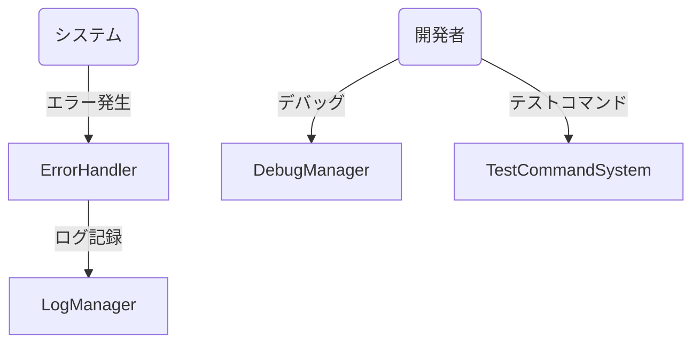
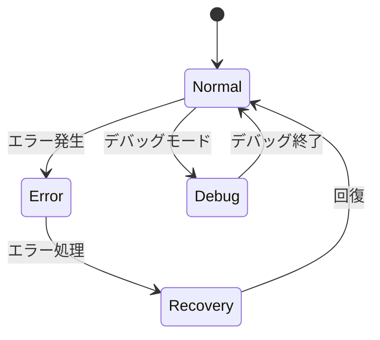
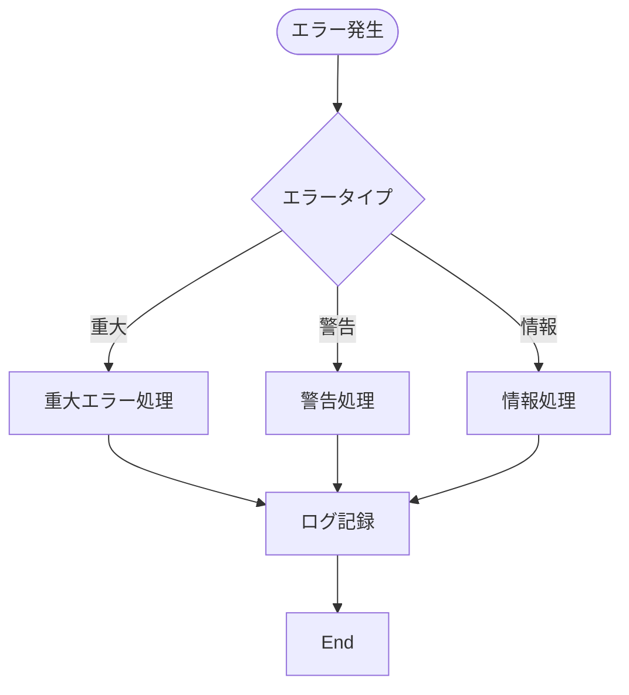
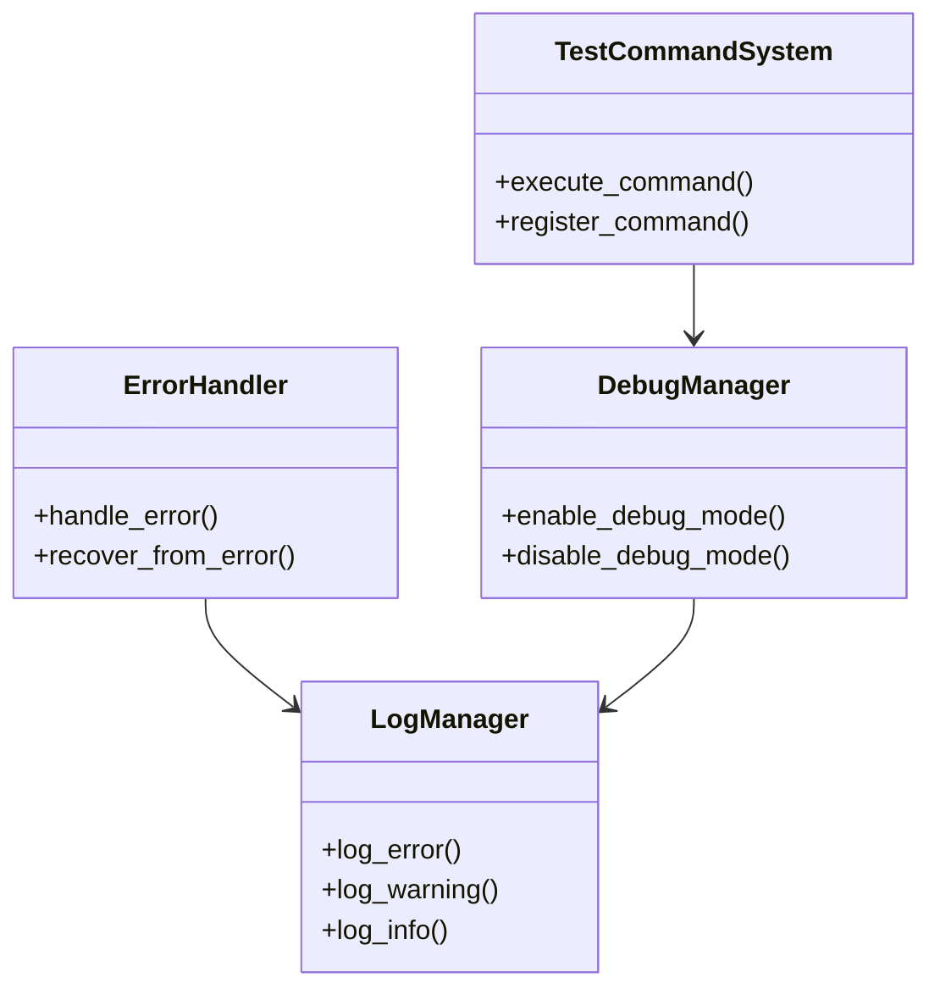

# エラー処理とデバッグ機能実装仕様

## 目次

1. [概要](#概要)
2. [ユースケース図](#ユースケース図)
3. [状態遷移図](#状態遷移図)
4. [アクティビティ図](#アクティビティ図)
5. [クラス図](#クラス図)
6. [実装詳細](#実装詳細)
7. [制限事項](#制限事項)
8. [変更履歴](#変更履歴)

## 概要

`ErrorHandler`がエラー処理を管理し、`DebugManager`がデバッグ機能を制御する。`LogManager`がログ記録を担当し、`TestCommandSystem`がテスト用コマンドを管理する。

## ユースケース図



## 状態遷移図



## アクティビティ図



## クラス図



## 実装詳細

### 1. クラス設計
```gdscript
class_name ErrorHandler
extends Node

# エラー管理
var error_types: Dictionary
var error_handlers: Dictionary
var recovery_strategies: Dictionary
var error_history: Array

# デバッグ管理
var debug_manager: DebugManager
var debug_flags: Dictionary
var debug_commands: Dictionary
var debug_history: Array

# ログ管理
var log_manager: LogManager
var log_levels: Dictionary
var log_files: Dictionary
var log_settings: Dictionary

# テストコマンド
var test_command_system: TestCommandSystem
var command_registry: Dictionary
var command_history: Array
var command_aliases: Dictionary
```

### 2. 主要メソッド
```gdscript
# エラー処理
func handle_error(error: Dictionary) -> void
func recover_from_error(error_type: String) -> void
func log_error(error: Dictionary) -> void
func notify_error(error: Dictionary) -> void

# デバッグ機能
func enable_debug_mode() -> void
func disable_debug_mode() -> void
func toggle_debug_flag(flag: String) -> void
func execute_debug_command(command: String) -> void

# ログ記録
func log_message(level: String, message: String) -> void
func save_logs() -> void
func clear_logs() -> void
func export_logs() -> void

# テストコマンド
func register_command(command: String, callback: Callable) -> void
func execute_command(command: String, args: Array) -> void
func list_commands() -> Array
func help_command(command: String) -> String
```

### 3. エラーパラメータ
```gdscript
# エラーレベル
var error_levels = {
    "critical": 0,
    "error": 1,
    "warning": 2,
    "info": 3
}

# デバッグフラグ
var debug_flags = {
    "show_fps": false,
    "show_collision": false,
    "show_pathfinding": false,
    "show_ai_state": false
}

# ログ設定
var log_settings = {
    "max_log_size": 1024 * 1024,  # 1MB
    "max_log_files": 5,
    "log_level": "info",
    "log_to_file": true
}

# テストコマンド
var command_settings = {
    "max_history": 100,
    "command_timeout": 5.0,
    "require_confirmation": true
}
```

### 4. イベント処理
```gdscript
# シグナル定義
signal error_occurred(error: Dictionary)
signal debug_mode_changed(enabled: bool)
signal log_message_added(level: String, message: String)
signal command_executed(command: String, result: Variant)

# イベントハンドラー
func _on_error_occurred(error: Dictionary) -> void:
    handle_error(error)
    emit_signal("error_occurred", error)

func _on_debug_mode_toggled(enabled: bool) -> void:
    emit_signal("debug_mode_changed", enabled)
    update_debug_state(enabled)

func _on_log_message(level: String, message: String) -> void:
    emit_signal("log_message_added", level, message)
    save_log_message(level, message)

func _on_command_executed(command: String, result: Variant) -> void:
    emit_signal("command_executed", command, result)
    update_command_history(command, result)
```

## 制限事項

1. エラー処理
- 同時に処理可能なエラーは最大10個
- エラーログの保持期間は7日間
- リカバリー試行回数は最大3回

2. デバッグ機能
- デバッグフラグは最大20個
- デバッグコマンドは最大50個
- デバッグログの保持期間は3日間

3. ログ管理
- ログファイルの最大サイズは1MB
- 保持するログファイルは最大5個
- ログメッセージの最大長は1000文字

4. テストコマンド
- コマンド履歴は最大100個
- コマンドの実行タイムアウトは5秒
- コマンドの引数は最大10個

## 変更履歴

| バージョン | 更新日     | 変更内容 |
| ---------- | ---------- | -------- |
| 0.1.0      | 2024-03-21 | 初版作成 |
| 0.2.0      | 2025-06-07 | 新規追加 |
