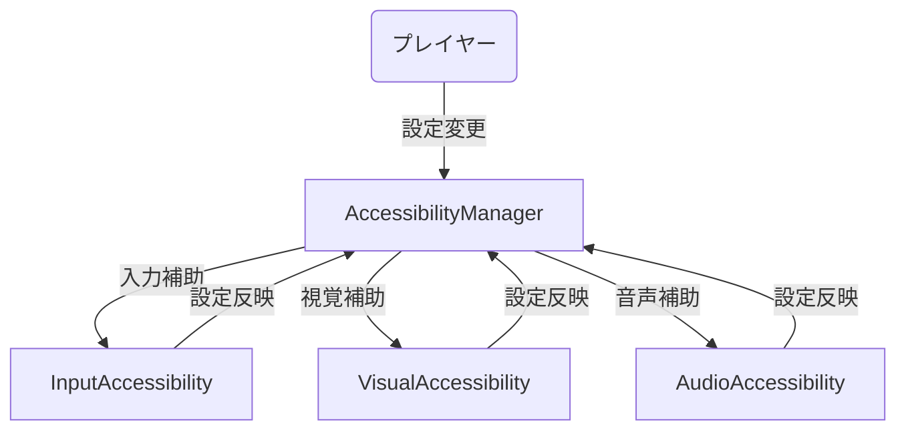
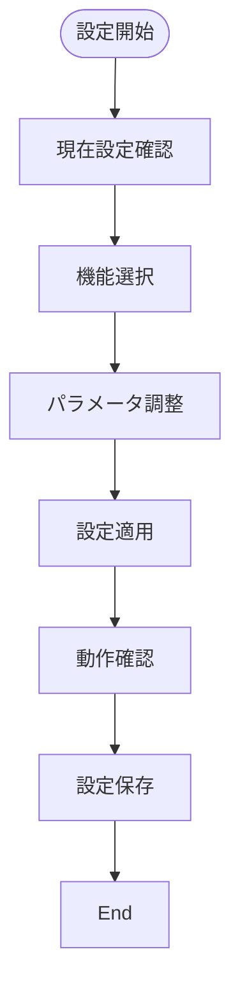
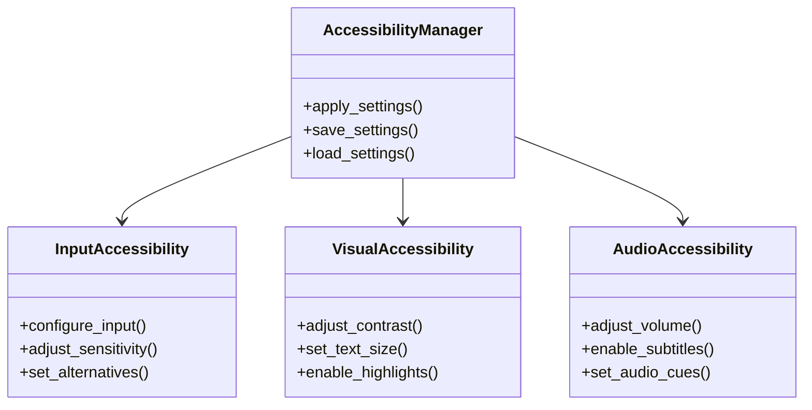

# アクセシビリティ実装仕様

## 目次

1. [概要](#概要)
2. [ユースケース図](#ユースケース図)
3. [状態遷移図](#状態遷移図)
4. [アクティビティ図](#アクティビティ図)
5. [クラス図](#クラス図)
6. [実装詳細](#実装詳細)
7. [制限事項](#制限事項)
8. [変更履歴](#変更履歴)

## 概要

`AccessibilityManager`がアクセシビリティを管理し、`InputAccessibility`が入力補助を、`VisualAccessibility`が視覚補助を、`AudioAccessibility`が音声補助を担当する。

## ユースケース図



## 状態遷移図

```mermaid
stateDiagram-v2
    [*] --> Default
    Default --> Custom : カスタム設定
    Custom --> Input : 入力補助
    Custom --> Visual : 視覚補助
    Custom --> Audio : 音声補助
    Input --> Custom : 完了
    Visual --> Custom : 完了
    Audio --> Custom : 完了
    Custom --> Default : リセット
```

## アクティビティ図



## クラス図



## 実装詳細

### 1. クラス設計
```gdscript
class_name AccessibilityManager
extends Node

# 入力補助管理
var input_accessibility: InputAccessibility
var input_settings: Dictionary
var key_bindings: Dictionary
var sensitivity_settings: Dictionary

# 視覚補助管理
var visual_accessibility: VisualAccessibility
var visual_settings: Dictionary
var color_settings: Dictionary
var text_settings: Dictionary

# 音声補助管理
var audio_accessibility: AudioAccessibility
var audio_settings: Dictionary
var subtitle_settings: Dictionary
var cue_settings: Dictionary

# 設定管理
var current_settings: Dictionary
var saved_settings: Dictionary
var preset_settings: Dictionary
```

### 2. 主要メソッド
```gdscript
# 入力補助
func configure_input(input_type: String) -> void
func adjust_sensitivity(parameter: String) -> void
func set_alternatives(input_id: String) -> void
func save_input_settings() -> void

# 視覚補助
func adjust_contrast(level: float) -> void
func set_text_size(size: float) -> void
func enable_highlights(enabled: bool) -> void
func save_visual_settings() -> void

# 音声補助
func adjust_volume(volume_type: String) -> void
func enable_subtitles(enabled: bool) -> void
func set_audio_cues(cue_type: String) -> void
func save_audio_settings() -> void

# 設定管理
func apply_settings(settings: Dictionary) -> void
func save_settings() -> void
func load_settings() -> Dictionary
func reset_settings() -> void
```

### 3. アクセシビリティ設定
```gdscript
# 入力設定
var input_settings = {
    "keyboard": {
        "remapping": true,
        "sticky_keys": true,
        "repeat_delay": 0.5,
        "repeat_rate": 0.1
    },
    "mouse": {
        "sensitivity": 1.0,
        "invert_y": false,
        "acceleration": false,
        "double_click_time": 0.3
    },
    "gamepad": {
        "deadzone": 0.1,
        "vibration": true,
        "button_remapping": true,
        "stick_remapping": true
    }
}

# 視覚設定
var visual_settings = {
    "contrast": {
        "enabled": true,
        "level": 1.0,
        "mode": "normal",
        "custom_colors": false
    },
    "text": {
        "size": 1.0,
        "font": "default",
        "spacing": 1.0,
        "outline": true
    },
    "highlights": {
        "enabled": true,
        "color": Color.yellow,
        "intensity": 0.5,
        "duration": 0.5
    }
}

# 音声設定
var audio_settings = {
    "volume": {
        "master": 1.0,
        "music": 0.8,
        "effects": 1.0,
        "voice": 1.0
    },
    "subtitles": {
        "enabled": true,
        "size": 1.0,
        "background": true,
        "speaker_names": true
    },
    "cues": {
        "enabled": true,
        "visual": true,
        "haptic": true,
        "priority": "high"
    }
}

# プリセット設定
var preset_settings = {
    "default": {
        "input": input_settings,
        "visual": visual_settings,
        "audio": audio_settings
    },
    "high_contrast": {
        "input": input_settings,
        "visual": {
            "contrast": {"level": 2.0},
            "text": {"size": 1.2},
            "highlights": {"intensity": 0.8}
        },
        "audio": audio_settings
    },
    "low_vision": {
        "input": input_settings,
        "visual": {
            "contrast": {"level": 1.5},
            "text": {"size": 1.5},
            "highlights": {"intensity": 0.7}
        },
        "audio": {
            "volume": {"voice": 1.2},
            "subtitles": {"enabled": true}
        }
    }
}
```

### 4. イベント処理
```gdscript
# シグナル定義
signal settings_changed(setting_type: String)
signal preset_applied(preset_name: String)
signal accessibility_enabled(enabled: bool)
signal settings_saved(success: bool)

# イベントハンドラー
func _on_settings_changed(setting_type: String) -> void:
    emit_signal("settings_changed", setting_type)
    update_settings(setting_type)

func _on_preset_applied(preset_name: String) -> void:
    emit_signal("preset_applied", preset_name)
    apply_preset(preset_name)

func _on_accessibility_enabled(enabled: bool) -> void:
    emit_signal("accessibility_enabled", enabled)
    update_accessibility_state(enabled)
```

## 制限事項

1. 入力補助
- キーリマッピングは最大20個まで
- 感度調整範囲は0.1から5.0まで
- 代替入力は最大5種類まで

2. 視覚補助
- コントラスト調整範囲は0.5から3.0まで
- テキストサイズ範囲は0.5から3.0まで
- ハイライト効果は最大5種類まで

3. 音声補助
- 音量調整範囲は0.0から2.0まで
- 字幕サイズ範囲は0.5から3.0まで
- 音声キューは最大10種類まで

4. 設定管理
- 保存できるプリセットは最大10個まで
- 設定ファイルのサイズは最大1MBまで
- 設定の変更頻度は最小1秒間隔

## 変更履歴

| バージョン | 更新日     | 変更内容 |
| ---------- | ---------- | -------- |
| 0.1.0      | 2024-03-21 | 初版作成 |
| 0.2.0      | 2025-06-07 | 新規追加 |
