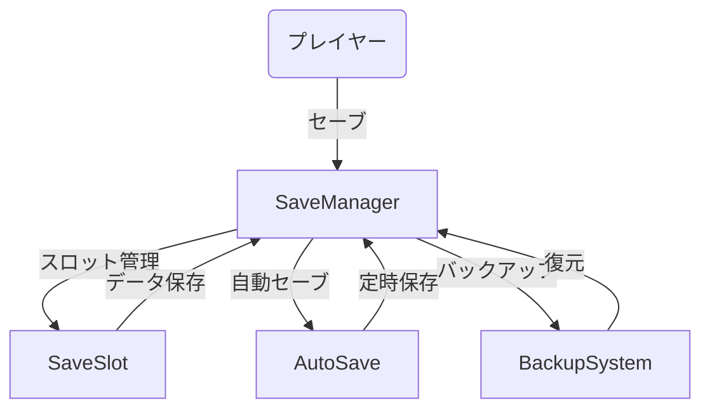
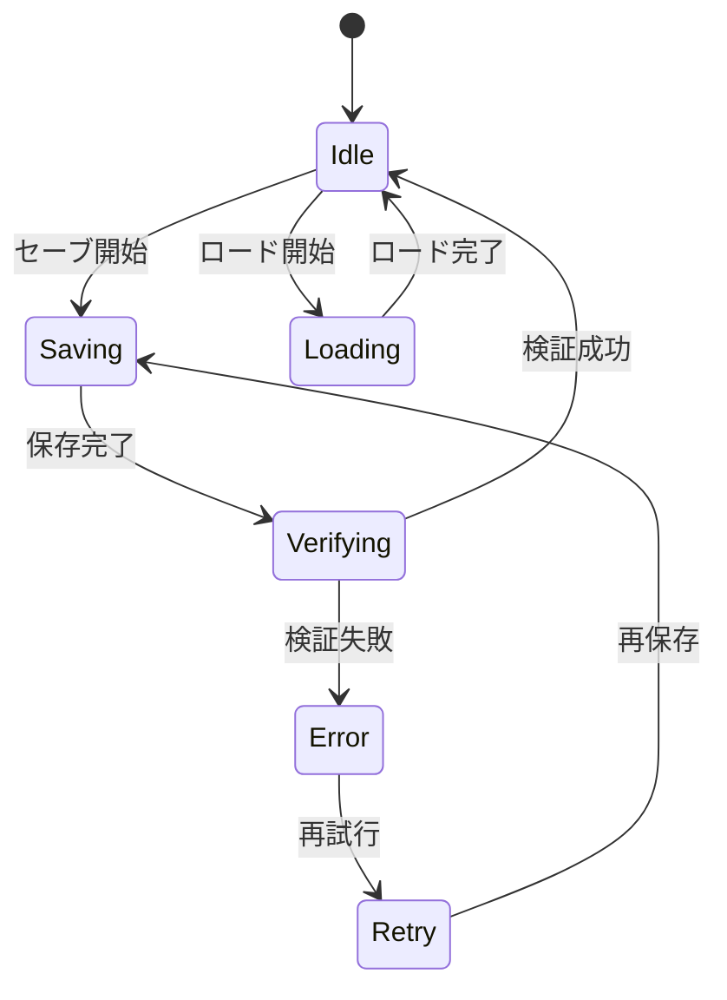
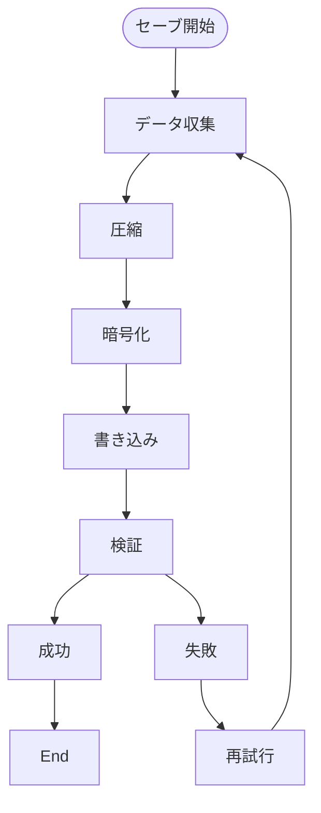
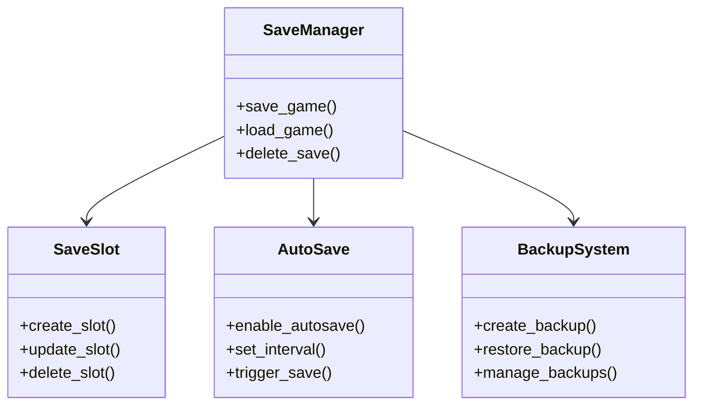

# セーブデータ管理実装仕様

## 目次

1. [概要](#概要)
2. [ユースケース図](#ユースケース図)
3. [状態遷移図](#状態遷移図)
4. [アクティビティ図](#アクティビティ図)
5. [クラス図](#クラス図)
6. [実装詳細](#実装詳細)
7. [制限事項](#制限事項)
8. [変更履歴](#変更履歴)

## 概要

`SaveManager`がセーブデータを管理し、`SaveSlot`がセーブスロットを、`AutoSave`が自動セーブを、`BackupSystem`がバックアップを担当する。

## ユースケース図



## 状態遷移図



## アクティビティ図



## クラス図



## 実装詳細

### 1. クラス設計
```gdscript
class_name SaveManager
extends Node

# セーブスロット管理
var save_slots: Dictionary
var current_slot: SaveSlot
var slot_settings: Dictionary
var slot_data: Dictionary

# 自動セーブ管理
var auto_save: AutoSave
var auto_save_settings: Dictionary
var auto_save_data: Dictionary
var auto_save_timer: Timer

# バックアップ管理
var backup_system: BackupSystem
var backup_settings: Dictionary
var backup_data: Dictionary
var backup_history: Array

# データ管理
var save_data: Dictionary
var metadata: Dictionary
var checksums: Dictionary
var encryption_keys: Dictionary
```

### 2. 主要メソッド
```gdscript
# セーブスロット管理
func create_save_slot(slot_id: String) -> bool
func update_save_slot(slot_id: String) -> bool
func delete_save_slot(slot_id: String) -> bool
func load_save_slot(slot_id: String) -> Dictionary

# 自動セーブ管理
func enable_auto_save(enabled: bool) -> void
func set_auto_save_interval(interval: float) -> void
func trigger_auto_save() -> bool
func get_auto_save_status() -> Dictionary

# バックアップ管理
func create_backup() -> bool
func restore_backup(backup_id: String) -> bool
func manage_backups() -> void
func get_backup_info() -> Dictionary

# データ管理
func save_game_data() -> bool
func load_game_data() -> Dictionary
func verify_data() -> bool
func encrypt_data() -> void
```

### 3. セーブデータ設定
```gdscript
# セーブスロット設定
var slot_settings = {
    "max_slots": 10,
    "slot_format": "slot_{id}",
    "metadata": {
        "player_name": "",
        "play_time": 0,
        "level": 1,
        "last_save": "",
        "thumbnail": null
    },
    "compression": {
        "enabled": true,
        "level": 6,
        "method": "zlib"
    }
}

# 自動セーブ設定
var auto_save_settings = {
    "enabled": true,
    "interval": 300,
    "max_saves": 5,
    "triggers": [
        "level_complete",
        "boss_defeat",
        "item_acquired",
        "quest_complete"
    ],
    "notifications": {
        "enabled": true,
        "message": "自動セーブ中...",
        "duration": 2.0
    }
}

# バックアップ設定
var backup_settings = {
    "enabled": true,
    "interval": 3600,
    "max_backups": 10,
    "compression": {
        "enabled": true,
        "level": 9,
        "method": "zlib"
    },
    "encryption": {
        "enabled": true,
        "method": "aes256",
        "key_rotation": true
    }
}

# データ設定
var data_settings = {
    "player": {
        "stats": true,
        "inventory": true,
        "quests": true,
        "achievements": true
    },
    "world": {
        "state": true,
        "npcs": true,
        "items": true,
        "events": true
    },
    "system": {
        "settings": true,
        "keybinds": true,
        "preferences": true
    }
}
```

### 4. イベント処理
```gdscript
# シグナル定義
signal save_started(slot_id: String)
signal save_completed(success: bool)
signal load_started(slot_id: String)
signal load_completed(success: bool)
signal auto_save_triggered()
signal backup_created(backup_id: String)

# イベントハンドラー
func _on_save_started(slot_id: String) -> void:
    emit_signal("save_started", slot_id)
    prepare_save_data(slot_id)

func _on_load_started(slot_id: String) -> void:
    emit_signal("load_started", slot_id)
    prepare_load_data(slot_id)

func _on_auto_save_triggered() -> void:
    emit_signal("auto_save_triggered")
    handle_auto_save()
```

## 制限事項

1. セーブスロット
- 最大スロット数は10個まで
- スロットデータのサイズは最大10MBまで
- スロット名の長さは最大32文字まで

2. 自動セーブ
- 保存間隔は最小60秒まで
- 最大保存数は5個まで
- トリガーイベントは最大10種類まで

3. バックアップ
- バックアップ数は最大10個まで
- バックアップのサイズは最大100MBまで
- バックアップ間隔は最小1時間まで

4. データ管理
- セーブデータの総サイズは最大1GBまで
- 暗号化キーの長さは256ビットまで
- 圧縮率は最大9まで

## 変更履歴

| バージョン | 更新日     | 変更内容 |
| ---------- | ---------- | -------- |
| 0.1.0      | 2024-03-21 | 初版作成 |
