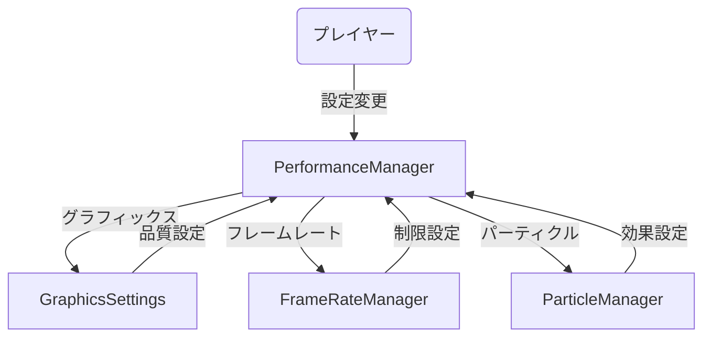
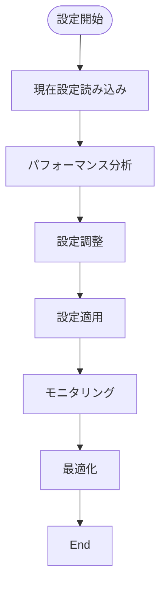
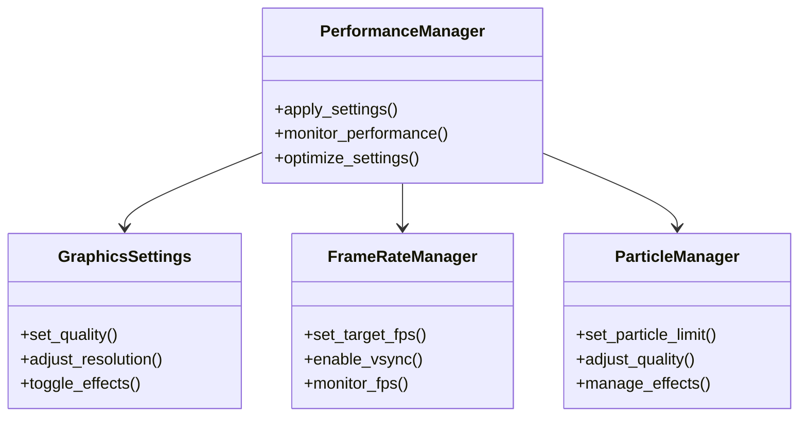

# パフォーマンス設定実装仕様

## 目次

1. [概要](#概要)
2. [パフォーマンス基準](#パフォーマンス基準)
3. [システム別要件](#システム別要件)
4. [設定管理](#設定管理)
5. [ユースケース図](#ユースケース図)
6. [状態遷移図](#状態遷移図)
7. [アクティビティ図](#アクティビティ図)
8. [クラス図](#クラス図)
9. [実装詳細](#実装詳細)
10. [テスト要件](#テスト要件)
11. [制限事項](#制限事項)
12. [関連ドキュメント](#関連ドキュメント)
13. [変更履歴](#変更履歴)

## 概要

本ドキュメントは、ゲーム全体のパフォーマンス設定に関する統一基準を定義する。

## パフォーマンス基準

### 1. 基本パフォーマンス目標
- FPS
  - 目標: 60FPS固定
  - 許容下限: 55FPS
  - 最大許容変動: ±2FPS
- ロード時間
  - 目標: 5秒以内
  - 許容上限: 7秒
- メモリ使用量
  - 目標: 2GB以下
  - 許容上限: 3GB
- 入力遅延
  - 目標: 100ms以下
  - 許容上限: 150ms

### 2. システム別パフォーマンス要件

#### 2.1 レンダリングシステム
- 描画コール数
  - 目標: 100回/フレーム以下
  - 許容上限: 150回/フレーム
- バッチ処理
  - 目標: 1000オブジェクト/バッチ
  - 許容上限: 1500オブジェクト/バッチ
- シェーダー処理
  - 目標: 5ms/フレーム以下
  - 許容上限: 8ms/フレーム

#### 2.2 物理演算システム
- コリジョン計算
  - 目標: 3ms/フレーム以下
  - 許容上限: 5ms/フレーム
- 剛体シミュレーション
  - 目標: 2ms/フレーム以下
  - 許容上限: 4ms/フレーム
- パーティクル
  - 目標: 1000パーティクル以下
  - 許容上限: 2000パーティクル

#### 2.3 メモリ管理システム
- リソースロード
  - 目標: 100ms以下
  - 許容上限: 200ms
- オブジェクトプール
  - 目標: 100オブジェクト以下
  - 許容上限: 150オブジェクト
- ガベージコレクション
  - 目標: 1回/分以下
  - 許容上限: 2回/分

## 設定管理

### 1. パフォーマンスプリセット
```gdscript
var performance_presets = {
    "high_quality": {
        "rendering": {
            "max_draw_calls": 200,
            "batch_size": 500,
            "lod_levels": 4,
            "occlusion_culling": true
        },
        "physics": {
            "max_particles": 2000,
            "collision_quality": 2,
            "spatial_partitioning": true,
            "simulation_quality": 2
        }
    },
    "balanced": {
        "rendering": {
            "max_draw_calls": 100,
            "batch_size": 1000,
            "lod_levels": 3,
            "occlusion_culling": true
        },
        "physics": {
            "max_particles": 1000,
            "collision_quality": 1,
            "spatial_partitioning": true,
            "simulation_quality": 1
        }
    },
    "performance": {
        "rendering": {
            "max_draw_calls": 50,
            "batch_size": 2000,
            "lod_levels": 2,
            "occlusion_culling": true
        },
        "physics": {
            "max_particles": 500,
            "collision_quality": 0,
            "spatial_partitioning": true,
            "simulation_quality": 0
        }
    }
}
```

### 2. 動的調整
- パフォーマンスモニタリング
  - フレームレート監視
  - メモリ使用量監視
  - ロード時間監視
  - 入力遅延監視
- 自動最適化
  - プリセット切り替え
  - パラメータ調整
  - リソース管理
  - 描画品質調整

## ユースケース図



## 状態遷移図

```mermaid
stateDiagram-v2
    [*] --> Default
    Default --> HighQuality : 高品質設定
    Default --> Balanced : バランス設定
    Default --> Performance : パフォーマンス設定
    HighQuality --> Default : リセット
    Balanced --> Default : リセット
    Performance --> Default : リセット
```

## アクティビティ図



## クラス図



## 実装詳細

### 1. クラス設計
```gdscript
class_name PerformanceManager
extends Node

# グラフィックス設定
var graphics_settings: GraphicsSettings
var quality_presets: Dictionary
var resolution_settings: Dictionary
var effect_settings: Dictionary

# フレームレート設定
var frame_rate_manager: FrameRateManager
var fps_settings: Dictionary
var vsync_settings: Dictionary
var performance_metrics: Dictionary

# パーティクル設定
var particle_manager: ParticleManager
var particle_settings: Dictionary
var effect_limits: Dictionary
var quality_levels: Dictionary

# パフォーマンス監視
var monitoring_enabled: bool
var metrics_history: Array
var optimization_thresholds: Dictionary
var warning_levels: Dictionary
```

### 2. 主要メソッド
```gdscript
# グラフィックス設定
func set_graphics_quality(level: String) -> void
func adjust_resolution(width: int, height: int) -> void
func toggle_effect(effect: String, enabled: bool) -> void
func get_current_settings() -> Dictionary

# フレームレート設定
func set_target_fps(fps: int) -> void
func enable_vsync(enabled: bool) -> void
func monitor_fps() -> Dictionary
func get_performance_metrics() -> Dictionary

# パーティクル設定
func set_particle_limit(limit: int) -> void
func adjust_particle_quality(level: String) -> void
func manage_effects() -> void
func get_effect_status() -> Dictionary

# パフォーマンス監視
func start_monitoring() -> void
func stop_monitoring() -> void
func analyze_performance() -> Dictionary
func optimize_settings() -> void
```

### 3. イベント処理
```gdscript
# シグナル定義
signal settings_changed(settings: Dictionary)
signal performance_warning(metric: String, value: float)
signal optimization_started()
signal optimization_completed(success: bool)

# イベントハンドラー
func _on_settings_changed(settings: Dictionary) -> void:
    emit_signal("settings_changed", settings)
    apply_settings(settings)

func _on_performance_warning(metric: String, value: float) -> void:
    emit_signal("performance_warning", metric, value)
    handle_warning(metric, value)

func _on_optimization_needed() -> void:
    emit_signal("optimization_started")
    optimize_settings()
```

## 制限事項

### 1. グラフィックス設定
- 解像度は最小854x480から最大3840x2160まで
- アンチエイリアシングは最大MSAA 8xまで
- シャドウ品質は3段階（低、中、高）

### 2. フレームレート設定
- 目標FPSは30から144まで
- モニタリング間隔は最小0.1秒まで
- 履歴サイズは最大300フレームまで

### 3. パーティクル設定
- 最大パーティクル数は5000まで
- パーティクル寿命は最大10秒まで
- エフェクト種類は最大10種類まで

### 4. パフォーマンス監視
- メトリクス収集間隔は最小0.1秒まで
- 警告閾値は最大5段階まで
- 最適化間隔は最小60秒まで

## テスト要件

### 1. パフォーマンステスト
- フレームレートテスト
  - 60FPS維持テスト
  - フレームレート変動テスト
  - 長時間実行テスト
- メモリテスト
  - メモリリークテスト
  - メモリ使用量テスト
  - ガベージコレクションテスト
- ロードテスト
  - 初期ロードテスト
  - シーン遷移テスト
  - リソースロードテスト
- 入力テスト
  - 入力遅延テスト
  - レスポンステスト
  - 同時入力テスト

### 2. 負荷テスト
- 同時接続テスト
  - 10人同時接続
  - 50人同時接続
  - 100人同時接続
- 長時間実行テスト
  - 1時間連続実行
  - 4時間連続実行
  - 24時間連続実行
- リソース使用テスト
  - 大量リソースロード
  - 大量オブジェクト生成
  - 大量パーティクル生成

## 関連ドキュメント

- [[14.1_Requirement.md]] - 基本要件
- [[14.2_PrototypeTechnicalDesign.md]] - プロトタイプ技術設計
- [[14.12_PerformanceProfiling.md]] - パフォーマンスプロファイリング
- [[15.12_PerformanceOptimizationSpec.md]] - パフォーマンス最適化仕様
- [[15.8_TestPerformanceSpec.md]] - パフォーマンステスト仕様

## 変更履歴

| バージョン | 更新日 | 変更内容 |
| ---------- | ------ | -------- |
| 0.1.0 | 2025-06-07 | 初版作成 |
