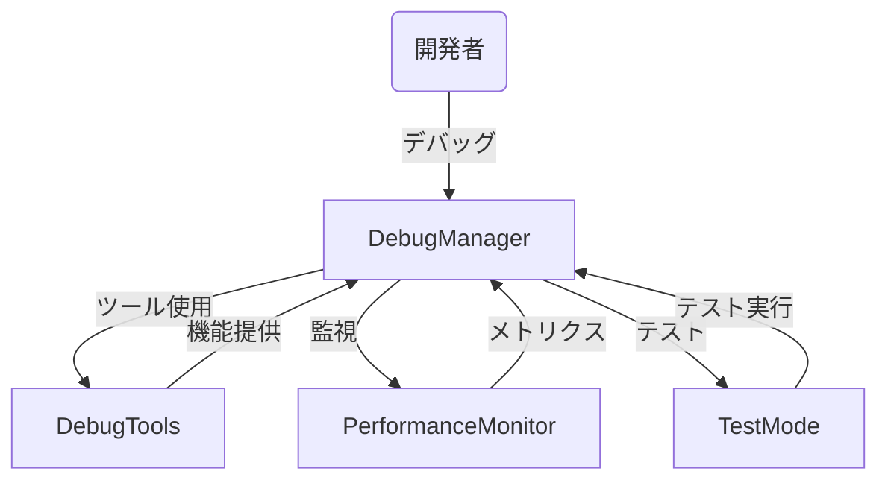
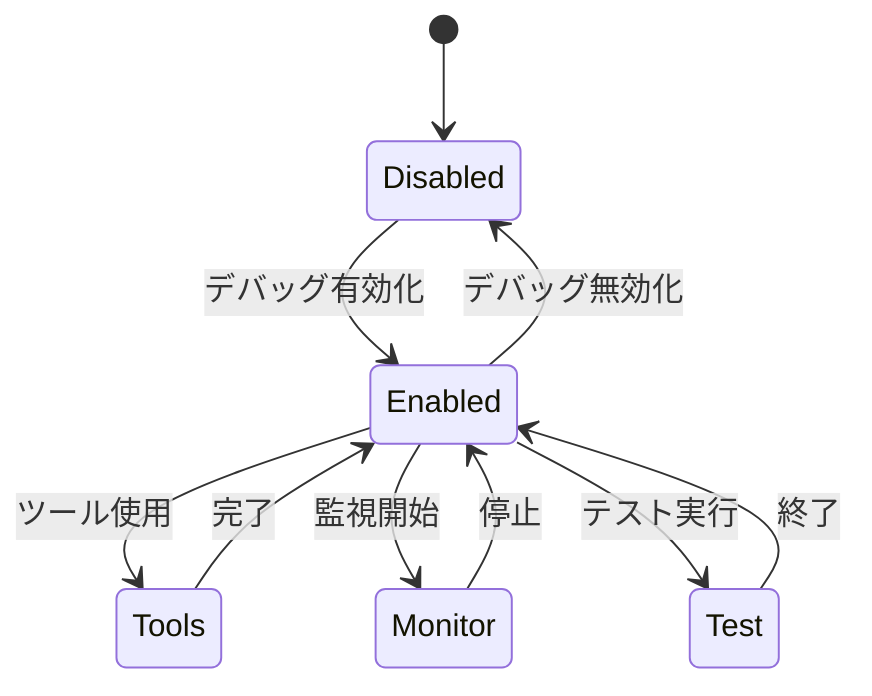
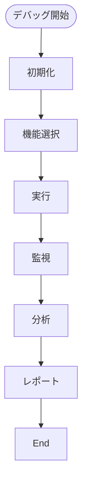
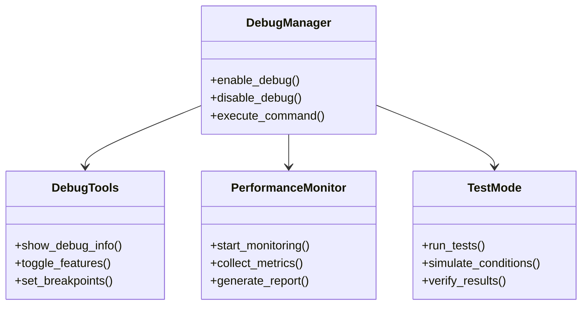

# デバッグ機能実装仕様

## 目次

1. [概要](#概要)
2. [ユースケース図](#ユースケース図)
3. [状態遷移図](#状態遷移図)
4. [アクティビティ図](#アクティビティ図)
5. [クラス図](#クラス図)
6. [実装詳細](#実装詳細)
7. [制限事項](#制限事項)
8. [変更履歴](#変更履歴)

## 概要

`DebugManager`がデバッグ機能を管理し、`DebugTools`がデバッグツールを、`PerformanceMonitor`がパフォーマンス監視を、`TestMode`がテストモードを担当する。

## ユースケース図



## 状態遷移図



## アクティビティ図



## クラス図



## 実装詳細

### 1. クラス設計
```gdscript
class_name DebugManager
extends Node

# デバッグツール
var debug_tools: DebugTools
var tool_settings: Dictionary
var active_tools: Array
var command_history: Array

# パフォーマンス監視
var performance_monitor: PerformanceMonitor
var monitoring_settings: Dictionary
var metrics_data: Dictionary
var report_settings: Dictionary

# テストモード
var test_mode: TestMode
var test_settings: Dictionary
var test_results: Dictionary
var simulation_data: Dictionary

# デバッグ設定
var debug_enabled: bool
var log_level: int
var output_settings: Dictionary
var security_settings: Dictionary
```

### 2. 主要メソッド
```gdscript
# デバッグツール
func enable_debug_tool(tool: String) -> void
func disable_debug_tool(tool: String) -> void
func execute_debug_command(command: String) -> void
func get_tool_status() -> Dictionary

# パフォーマンス監視
func start_performance_monitoring() -> void
func stop_performance_monitoring() -> void
func collect_metrics() -> Dictionary
func generate_performance_report() -> Dictionary

# テストモード
func enter_test_mode() -> void
func exit_test_mode() -> void
func run_test(test_name: String) -> Dictionary
func simulate_condition(condition: String) -> void

# デバッグ管理
func enable_debug_mode() -> void
func disable_debug_mode() -> void
func set_log_level(level: int) -> void
func get_debug_status() -> Dictionary
```

### 3. デバッグ設定
```gdscript
# デバッグツール設定
var tool_settings = {
    "enabled_tools": [
        "console",
        "inspector",
        "profiler",
        "memory_viewer"
    ],
    "console": {
        "max_history": 1000,
        "auto_scroll": true,
        "timestamp": true
    },
    "inspector": {
        "update_interval": 0.1,
        "max_depth": 5,
        "show_private": false
    },
    "profiler": {
        "sampling_rate": 0.1,
        "max_samples": 1000,
        "metrics": [
            "fps",
            "memory",
            "draw_calls",
            "physics"
        ]
    }
}

# パフォーマンス監視設定
var monitoring_settings = {
    "enabled": true,
    "metrics": {
        "fps": {
            "enabled": true,
            "interval": 0.1,
            "warning_threshold": 45
        },
        "memory": {
            "enabled": true,
            "interval": 1.0,
            "warning_threshold": 0.8
        },
        "draw_calls": {
            "enabled": true,
            "interval": 0.5,
            "warning_threshold": 1000
        }
    },
    "reporting": {
        "auto_report": true,
        "report_interval": 300,
        "save_reports": true,
        "report_format": "json"
    }
}

# テストモード設定
var test_settings = {
    "enabled": true,
    "test_categories": [
        "unit",
        "integration",
        "performance",
        "stress"
    ],
    "simulation": {
        "max_entities": 1000,
        "simulation_time": 300,
        "random_seed": 0
    },
    "verification": {
        "strict_mode": true,
        "timeout": 30,
        "retry_count": 3
    }
}

# デバッグ設定
var debug_settings = {
    "enabled": false,
    "log_levels": {
        "error": 0,
        "warning": 1,
        "info": 2,
        "debug": 3,
        "trace": 4
    },
    "output": {
        "console": true,
        "file": true,
        "file_path": "debug.log",
        "max_file_size": 10485760
    },
    "security": {
        "require_password": true,
        "allowed_commands": [
            "help",
            "status",
            "metrics",
            "test"
        ],
        "ip_whitelist": []
    }
}
```

### 4. イベント処理
```gdscript
# シグナル定義
signal debug_enabled()
signal debug_disabled()
signal tool_activated(tool: String)
signal metrics_updated(metrics: Dictionary)
signal test_completed(results: Dictionary)

# イベントハンドラー
func _on_debug_enabled() -> void:
    emit_signal("debug_enabled")
    initialize_debug_tools()

func _on_tool_activated(tool: String) -> void:
    emit_signal("tool_activated", tool)
    handle_tool_activation(tool)

func _on_metrics_updated(metrics: Dictionary) -> void:
    emit_signal("metrics_updated", metrics)
    process_metrics(metrics)
```

## 制限事項

1. デバッグツール
- 同時に有効化できるツールは最大5つまで
- コマンド履歴は最大1000件まで
- インスペクタの更新間隔は最小0.1秒まで

2. パフォーマンス監視
- メトリクス収集間隔は最小0.1秒まで
- サンプル数は最大1000件まで
- レポート生成間隔は最小60秒まで

3. テストモード
- 同時実行テストは最大10個まで
- シミュレーション時間は最大10分まで
- テストカテゴリは最大10種類まで

4. デバッグ設定
- ログレベルは5段階まで
- ログファイルサイズは最大10MBまで
- 許可コマンドは最大20種類まで

## 変更履歴

| バージョン | 更新日     | 変更内容 |
| ---------- | ---------- | -------- |
| 0.1.0      | 2024-03-21 | 初版作成 |
