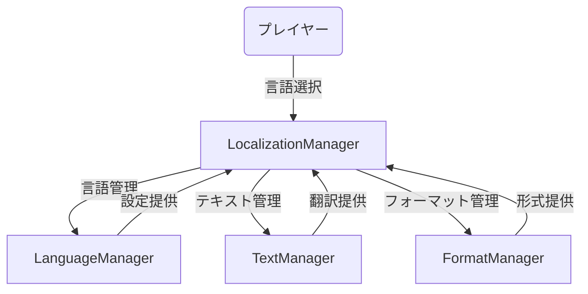
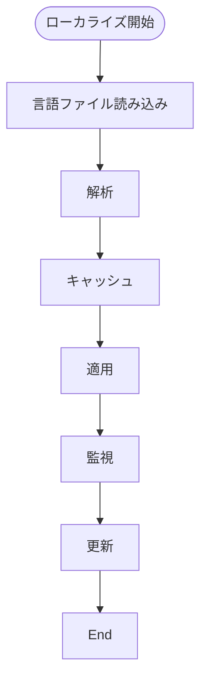
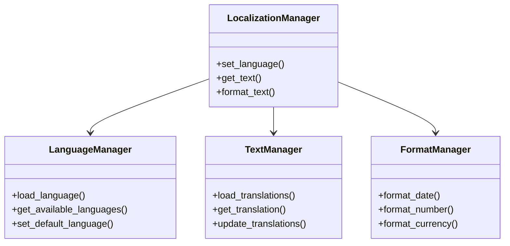

# ローカライゼーション実装仕様

## 目次

1. [概要](#概要)
2. [ユースケース図](#ユースケース図)
3. [状態遷移図](#状態遷移図)
4. [アクティビティ図](#アクティビティ図)
5. [クラス図](#クラス図)
6. [実装詳細](#実装詳細)
7. [制限事項](#制限事項)
8. [変更履歴](#変更履歴)

## 概要

`LocalizationManager`がローカライゼーションを管理し、`LanguageManager`が言語設定を、`TextManager`がテキスト管理を、`FormatManager`がフォーマット管理を担当する。

## ユースケース図



## 状態遷移図

```mermaid
stateDiagram-v2
    [*] --> Default
    Default --> LanguageSelect : 言語選択
    LanguageSelect --> Loading : 読み込み
    Loading --> Active : 完了
    Active --> Reload : 更新
    Reload --> Active : 完了
    Active --> Default : リセット
```

## アクティビティ図



## クラス図



## 実装詳細

### 1. クラス設計
```gdscript
class_name LocalizationManager
extends Node

# 言語管理
var language_manager: LanguageManager
var current_language: String
var available_languages: Array
var language_settings: Dictionary

# テキスト管理
var text_manager: TextManager
var translation_cache: Dictionary
var text_settings: Dictionary
var update_settings: Dictionary

# フォーマット管理
var format_manager: FormatManager
var format_settings: Dictionary
var locale_settings: Dictionary
var currency_settings: Dictionary

# ローカライゼーション設定
var localization_enabled: bool
var fallback_language: String
var cache_settings: Dictionary
var debug_settings: Dictionary
```

### 2. 主要メソッド
```gdscript
# 言語管理
func set_language(language: String) -> void
func get_available_languages() -> Array
func set_default_language(language: String) -> void
func get_current_language() -> String

# テキスト管理
func load_translations() -> void
func get_translation(key: String) -> String
func update_translations() -> void
func get_translation_status() -> Dictionary

# フォーマット管理
func format_date(date: Dictionary) -> String
func format_number(number: float) -> String
func format_currency(amount: float) -> String
func get_format_settings() -> Dictionary

# ローカライゼーション管理
func enable_localization() -> void
func disable_localization() -> void
func set_fallback_language(language: String) -> void
func get_localization_status() -> Dictionary
```

### 3. ローカライゼーション設定
```gdscript
# 言語設定
var language_settings = {
    "default_language": "ja",
    "available_languages": [
        "ja",
        "en",
        "zh",
        "ko"
    ],
    "language_names": {
        "ja": "日本語",
        "en": "English",
        "zh": "中文",
        "ko": "한국어"
    },
    "fallback": {
        "enabled": true,
        "language": "en"
    }
}

# テキスト設定
var text_settings = {
    "translation_files": {
        "path": "res://translations/",
        "format": "json",
        "encoding": "utf-8"
    },
    "categories": [
        "ui",
        "items",
        "quests",
        "dialogue",
        "system"
    ],
    "cache": {
        "enabled": true,
        "max_size": 1000,
        "expiration": 3600
    }
}

# フォーマット設定
var format_settings = {
    "date": {
        "format": "YYYY-MM-DD",
        "timezone": "Asia/Tokyo",
        "calendar": "gregorian"
    },
    "number": {
        "decimal_separator": ".",
        "thousand_separator": ",",
        "decimal_places": 2
    },
    "currency": {
        "symbol": "¥",
        "position": "before",
        "decimal_places": 0
    }
}

# ローカライゼーション設定
var localization_settings = {
    "enabled": true,
    "auto_detect": true,
    "persist_settings": true,
    "debug": {
        "enabled": false,
        "show_keys": false,
        "log_missing": true
    },
    "update": {
        "auto_update": true,
        "check_interval": 3600,
        "force_update": false
    }
}
```

### 4. イベント処理
```gdscript
# シグナル定義
signal language_changed(language: String)
signal translations_loaded()
signal format_changed(format: String)
signal localization_error(error: String)

# イベントハンドラー
func _on_language_changed(language: String) -> void:
    emit_signal("language_changed", language)
    update_language(language)

func _on_translations_loaded() -> void:
    emit_signal("translations_loaded")
    update_cache()

func _on_format_changed(format: String) -> void:
    emit_signal("format_changed", format)
    update_formats(format)
```

## 制限事項

1. 言語管理
- サポート言語は最大10言語まで
- 言語名の長さは最大32文字まで
- フォールバック言語は1つのみ

2. テキスト管理
- 翻訳キーは最大1000個まで
- キャッシュサイズは最大1000エントリまで
- カテゴリ数は最大10個まで

3. フォーマット管理
- 日付フォーマットは最大32文字まで
- 数値の小数点以下は最大4桁まで
- 通貨記号は最大4文字まで

4. ローカライゼーション設定
- 自動更新間隔は最小1時間まで
- デバッグログは最大1MBまで
- 設定ファイルサイズは最大10MBまで

## 変更履歴

| バージョン | 更新日     | 変更内容 |
| ---------- | ---------- | -------- |
| 0.1.0      | 2024-03-21 | 初版作成 |
