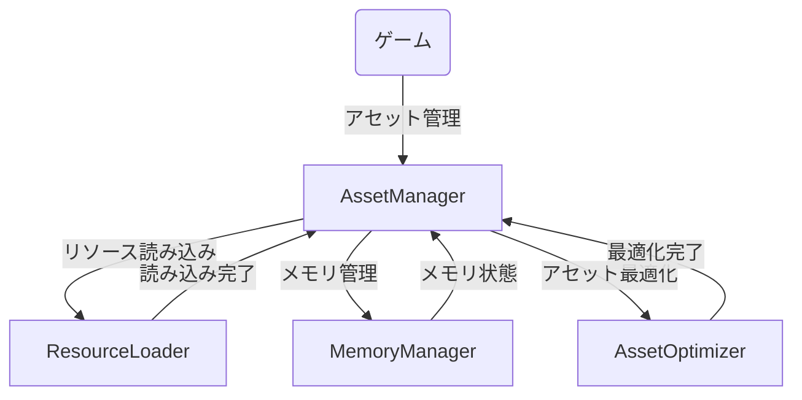
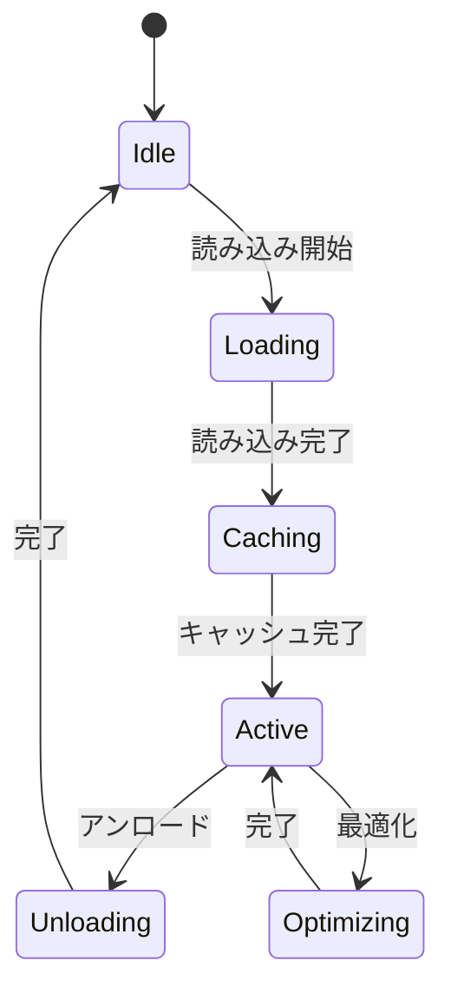
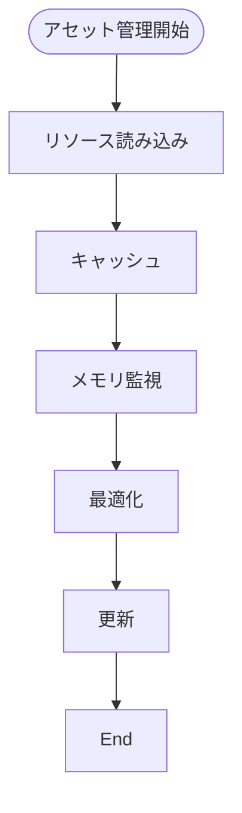
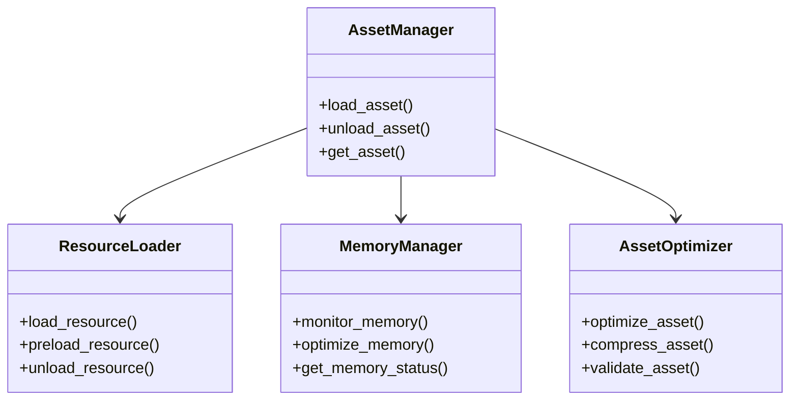

# アセット管理実装仕様

## 目次

1. [概要](#概要)
2. [ユースケース図](#ユースケース図)
3. [状態遷移図](#状態遷移図)
4. [アクティビティ図](#アクティビティ図)
5. [クラス図](#クラス図)
6. [実装詳細](#実装詳細)
7. [制限事項](#制限事項)
8. [変更履歴](#変更履歴)

## 概要

`AssetManager`がアセット管理を担当し、`ResourceLoader`がリソース読み込みを、`MemoryManager`がメモリ管理を、`AssetOptimizer`がアセット最適化を担当する。

## ユースケース図



## 状態遷移図



## アクティビティ図



## クラス図



## 実装詳細

### 1. クラス設計
```gdscript
class_name AssetManager
extends Node

# リソース管理
var resource_loader: ResourceLoader
var loaded_resources: Dictionary
var resource_cache: Dictionary
var loading_queue: Array

# メモリ管理
var memory_manager: MemoryManager
var memory_settings: Dictionary
var memory_stats: Dictionary
var optimization_settings: Dictionary

# アセット最適化
var asset_optimizer: AssetOptimizer
var optimization_cache: Dictionary
var compression_settings: Dictionary
var validation_settings: Dictionary

# アセット管理設定
var asset_enabled: bool
var preload_settings: Dictionary
var cache_settings: Dictionary
var update_settings: Dictionary
```

### 2. 主要メソッド
```gdscript
# リソース管理
func load_resource(path: String) -> Resource
func preload_resource(path: String) -> void
func unload_resource(path: String) -> void
func get_resource_status() -> Dictionary

# メモリ管理
func monitor_memory() -> void
func optimize_memory() -> void
func get_memory_status() -> Dictionary
func set_memory_limit(limit: int) -> void

# アセット最適化
func optimize_asset(path: String) -> void
func compress_asset(path: String) -> void
func validate_asset(path: String) -> bool
func get_optimization_status() -> Dictionary

# アセット管理
func enable_asset_management() -> void
func disable_asset_management() -> void
func set_preload_settings(settings: Dictionary) -> void
func get_asset_status() -> Dictionary
```

### 3. アセット管理設定
```gdscript
# リソース設定
var resource_settings = {
    "preload": {
        "enabled": true,
        "priority": {
            "high": 0,
            "medium": 1,
            "low": 2
        },
        "max_concurrent": 5
    },
    "cache": {
        "enabled": true,
        "max_size": 1000,
        "expiration": 3600
    },
    "loading": {
        "timeout": 30,
        "retry_count": 3,
        "show_progress": true
    }
}

# メモリ設定
var memory_settings = {
    "limits": {
        "total": 2048,
        "per_asset": 100,
        "cache": 500
    },
    "optimization": {
        "auto_optimize": true,
        "threshold": 0.8,
        "interval": 300
    },
    "monitoring": {
        "enabled": true,
        "interval": 1.0,
        "warning_threshold": 0.7
    }
}

# 最適化設定
var optimization_settings = {
    "textures": {
        "max_size": 2048,
        "compression": "etc2",
        "mipmaps": true
    },
    "models": {
        "max_vertices": 10000,
        "max_materials": 4,
        "optimize_mesh": true
    },
    "audio": {
        "max_bitrate": 192,
        "compression": "vorbis",
        "streaming": true
    }
}

# アセット管理設定
var asset_settings = {
    "enabled": true,
    "auto_update": true,
    "validation": {
        "enabled": true,
        "check_integrity": true,
        "verify_checksums": true
    },
    "organization": {
        "categories": [
            "textures",
            "models",
            "audio",
            "scripts",
            "scenes"
        ],
        "naming_convention": "snake_case",
        "version_control": true
    }
}
```

### 4. イベント処理
```gdscript
# シグナル定義
signal resource_loaded(path: String)
signal memory_warning(usage: float)
signal optimization_completed(success: bool)
signal asset_error(error: String)

# イベントハンドラー
func _on_resource_loaded(path: String) -> void:
    emit_signal("resource_loaded", path)
    update_cache(path)

func _on_memory_warning(usage: float) -> void:
    emit_signal("memory_warning", usage)
    handle_memory_warning(usage)

func _on_optimization_completed(success: bool) -> void:
    emit_signal("optimization_completed", success)
    update_optimization_status(success)
```

## 制限事項

1. リソース管理
- 同時読み込み数は最大5つまで
- キャッシュサイズは最大1000エントリまで
- リソースパスは最大256文字まで

2. メモリ管理
- 総メモリ制限は最大2GBまで
- アセットごとのメモリ制限は最大100MBまで
- キャッシュメモリは最大500MBまで

3. アセット最適化
- テクスチャサイズは最大2048x2048まで
- モデルの頂点数は最大10000まで
- オーディオビットレートは最大192kbpsまで

4. アセット管理
- カテゴリ数は最大10個まで
- バージョン履歴は最大100件まで
- 検証間隔は最小1分まで

## 変更履歴

| バージョン | 更新日     | 変更内容 |
| ---------- | ---------- | -------- |
| 0.1.0      | 2024-03-21 | 初版作成 |
