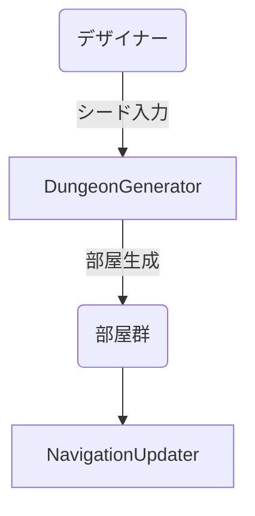
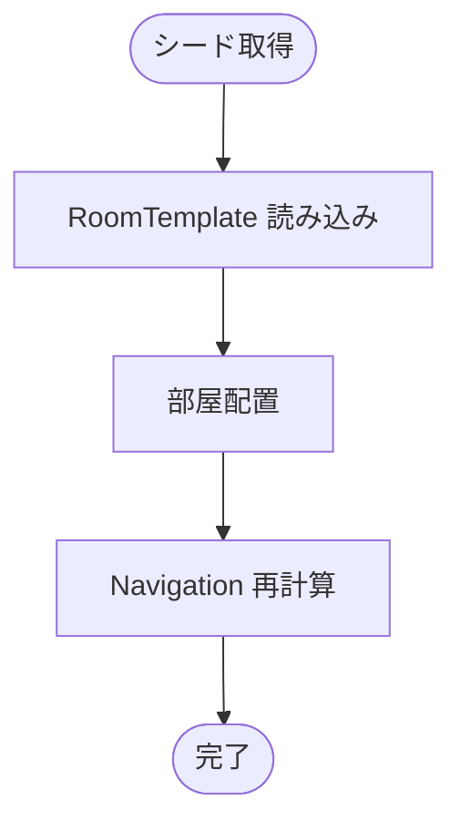
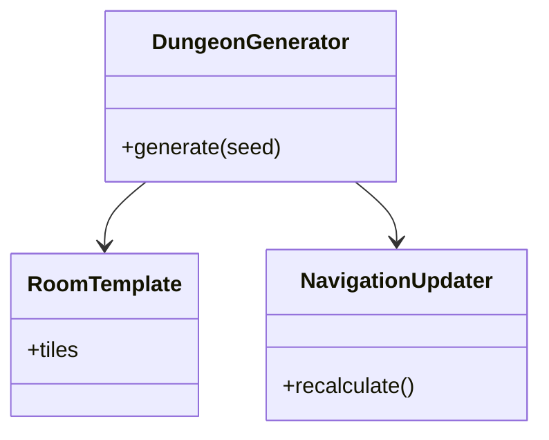

# ダンジョン生成実装仕様

## 目次

1. [概要](#概要)
2. [ユースケース図](#ユースケース図)
3. [アクティビティ図](#アクティビティ図)
4. [クラス図](#クラス図)
5. [変更履歴](#変更履歴)

## 概要

`DungeonGenerator` は部屋テンプレート `RoomTemplate` と乱数シードからマップを構築し、生成後に `NavigationUpdater` がナビゲーションメッシュを再計算する。

## ユースケース図

## アクティビティ図

## クラス図

## 変更履歴

| バージョン | 更新日     | 変更内容 |
| ---------- | ---------- | -------- |
| 0.1.0      | 2025-06-06 | 初版作成 |

# 関連ドキュメント

## 技術ドキュメント
- [14.1 要件定義](14.1_Requirement.md) - プロジェクトの基本要件と技術要件
- [14.2 プロトタイプ技術設計](14.2_PrototypeTechnicalDesign.md) - プロトタイプ開発の技術設計
- [14.5 ダンジョン生成](14.5_DungeonGeneration.md) - ダンジョン生成システム
- [14.13 技術設計仕様](14.13_TechnicalDesignSpec.md) - 全体の技術設計仕様

## 実装仕様書
- [15.3 敵AI実装仕様](15.3_EnemyAISpec.md) - 敵AIの実装詳細
- [15.4 戦闘システム実装仕様](15.4_CombatSystemSpec.md) - 戦闘システムの実装詳細
- [15.11 チュートリアル実装仕様](15.11_TutorialRoomSpec.md) - チュートリアルシステムの実装詳細
