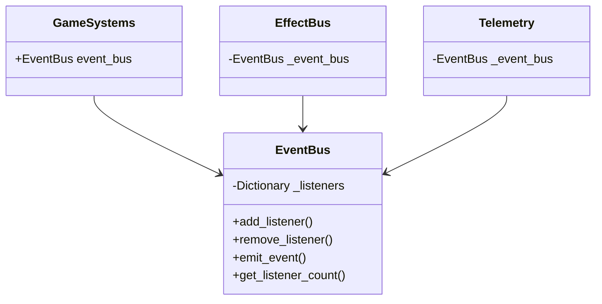
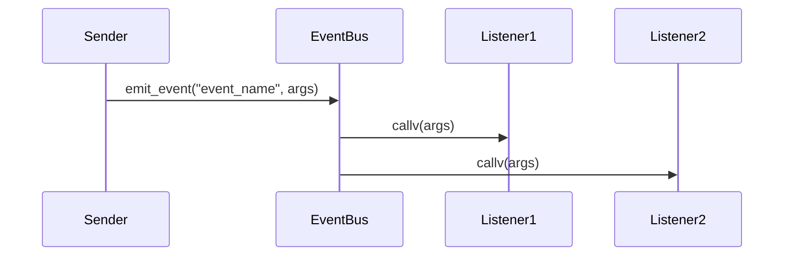
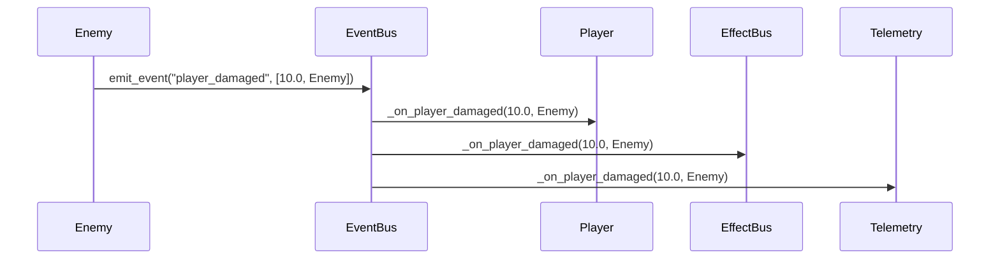

# 目次
1. [概要](#概要)
2. [システム構成](#システム構成)
3. [イベント定義](#イベント定義)
4. [使用方法](#使用方法)
5. [イベントフロー](#イベントフロー)
6. [エラーハンドリング](#エラーハンドリング)
7. [制限事項](#制限事項)
8. [変更履歴](#変更履歴)

# EventBus実装仕様書

## 概要

EventBusは、ゲーム内のイベント管理を担当するサブシステムです。GameSystemsの一部として機能し、ゲーム内の様々なイベントの発火と購読を一元管理します。

### 主な機能
- イベントの発火と購読の管理
- イベントリスナーの登録と解除
- イベントの伝播制御

## システム構成

### クラス図


## イベント定義

### ゲーム状態イベント
```gdscript
# ゲームの開始
signal game_started

# ゲームの一時停止
signal game_paused

# ゲームの再開
signal game_resumed

# ゲームの終了
signal game_ended
```

### プレイヤー関連イベント
```gdscript
# プレイヤーのダメージ
signal player_damaged(amount: float, source: Node)

# プレイヤーの回復
signal player_healed(amount: float, source: Node)

# プレイヤーの死亡
signal player_died
```

### 敵関連イベント
```gdscript
# 敵のダメージ
signal enemy_damaged(enemy: Node, amount: float, source: Node)

# 敵の死亡
signal enemy_died(enemy: Node)
```

### ルーム関連イベント
```gdscript
# ルームへの進入
signal room_entered(room_id: String)

# ルームのクリア
signal room_cleared(room_id: String)
```

## 使用方法

### イベントリスナーの登録
```gdscript
# メソッドをリスナーとして登録
func _ready() -> void:
    GameSystems.instance.event_bus.add_listener("player_damaged", _on_player_damaged)

# リスナーメソッドの実装
func _on_player_damaged(amount: float, source: Node) -> void:
    print("プレイヤーが %f のダメージを受けました" % amount)
```

### イベントの発火
```gdscript
# イベントの発火
func deal_damage_to_player(amount: float) -> void:
    GameSystems.instance.event_bus.emit_event("player_damaged", [amount, self])
```

### イベントリスナーの解除
```gdscript
func _exit_tree() -> void:
    GameSystems.instance.event_bus.remove_listener("player_damaged", _on_player_damaged)
```

## イベントフロー

### 基本的なイベントフロー


### プレイヤーダメージイベントの例


## エラーハンドリング

### エラーケース
1. 無効なイベント名での発火
2. 無効なリスナーの呼び出し
3. 重複したリスナーの登録

### エラー処理
```gdscript
# イベント発火時のエラー処理
func emit_event(event_name: String, args: Array = []) -> void:
    if not _listeners.has(event_name):
        push_warning("EventBus: 未登録のイベント '%s' が発火されました" % event_name)
        return

    for listener in _listeners[event_name]:
        if listener.is_valid():
            listener.callv(args)
        else:
            push_warning("EventBus: 無効なリスナーが登録されています")
```

## 制限事項

### 現在の制限
- イベントの優先順位制御は未実装
- イベントのキャンセル機能は未実装
- 非同期イベント処理は未実装

### 今後の改善点
1. イベントの優先順位システムの実装
2. イベントのキャンセル機能の追加
3. 非同期イベント処理のサポート
4. イベントのデバッグ機能の強化

## 変更履歴

| バージョン | 更新日       | 変更内容                 |
| --------- | ----------- | ------------------------ |
| 0.1       | 2025-05-30 | 初版作成（基本実装）     |
