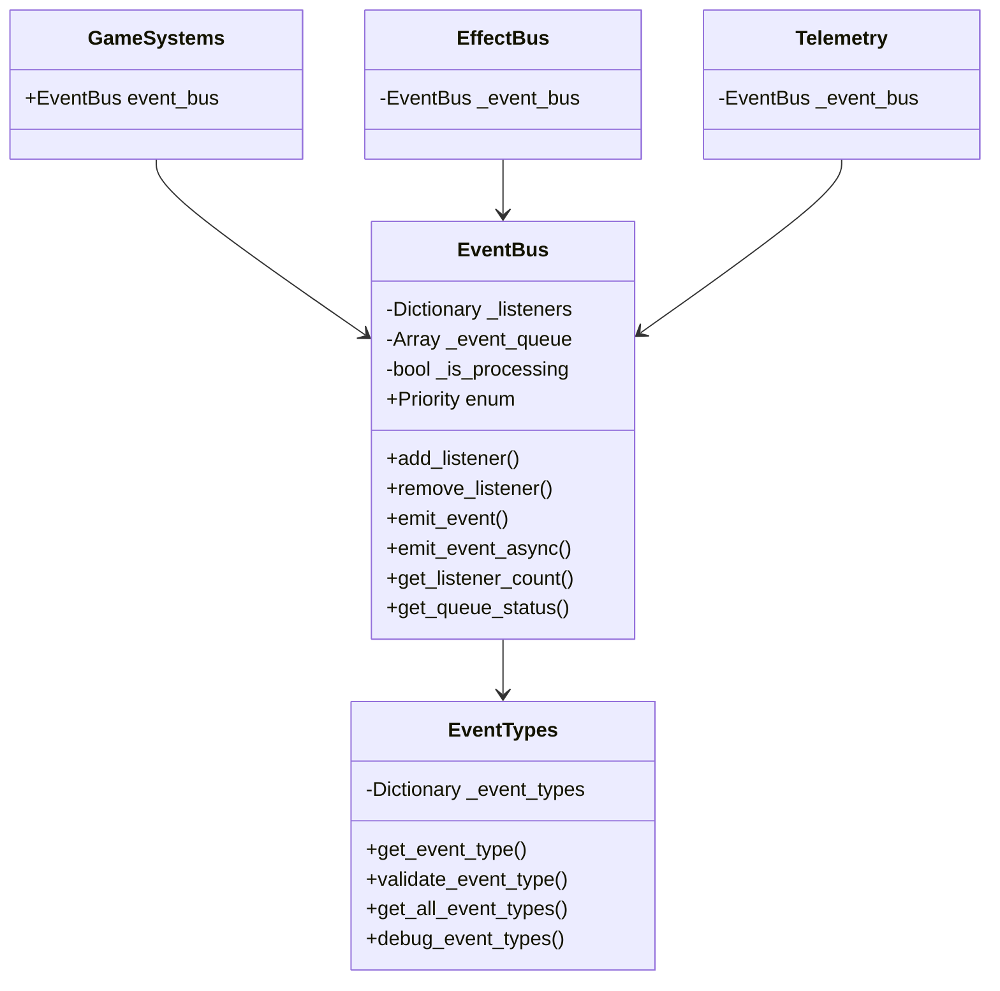
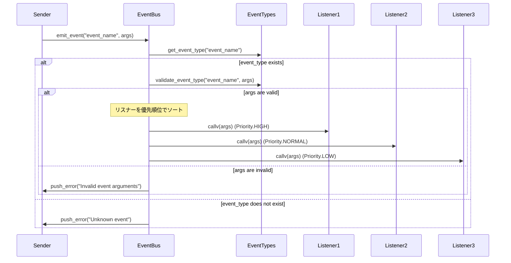
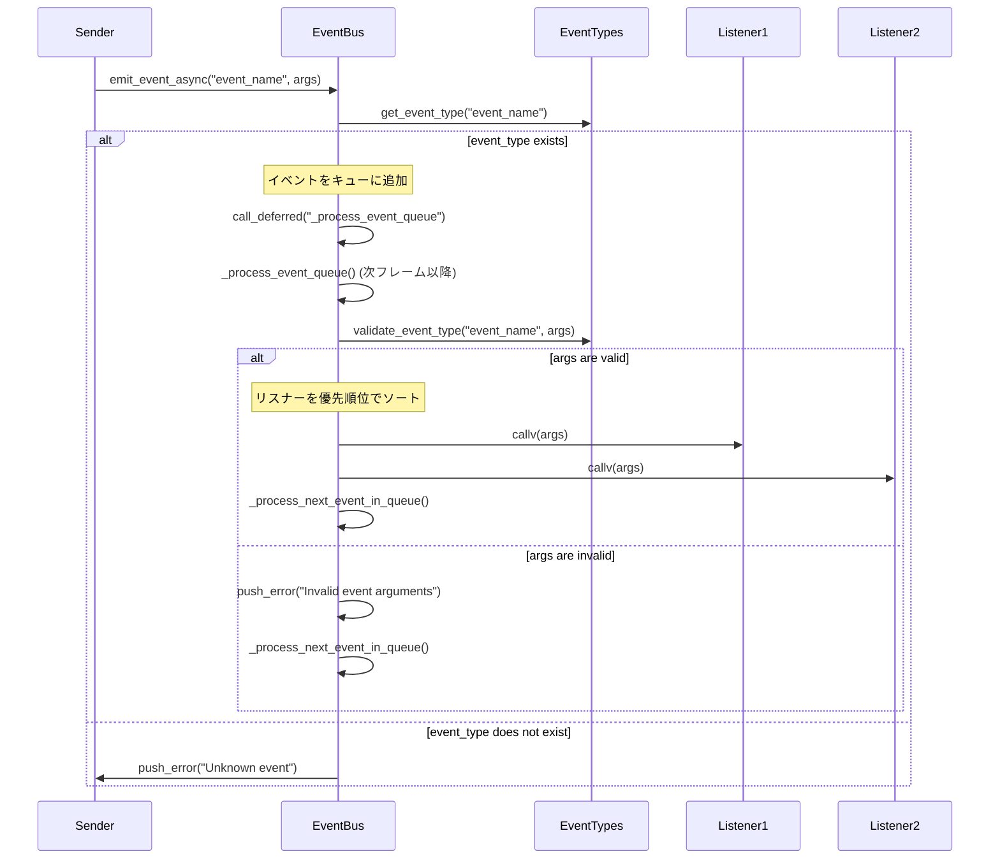

# 目次

1. [概要](#概要)
2. [システム構成](#システム構成)
3. [イベント定義](#イベント定義)
4. [使用方法](#使用方法)
5. [イベントフロー](#イベントフロー)
6. [エラーハンドリング](#エラーハンドリング)
7. [制限事項](#制限事項)
8. [変更履歴](#変更履歴)

# EventBus 実装仕様書

## 概要

EventBus は、ゲーム内のイベント管理を担当するサブシステムです。GameSystems の一部として機能し、ゲーム内の様々なイベントの発火と購読を一元管理します。

### 主な機能

-   イベントの発火と購読の管理
-   優先順位付きイベントリスナーの登録と解除
-   同期・非同期イベント処理
-   イベントの伝播制御

## システム構成

### クラス図



## イベント定義

### イベントタイプの検証

イベントシステムは、イベントの発火時に以下の検証を行います：

1. イベント名の存在確認
2. パラメータの数と型の検証

```gdscript
# イベントタイプの検証例
var is_valid = EventTypes.validate_event_type("player_damaged", [10.0, damage_source])
if not is_valid:
    push_error("Invalid event arguments for player_damaged")
    return
```

### 優先順位定義

```gdscript
enum Priority {
    LOWEST = 0,
    LOW = 1,
    NORMAL = 2,
    HIGH = 3,
    HIGHEST = 4
}
```

### ゲーム状態イベント

```gdscript
@warning_ignore("unused_signal")
signal game_started

@warning_ignore("unused_signal")
signal game_paused

@warning_ignore("unused_signal")
signal game_resumed

@warning_ignore("unused_signal")
signal game_ended(score: int, reason: String)
```

### プレイヤー関連イベント

```gdscript
@warning_ignore("unused_signal")
signal player_damaged(amount: float, source: Node)

@warning_ignore("unused_signal")
signal player_healed(amount: float, source: Node)

@warning_ignore("unused_signal")
signal player_died(killer: Node)
```

### 敵関連イベント

```gdscript
@warning_ignore("unused_signal")
signal enemy_damaged(enemy: Node, amount: float, source: Node)

@warning_ignore("unused_signal")
signal enemy_died(enemy: Node, killer: Node)
```

### ルーム関連イベント

```gdscript
@warning_ignore("unused_signal")
signal room_entered(room_id: String, player: Node)

@warning_ignore("unused_signal")
signal room_cleared(room_id: String, clear_time: float)
```

## 使用方法

### イベントリスナーの登録（優先順位付き）

```gdscript
# メソッドをリスナーとして登録（優先順位指定）
# add_listener呼び出し時にイベント名の存在が確認されます。
# 存在しないイベント名の場合、エラーが出力されます。
func _ready() -> void:
    GameSystems.instance.event_bus.add_listener(
        "player_damaged",
        _on_player_damaged,
        EventBus.Priority.HIGH
    )

# リスナーメソッドの実装
# 登録したイベントタイプで定義されたパラメータと一致するシグネチャを持つ必要があります。
func _on_player_damaged(amount: float, source: Node) -> void:
    print("プレイヤーが %f のダメージを受けました" % amount)
```

### イベントの発火（同期）

```gdscript
# 同期イベントの発火
# emit_event呼び出し時にイベント名の存在と引数の検証が行われます。
# 存在しないイベント名、または引数の数や型がイベント定義と一致しない場合、エラーが出力されイベントは発火されません。
func deal_damage_to_player(amount: float) -> void:
    # sourceとしてself（Node）を渡しています
    GameSystems.instance.event_bus.emit_event("player_damaged", [amount, self])
```

### イベントの発火（非同期）

```gdscript
# 非同期イベントの発火
# emit_event_async呼び出し時にはイベント名の存在のみ確認されます。
# 引数の検証はイベントがキューから取り出されて処理される際（別フレーム）に行われます。
# 検証に失敗した場合、エラーが出力されリスナーは呼び出されません。
func deal_damage_to_player_async(amount: float) -> void:
    # sourceとしてself（Node）を渡しています
    GameSystems.instance.event_bus.emit_event_async("player_damaged", [amount, self])
```

### イベントリスナーの解除

```gdscript
func _exit_tree() -> void:
    GameSystems.instance.event_bus.remove_listener("player_damaged", _on_player_damaged)
```

## イベントフロー

### 基本的なイベントフロー（同期・優先順位付き）



### 非同期イベントフロー



## エラーハンドリング

### エラーケース

1.  **無効なイベント名での操作**: `add_listener`, `emit_event`, `emit_event_async` に未定義のイベント名が渡された場合。EventBus はエラーを出力し、処理を中断します。
2.  **無効なイベントパラメータでの発火**: `emit_event`, `emit_event_async` に、イベント定義と引数の数や型が一致しないパラメータが渡された場合。EventBus はエラーを出力し、そのイベントに対するリスナーの呼び出しを行いません。
3.  **無効なリスナーの呼び出し**: 登録されていた Callable が無効になった場合（例: 対象の Object が解放された）。EventBus はその Callable をリスナーリストから削除します。
4.  **重複したリスナーの登録**: 同じイベント名と同じ Callable が複数回登録されようとした場合。デバッグモードが有効な場合、EventBus は警告を出力しますが、登録は一度だけ行われます。

### エラー処理（コード例）

EventBus 内部でエラーや警告が発生した際は、Godot の標準機能 (`push_error`, `push_warning`) を使用してコンソールに出力されます。これにより、開発中に問題を特定しやすくなっています。

例えば、`emit_event`におけるイベント名と引数の検証失敗時には、以下のようなエラーが出力されます。

```
EventBus: Cannot emit unknown event 'some_unknown_event'
```

または

```
EventBus: Invalid event arguments for 'player_damaged'
```

同様に、`add_listener`に未知のイベント名が渡された場合や、重複リスナー登録（デバッグモード時）には警告やエラーが出力されます。

## 制限事項

### 現在の制限

-   イベント伝播のキャンセル機能は現在のバージョンにはありません。
-   EventBus 自体はシングルトンではありません。必要に応じて GameSystems などの上位システムでインスタンスを管理してください。
-   大量の非同期イベントを一度に発火した場合、処理に時間がかかる可能性があります。

## 変更履歴

-   **Version 0.3 (YYYY-MM-DD)**
    -   EventTypes の初期化タイミングを修正し、get_event_type/validate_event_type 呼び出し時に初期化を保証するように変更。
    -   EventBus の add_listener, emit_event, emit_event_async におけるイベント名・引数検証ロジックを EventTypes と連携するように修正。
    -   非同期イベント(emit_event_async)の引数検証を、発火時ではなくキュー処理時に行うように変更。
    -   重複リスナー登録時の警告出力に push_warning を使用するように変更。
    -   イベントフローおよびエラーハンドリングに関するドキュメントを更新。
