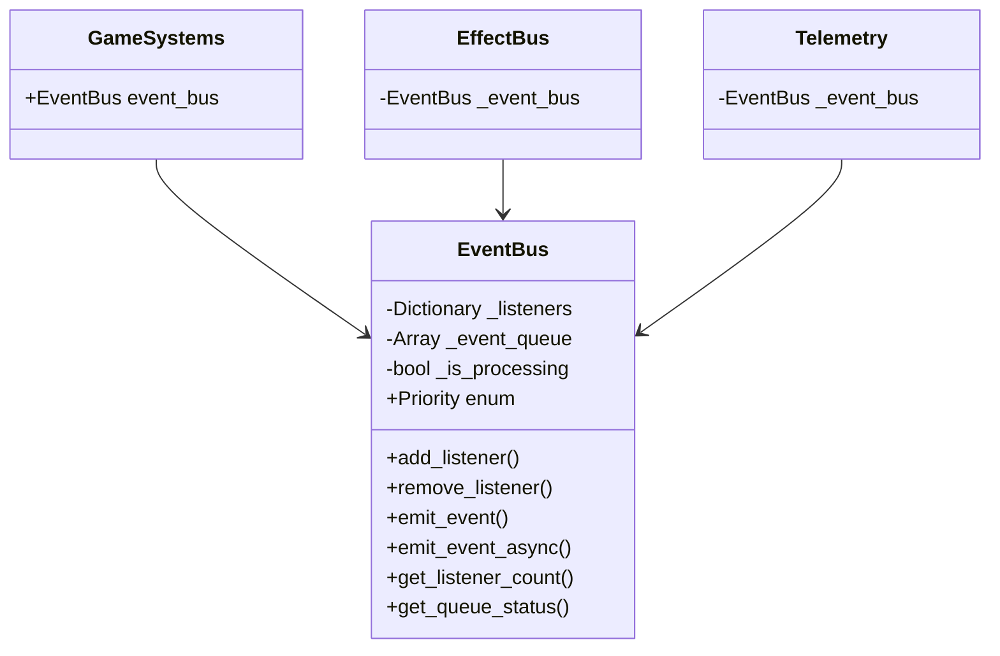
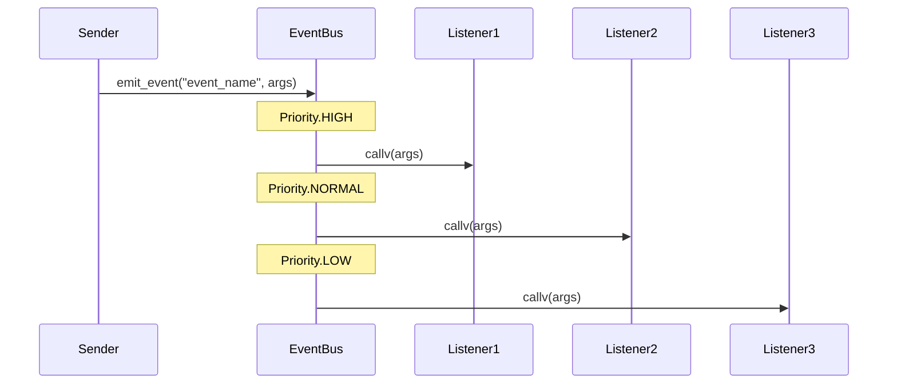
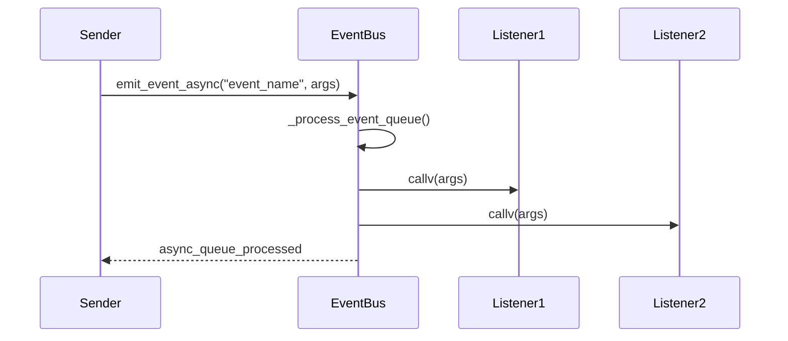

# 目次

1. [概要](#概要)
2. [システム構成](#システム構成)
3. [イベント定義](#イベント定義)
4. [使用方法](#使用方法)
5. [イベントフロー](#イベントフロー)
6. [エラーハンドリング](#エラーハンドリング)
7. [制限事項](#制限事項)
8. [変更履歴](#変更履歴)

# EventBus 実装仕様書

## 概要

EventBus は、ゲーム内のイベント管理を担当するサブシステムです。GameSystems の一部として機能し、ゲーム内の様々なイベントの発火と購読を一元管理します。

### 主な機能

-   イベントの発火と購読の管理
-   優先順位付きイベントリスナーの登録と解除
-   同期・非同期イベント処理
-   イベントの伝播制御

## システム構成

### クラス図



## イベント定義

### 優先順位定義

```gdscript
enum Priority {
    LOWEST = 0,
    LOW = 1,
    NORMAL = 2,
    HIGH = 3,
    HIGHEST = 4
}
```

### ゲーム状態イベント

```gdscript
@warning_ignore("unused_signal")
signal game_started

@warning_ignore("unused_signal")
signal game_paused

@warning_ignore("unused_signal")
signal game_resumed

@warning_ignore("unused_signal")
signal game_ended
```

### プレイヤー関連イベント

```gdscript
@warning_ignore("unused_signal")
signal player_damaged(amount: float, source: Node)

@warning_ignore("unused_signal")
signal player_healed(amount: float, source: Node)

@warning_ignore("unused_signal")
signal player_died
```

### 敵関連イベント

```gdscript
@warning_ignore("unused_signal")
signal enemy_damaged(enemy: Node, amount: float, source: Node)

@warning_ignore("unused_signal")
signal enemy_died(enemy: Node)
```

### ルーム関連イベント

```gdscript
@warning_ignore("unused_signal")
signal room_entered(room_id: String)

@warning_ignore("unused_signal")
signal room_cleared(room_id: String)
```

## 使用方法

### イベントリスナーの登録（優先順位付き）

```gdscript
# メソッドをリスナーとして登録（優先順位指定）
func _ready() -> void:
    GameSystems.instance.event_bus.add_listener(
        "player_damaged",
        _on_player_damaged,
        EventBus.Priority.HIGH
    )

# リスナーメソッドの実装
func _on_player_damaged(amount: float, source: Node) -> void:
    print("プレイヤーが %f のダメージを受けました" % amount)
```

### イベントの発火（同期）

```gdscript
# 同期イベントの発火
func deal_damage_to_player(amount: float) -> void:
    GameSystems.instance.event_bus.emit_event("player_damaged", [amount, self])
```

### イベントの発火（非同期）

```gdscript
# 非同期イベントの発火
func deal_damage_to_player_async(amount: float) -> void:
    GameSystems.instance.event_bus.emit_event_async("player_damaged", [amount, self])
```

### イベントリスナーの解除

```gdscript
func _exit_tree() -> void:
    GameSystems.instance.event_bus.remove_listener("player_damaged", _on_player_damaged)
```

## イベントフロー

### 基本的なイベントフロー（優先順位付き）



### 非同期イベントフロー



## エラーハンドリング

### エラーケース

1. 無効なイベント名での発火
2. 無効なリスナーの呼び出し
3. 重複したリスナーの登録
4. 非同期イベント処理中のエラー

### エラー処理

```gdscript
# イベント発火時のエラー処理
func emit_event(event_name: String, args: Array = []) -> void:
    if not _listeners.has(event_name):
        push_warning("EventBus: 未登録のイベント '%s' が発火されました" % event_name)
        return

    var listeners_to_call = _listeners[event_name].duplicate()
    for listener_data in listeners_to_call:
        var listener_callable = listener_data.listener
        if listener_callable.is_valid() and listener_callable.get_object() != null:
            listener_callable.callv(args)
        else:
            remove_listener(event_name, listener_data.listener)
```

## 制限事項

### 現在の制限

-   イベントのキャンセル機能は未実装
-   イベントのデバッグ機能は限定的

### パフォーマンス基準

以下のパフォーマンス基準を満たすことを確認済み：

1. リスナー追加

    - 平均実行時間: 0.1ms 以下
    - 最大実行時間: 2ms 以下

2. イベント発火（同期）

    - 平均実行時間: 2ms 以下
    - 最大実行時間: 5ms 以下

3. イベント発火（非同期）

    - 平均実行時間: 5ms 以下
    - 最大実行時間: 10ms 以下

4. メモリ使用量
    - リスナー登録時: 1MB 以下
    - イベント発火時: 10KB 以下

### 今後の改善点

1. イベントのキャンセル機能の追加
2. イベントのデバッグ機能の強化
3. イベントの統計情報の収集
4. イベントのパフォーマンスモニタリング
5. パフォーマンステストの自動化と継続的監視

## 変更履歴

| バージョン | 更新日     | 変更内容                                           |
| ---------- | ---------- | -------------------------------------------------- |
| 0.3        | 2024-03-20 | パフォーマンステスト結果と基準値の追加             |
| 0.2        | 2024-03-19 | 優先順位付きイベント処理と非同期イベント処理の実装 |
| 0.1        | 2025-05-30 | 初版作成（基本実装）                               |
