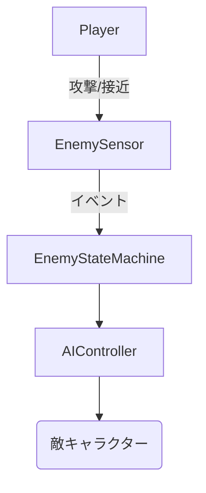
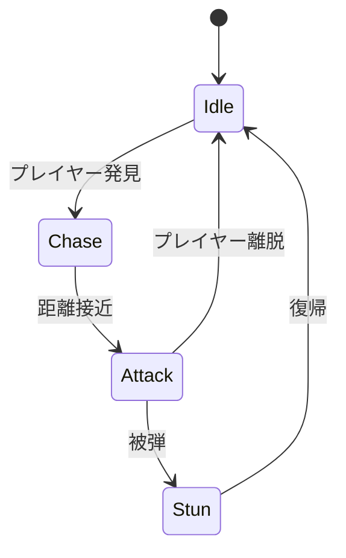
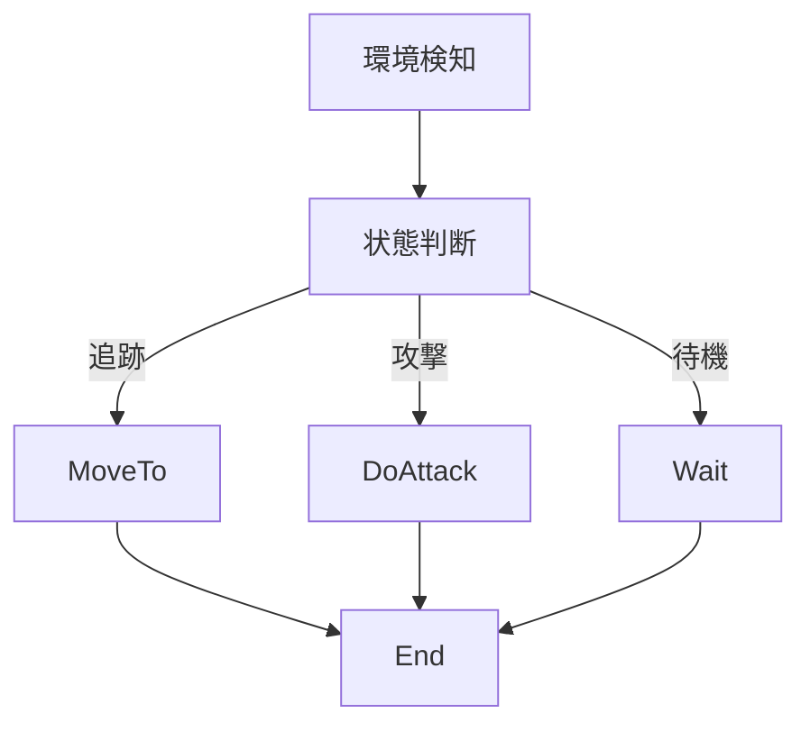
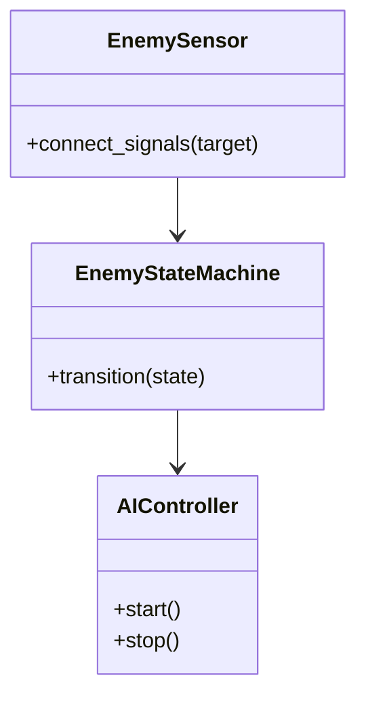

# 敵AI実装仕様

## 目次

1. [概要](#概要)
2. [ユースケース図](#ユースケース図)
3. [状態遷移図](#状態遷移図)
4. [アクティビティ図](#アクティビティ図)
5. [クラス図](#クラス図)
6. [変更履歴](#変更履歴)

## 概要

`EnemySensor` がプレイヤー位置や被弾イベントを検知し、`EnemyStateMachine` に状態遷移を通知。 `AIController` が各コンポーネントを統合して敵挙動を制御する。

## ユースケース図



## 状態遷移図



## アクティビティ図



## クラス図



## 実装詳細

### 1. クラス設計
```gdscript
class_name EnemyAI
extends Node

# センサーシステム
var sensor: EnemySensor
var detection_range: float
var attack_range: float
var field_of_view: float
var hearing_range: float

# 状態管理
var state_machine: EnemyStateMachine
var current_state: String
var previous_state: String
var state_history: Array
var state_timeouts: Dictionary

# 行動制御
var controller: AIController
var movement_speed: float
var rotation_speed: float
var attack_cooldown: float
var stun_duration: float

# ターゲット管理
var target: Node
var target_position: Vector3
var last_known_position: Vector3
var target_visible: bool
var target_distance: float

# パス探索
var pathfinder: PathFinder
var current_path: Array
var waypoint_index: int
var path_update_interval: float
var obstacle_avoidance: bool

# 戦闘パラメータ
var attack_damage: float
var attack_speed: float
var attack_pattern: int
var special_abilities: Array
var weakness_resistance: Dictionary
```

### 2. 主要メソッド
```gdscript
# 初期化と設定
func initialize(config: Dictionary) -> void
func setup_sensors() -> void
func setup_state_machine() -> void
func setup_controller() -> void

# センサー処理
func update_sensors() -> void
func check_target_visibility() -> bool
func calculate_target_distance() -> float
func detect_surroundings() -> Dictionary

# 状態管理
func update_state() -> void
func handle_state_transition() -> void
func process_state_behavior() -> void
func check_state_conditions() -> bool

# 行動制御
func update_movement() -> void
func update_rotation() -> void
func execute_attack() -> void
func handle_stun() -> void

# パス探索
func update_path() -> void
func follow_path() -> void
func find_alternative_path() -> void
func check_path_validity() -> bool

# 戦闘処理
func calculate_attack_damage() -> float
func execute_attack_pattern() -> void
func use_special_ability(ability_index: int) -> void
func handle_damage_received(damage: float, damage_type: String) -> void
```

### 3. 状態定義
```gdscript
# 基本状態
enum EnemyState {
    IDLE,
    PATROL,
    CHASE,
    ATTACK,
    STUN,
    FLEE,
    DEAD
}

# 行動パターン
enum BehaviorPattern {
    AGGRESSIVE,
    DEFENSIVE,
    CAUTIOUS,
    BERSERK
}

# 攻撃パターン
enum AttackPattern {
    SINGLE,
    COMBO,
    RANGE,
    SPECIAL
}

# 特殊能力
enum SpecialAbility {
    TELEPORT,
    SUMMON,
    BUFF,
    DEBUFF
}
```

### 4. 設定パラメータ
```gdscript
# 基本パラメータ
var base_params = {
    "health": 100.0,
    "movement_speed": 5.0,
    "rotation_speed": 180.0,
    "detection_range": 20.0,
    "attack_range": 2.0,
    "field_of_view": 120.0,
    "hearing_range": 15.0
}

# 戦闘パラメータ
var combat_params = {
    "attack_damage": 10.0,
    "attack_speed": 1.0,
    "attack_cooldown": 1.5,
    "stun_duration": 2.0,
    "critical_chance": 0.1,
    "critical_multiplier": 2.0
}

# 行動パラメータ
var behavior_params = {
    "patrol_radius": 10.0,
    "chase_speed_multiplier": 1.5,
    "flee_health_threshold": 0.3,
    "aggro_range": 15.0,
    "deaggro_range": 25.0
}
```

### 5. イベント処理
```gdscript
# シグナル定義
signal state_changed(new_state: String)
signal target_detected(target: Node)
signal target_lost()
signal attack_executed(damage: float)
signal damage_received(amount: float)
signal special_ability_used(ability: SpecialAbility)

# イベントハンドラー
func _on_target_detected(target: Node) -> void:
    current_state = EnemyState.CHASE
    emit_signal("target_detected", target)

func _on_target_lost() -> void:
    current_state = EnemyState.PATROL
    emit_signal("target_lost")

func _on_attack_executed(damage: float) -> void:
    emit_signal("attack_executed", damage)

func _on_damage_received(amount: float) -> void:
    emit_signal("damage_received", amount)
    check_state_transition()
```

## テスト仕様

### 1. 単体テスト
- センサーシステム
  - ターゲット検出
  - 距離計算
  - 視界判定
  - 聴覚判定
- 状態管理
  - 状態遷移
  - 条件判定
  - タイムアウト
  - 履歴記録
- 行動制御
  - 移動処理
  - 回転処理
  - 攻撃処理
  - スタン処理
- パス探索
  - パス生成
  - 経路追従
  - 障害物回避
  - 代替経路探索

### 2. 統合テスト
- 他システムとの連携
  - 戦闘システム
  - ダンジョン生成
  - プレイヤー制御
  - 物理演算
- パフォーマンステスト
  - CPU使用率
  - メモリ使用量
  - 同時処理数
  - 応答時間

## パフォーマンス要件

### 1. 処理速度
- センサー更新: 0.5ms以下
- 状態更新: 1ms以下
- パス探索: 5ms以下
- 行動制御: 2ms以下

### 2. メモリ使用量
- 基本データ: 5MB以下
- パスデータ: 10MB以下
- 状態データ: 5MB以下
- 一時データ: 5MB以下

## 変更履歴
| バージョン | 更新日     | 変更内容                 |
| ---------- | ---------- | ------------------------ |
| 0.3        | 2025-06-07 | 実装詳細の追加           |
| 0.2        | 2025-05-29 | テンプレート統一化       |
| 0.1.0      | 2025-05-28 | 初版作成                 |

# 関連ドキュメント

## 技術ドキュメント
- [14.1 要件定義](14.1_Requirement.md) - プロジェクトの基本要件と技術要件
- [14.2 プロトタイプ技術設計](14.2_PrototypeTechnicalDesign.md) - プロトタイプ開発の技術設計
- [14.5 ダンジョン生成](14.5_DungeonGeneration.md) - ダンジョン生成システム
- [14.6 敵AI基盤](14.6_EnemyAIFoundation.md) - 敵AIの基本設計
- [14.7 戦闘システム](14.7_CombatSystem.md) - 戦闘システムの基本設計
- [14.13 技術設計仕様](14.13_TechnicalDesignSpec.md) - 全体の技術設計仕様

## 実装仕様書
- [15.2 ダンジョン生成実装仕様](15.2_DungeonGenerationSpec.md) - ダンジョン生成の実装詳細
- [15.4 戦闘システム実装仕様](15.4_CombatSystemSpec.md) - 戦闘システムの実装詳細
- [15.11 チュートリアル実装仕様](15.11_TutorialRoomSpec.md) - チュートリアルシステムの実装詳細
