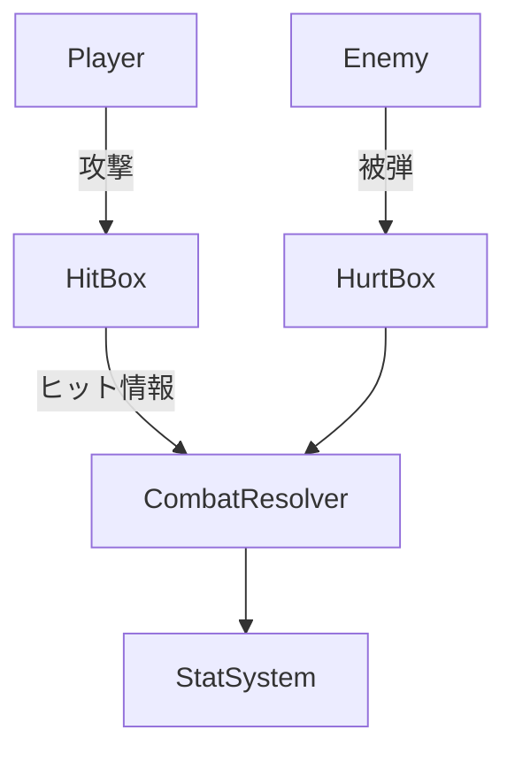
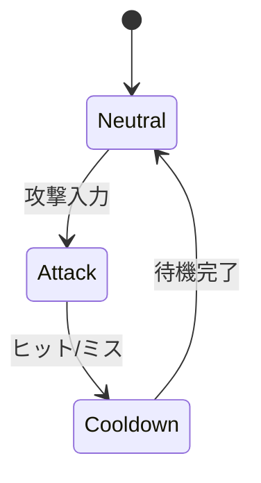
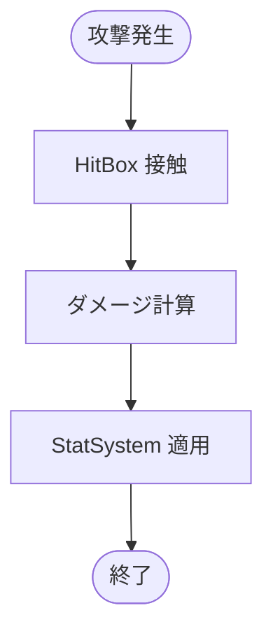
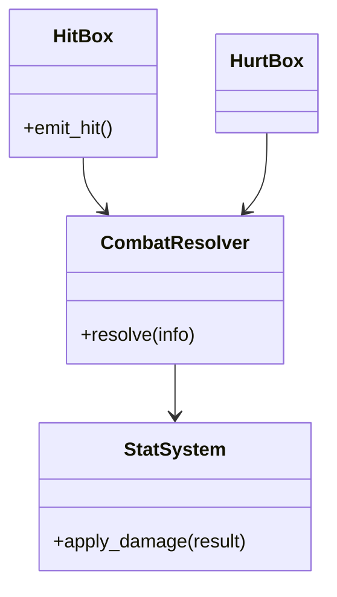

# 戦闘システム実装仕様

## 目次

1. [概要](#概要)
2. [ユースケース図](#ユースケース図)
3. [状態遷移図](#状態遷移図)
4. [アクティビティ図](#アクティビティ図)
5. [クラス図](#クラス図)
6. [実装詳細](#実装詳細)
7. [テスト仕様](#テスト仕様)
8. [パフォーマンス要件](#パフォーマンス要件)
9. [変更履歴](#変更履歴)

## 概要

`HitBox` と `HurtBox` の衝突で `CombatResolver` がダメージ計算を行い、`StatSystem` へ結果を反映する。ヒット演出は別途 `EffectSpawner` が担当する。

## ユースケース図



## 状態遷移図



## アクティビティ図



## クラス図



## 実装詳細

### 1. クラス設計
```gdscript
class_name CombatSystem
extends Node

# ヒットボックス管理
var hit_boxes: Dictionary
var active_hit_boxes: Array
var hit_box_timers: Dictionary
var hit_box_effects: Dictionary

# ダメージ計算
var damage_calculator: DamageCalculator
var critical_chance: float
var critical_multiplier: float
var damage_modifiers: Dictionary
var resistance_modifiers: Dictionary

# 戦闘状態
var combat_state: String
var attack_cooldowns: Dictionary
var combo_counters: Dictionary
var stun_timers: Dictionary
var invincibility_frames: Dictionary

# エフェクト管理
var effect_spawner: EffectSpawner
var hit_effects: Dictionary
var damage_effects: Dictionary
var status_effects: Dictionary
var particle_systems: Dictionary

# 統計管理
var stat_system: StatSystem
var health_stats: Dictionary
var combat_stats: Dictionary
var status_stats: Dictionary
var experience_stats: Dictionary
```

### 2. 主要メソッド
```gdscript
# ヒットボックス管理
func register_hit_box(hit_box: HitBox) -> void
func activate_hit_box(hit_box_id: String) -> void
func deactivate_hit_box(hit_box_id: String) -> void
func check_hit_box_collision(hit_box: HitBox, hurt_box: HurtBox) -> bool

# ダメージ計算
func calculate_damage(attacker: Node, defender: Node, hit_info: Dictionary) -> float
func apply_damage_modifiers(base_damage: float, modifiers: Dictionary) -> float
func calculate_critical_hit(damage: float) -> float
func apply_resistance(damage: float, resistance: Dictionary) -> float

# 戦闘状態管理
func update_combat_state() -> void
func handle_attack_cooldown(attacker: Node) -> void
func process_combo(attacker: Node) -> void
func handle_stun(target: Node) -> void

# エフェクト処理
func spawn_hit_effect(position: Vector3, effect_type: String) -> void
func spawn_damage_effect(target: Node, damage: float) -> void
func apply_status_effect(target: Node, effect: Dictionary) -> void
func update_particle_systems() -> void

# 統計更新
func update_health_stats(target: Node, damage: float) -> void
func update_combat_stats(attacker: Node, defender: Node) -> void
func update_status_stats(target: Node) -> void
func process_experience_gain(target: Node, amount: float) -> void
```

### 3. 戦闘パラメータ
```gdscript
# 基本パラメータ
var base_params = {
    "base_damage": 10.0,
    "critical_chance": 0.1,
    "critical_multiplier": 2.0,
    "attack_speed": 1.0,
    "combo_window": 2.0
}

# 状態効果
var status_effects = {
    "poison": {
        "damage_per_tick": 5.0,
        "duration": 5.0,
        "tick_interval": 1.0
    },
    "burn": {
        "damage_per_tick": 8.0,
        "duration": 3.0,
        "tick_interval": 0.5
    },
    "stun": {
        "duration": 2.0,
        "can_move": false,
        "can_attack": false
    }
}

# 抵抗値
var resistance_types = {
    "physical": 0.0,
    "fire": 0.0,
    "ice": 0.0,
    "lightning": 0.0,
    "poison": 0.0
}
```

### 4. イベント処理
```gdscript
# シグナル定義
signal hit_registered(attacker: Node, defender: Node, damage: float)
signal damage_applied(target: Node, amount: float)
signal status_effect_applied(target: Node, effect: String)
signal combat_state_changed(new_state: String)
signal combo_increased(attacker: Node, combo_count: int)

# イベントハンドラー
func _on_hit_box_activated(hit_box: HitBox) -> void:
    active_hit_boxes.append(hit_box)
    hit_box_timers[hit_box] = 0.0

func _on_hit_box_deactivated(hit_box: HitBox) -> void:
    active_hit_boxes.erase(hit_box)
    hit_box_timers.erase(hit_box)

func _on_damage_calculated(attacker: Node, defender: Node, damage: float) -> void:
    emit_signal("hit_registered", attacker, defender, damage)
    apply_damage(defender, damage)

func _on_status_effect_triggered(target: Node, effect: String) -> void:
    emit_signal("status_effect_applied", target, effect)
    process_status_effect(target, effect)
```

## テスト仕様

### 1. 単体テスト
- ヒットボックス
  - 登録と解除
  - 衝突判定
  - タイマー管理
  - エフェクト連動
- ダメージ計算
  - 基本ダメージ
  - クリティカル
  - 修正値適用
  - 抵抗値計算
- 戦闘状態
  - 状態遷移
  - クールダウン
  - コンボ処理
  - スタン処理
- エフェクト
  - 生成と管理
  - パーティクル
  - 状態効果
  - 視覚効果

### 2. 統合テスト
- 他システムとの連携
  - キャラクター制御
  - アニメーション
  - サウンド
  - 物理演算
- パフォーマンステスト
  - 同時ヒット処理
  - エフェクト生成
  - 状態更新
  - メモリ使用量

## パフォーマンス要件

### 1. 処理速度
- ヒット判定: 0.5ms以下
- ダメージ計算: 1ms以下
- 状態更新: 1ms以下
- エフェクト生成: 2ms以下

### 2. メモリ使用量
- ヒットボックス: 5MB以下
- エフェクト: 10MB以下
- 状態データ: 5MB以下
- 一時データ: 5MB以下

## 変更履歴

| バージョン | 更新日     | 変更内容                 |
| ---------- | ---------- | ------------------------ |
| 0.3        | 2025-06-07 | 実装詳細の追加           |
| 0.2        | 2025-05-29 | テンプレート統一化       |
| 0.1.0      | 2025-05-28 | 初版作成                 |
