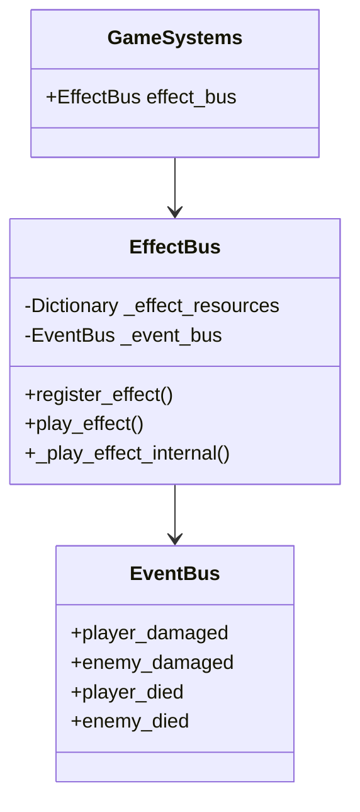
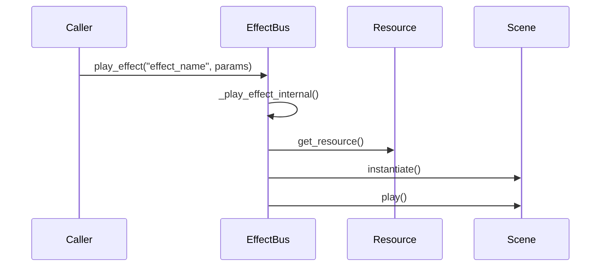
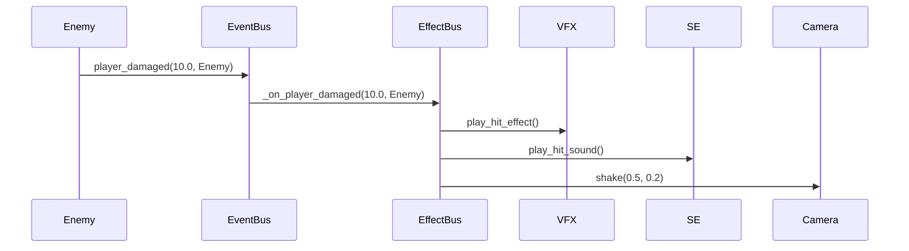

# 目次
1. [概要](#概要)
2. [システム構成](#システム構成)
3. [エフェクト定義](#エフェクト定義)
4. [使用方法](#使用方法)
5. [エフェクトフロー](#エフェクトフロー)
6. [エラーハンドリング](#エラーハンドリング)
7. [制限事項](#制限事項)
8. [変更履歴](#変更履歴)

# EffectBus実装仕様書

## 概要

EffectBusは、ゲーム内のエフェクト（視覚効果、音響効果、カメラ効果など）を管理するサブシステムです。GameSystemsの一部として機能し、EventBusと連携してゲーム内の様々なエフェクトを制御します。

### 主な機能
- エフェクトリソースの管理
- エフェクトの再生制御
- イベントとエフェクトの紐付け
- カメラエフェクトの制御

## システム構成

### クラス図


## エフェクト定義

### エフェクトシグナル
```gdscript
# エフェクトのトリガー
signal effect_triggered(effect_name: String, params: Dictionary)

# ビジュアルエフェクトの再生
signal vfx_played(vfx_name: String, position: Vector3)

# サウンドエフェクトの再生
signal se_played(se_name: String)

# カメラシェイク
signal camera_shake(intensity: float, duration: float)
```

### エフェクトパラメータ
```gdscript
# ヒットエフェクトのパラメータ
{
    "amount": float,      # ダメージ量
    "position": Vector3,  # エフェクトの位置
    "scale": float,      # エフェクトのスケール
    "duration": float    # エフェクトの持続時間
}

# 死亡エフェクトのパラメータ
{
    "position": Vector3,  # エフェクトの位置
    "rotation": float,   # エフェクトの回転
    "scale": float      # エフェクトのスケール
}
```

## 使用方法

### エフェクトリソースの登録
```gdscript
# エフェクトリソースの登録
func _ready() -> void:
    var hit_effect = preload("res://effects/hit_effect.tscn")
    GameSystems.instance.effect_bus.register_effect("player_hit", hit_effect)
```

### エフェクトの再生
```gdscript
# エフェクトの再生
func play_hit_effect(position: Vector3, damage: float) -> void:
    GameSystems.instance.effect_bus.play_effect("player_hit", {
        "position": position,
        "amount": damage,
        "scale": 1.0,
        "duration": 0.5
    })
```

### イベントとの連携
```gdscript
# イベントリスナーの設定
func setup_event_listeners(event_bus: EventBus) -> void:
    event_bus.player_damaged.connect(_on_player_damaged)
    event_bus.enemy_damaged.connect(_on_enemy_damaged)

# イベントハンドラ
func _on_player_damaged(amount: float, source: Node) -> void:
    play_effect("player_hit", {
        "amount": amount,
        "position": source.global_position
    })
```

## エフェクトフロー

### 基本的なエフェクトフロー


### プレイヤーダメージエフェクトの例


## エラーハンドリング

### エラーケース
1. 未登録のエフェクトの再生
2. 無効なエフェクトリソース
3. 無効なパラメータ

### エラー処理
```gdscript
# エフェクト再生時のエラー処理
func play_effect(effect_name: String, params: Dictionary = {}) -> void:
    if not _effect_resources.has(effect_name):
        push_error("EffectBus: 未登録のエフェクト '%s' が呼び出されました" % effect_name)
        return

    var resource = _effect_resources[effect_name]
    if not resource:
        push_error("EffectBus: 無効なエフェクトリソース '%s'" % effect_name)
        return

    effect_triggered.emit(effect_name, params)
    _play_effect_internal(effect_name, params)
```

## 制限事項

### 現在の制限
- エフェクトの具体的な再生処理は未実装（TODO）
- エフェクトのプール管理は未実装
- エフェクトの優先順位制御は未実装
- エフェクトのブレンド機能は未実装

### 今後の改善点
1. エフェクト再生システムの実装
2. エフェクトプールの実装
3. エフェクトの優先順位システムの追加
4. エフェクトのブレンド機能の実装
5. エフェクトのデバッグ機能の強化

## 変更履歴

| バージョン | 更新日       | 変更内容                 |
| --------- | ----------- | ------------------------ |
| 0.1       | 2025-05-30 | 初版作成（基本実装）     |
