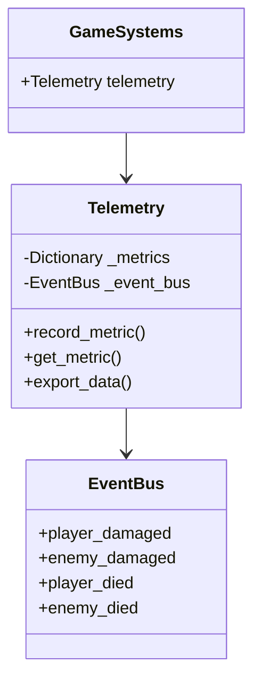
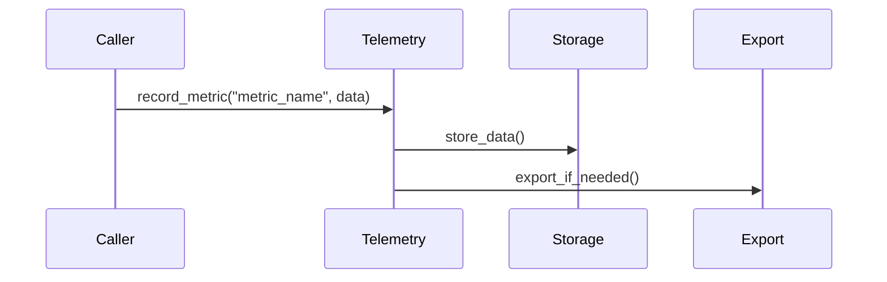
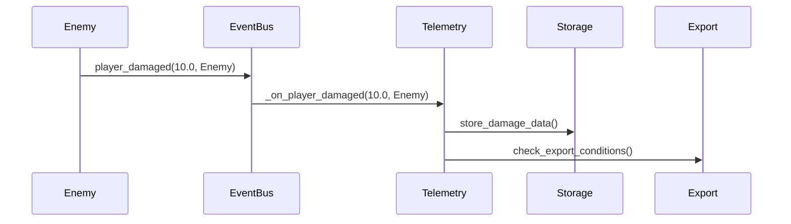

# 目次
1. [概要](#概要)
2. [システム構成](#システム構成)
3. [メトリクス定義](#メトリクス定義)
4. [使用方法](#使用方法)
5. [データフロー](#データフロー)
6. [エラーハンドリング](#エラーハンドリング)
7. [制限事項](#制限事項)
8. [変更履歴](#変更履歴)

# Telemetry実装仕様書

## 概要

Telemetryは、ゲーム内の様々なメトリクス（プレイヤーの行動、ゲームの状態、パフォーマンスなど）を収集・分析するサブシステムです。GameSystemsの一部として機能し、EventBusと連携してゲーム内の様々なデータを収集します。

### 主な機能
- メトリクスデータの収集
- イベントベースのデータ記録
- パフォーマンスモニタリング
- データのエクスポート

## システム構成

### クラス図


## メトリクス定義

### メトリクスシグナル
```gdscript
# メトリクスの記録
signal metric_recorded(metric_name: String, value: Variant)

# データのエクスポート
signal data_exported(data: Dictionary)

# パフォーマンス警告
signal performance_warning(metric_name: String, threshold: float)
```

### メトリクスパラメータ
```gdscript
# ダメージメトリクスのパラメータ
{
    "amount": float,      # ダメージ量
    "source": String,     # ダメージ源
    "target": String,     # 対象
    "timestamp": float    # 発生時刻
}

# パフォーマンスメトリクスのパラメータ
{
    "fps": float,         # FPS
    "memory": float,      # メモリ使用量
    "cpu_time": float,    # CPU時間
    "timestamp": float    # 計測時刻
}
```

## 使用方法

### メトリクスの記録
```gdscript
# メトリクスの記録
func record_damage_metric(amount: float, source: String, target: String) -> void:
    GameSystems.instance.telemetry.record_metric("damage", {
        "amount": amount,
        "source": source,
        "target": target,
        "timestamp": Time.get_unix_time_from_system()
    })
```

### メトリクスの取得
```gdscript
# メトリクスの取得
func get_damage_metrics() -> Dictionary:
    return GameSystems.instance.telemetry.get_metric("damage")
```

### イベントとの連携
```gdscript
# イベントリスナーの設定
func setup_event_listeners(event_bus: EventBus) -> void:
    event_bus.player_damaged.connect(_on_player_damaged)
    event_bus.enemy_damaged.connect(_on_enemy_damaged)

# イベントハンドラ
func _on_player_damaged(amount: float, source: Node) -> void:
    record_damage_metric(amount, source.name, "player")
```

## データフロー

### 基本的なデータフロー


### ダメージメトリクスの例


## エラーハンドリング

### エラーケース
1. 無効なメトリクス名
2. 無効なデータ形式
3. ストレージエラー
4. エクスポートエラー

### エラー処理
```gdscript
# メトリクス記録時のエラー処理
func record_metric(metric_name: String, data: Dictionary) -> void:
    if not _validate_metric_name(metric_name):
        push_error("Telemetry: 無効なメトリクス名 '%s'" % metric_name)
        return

    if not _validate_metric_data(data):
        push_error("Telemetry: 無効なメトリクスデータ '%s'" % str(data))
        return

    metric_recorded.emit(metric_name, data)
    _store_metric_data(metric_name, data)
```

## 制限事項

### 現在の制限
- メトリクスの永続化は未実装（TODO）
- リアルタイム分析機能は未実装
- データの圧縮機能は未実装
- カスタムメトリクスの定義機能は未実装

### 今後の改善点
1. メトリクスの永続化システムの実装
2. リアルタイム分析機能の追加
3. データ圧縮機能の実装
4. カスタムメトリクス定義機能の追加
5. データ可視化機能の実装

## 変更履歴

| バージョン | 更新日       | 変更内容                 |
| --------- | ----------- | ------------------------ |
| 0.1       | 2025-05-30 | 初版作成（基本実装）     |
