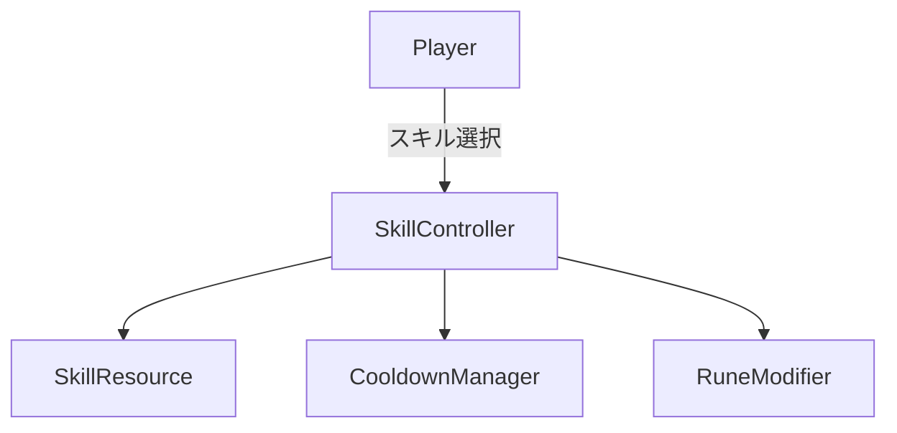
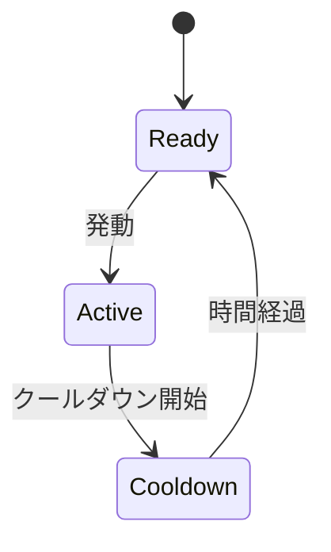
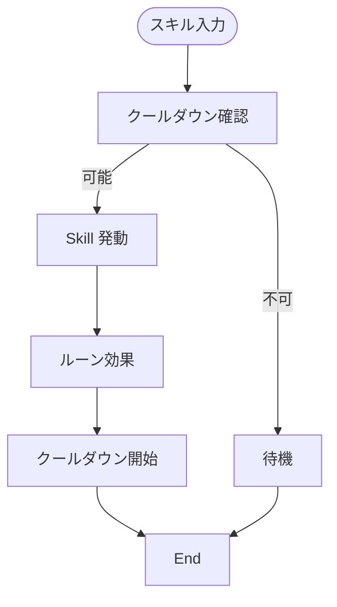
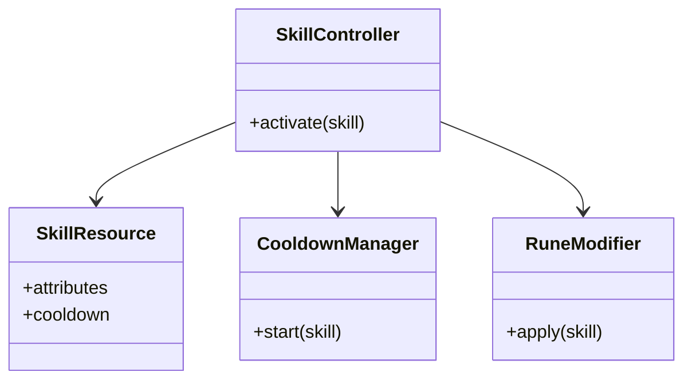

# スキル・ビルド実装仕様

## 目次

1. [概要](#概要)
2. [ユースケース図](#ユースケース図)
3. [状態遷移図](#状態遷移図)
4. [アクティビティ図](#アクティビティ図)
5. [クラス図](#クラス図)
6. [変更履歴](#変更履歴)

## 概要

`SkillController` が `SkillResource` を読み込み、`CooldownManager` で発動間隔を制御する。`RuneModifier` によりスキル効果を拡張できる。

## ユースケース図

## 状態遷移図

## アクティビティ図

## クラス図

## 変更履歴

| バージョン | 更新日     | 変更内容 |
| ---------- | ---------- | -------- |
| 0.1.0      | 2025-06-06 | 初版作成 |
