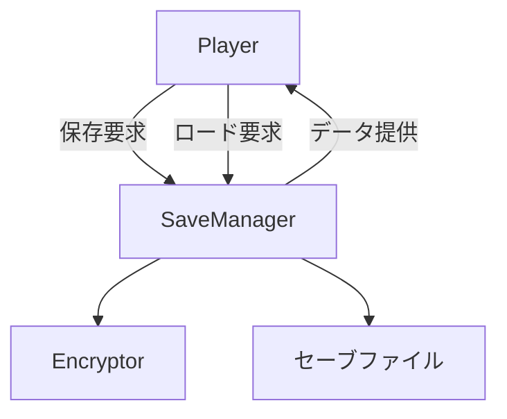
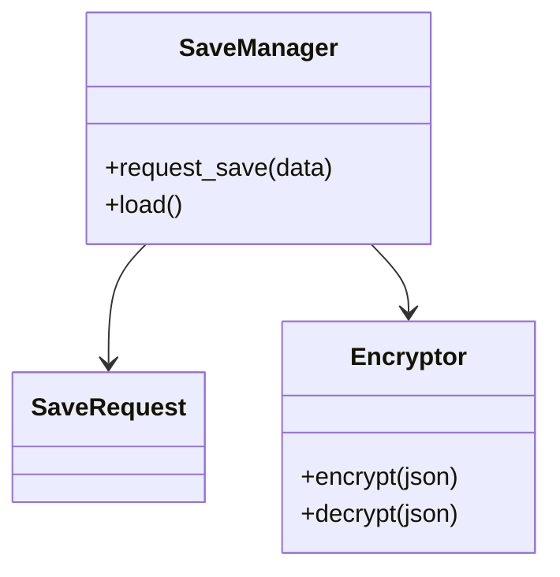

# セーブ・ロード実装仕様

## 目次

1. [概要](#概要)
2. [ユースケース図](#ユースケース図)
3. [アクティビティ図](#アクティビティ図)
4. [クラス図](#クラス図)
5. [変更履歴](#変更履歴)

## 概要

`SaveManager` が `SaveRequest` を受け取り、`Encryptor` で暗号化したデータを非同期で保存する。ロード時は復号後にゲームデータを復元する。

## ユースケース図



## アクティビティ図


## クラス図



## 実装詳細

### 1. クラス設計
```gdscript
class_name SaveSystem
extends Node

# セーブデータ管理
var save_data: Dictionary
var save_slots: Dictionary
var auto_save_data: Dictionary
var backup_data: Dictionary

# 暗号化管理
var encryptor: Encryptor
var encryption_key: String
var encryption_iv: String
var compression_level: int

# ファイル管理
var file_manager: FileManager
var save_directory: String
var backup_directory: String
var temp_directory: String

# 状態管理
var save_state: String
var load_state: String
var error_state: String
var progress_state: Dictionary

# イベント管理
var event_manager: EventManager
var save_events: Dictionary
var load_events: Dictionary
var error_events: Dictionary
```

### 2. 主要メソッド
```gdscript
# セーブ処理
func save_game(slot_id: String) -> void
func auto_save() -> void
func create_backup() -> void
func delete_save(slot_id: String) -> void

# ロード処理
func load_game(slot_id: String) -> void
func load_auto_save() -> void
func restore_backup() -> void
func verify_save_data(slot_id: String) -> bool

# データ変換
func serialize_data(data: Dictionary) -> String
func deserialize_data(json: String) -> Dictionary
func compress_data(data: String) -> PoolByteArray
func decompress_data(data: PoolByteArray) -> String

# 暗号化処理
func encrypt_data(data: String) -> String
func decrypt_data(data: String) -> String
func generate_encryption_key() -> void
func rotate_encryption_key() -> void

# エラー処理
func handle_save_error(error: String) -> void
func handle_load_error(error: String) -> void
func recover_corrupted_save() -> bool
func validate_save_integrity() -> bool
```

### 3. セーブデータ構造
```gdscript
# セーブスロット
var save_slot = {
    "slot_id": "slot_1",
    "timestamp": 0,
    "play_time": 0,
    "version": "1.0.0",
    "checksum": "",
    "data": {}
}

# ゲームデータ
var game_data = {
    "player": {
        "position": Vector3(),
        "health": 100,
        "inventory": [],
        "skills": [],
        "quests": []
    },
    "world": {
        "time": 0,
        "weather": "clear",
        "npcs": [],
        "objects": []
    },
    "settings": {
        "audio": {},
        "graphics": {},
        "controls": {}
    }
}

# メタデータ
var meta_data = {
    "game_version": "1.0.0",
    "save_version": "1.0.0",
    "platform": "Windows",
    "creation_date": "",
    "modification_date": ""
}
```

### 4. イベント処理
```gdscript
# シグナル定義
signal save_started(slot_id: String)
signal save_completed(slot_id: String)
signal save_failed(slot_id: String, error: String)
signal load_started(slot_id: String)
signal load_completed(slot_id: String)
signal load_failed(slot_id: String, error: String)

# イベントハンドラー
func _on_save_started(slot_id: String) -> void:
    save_state = "saving"
    emit_signal("save_started", slot_id)

func _on_save_completed(slot_id: String) -> void:
    save_state = "idle"
    emit_signal("save_completed", slot_id)

func _on_load_started(slot_id: String) -> void:
    load_state = "loading"
    emit_signal("load_started", slot_id)

func _on_load_completed(slot_id: String) -> void:
    load_state = "idle"
    emit_signal("load_completed", slot_id)
```

## テスト仕様

### 1. 単体テスト
- セーブ処理
  - データシリアライズ
  - 暗号化
  - ファイル書き込み
  - バックアップ作成
- ロード処理
  - ファイル読み込み
  - 復号化
  - データデシリアライズ
  - 整合性チェック
- エラー処理
  - ファイル破損
  - 暗号化エラー
  - データ不整合
  - リカバリー処理

### 2. 統合テスト
- 他システムとの連携
  - ゲーム状態
  - プレイヤーデータ
  - ワールドデータ
  - 設定データ
- パフォーマンステスト
  - 大量データ
  - 同時セーブ
  - 自動セーブ
  - メモリ使用量

## パフォーマンス要件

### 1. 処理速度
- セーブ処理: 2秒以下
- ロード処理: 3秒以下
- 暗号化: 1秒以下
- データ検証: 1秒以下

### 2. メモリ使用量
- セーブデータ: 10MB以下
- 一時データ: 5MB以下
- バックアップ: 20MB以下
- 全体: 50MB以下

## 変更履歴
| バージョン | 更新日     | 変更内容                 |
| ---------- | ---------- | ------------------------ |
| 0.3        | 2025-06-07 | 実装詳細の追加           |
| 0.2        | 2025-05-29 | テンプレート統一化       |
| 0.1.0      | 2025-05-28 | 初版作成                 |

# 関連ドキュメント

## 技術ドキュメント
- [14.1 要件定義](14.1_Requirement.md) - プロジェクトの基本要件と技術要件
- [14.2 プロトタイプ技術設計](14.2_PrototypeTechnicalDesign.md) - プロトタイプ開発の技術設計
- [14.3 Godot環境設定](14.3_GodotEnvironment.md) - 開発環境の設定と構成
- [14.4 リアクティブシステム](14.4_ReactiveSystem.md) - リアクティブシステムの設計
- [14.5 状態管理](14.5_StateManagement.md) - 状態管理システムの設計
- [14.9 セーブデータ管理](14.9_SaveDataManagement.md) - セーブデータ管理システムの設計
- [14.13 技術設計仕様](14.13_TechnicalDesignSpec.md) - 全体の技術設計仕様
- [14.18 システムアーキテクチャ](14.18_SystemArchitecture.md) - 全体システムアーキテクチャ

## 実装仕様書
- [15.1 リアクティブシステム実装仕様](15.1_ReactiveSystemImpl.md) - リアクティブシステムの実装詳細
- [15.2 状態管理実装仕様](15.2_StateManagementImpl.md) - 状態管理システムの実装詳細
- [15.3 敵AI実装仕様](15.3_EnemyAISpec.md) - 敵AIシステムの実装詳細
- [15.4 戦闘システム実装仕様](15.4_CombatSystemSpec.md) - 戦闘システムの実装詳細
- [15.5 スキルシステム実装仕様](15.5_SkillSystemSpec.md) - スキルシステムの実装詳細
