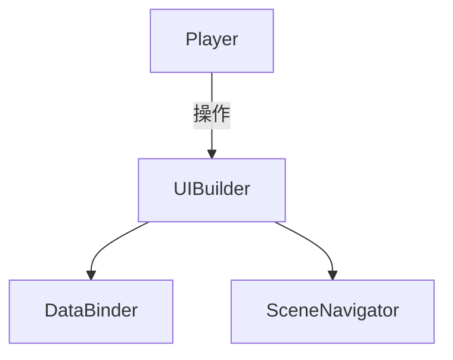
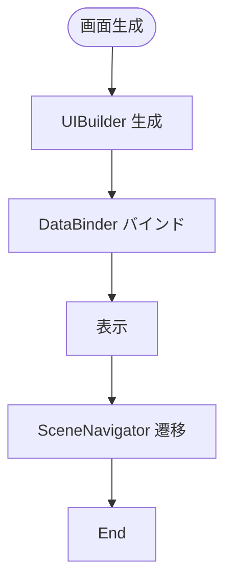
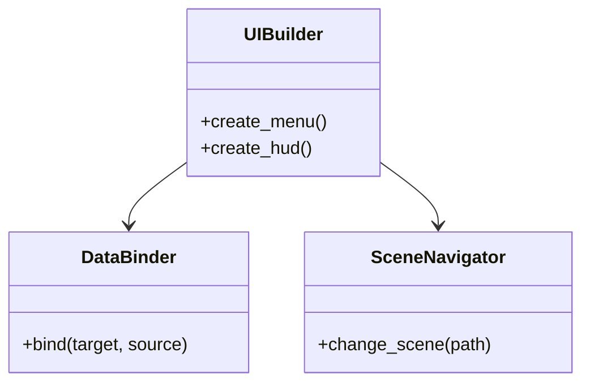

# UI/UX Implementation Specification

## 目次

1. [概要](#概要)
2. [ユースケース図](#ユースケース図)
3. [アクティビティ図](#アクティビティ図)
4. [クラス図](#クラス図)
5. [変更履歴](#変更履歴)

## 概要

`UIBuilder` が画面構成を作成し、`DataBinder` が `Observable` データを UI コンポーネントへバインドする。`SceneNavigator` はシーン遷移を管理する。

## ユースケース図



## アクティビティ図



## クラス図



## 実装詳細

### 1. クラス設計
```gdscript
class_name UISystem
extends Node

# UI管理
var ui_manager: UIManager
var active_screens: Dictionary
var screen_stack: Array
var overlay_stack: Array

# レイアウト管理
var layout_manager: LayoutManager
var layout_templates: Dictionary
var layout_states: Dictionary
var layout_animations: Dictionary

# データバインディング
var data_binder: DataBinder
var bindings: Dictionary
var observers: Dictionary
var update_queue: Array

# アニメーション管理
var animation_manager: AnimationManager
var transition_effects: Dictionary
var screen_animations: Dictionary
var element_animations: Dictionary

# イベント管理
var event_manager: EventManager
var input_handlers: Dictionary
var gesture_handlers: Dictionary
var focus_handlers: Dictionary
```

### 2. 主要メソッド
```gdscript
# 画面管理
func show_screen(screen_id: String) -> void
func hide_screen(screen_id: String) -> void
func push_screen(screen_id: String) -> void
func pop_screen() -> void

# レイアウト処理
func apply_layout(layout_id: String) -> void
func update_layout(layout_id: String) -> void
func animate_layout(layout_id: String, animation: String) -> void
func reset_layout(layout_id: String) -> void

# データバインディング
func bind_data(target: Node, source: Node, property: String) -> void
func unbind_data(target: Node, property: String) -> void
func update_binding(target: Node, property: String) -> void
func process_update_queue() -> void

# アニメーション制御
func play_transition(from: String, to: String, effect: String) -> void
func play_screen_animation(screen_id: String, animation: String) -> void
func play_element_animation(element: Node, animation: String) -> void
func stop_animation(animation_id: String) -> void

# イベント処理
func handle_input(event: InputEvent) -> void
func handle_gesture(gesture: String, data: Dictionary) -> void
func handle_focus_change(focused: Node, unfocused: Node) -> void
func process_event_queue() -> void
```

### 3. UIコンポーネント
```gdscript
# 基本コンポーネント
var base_components = {
    "button": {
        "type": "Button",
        "properties": {
            "text": "",
            "icon": null,
            "disabled": false
        },
        "events": ["pressed", "released"]
    },
    "label": {
        "type": "Label",
        "properties": {
            "text": "",
            "font": null,
            "color": Color.white
        }
    },
    "panel": {
        "type": "Panel",
        "properties": {
            "style": "default",
            "visible": true
        }
    }
}

# レイアウトコンポーネント
var layout_components = {
    "container": {
        "type": "Container",
        "properties": {
            "orientation": "vertical",
            "spacing": 10
        }
    },
    "grid": {
        "type": "GridContainer",
        "properties": {
            "columns": 2,
            "spacing": 10
        }
    },
    "scroll": {
        "type": "ScrollContainer",
        "properties": {
            "scroll_horizontal": true,
            "scroll_vertical": true
        }
    }
}

# 特殊コンポーネント
var special_components = {
    "inventory_slot": {
        "type": "InventorySlot",
        "properties": {
            "item": null,
            "quantity": 0,
            "locked": false
        },
        "events": ["item_clicked", "item_dragged"]
    },
    "skill_button": {
        "type": "SkillButton",
        "properties": {
            "skill": null,
            "cooldown": 0,
            "key_bind": ""
        },
        "events": ["skill_activated", "cooldown_started"]
    }
}
```

### 4. イベント処理
```gdscript
# シグナル定義
signal screen_changed(from: String, to: String)
signal layout_updated(layout_id: String)
signal data_bound(target: Node, property: String)
signal animation_completed(animation_id: String)

# イベントハンドラー
func _on_screen_changed(from: String, to: String) -> void:
    emit_signal("screen_changed", from, to)
    update_layout(to)

func _on_layout_updated(layout_id: String) -> void:
    emit_signal("layout_updated", layout_id)
    process_update_queue()

func _on_data_bound(target: Node, property: String) -> void:
    emit_signal("data_bound", target, property)
    update_binding(target, property)

func _on_animation_completed(animation_id: String) -> void:
    emit_signal("animation_completed", animation_id)
    cleanup_animation(animation_id)
```

## テスト仕様

### 1. 単体テスト
- 画面管理
  - 表示/非表示
  - スタック操作
  - オーバーレイ
  - 状態管理
- レイアウト
  - テンプレート適用
  - 動的更新
  - アニメーション
  - レスポンシブ対応
- データバインディング
  - 双方向バインディング
  - 更新処理
  - エラー処理
  - パフォーマンス

### 2. 統合テスト
- 他システムとの連携
  - ゲーム状態
  - 入力処理
  - アニメーション
  - サウンド
- パフォーマンステスト
  - 画面遷移
  - データ更新
  - アニメーション
  - メモリ使用量

## パフォーマンス要件

### 1. 処理速度
- 画面遷移: 100ms以下
- レイアウト更新: 50ms以下
- データバインディング: 10ms以下
- アニメーション: 16ms以下（60FPS）

### 2. メモリ使用量
- UIデータ: 10MB以下
- テクスチャ: 20MB以下
- アニメーション: 5MB以下
- 全体: 50MB以下

## 変更履歴
| バージョン | 更新日     | 変更内容                 |
| ---------- | ---------- | ------------------------ |
| 0.3        | 2025-06-07 | 実装詳細の追加           |
| 0.2        | 2025-05-29 | テンプレート統一化       |
| 0.1.0      | 2025-05-28 | 初版作成                 |

# 関連ドキュメント

## 技術ドキュメント
- [14.1 要件定義](14.1_Requirement.md) - プロジェクトの基本要件と技術要件
- [14.2 プロトタイプ技術設計](14.2_PrototypeTechnicalDesign.md) - プロトタイプ開発の技術設計
- [14.3 Godot環境設定](14.3_GodotEnvironment.md) - 開発環境の設定と構成
- [14.4 リアクティブシステム](14.4_ReactiveSystem.md) - リアクティブシステムの設計
- [14.5 状態管理](14.5_StateManagement.md) - 状態管理システムの設計
- [14.10 UIレイアウト](14.10_UILayout.md) - UIレイアウトシステムの設計
- [14.13 技術設計仕様](14.13_TechnicalDesignSpec.md) - 全体の技術設計仕様
- [14.18 システムアーキテクチャ](14.18_SystemArchitecture.md) - 全体システムアーキテクチャ

## 実装仕様書
- [15.1 リアクティブシステム実装仕様](15.1_ReactiveSystemImpl.md) - リアクティブシステムの実装詳細
- [15.2 状態管理実装仕様](15.2_StateManagementImpl.md) - 状態管理システムの実装詳細
- [15.3 敵AI実装仕様](15.3_EnemyAISpec.md) - 敵AIシステムの実装詳細
- [15.4 戦闘システム実装仕様](15.4_CombatSystemSpec.md) - 戦闘システムの実装詳細
- [15.5 スキルシステム実装仕様](15.5_SkillSystemSpec.md) - スキルシステムの実装詳細
- [15.6 セーブ・ロード実装仕様](15.6_SaveLoadSpec.md) - セーブ・ロードシステムの実装詳細
