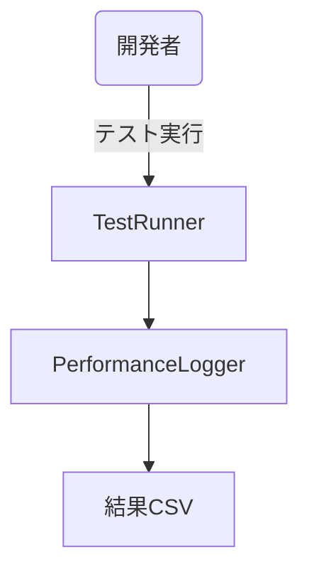
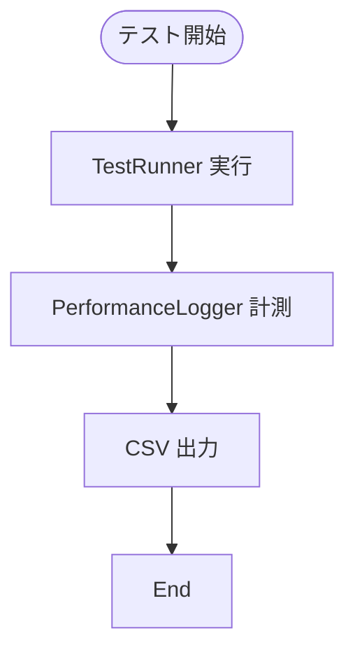
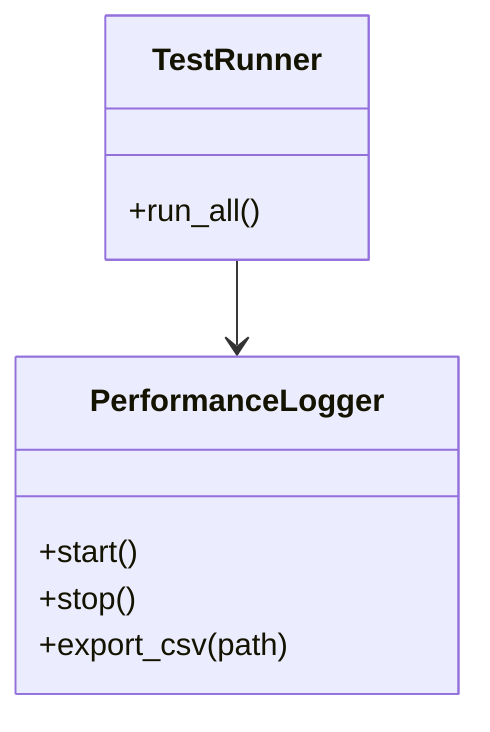

# テスト・パフォーマンス実装仕様

## 目次

1. [概要](#概要)
2. [ユースケース図](#ユースケース図)
3. [アクティビティ図](#アクティビティ図)
4. [クラス図](#クラス図)
5. [変更履歴](#変更履歴)

## 概要

`TestRunner` が GUT を利用してユニットテストを実行し、`PerformanceLogger` が `EngineProfiler` の統計を CSV 出力する。CI では自動的に両者を実行し品質を担保する。

## ユースケース図

## アクティビティ図

## クラス図

## 変更履歴

| バージョン | 更新日     | 変更内容 |
| ---------- | ---------- | -------- |
| 0.1.0      | 2025-06-06 | 初版作成 |
