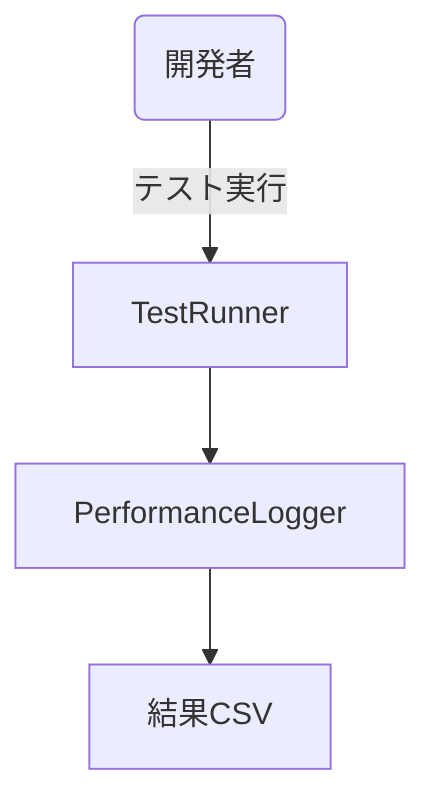
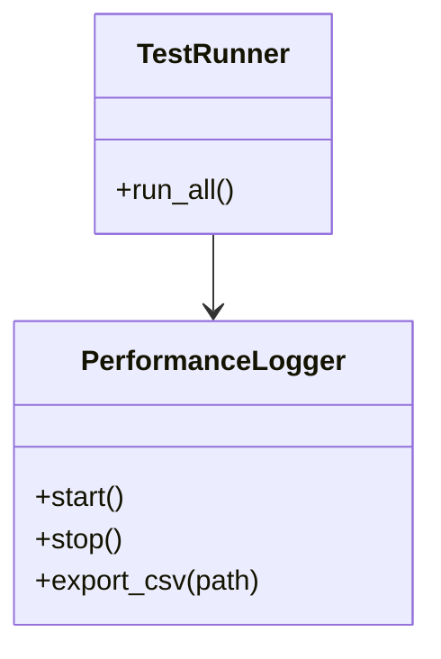

# テスト・パフォーマンス実装仕様

## 目次

1. [概要](#概要)
2. [ユースケース図](#ユースケース図)
3. [アクティビティ図](#アクティビティ図)
4. [クラス図](#クラス図)
5. [変更履歴](#変更履歴)

## 概要

`TestRunner` が GUT を利用してユニットテストを実行し、`PerformanceLogger` が `EngineProfiler` の統計を CSV 出力する。CI では自動的に両者を実行し品質を担保する。

## ユースケース図



## アクティビティ図


## クラス図



## 実装詳細

### 1. クラス設計
```gdscript
class_name TestSystem
extends Node

# テスト管理
var test_runner: TestRunner
var test_suites: Dictionary
var test_results: Dictionary
var test_coverage: Dictionary

# パフォーマンス管理
var performance_logger: PerformanceLogger
var performance_metrics: Dictionary
var benchmark_results: Dictionary
var profiling_data: Dictionary

# 自動化管理
var automation_manager: AutomationManager
var test_scenarios: Dictionary
var test_sequences: Dictionary
var test_environment: Dictionary

# レポート管理
var report_generator: ReportGenerator
var report_templates: Dictionary
var report_data: Dictionary
var report_formats: Dictionary

# CI/CD連携
var ci_manager: CIManager
var build_configs: Dictionary
var deployment_configs: Dictionary
var notification_configs: Dictionary
```

### 2. 主要メソッド
```gdscript
# テスト実行
func run_tests(suite_id: String) -> void
func run_benchmarks(benchmark_id: String) -> void
func run_automation(scenario_id: String) -> void
func run_coverage_analysis() -> void

# パフォーマンス計測
func start_profiling() -> void
func stop_profiling() -> void
func collect_metrics() -> void
func analyze_performance() -> void

# レポート生成
func generate_test_report() -> void
func generate_performance_report() -> void
func generate_coverage_report() -> void
func export_reports(format: String) -> void

# CI/CD連携
func trigger_build() -> void
func deploy_build() -> void
func notify_results() -> void
func update_dashboard() -> void

# エラー処理
func handle_test_failure(error: String) -> void
func handle_performance_issue(issue: String) -> void
func handle_automation_error(error: String) -> void
func handle_ci_failure(error: String) -> void
```

### 3. テスト設定
```gdscript
# テスト設定
var test_config = {
    "unit_tests": {
        "timeout": 30,
        "retry_count": 3,
        "parallel_execution": true,
        "coverage_threshold": 80
    },
    "integration_tests": {
        "timeout": 60,
        "retry_count": 2,
        "parallel_execution": false,
        "coverage_threshold": 70
    },
    "performance_tests": {
        "duration": 300,
        "sample_count": 1000,
        "warmup_time": 30,
        "threshold": {
            "fps": 60,
            "memory": 100,
            "cpu": 80
        }
    }
}

# ベンチマーク設定
var benchmark_config = {
    "cpu_benchmark": {
        "iterations": 1000,
        "timeout": 60,
        "metrics": ["fps", "frame_time", "cpu_time"]
    },
    "memory_benchmark": {
        "duration": 300,
        "interval": 1,
        "metrics": ["total_memory", "peak_memory", "leak_detection"]
    },
    "io_benchmark": {
        "file_size": 100,
        "operations": 1000,
        "metrics": ["read_speed", "write_speed", "seek_time"]
    }
}

# 自動化設定
var automation_config = {
    "ui_tests": {
        "timeout": 30,
        "retry_count": 3,
        "screenshot_on_failure": true
    },
    "gameplay_tests": {
        "duration": 300,
        "scenarios": 10,
        "record_video": true
    },
    "stress_tests": {
        "duration": 600,
        "concurrent_users": 100,
        "metrics": ["response_time", "error_rate"]
    }
}
```

### 4. イベント処理
```gdscript
# シグナル定義
signal test_started(suite_id: String)
signal test_completed(suite_id: String, results: Dictionary)
signal performance_measured(metrics: Dictionary)
signal automation_completed(scenario_id: String, results: Dictionary)

# イベントハンドラー
func _on_test_started(suite_id: String) -> void:
    emit_signal("test_started", suite_id)
    update_test_status(suite_id, "running")

func _on_test_completed(suite_id: String, results: Dictionary) -> void:
    emit_signal("test_completed", suite_id, results)
    update_test_status(suite_id, "completed")
    generate_test_report()

func _on_performance_measured(metrics: Dictionary) -> void:
    emit_signal("performance_measured", metrics)
    update_performance_data(metrics)
    check_performance_thresholds(metrics)

func _on_automation_completed(scenario_id: String, results: Dictionary) -> void:
    emit_signal("automation_completed", scenario_id, results)
    update_automation_status(scenario_id, results)
    generate_automation_report()
```

## テスト仕様

### 1. 単体テスト
- 基本機能
  - 正常系テスト
  - 異常系テスト
  - 境界値テスト
  - エラー処理
- パフォーマンス
  - CPU使用率
  - メモリ使用量
  - フレームレート
  - ロード時間
- 自動化
  - UI操作
  - ゲームプレイ
  - ストレステスト
  - 回帰テスト

### 2. 統合テスト
- システム連携
  - コンポーネント間
  - データフロー
  - イベント処理
  - 状態管理
- パフォーマンス
  - 同時実行
  - リソース管理
  - ネットワーク
  - データベース

## パフォーマンス要件

### 1. 処理速度
- テスト実行: 5分以下
- パフォーマンス計測: 10分以下
- レポート生成: 1分以下
- CI/CD実行: 15分以下

### 2. メモリ使用量
- テスト実行: 100MB以下
- パフォーマンス計測: 200MB以下
- レポート生成: 50MB以下
- 全体: 500MB以下

## 変更履歴
| バージョン | 更新日     | 変更内容                 |
| ---------- | ---------- | ------------------------ |
| 0.3        | 2025-06-07 | 実装詳細の追加           |
| 0.2        | 2025-05-29 | テンプレート統一化       |
| 0.1.0      | 2025-05-28 | 初版作成                 |

# 関連ドキュメント

## 技術ドキュメント
- [14.1 要件定義](14.1_Requirement.md) - プロジェクトの基本要件と技術要件
- [14.2 プロトタイプ技術設計](14.2_PrototypeTechnicalDesign.md) - プロトタイプ開発の技術設計
- [14.3 Godot環境設定](14.3_GodotEnvironment.md) - 開発環境の設定と構成
- [14.4 リアクティブシステム](14.4_ReactiveSystem.md) - リアクティブシステムの設計
- [14.5 状態管理](14.5_StateManagement.md) - 状態管理システムの設計
- [14.11 テスト自動化](14.11_TestAutomation.md) - テスト自動化システム
- [14.12 パフォーマンス分析](14.12_PerformanceProfiling.md) - パフォーマンス分析システム
- [14.13 技術設計仕様](14.13_TechnicalDesignSpec.md) - 全体の技術設計仕様
- [14.18 システムアーキテクチャ](14.18_SystemArchitecture.md) - 全体システムアーキテクチャ

## 実装仕様書
- [15.1 リアクティブシステム実装仕様](15.1_ReactiveSystemImpl.md) - リアクティブシステムの実装詳細
- [15.2 状態管理実装仕様](15.2_StateManagementImpl.md) - 状態管理システムの実装詳細
- [15.3 敵AI実装仕様](15.3_EnemyAISpec.md) - 敵AIシステムの実装詳細
- [15.4 戦闘システム実装仕様](15.4_CombatSystemSpec.md) - 戦闘システムの実装詳細
- [15.5 スキルシステム実装仕様](15.5_SkillSystemSpec.md) - スキルシステムの実装詳細
- [15.6 セーブ・ロード実装仕様](15.6_SaveLoadSpec.md) - セーブ・ロードシステムの実装詳細
- [15.7 UI/UX実装仕様](15.7_UIUXSpec.md) - UI/UXシステムの実装詳細
- [15.12 パフォーマンス最適化実装仕様](15.12_PerformanceOptimizationSpec.md) - パフォーマンス最適化の実装詳細
