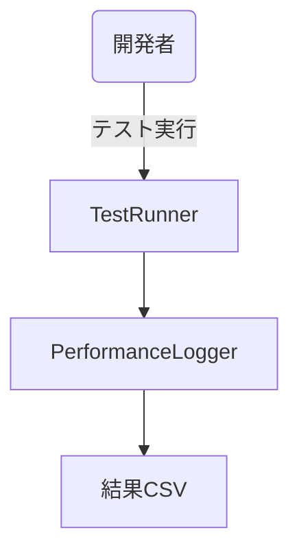
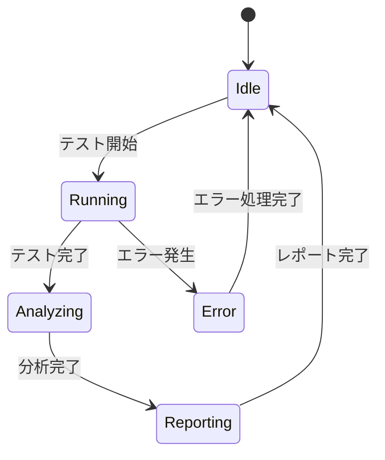
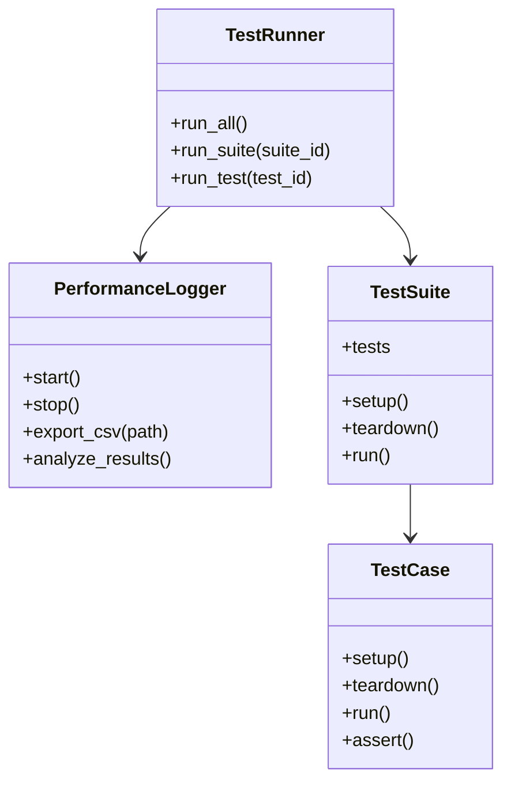

# パフォーマンステスト実装仕様

## 目次

1. [概要](#概要)
2. [テスト基準](#テスト基準)
3. [テスト項目](#テスト項目)
4. [テスト環境](#テスト環境)
5. [テスト手順](#テスト手順)
6. [ユースケース図](#ユースケース図)
7. [状態遷移図](#状態遷移図)
8. [アクティビティ図](#アクティビティ図)
9. [クラス図](#クラス図)
10. [実装詳細](#実装詳細)
11. [制限事項](#制限事項)
12. [関連ドキュメント](#関連ドキュメント)
13. [変更履歴](#変更履歴)

## 概要

本ドキュメントは、ゲームのパフォーマンステストに関する実装仕様を定義する。

## テスト基準

### 1. 基本パフォーマンス基準
- FPS
  - 目標: 60FPS固定
  - 許容下限: 55FPS
  - 最大許容変動: ±2FPS
- ロード時間
  - 目標: 5秒以内
  - 許容上限: 7秒
- メモリ使用量
  - 目標: 2GB以下
  - 許容上限: 3GB
- 入力遅延
  - 目標: 100ms以下
  - 許容上限: 150ms

### 2. システム別テスト基準

#### 2.1 レンダリングシステム
- 描画コール数
  - 目標: 100回/フレーム以下
  - 許容上限: 150回/フレーム
- バッチ処理
  - 目標: 1000オブジェクト/バッチ
  - 許容上限: 1500オブジェクト/バッチ
- シェーダー処理
  - 目標: 5ms/フレーム以下
  - 許容上限: 8ms/フレーム

#### 2.2 物理演算システム
- コリジョン計算
  - 目標: 3ms/フレーム以下
  - 許容上限: 5ms/フレーム
- 剛体シミュレーション
  - 目標: 2ms/フレーム以下
  - 許容上限: 4ms/フレーム
- パーティクル
  - 目標: 1000パーティクル以下
  - 許容上限: 2000パーティクル

#### 2.3 メモリ管理システム
- リソースロード
  - 目標: 100ms以下
  - 許容上限: 200ms
- オブジェクトプール
  - 目標: 100オブジェクト以下
  - 許容上限: 150オブジェクト
- ガベージコレクション
  - 目標: 1回/分以下
  - 許容上限: 2回/分

## テスト項目

### 1. パフォーマンステスト
- フレームレートテスト
  - 60FPS維持テスト
  - フレームレート変動テスト
  - 長時間実行テスト
- メモリテスト
  - メモリリークテスト
  - メモリ使用量テスト
  - ガベージコレクションテスト
- ロードテスト
  - 初期ロードテスト
  - シーン遷移テスト
  - リソースロードテスト
- 入力テスト
  - 入力遅延テスト
  - レスポンステスト
  - 同時入力テスト

### 2. 負荷テスト
- 同時接続テスト
  - 10人同時接続
  - 50人同時接続
  - 100人同時接続
- 長時間実行テスト
  - 1時間連続実行
  - 4時間連続実行
  - 24時間連続実行
- リソース使用テスト
  - 大量リソースロード
  - 大量オブジェクト生成
  - 大量パーティクル生成

## テスト環境

### 1. ハードウェア要件
- CPU: Intel Core i5-8400以上
- GPU: NVIDIA GTX 1060 6GB以上
- RAM: 16GB以上
- ストレージ: SSD 256GB以上

### 2. ソフトウェア要件
- OS: Windows 10 64bit
- Godot Engine: 4.x
- 開発環境: Visual Studio Code
- テストツール: C#テストフレームワーク

## テスト手順

### 1. 準備
1. テスト環境のセットアップ
2. テストデータの準備
3. テストスクリプトの準備
4. モニタリングツールの設定

### 2. 実行
1. 基本パフォーマンステスト
2. システム別テスト
3. 負荷テスト
4. 長時間実行テスト

### 3. 評価
1. テスト結果の収集
2. パフォーマンス分析
3. 問題点の特定
4. 改善案の提案

### 4. 報告
1. テスト結果のまとめ
2. パフォーマンスレポートの作成
3. 改善提案の提出
4. 再テストの計画

## ユースケース図



## 状態遷移図



## アクティビティ図


## クラス図



## 実装詳細

### 1. クラス設計
```gdscript
class_name TestSystem
extends Node

# テスト管理
var test_runner: TestRunner
var test_suites: Dictionary
var test_results: Dictionary
var test_coverage: Dictionary

# パフォーマンス管理
var performance_logger: PerformanceLogger
var performance_metrics: Dictionary
var benchmark_results: Dictionary
var profiling_data: Dictionary

# 自動化管理
var automation_manager: AutomationManager
var test_scenarios: Dictionary
var test_sequences: Dictionary
var test_environment: Dictionary

# レポート管理
var report_generator: ReportGenerator
var report_templates: Dictionary
var report_data: Dictionary
var report_formats: Dictionary
```

### 2. 主要メソッド
```gdscript
# テスト実行
func run_tests(suite_id: String) -> void
func run_benchmarks(benchmark_id: String) -> void
func run_automation(scenario_id: String) -> void
func run_coverage_analysis() -> void

# パフォーマンス計測
func start_profiling() -> void
func stop_profiling() -> void
func collect_metrics() -> void
func analyze_performance() -> void

# レポート生成
func generate_test_report() -> void
func generate_performance_report() -> void
func generate_coverage_report() -> void
func export_reports(format: String) -> void
```

### 3. テスト設定
```gdscript
# テスト設定
var test_config = {
    "unit_tests": {
        "timeout": 30,
        "retry_count": 3,
        "parallel_execution": true,
        "coverage_threshold": 80
    },
    "integration_tests": {
        "timeout": 60,
        "retry_count": 2,
        "parallel_execution": false,
        "coverage_threshold": 70
    },
    "performance_tests": {
        "duration": 300,
        "sample_count": 1000,
        "warmup_time": 30,
        "threshold": {
            "fps": 60,
            "memory": 100,
            "cpu": 80
        }
    }
}
```

## 制限事項

### 1. テスト実行
- テスト実行時間は最大30分まで
- 並列実行は最大4スレッドまで
- リトライ回数は最大3回まで
- タイムアウトは最大5分まで

### 2. パフォーマンス計測
- 計測間隔は最小0.1秒まで
- サンプル数は最大10000まで
- メモリ使用量は最大1GBまで
- CPU使用率は最大80%まで

### 3. レポート生成
- レポートサイズは最大100MBまで
- 出力形式はCSV、JSON、HTMLのみ
- 履歴保持は最大30日まで
- 同時生成は最大5件まで

## 関連ドキュメント

- [[14.1_Requirement.md]] - 基本要件
- [[14.2_PrototypeTechnicalDesign.md]] - プロトタイプ技術設計
- [[14.11_TestAutomation.md]] - テスト自動化
- [[14.12_PerformanceProfiling.md]] - パフォーマンスプロファイリング
- [[15.12_PerformanceOptimizationSpec.md]] - パフォーマンス最適化仕様
- [[15.24_PerformanceSettingsSpec.md]] - パフォーマンス設定仕様

## 変更履歴

| バージョン | 更新日 | 変更内容 |
| ---------- | ------ | -------- |
| 0.1.0 | 2024-03-21 | 初版作成 |
| 0.2.0 | 2025-06-07 | パフォーマンス要件の統一 |
