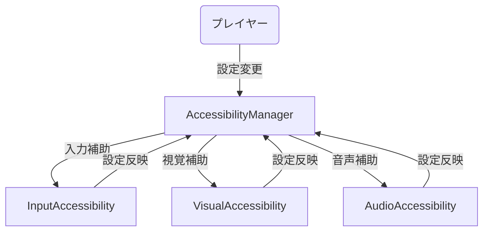
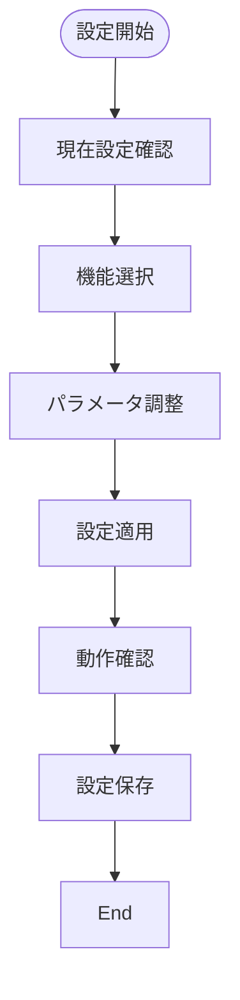
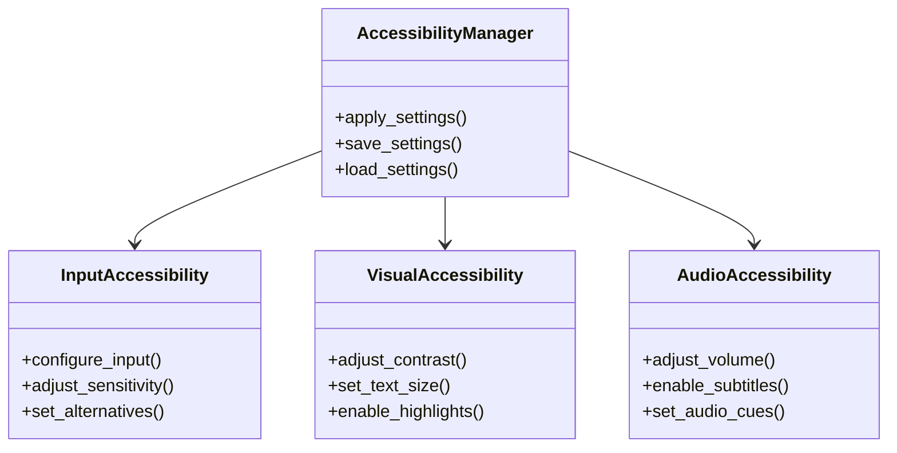

# アクセシビリティ実装仕様

## 目次

1. [概要](#概要)
2. [機能要件](#機能要件)
3. [実装詳細](#実装詳細)
4. [UI/UX設計](#uiux設計)
5. [テスト計画](#テスト計画)
6. [制限事項](#制限事項)
7. [変更履歴](#変更履歴)

## 概要

本ドキュメントは、ゲームのアクセシビリティ機能に関する実装仕様を定義する。

## ユースケース図


## 状態遷移図
```mermaid
stateDiagram-v2
    [*] --> Default
    Default --> Custom : カスタム設定
    Custom --> Input : 入力補助
    Custom --> Visual : 視覚補助
    Custom --> Audio : 音声補助
    Input --> Custom : 完了
    Visual --> Custom : 完了
    Audio --> Custom : 完了
    Custom --> Default : リセット
```

## アクティビティ図


## クラス図


## 機能要件

### 1. コントローラー設定
- キーコンフィグ機能
  - 全アクションのキー/ボタン割り当て変更
  - 複数のプリセット保存
  - デッドゾーン調整
  - スティック感度調整

### 2. 視覚的アクセシビリティ
- 色覚異常対応
  - 3種類のカラーモード（通常/第一色覚/第二色覚）
  - UI要素のコントラスト調整
  - 重要情報の形状による区別
- フォントサイズ調整
  - 3段階のサイズ変更
  - 太字表示オプション
- 画面効果の調整
  - フラッシュ効果の強度調整
  - 画面シェイクの強度調整
  - モーションブラー効果のON/OFF

### 3. 聴覚的アクセシビリティ
- 字幕表示
  - 会話字幕のON/OFF
  - 環境音字幕のON/OFF
  - 字幕サイズ調整
  - 字幕背景の透明度調整
- 音声設定
  - 各音声チャンネルの個別音量調整
  - 空間音響の強度調整

### 4. 操作補助
- 自動ターゲット補助
  - 補助強度の3段階調整
  - ターゲット切り替えの自動化
- 入力補助
  - 連続入力の許容時間調整
  - コンボ入力の難易度調整

## 実装詳細

### 1. クラス設計
```gdscript
class_name AccessibilitySystem
extends Node

# 設定管理
var settings_manager: SettingsManager
var current_settings: Dictionary
var preset_settings: Dictionary
var default_settings: Dictionary

# 入力管理
var input_manager: InputManager
var key_bindings: Dictionary
var controller_settings: Dictionary
var input_assist: Dictionary

# 視覚管理
var visual_manager: VisualManager
var color_settings: Dictionary
var font_settings: Dictionary
var effect_settings: Dictionary

# 聴覚管理
var audio_manager: AudioManager
var subtitle_settings: Dictionary
var audio_settings: Dictionary
var spatial_settings: Dictionary

# 操作補助
var assist_manager: AssistManager
var target_assist: Dictionary
var input_buffer: Dictionary
var combo_assist: Dictionary
```

### 2. 主要メソッド
```gdscript
# 設定管理
func load_settings() -> void
func save_settings() -> void
func apply_settings(settings: Dictionary) -> void
func reset_to_default() -> void

# 入力設定
func configure_input(action: String, event: InputEvent) -> void
func adjust_deadzone(value: float) -> void
func adjust_sensitivity(value: float) -> void
func save_preset(name: String) -> void

# 視覚設定
func set_color_mode(mode: String) -> void
func adjust_font_size(size: int) -> void
func toggle_bold_text(enabled: bool) -> void
func adjust_effects(intensity: float) -> void

# 聴覚設定
func toggle_subtitles(enabled: bool) -> void
func adjust_subtitle_size(size: int) -> void
func set_audio_volume(channel: String, volume: float) -> void
func adjust_spatial_audio(intensity: float) -> void

# 操作補助
func set_target_assist_level(level: int) -> void
func adjust_input_buffer(time: float) -> void
func set_combo_difficulty(level: int) -> void
func update_assist_settings() -> void
```

### 3. アクセシビリティ設定
```gdscript
# 基本設定
var base_settings = {
    "input": {
        "deadzone": 0.2,
        "sensitivity": 1.0,
        "invert_y": false,
        "vibration": true
    },
    "visual": {
        "color_mode": "normal",
        "font_size": 1,
        "bold_text": false,
        "high_contrast": false
    },
    "audio": {
        "master_volume": 1.0,
        "music_volume": 0.8,
        "sfx_volume": 0.8,
        "voice_volume": 1.0
    },
    "assist": {
        "target_assist": 1,
        "input_buffer": 0.2,
        "combo_difficulty": 1
    }
}

# カラーモード
var color_modes = {
    "normal": {
        "primary": Color(1, 1, 1),
        "secondary": Color(0.5, 0.5, 0.5),
        "accent": Color(0, 0.8, 1)
    },
    "protanopia": {
        "primary": Color(0.5, 0.5, 1),
        "secondary": Color(0.3, 0.3, 0.8),
        "accent": Color(0, 0.6, 1)
    },
    "deuteranopia": {
        "primary": Color(1, 0.5, 0.5),
        "secondary": Color(0.8, 0.3, 0.3),
        "accent": Color(1, 0.6, 0)
    }
}

# 字幕設定
var subtitle_settings = {
    "enabled": true,
    "size": 1,
    "background_opacity": 0.5,
    "show_speaker": true,
    "show_sound_effects": true,
    "show_environmental": true
}
```

### 4. イベント処理
```gdscript
# シグナル定義
signal settings_changed(settings: Dictionary)
signal color_mode_changed(mode: String)
signal subtitle_toggled(enabled: bool)
signal assist_level_changed(level: int)

# イベントハンドラー
func _on_settings_changed(settings: Dictionary) -> void:
    emit_signal("settings_changed", settings)
    apply_settings(settings)

func _on_color_mode_changed(mode: String) -> void:
    emit_signal("color_mode_changed", mode)
    update_visual_settings(mode)

func _on_subtitle_toggled(enabled: bool) -> void:
    emit_signal("subtitle_toggled", enabled)
    update_subtitle_settings(enabled)

func _on_assist_level_changed(level: int) -> void:
    emit_signal("assist_level_changed", level)
    update_assist_settings(level)
```

## UI/UX設計

### 1. アクセシビリティメニュー
- メインメニューから直接アクセス可能
- カテゴリ別のタブ分け
- 現在の設定を視覚的に表示
- プリセットの保存/読み込み機能

### 2. 設定変更の即時反映
- 設定変更時に即時プレビュー
- 変更の確定/キャンセル機能
- デフォルト値へのリセット機能

## テスト計画

### 1. 単体テスト
- 設定管理
  - 設定の保存/読み込み
  - プリセット管理
  - デフォルト値
  - 値の範囲チェック
- 入力設定
  - キーコンフィグ
  - デッドゾーン
  - 感度調整
  - 振動設定
- 視覚設定
  - カラーモード
  - フォント設定
  - エフェクト調整
  - コントラスト

### 2. 統合テスト
- システム連携
  - 設定の反映
  - イベント処理
  - 状態管理
  - パフォーマンス
- ユーザビリティ
  - 操作性
  - 反応速度
  - 視認性
  - 聴認性

## パフォーマンス要件

### 1. 処理速度
- 設定変更: 100ms以下
- カラーモード切替: 200ms以下
- 字幕表示: 16ms以下
- 操作補助: 33ms以下

### 2. メモリ使用量
- 設定データ: 1MB以下
- プリセット: 5MB以下
- 字幕データ: 10MB以下
- 全体: 20MB以下

## 制限事項

- パフォーマンスへの影響を最小限に抑える
- 既存のゲームシステムとの互換性を維持
- 設定の組み合わせによる予期せぬ動作に注意
1. 入力補助
   - キーリマッピングは最大20個まで
   - 感度調整範囲は0.1から5.0まで
   - 代替入力は最大5種類まで
2. 視覚補助
   - コントラスト調整範囲は0.5から3.0まで
   - テキストサイズ範囲は0.5から3.0まで
   - ハイライト効果は最大5種類まで
3. 音声補助
   - 音量調整範囲は0.0から2.0まで
   - 字幕サイズ範囲は0.5から3.0まで
   - 音声キューは最大10種類まで
4. 設定管理
   - 保存できるプリセットは最大10個まで
   - 設定ファイルのサイズは最大1MBまで
   - 設定の変更頻度は最小1秒間隔

## 変更履歴

| バージョン | 更新日     | 変更内容                 |
| ---------- | ---------- | ------------------------ |
| 0.3        | 2025-06-07 | 実装詳細の追加           |
| 0.4        | 2025-06-06 | 15.22の内容を統合        |
| 0.2        | 2025-05-29 | テンプレート統一化       |
| 0.1.0      | 2025-05-28 | 初版作成                 |
