00_index.md

---
title: プロジェクトドキュメントインデックス
version: 0.3.0
status: draft
updated: 2025-06-01
tags:
    - Index
    - Documentation
    - Reference
    - Core
    - Project
linked_docs:
    - "[[99_Reference/DocumentManagementRules|ドキュメント管理ルール]]"
    - "[[99_Reference/PullRequestProcedure|プルリクエスト手順]]"
    - "[[99_Reference/GithubIssueEditingWorkflow|GitHub Issue編集ワークフロー]]"
    - "[[99_Reference/ProjectRules|プロジェクトルール]]"
    - "[[30_APIReference/00_index|APIリファレンス]]"
    - "[[40_Tutorials/00_index|チュートリアル]]"
    - "[[12_Architecture/12_03_detailed_design/01_core_components/02_viewmodel_base|ViewModelBase実装詳細]]"
    - "[[12_Architecture/12_03_detailed_design/01_core_components/01_reactive_property|ReactiveProperty実装詳細]]"
    - "[[12_Architecture/12_03_detailed_design/01_core_components/03_composite_disposable|CompositeDisposable実装詳細]]"
    - "[[12_Architecture/12_03_detailed_design/01_core_components/04_event_bus|イベントバス実装詳細]]"
---

# プロジェクトドキュメントインデックス

## 目次

1. [概要](#概要)
2. [ドキュメント構成](#ドキュメント構成)
3. [使用方法](#使用方法)
4. [制限事項](#制限事項)
5. [変更履歴](#変更履歴)

## 概要

このドキュメントは、プロジェクトの全ドキュメントへのインデックスを提供します。

## ドキュメント構成

### コアドキュメント

-   [[10_CoreDocs/00_index|コアドキュメント]]
    -   [[10_CoreDocs/11_PlanDocs/00_index|計画ドキュメント]]
    -   [[10_CoreDocs/12_Job/00_index|ジョブ関連]]
    -   [[10_CoreDocs/13_Skills/00_index|スキル関連]]
    -   [[10_CoreDocs/14_TechDocs/00_index|技術ドキュメント]]
    -   [[10_CoreDocs/15_ImplementationSpecs/00_index|実装仕様]]

### ユーザーガイド

-   [[20_UserGuides/00_index|ユーザーガイド]]
    -   [[20_UserGuides/Installation|インストールガイド]]
    -   [[20_UserGuides/Configuration|設定ガイド]]

### API リファレンス

-   [[30_APIReference/00_index|APIリファレンス]]
    -   [[30_APIReference/CoreSystemAPI|コアシステムAPI]]
    -   [[30_APIReference/GameplayAPI|ゲームプレイAPI]]
    -   [[30_APIReference/DataManagementAPI|データ管理API]]

### チュートリアル

-   [[40_Tutorials/00_index|チュートリアル]]
    -   [[40_Tutorials/GettingStarted|はじめに]]
    -   [[40_Tutorials/BasicFeatures|基本機能]]
    -   [[40_Tutorials/AdvancedFeatures|応用機能]]

### 参照資料

-   [[99_Reference/DocumentManagementRules|ドキュメント管理ルール]]
-   [[99_Reference/PullRequestProcedure|プルリクエスト手順]]
-   [[99_Reference/GithubIssueEditingWorkflow|GitHub Issue編集ワークフロー]]
-   [[99_Reference/ProjectRules|プロジェクトルール]]
-   [[99_Reference/CommitMessageRules|コミットメッセージルール]]

## 使用方法

各セクションのリンクをクリックして、該当するドキュメントに移動できます。
ドキュメントは階層構造で整理されており、関連する情報を簡単に見つけることができます。

## 制限事項

-   ドキュメントの更新は、必ず`DocumentManagementRules.md`に従って行ってください
-   リンクの追加・変更時は、関連するドキュメントのメタデータも更新してください
-   バージョン管理は、変更の種類に応じて適切なバージョン番号を使用してください

## 変更履歴

| バージョン | 更新日     | 変更内容                                                                                 |
| ---------- | ---------- | ---------------------------------------------------------------------------------------- |
| 0.3.0      | 2025-06-01 | 新規ドキュメントへの参照を追加<br>- API リファレンスの更新<br>- チュートリアルの更新     |
| 0.2.0      | 2025-06-01 | ドキュメント管理ルールに準拠した更新<br>- 制限事項セクションの追加<br>- メタデータの更新 |
| 0.1.1      | 2025-06-01 | 日付の修正                                                                               |
| 0.1.0      | 2025-06-01 | 初版作成                                                                                 |

---
11_PlanDocs\00_index.md

---
title: 計画ドキュメント
version: 0.4.3
status: review
updated: 2025-06-13
tags:
    - Plan
    - Documentation
    - Core
    - Project
linked_docs:
    - "[[11_01_project_plan|プロジェクト計画書]]"
    - "[[11_02_design_pillars|デザインピラー]]"
    - "[[11_03_mvp_definition|MVP定義]]"
    - "[[11_04_kpi_metrics|KPI定義]]"
    - "[[11_05_core_gameplay_loop|コアループ]]"
    - "[[11_06_feature_specifications|機能一覧]]"
    - "[[11_07_content_architecture|コンテンツマップ]]"
    - "[[11_08_risk_analysis|リスクマトリックス]]"
    - "[[11_09_core_experience|コア体験仕様]]"
    - "[[11_10_prototype_guidelines|プロトタイプ要素まとめ]]"
    - "[[11_5_development_roadmap|開発ロードマップ]]"
    - "[[11_5_technical_architecture|技術アーキテクチャ設計書]]"
    - "[[11_11_player_systems|プレイヤー基盤詳細]]"
    - "[[11_12_level_design|レベル生成詳細]]"
    - "[[11_13_skill_mechanics|スキルシステム詳細]]"
    - "[[11_14_ui_metagame|UIとメタ要素詳細]]"
    - "[[11_15_balance_testing|テストと調整詳細]]"
    - "[[11_16_core_implementation|コアシステム実装計画]]"
---

# 計画ドキュメント

## 目次

1. [概要](#概要)
2. [詳細](#詳細)
3. [使用方法](#使用方法)
4. [制限事項](#制限事項)
5. [変更履歴](#変更履歴)

## 概要

このディレクトリには、プロジェクトの計画と設計に関するドキュメントが含まれています。
各ドキュメントは、プロジェクトの進行に合わせて更新され、チーム全体で共有されます。

## 詳細

計画ドキュメントは以下のカテゴリに分類されます：

1. [[11_01_project_plan|プロジェクト計画書]] - プロジェクト全体の計画と目標
2. [[11_02_design_pillars|デザインピラー]] - ゲームデザインの基本方針
3. [[11_03_mvp_definition|MVP定義]] - 最小実行可能製品の定義
4. [[11_04_kpi_metrics|KPI定義]] - 主要業績評価指標
5. [[11_05_core_gameplay_loop|コアループ]] - ゲームの核となるループ設計
6. [[11_06_feature_specifications|機能一覧]] - 実装予定の機能リスト
7. [[11_07_content_architecture|コンテンツマップ]] - ゲームコンテンツの構成
8. [[11_08_risk_analysis|リスクマトリックス]] - プロジェクトリスクの分析
9. [[11_09_core_experience|コア体験仕様]] - プレイヤー体験の詳細仕様
10. [[11_10_prototype_guidelines|プロトタイプ要素まとめ]] - プロトタイプ制作の指針
11. [[11_5_development_roadmap|開発ロードマップ]] - 実装スケジュールの計画
12. [[11_5_technical_architecture|技術アーキテクチャ設計書]] - 技術構成の概要
13. [[11_11_player_systems|プレイヤー基盤詳細]] - 操作系の基礎まとめ
14. [[11_12_level_design|レベル生成詳細]] - ダンジョン構成の手順
15. [[11_13_skill_mechanics|スキルシステム詳細]] - スキル設計の要点
16. [[11_14_ui_metagame|UIとメタ要素詳細]] - 基本 UI とメタ進行
17. [[11_15_balance_testing|テストと調整詳細]] - バランス検証手順
18. [[11_16_core_implementation|コアシステム実装計画]] - コアシステム実装の方針

## 使用方法

各ドキュメントは独立した Markdown ファイルとして提供されています。
プロジェクトの進行に合わせて、必ず最新の計画ドキュメントを参照してください。

## 制限事項

-   計画ドキュメントは随時更新される可能性があります
-   最新の情報は必ず最新バージョンを参照してください
-   計画の変更は必ずドキュメントに反映されます
-   ドキュメントの更新は`DocumentManagementRules.md`に従って行ってください

## 変更履歴

| バージョン | 更新日     | 変更内容                                                                                                    |
| ---------- | ---------- | ----------------------------------------------------------------------------------------------------------- |
| 0.4.3      | 2025-06-13 | 開発ロードマップと技術アーキテクチャ設計書を追加 |
| 0.4.2      | 2025-06-06 | ファイル名の整理と統一<br>- 番号付けの統一（01-16）<br>- 命名規則の統一（スネークケース）<br>- リンクの更新 |
| 0.4.1      | 2025-06-06 | コアシステム実装計画を追加                                                                                  |
| 0.4.0      | 2025-06-06 | プロトタイプ進行詳細ドキュメントを追加                                                                      |
| 0.3.0      | 2025-06-06 | プロトタイプ要素まとめを追加                                                                                |
| 0.2.0      | 2025-06-01 | ドキュメント管理ルールに準拠した更新<br>- リンクドキュメントの追加<br>- メタデータの更新                    |
| 0.1.0      | 2025-06-01 | 初版作成                                                                                                    |

---
11_PlanDocs\11_01_project_plan.md

---
title: プロジェクト計画書
version: 0.2.1
status: review
updated: 2025-06-01
tags:
    - Plan
    - Document
    - Core
    - Project
linked_docs:
    - "[[11_PlanDocs/11_02_design_pillars|デザインピラー]]"
    - "[[11_PlanDocs/11_03_mvp_definition|MVP定義]]"
    - "[[11_PlanDocs/11_04_kpi_metrics|KPI定義]]"
    - "[[11_PlanDocs/00_index|計画ドキュメント]]"
---

# Shrine of the Lost Ones \_(仮題)

## 1. コンセプト概要

-   **ジャンル**：HD 2D ローグライクアクション
-   **キーワード**：長期やり込み／スキルツリー＆条件解放スキル／ダークポップ／"Cult of the Lamb"テイスト
-   **ターゲット**：作者自身（コアゲーマー層）—— 周回ごとにビルドが変わり、無限に遊べる

---

## 2. 世界観 & アート方向性

| 項目          | 方針                                                                                    |
| ------------- | --------------------------------------------------------------------------------------- |
| **雰囲気**    | "闇可愛い"カルト教団 × 退廃聖域 <br>_Cult of the Lamb_ 風カートゥーン調＋柔らかい輪郭線 |
| **主人公**    | 影を失った無垢な旅人。影を取り戻すため各聖域を巡礼                                      |
| **敵 / ボス** | 堕落した預言者・異形の信徒など。撃破で "影の欠片" を回収                                |
| **カラー**    | ダークトーン＋パステル（薄紫・ターコイズなど）の差し色                                  |

---

## 3. コアゲームループ

1. **巡礼開始**
    - 毎ランごとに"聖域階層"をプロシージャル生成
    - 開始時に **ジョブ** と初期スキルを選択
2. **探索 & 戦闘**
    - 敵撃破 → **影の欠片**獲得 → スキルツリーの一時強化 or 新スキル取得
    - 隠し通路・能力ギミックでメトロイドヴァニア的ショートカット開放
3. **ボス撃破**
    - 階層ボスを倒し "影の核心" を入手
4. **帰還 & 永続アップグレード**
    - 倒れる／ボス撃破で拠点メニューへ帰還
    - 影の欠片を消費して **グローバル強化** と **スキルツリー恒久解放**
5. **再出発**
    - 新ジョブ／スキルがアンロックされ再巡礼

---

## 4. スキル & ジョブシステム

### 4.1 ジョブ（プレイスタイルの軸）

| ジョブ     | コア特性                       | 例スキル                   |
| ---------- | ------------------------------ | -------------------------- |
| **影使い** | 短〜中距離／影を実体化して攻撃 | 影分身・影射出             |
| **信仰師** | サポート／召喚・バフ           | 供物召喚・癒しの祈り       |
| **血戦士** | 近接特化／HP 消費で高火力      | 血の斬撃・自己犠牲バフ     |
| **歪術士** | 遠距離魔法／状態異常           | 虚無弾・時間遅延フィールド |

### 4.2 スキルツリー & 条件解放

-   **スキルツリー構造**
    -   各ジョブごとに分岐型ツリーを持つ
    -   ラン中に取得したポイントで**一時強化** → 帰還後に恒久解放可能
-   **特殊スキル解放条件**（例）
    -   _白刃一閃_：ボスをノーダメージ撃破すると出現
    -   _影蝕の烙印_：HP5%以下で３分間生存
    -   条件達成 ⇒ 翌周からツリーにノード追加
-   **スキルカスタマイズ**（任意要素）
    -   ルーンで「形状」「属性」「トリガー」を改変し、ビルド幅を確保

---

## 5. リプレイ性を支える要素

| 要素                   | 内容                                                                  |
| ---------------------- | --------------------------------------------------------------------- |
| **聖遺物収集**         | 特殊効果アイテム。図鑑＆実績に紐づきコレクション欲を刺激              |
| **難易度階層**         | ボスの「内なる影」を解放 → 次周から敵 AI／ギミック強化（*Hades*形式） |
| **スキルツリーの拡張** | 周回でポイント蓄積 → ツリー恒久成長により常に新ビルドへ挑戦可能       |

---

## 6. 技術・制作ロードマップ（Godot 4.x）

| フェーズ           | 期間      | 目標                                                                                 |
| ------------------ | --------- | ------------------------------------------------------------------------------------ |
| **① プロトタイプ** | 2〜4 週   | ・1 ジョブ＋ 3 スキル <br>・部屋ランダム生成 <br>・簡易 UI & 1 ボス                  |
| **② アルファ**     | 2〜3 か月 | ・ジョブ 4 種／スキル 30 種 <br>・スキルツリーベース実装 <br>・ゲームパッド対応      |
| **③ ベータ**       | 3〜4 か月 | ・全階層／全ボス／難易度解放 <br>・特殊スキル条件解放システム <br>・ローカライズ枠組 |
| **④ リリース**     | 調整      | _Itch.io_ または _Steam_ (Early Access)                                              |

**技術スタックメモ**

-   `TileMap` + `NavigationServer`：部屋生成 & AI パス
-   `Resource` (.tres/.res)：スキル・聖遺物をデータ駆動化
-   `StateMachine` (`AnimationTree`)：ジョブ別アクション遷移
-   **Signal ベース**イベントバス：スキルツリー・UI 更新を疎結合に
-   `JSON` 保存＋暗号化：メタ進行とコレクション情報を保持

---

## 7. 次に決めること

1. **最初のジョブ / スキルツリー骨格**（難易度調整の基準）
2. **部屋サイズと階層構造**（タイル解像度／1 周想定時間）
3. **特殊スキルの条件設計**（難易度・発生確率のバランス）
4. **アートパイプライン**（自作かアセットか、解像度の基準）

---

## 8. アクションアイテム

-   [ ] 気になる点・追加要望をフィードバック
-   [ ] **フェーズ ①** のタスクを細分化し Trello / GitHub Projects へ登録

## 変更履歴

| バージョン | 更新日     | 変更内容                                                                   |
| ---------- | ---------- | -------------------------------------------------------------------------- |
| 0.2.1      | 2025-06-01 | ドキュメント管理ルールに準拠した更新<br>- メタデータの更新<br>- 日付の修正 |
| 0.2.0      | 2025-06-01 | プロジェクト計画の詳細化                                                   |
| 0.1.0      | 2025-06-01 | 初版作成                                                                   |

---
11_PlanDocs\11_02_design_pillars.md

---
title: デザインピラー
version: 0.2.1
status: review
updated: 2025-06-01
tags:
    - DesignPillar
    - Document
    - Core
    - Project
linked_docs:
    - "[[11_PlanDocs/11_01_project_plan|プロジェクト計画書]]"
    - "[[11_PlanDocs/11_03_mvp_definition|MVP定義]]"
    - "[[11_PlanDocs/11_04_kpi_metrics|KPI定義]]"
    - "[[11_PlanDocs/00_index|計画ドキュメント]]"
---

> **目的**：開発中に意思決定を迷わない"企画の羅針盤"。

---

## 🥇 ピラー 1 ── **瞬発的で手触りの良いアクション**

-   入力後 0.1 秒以内のレスポンス、ヒットストップ＆エフェクトで "当てた気持ちよさ" を保証
-   無敵回避・空中制御など「プレイヤースキルが伸びる余地」を確保
-   死亡後 10 秒以内に再挑戦できるテンポを最優先

---

## 🥈 ピラー 2 ── **ビルドの無限可能性**

-   ジョブ × スキルツリー × 条件解放スキルの掛け算で毎ラン新しい組み合わせを生成
-   "強いだけ" でなく _戦い方そのもの_ が変わるノード設計
-   縛りプレイや実績で "試したくなる理由" を提供

---

## 🥉 ピラー 3 ── **毎ラン新しい発見と選択**

-   部屋構成・敵配置・隠しギミックをプロシージャル生成し "未知" を担保
-   メトロイドヴァニア的ショートカットが選択肢を生み「リスク vs リターン」を迷わせる
-   30 分遊んでも 3 回は「おっ！」と驚くイベントを保証

---

## 💠 ピラー 4 ── **ダークポップな世界観**

-   "闇かわいい"カルト × パステル配色で怖過ぎず愛嬌を持たせる
-   敵も小動物的シルエットを基調にし、倒しても残虐感を抑制
-   UI・フォント・SE まで統一し、没入感とブランド性を両立

---

## 変更履歴

| バージョン | 更新日     | 変更内容                                                                   |
| ---------- | ---------- | -------------------------------------------------------------------------- |
| 0.2.1      | 2025-06-01 | ドキュメント管理ルールに準拠した更新<br>- メタデータの更新<br>- 日付の修正 |
| 0.2.0      | 2025-06-01 | デザインピラーの詳細化                                                     |
| 0.1.0      | 2025-06-01 | 初版作成                                                                   |

---

---
11_PlanDocs\11_03_mvp_definition.md

---
title: MVP定義
version: 0.2.0
status: draft
updated: 2025-06-01
tags:
    - MVP
    - Document
    - Core
linked_docs:
    - "[[11_PlanDocs/11_01_project_plan|プロジェクト計画書]]"
    - "[[11_PlanDocs/11_02_design_pillars|デザインピラー]]"
    - "[[11_PlanDocs/11_04_kpi_metrics|KPI定義]]"
    - "[[11_PlanDocs/00_index|計画ドキュメント]]"
---

> **目的**：デザインピラーを検証できる最小構成を明示し、開発スコープを固定する。  
> **期間目安**：4 〜 6 週間（プロトタイプ＋ α）

---

## 1. コア機能セット ✅ 実装する

| カテゴリ           | 内容                                                                                                             |
| ------------------ | ---------------------------------------------------------------------------------------------------------------- |
| **アクション**     | - 近接攻撃（1 種）<br>- 回避ロール／ジャンプ<br>- ヒットストップ & 最低限のエフェクト                            |
| **ジョブ**         | - **影使い** 1 種のみ                                                                                            |
| **スキルツリー**   | - ノード 12 個（基幹 6 + 分岐 4 + 条件解放 2）<br>- 条件解放スキル例：ノーダメージボス撃破／HP10% 以下 30 秒生存 |
| **敵 AI**          | - 通常敵 4 タイプ（近接、遠隔、突進、サミナー）<br>- ミニボス 1 体                                               |
| **ダンジョン生成** | - 固定サイズ部屋 (16×16 tiles) をノード 8 個で接続<br>- 隠し通路 / 鍵扉 ギミック 1 種ずつ                        |
| **ボス戦**         | - ボス 1 体（3 フェーズ変化）                                                                                    |
| **メタ進行**       | - 影の欠片による恒久ステータス強化 4 枠<br>- スキルツリー恒久解放 UI                                             |
| **UX**             | - ゲームパッド & キーボード対応<br>- デス後 10 秒以内リトライ                                                    |
| **アート**         | - プレースホルダーだが "ダークポップ" 配色を試す                                                                 |
| **オーディオ**     | - 攻撃 / 被弾 / ボス入場 SE<br>- シンプルなループ BGM 1 曲                                                       |

---

## 2. **除外する機能**（v0.1 ではやらない）

-   ジョブ 2 種目以降、ツリー分岐追加
-   聖遺物コレクション図鑑
-   難易度階層（ニューゲーム＋）
-   拠点・信者・月例イベント系のメタ要素
-   ローカライズ、多言語フォント
-   オンライン機能（ランキング・Co-op など）
-   2D 物理を伴う複雑ギミック（リフト、プーリー等）

---

## 3. プレイフロー & KPI

| チェックポイント      | 目標値                                              |
| --------------------- | --------------------------------------------------- |
| **1 ラン時間**        | 15 〜 20 分（ボス撃破まで）                         |
| **死亡 → 再挑戦所要** | ≤ 10 秒                                             |
| **ビルド多様性**      | 3 周プレイで「主要ビルド構成」が 2 つ以上体感できる |
| **"驚きイベント"**    | 1 周につき最低 1 回、隠し通路 or 条件解放発生       |
| **テスター満足度**    | "もっと試したい"回答 70% 以上（N≥10）               |

---

## 4. 成果物 & 完了基準

1. **プレイ動画（5 分以内）**：序盤〜ボス撃破までの流れ
2. **プレイテストレポート**：簡易アンケート／バグ一覧
3. **リポジトリ v0.1 タグ**：ビルド手順 & パッケージ (Win/Linux)
4. **デザイン振り返り**：ピラー達成度 ◎◯△ 評価と次フェーズ課題

> 上記 4 点が揃い、「コアループが面白い」と判断できれば MVP 達成。

---

## 5. 次アクション

1. **タスク分解**
    - Trello / GitHub Issues に上記機能をカード化
2. **優先順位付け & スプリント計画**
    - 1 週目：プレイヤー操作・1 タイル部屋・敵 1 種
    - 2 週目：残り敵種 + スキルツリー基幹ノード
    - 3 週目：ボス実装 + 条件解放スキル
    - 4 週目：UI ポリッシュ・テスト & 調整
3. **プロトタイプレビュー**（週次）
    - "1 ラン 5 分" テストでテンポ評価

---
11_PlanDocs\11_04_kpi_metrics.md

---
title: KPI管理
version: 0.1.0
status: draft
updated: 2025-06-01
tags:
    - KPI
    - Document
    - Core
linked_docs:
    - "[[11_PlanDocs/11_02_design_pillars|デザインピラー]]"
    - "[[11_PlanDocs/11_03_mvp_definition|MVP定義]]"
    - "[[11_PlanDocs/11_01_project_plan|プロジェクト計画書]]"
    - "[[11_PlanDocs/00_index|計画ドキュメント]]"
---

> **目的**：デザインピラー達成度を "数値" で追跡し、開発判断を迷わなくする。  
> **判定サイクル**：ビルドごと／週次スプリント末

---

## 1. 体験仮説 ✍️

| ピラー                                | 体験仮説（ユーザーがこう感じたら成功）                                                                                          |
| ------------------------------------- | ------------------------------------------------------------------------------------------------------------------------------- |
| 🥇 **瞬発的で手触りの良いアクション** | 入力後 **0.1 秒以内** に攻撃が命中し、**0.05 秒** のヒットストップが入れば「当てた爽快感」を得られる                            |
| 🥈 **ビルドの無限可能性**             | **3 ラン以内** に異なるビルドを **2 回以上** 体験できれば「毎回遊び方が変わる」と感じる                                         |
| 🥉 **毎ラン新しい発見と選択**         | **1 ラン 15〜20 分** の間に最低 **1 回** 隠し通路や別ルートが見つかれば「未知の発見」が生まれる                                 |
| 💠 **ダークポップな世界観**           | ランダムに撮影したスクリーンショット **3 枚中 2 枚以上** で「ダークトーン＋パステル差し色」が主視覚要素なら"ダークポップ"が成立 |

---

## 2. KPI v0.1（ドラフト）

| ピラー | 指標                   | 目標値           | 計測方法                          | 判定タイミング |
| ------ | ---------------------- | ---------------- | --------------------------------- | -------------- |
| P1     | **入力 → ヒット遅延**  | ≤ 100 ms         | Godot Profiler サンプル           | ビルド毎       |
| P1     | **再挑戦ロード時間**   | ≤ 10 秒          | In-Game Timer                     | 週次           |
| P2     | **主要ビルド数**       | ≥ 2 （3 ラン時） | Autotest：スキル組合せユニーク ID | スプリント毎   |
| P3     | **"驚きイベント"頻度** | ≥ 1／ラン        | Autotest イベントログ             | 週次           |
| P4     | **ダークポップ表示率** | ≥ 70 %           | 自動スクショ分類（暫定は手動）    | 月次           |

> ※入力 → ヒット遅延／再挑戦ロード時間の閾値は MVP 目標を流用しています。 :contentReference[oaicite:4]{index=4}

### メモ

-   "ダークポップ表示率" は将来的に **色相クラスタリング** で自動判定を検討。
-   指標が増え過ぎた場合は **「ゲーム体験に直接影響するか」** で優先度を整理する。
-   KPI は **半期ごとに再評価** し、難易度上昇や新コンテンツ追加に合わせて更新。

---
11_PlanDocs\11_05_core_gameplay_loop.md

---
title: コアゲームループ図
version: 0.1.0
status: draft
updated: 2025-06-01
tags:
    - CoreLoop
    - Document
    - Core
linked_docs:
    - "[[11_01_project_plan|プロジェクト計画書]]"
    - "[[00_index|計画ドキュメント]]"
---

## コアゲームループ図

```mermaid
flowchart LR
  Start --> Room[戦闘部屋]
  Room --> Reward[報酬取得／スキルルーン選択]
  Reward --> Branch{分岐／探索?}
  Branch -->|戦闘| Room
  Branch -->|探索| Secret[隠しルート発見]
  Secret --> Room
  Room --> Boss[ボス or 次階層]
  Boss --> Meta[拠点／メタ強化]
  Meta --> Start

ループ要素詳細

| フェーズ  | 目的           | プレイヤー入力 | KPI 関連   |
| ----- | ------------ | ------- | -------- |
| 戦闘部屋  | スキル試用／リソース獲得 | 攻撃・回避   | 入力→ヒット遅延 |
| 報酬選択  | ビルド分岐を提示     | 3 択クリック | ビルド多様性   |
| 隠しルート | 発見の驚き        | 壁破壊・鍵使用 | "驚きイベント" |
| メタ強化  | 長期モチベ        | スキルツリー  | 周回数      |
```

---
11_PlanDocs\11_06_feature_specifications.md

---
title: 機能リスト
version: 0.1.0
status: draft
updated: 2025-06-01
tags:
    - FeatureList
    - Document
    - Core
linked_docs:
    - "[[11_02_design_pillars|デザインピラー]]"
    - "[[11_03_mvp_definition|MVP]]"
    - "[[00_index|計画ドキュメント]]"
---

## 機能テーブル

| 機能カテゴリ | 機能名                 | ピラー紐付け   | 実装難度 | 価値 | 優先度 |
| ------------ | ---------------------- | -------------- | -------- | ---- | ------ |
| 戦闘         | 通常攻撃コンボ         | 瞬発アクション | 2        | 5    | A      |
| 戦闘         | チャージ攻撃           | 瞬発アクション | 3        | 3    | B      |
| ビルド       | スキルルーン合成       | 無限可能性     | 4        | 5    | A      |
| 探索         | 隠し壁破壊             | 発見と選択     | 2        | 4    | A      |
| メタ         | 永続スキルツリー       | 無限可能性     | 3        | 4    | B      |
| UI           | カラーパレット自動変換 | ダークポップ   | 2        | 3    | C      |

> **難度**: 1〜5（5 = 難） / **価値**: 1〜5（5 = 高） / **優先度**: A,B,C（MVP= A）

---
11_PlanDocs\11_07_content_architecture.md

---
title: 07_ContentMap
version: 0.1
status: draft
updated: 2025-05-30
linked_docs:
  - 11.5_CoreLoop
---

## 階層別コンテンツマップ（v0）

| 階層    | 所要時間 | 敵タイプ              | 固定イベント | レアドロップ |
| ------- | -------- | --------------------- | ------------ | ------------ |
| F1 廃墟 | 3〜5 分  | スケルトン / スライム | 教会の鐘     | 初級ルーン   |
| F2 下水 | 4〜6 分  | ラット / 毒植物       | 闇市         | 毒ルーン     |
| F3 祭壇 | 5〜7 分  | カルト信徒 / ゴーレム | 神像パズル   | 召喚ルーン   |

---
11_PlanDocs\11_08_risk_analysis.md

---
title: 08_RiskMatrix
version: 0.1.0
status: draft
updated: 2025-05-30
tags:
    - Risk
    - Management
linked_docs:
    - "[[11_01_project_plan]]"
---

| リスク                             | 発生確率 | 影響度 | 優先度 | 対策                                 |
| ---------------------------------- | -------- | ------ | ------ | ------------------------------------ |
| スキル組合せが破綻して難易度激増   | 高       | 高     | A      | 最小 / 最大 DPS を毎ビルド自動計算   |
| ダークポップ表現がチープに見える   | 中       | 中     | B      | アートスタイルガイド & 外注見積      |
| 開発モチベーション低下（一人開発） | 中       | 高     | A      | 週報ブログ公開で外圧 / KPI グラフ化  |
| Godot 4 の新バグ遭遇               | 中       | 中     | B      | LTS 4.2 へ固定、Issue Tracker を監視 |

---
11_PlanDocs\11_09_core_experience.md

---
title: 09_CoreExperienceSpec
version: 0.2
status: draft
updated: 2025-05-29
tags:
    - Document
linked_docs:
---

## 0. 変更履歴

| Ver | 日付       | 概要                             |
| --- | ---------- | -------------------------------- |
| 0.1 | 2025‑05‑29 | 初版                             |
| 0.2 | 2025‑05‑29 | キャンセル表とスタガー仕様を追加 |

## 1. 共通前提

| 項目                  | 値                     | 備考                           |
| --------------------- | ---------------------- | ------------------------------ |
| ターゲット FPS        | **60 fps** (=16.67 ms) | Godot `Engine.target_fps = 60` |
| 入力 → ヒット遅延上限 | **≤ 0.10 s = 6 f**     | 主要 KPI                       |
| 入力バッファ長        | **0.20 s = 12 f**      | 任意入力を `RingBuffer` に保持 |
| ヒットストップ標準    | **0.05 s = 3 f**       | ダメージ種別で ±1F 調整        |
| ダメージ数値単位      | 100 HP = 雑魚平均耐久  | DPS 試算用                     |

## 2. プレイヤーアクション・フレーム表

| アクション       | 総 F | 発生 F | 持続 F | 硬直 F | 無敵 F | 移動距離 | 備考           |
| ---------------- | ---- | ------ | ------ | ------ | ------ | -------- | -------------- |
| **通常攻撃\_L1** | 20   | 4      | 4      | 12     | –      | 0.3 m    | コンボ 1 段目  |
| **通常攻撃\_L2** | 22   | 3      | 5      | 14     | –      | 0.35 m   | コンボ 2 段目  |
| **チャージ攻撃** | 40   | 16     | 6      | 18     | –      | 0.5 m    | 長押し 0.5 s   |
| **回避ロール**   | 26   | 1      | 8      | 17     | 3‑10   | 3 m      | 3‑10F:完全無敵 |
| **ジャンプ**     | 30   | 2      | –      | –      | –      | 4 m(縦)  | 空中制御率 60% |

### 2.2 キャンセル & 入力バッファ表

| アクション元 → | キャンセル可 F | 許可ターゲット          | 備考                         |
| -------------- | -------------- | ----------------------- | ---------------------------- |
| 通常攻撃\_L1   | 14‑20          | 回避 / 攻撃\_L2         | Hit 確認後に回避可能         |
| 通常攻撃\_L2   | 16‑22          | 回避 / チャージ         | 〃                           |
| チャージ攻撃   | 30‑40          | 回避                    | 解除後すぐ次行動             |
| 回避ロール     | 18‑26          | 通常攻撃\_L1 / チャージ | ロール終端で攻撃に繋げられる |
| ジャンプ(空中) | 3‑30           | 空中攻撃 / 回避         | 空中制御中                   |

> **入力バッファ**
>
> -   プレイヤー入力は `InputRing[12]` に保持。
> -   硬直 F 中に検知し次フレームに遷移。
> -   同一フレームに複数有効入力がある場合は優先度: 回避＞ジャンプ＞攻撃。

## 3. ヒットストップ & 演出指針

| 事象            | 停止 F | カメラシェイク  | パーティクル | SE          |
| --------------- | ------ | --------------- | ------------ | ----------- |
| 雑魚 Hit 　　　 | 3      | 0.2 m / 0.08 s  | 火花 8 個    | slash_light |
| 雑魚 Crit       | 4      | 0.3 m / 0.10 s  | 火花 12 個   | slash_heavy |
| ボス部位破壊    | 6      | 0.5 m / 0.15 s  | 爆煙 20 個   | boss_break  |
| プレイヤー被弾  | 2      | 0.25 m / 0.06 s | 血飛沫 6 個  | player_hit  |

### 3.1 スタガー（怯み）システム

-   **Poise**：敵ごとに設定するスタガー耐久値。
-   **スタガーダメージ**：各攻撃に `stagger_value`(例: 通常=10, チャージ=30)。累積が Poise を超えるとスタガー。
-   **スタガー時間**：30F (0.5 s)。この間、敵は移動/攻撃不可。
-   **追加効果**：スタガー中ヒットストップ +4F, 受けるダメージ +25%。
-   **リセット**：スタガー終了時に Poise を全快し、再スタガーまで最短 60F のクールタイム。

| 敵タイプ | Poise | 備考                    |
| -------- | ----- | ----------------------- |
| 近接     | 40    | 通常攻撃 4 発相当       |
| 遠隔     | 30    | 〃                      |
| 突進     | 60    | チャージ 2 発+通常 2 発 |
| サミナー | 25    | 防御低め                |
| ミニボス | 120   | フェーズ毎に-20%        |

> **実装ノート**
>
> -   `poise_current` をリアルタイム減衰(1f +1)させるとソロ周回時の軟化を抑制。
> -   スタガー突入/回復はアニメーションブレンドで繋ぐ。

---

## 4. 敵 AI パラメータ草案

> MVP では **通常敵 4 タイプ＋ミニボス 1 体** を実装する :contentReference[oaicite:2]{index=2}

### 4.1 通常敵テンプレ

| 種別     | HP  | 基本 DPS | 行動一覧 (発生 F/硬直 F/距離)     | 特性               |
| -------- | --- | -------- | --------------------------------- | ------------------ |
| 近接     | 100 | 25       | 斬り(10/18/1m) / 突き(12/16/1.2m) | ガード無           |
| 遠隔     | 80  | 20       | 射撃(14/20/7m) / バックステップ   | 弾速 0.25m/f       |
| 突進     | 120 | 30       | タックル(8/22/4m) / 反転          | タックル中アーマー |
| サミナー | 90  | 10(本体) | 召喚(30/40/–) / 逃走(–/–/3m)      | 雑魚 2 体生成      |

### 4.2 ミニボス例：**影織りの司祭**

| フェーズ  | HP  | 固有行動            | ギミック       |
| --------- | --- | ------------------- | -------------- |
| P1        | 600 | 影弾バースト(12/20) | 設置トラップ   |
| P2 (<50%) | 400 | 影鎌回転(18/24)     | 召喚＋視界縮小 |

---

## 5. KPI との紐付けチェック

-   **入力 → ヒット ≤6F**：キャンセル表により常時保証
-   **スタガー発生頻度**：雑魚 1 体につき平均 1.5 回 / 撃破 を想定し Poise を調整
-   その他 KPI は v0.1 と同様

---
11_PlanDocs\11_10_prototype_guidelines.md

---
title: プロトタイプ制作要素まとめ
version: 0.1.0
status: draft
updated: 2025-06-06
tags:
    - Prototype
    - Plan
    - Development
linked_docs:
    - "[[11_01_project_plan|プロジェクト計画書]]"
    - "[[11_03_mvp_definition|MVP定義]]"
    - "[[11_5_development_roadmap|開発ロードマップ]]"
    - "[[11_05_core_gameplay_loop|コアループ]]"
    - "[[11_06_feature_specifications|機能一覧]]"
---

# プロトタイプ制作要素まとめ

## 目次

1. [概要](#概要)
2. [必要要素](#必要要素)
3. [開発環境](#開発環境)
4. [進行手順](#進行手順)
5. [変更履歴](#変更履歴)

## 概要

Docs/10_CoreDocs/11_PlanDocs の各ドキュメントを参照し、プロトタイプ段階で実装すべき機能と準備事項を整理する。

## 必要要素

- **ジョブ & スキル**：
    - 影使い 1 種のみ実装
    - スキル 3 種（通常攻撃、回避ロール、チャージ攻撃）
- **レベル構造**：
    - 16×16 タイル部屋を 8 個接続するランダム生成
    - 隠し通路と鍵扉のギミックを 1 種ずつ
- **敵 & ボス**：
    - 通常敵 4 タイプ（近接、遠隔、突進、召喚）
    - ミニボス 1 体 / ボス 1 体
- **メタ進行要素**：
    - 影の欠片による恒久ステータス強化
    - 簡易スキルツリー UI
- **UX**：
    - キーボード / ゲームパッド両対応
    - 死亡後 10 秒以内の再挑戦ロード

## 開発環境

- **Godot 4.x (.NET/C#)** を使用
- `TileMap` + `NavigationServer` で部屋生成と AI パス管理
- `Resource` ファイルでスキルや聖遺物をデータ駆動化
- `StateMachine`(`AnimationTree`) によるアクション遷移
- JSON 形式でメタ進行データを保存

## 進行手順

1. **プレイヤーキャラクター基盤**：
    - 移動・ジャンプ・ダッシュ、ステートマシンと入力システム
    - 詳細: [[11_11_player_foundation|プレイヤー基盤詳細]]
2. **レベル生成**：
    - 部屋形状定義と接続ロジック、ナビゲーションメッシュ
    - 詳細: [[11_12_level_generation|レベル生成詳細]]
3. **スキルシステム**：
    - スキル定義と効果実行、クールダウン管理、スキルツリー UI
    - 詳細: [[11_13_skill_system|スキルシステム詳細]]
4. **UI とメタ要素**：
    - ヘルスバー、スキルアイコン、インベントリの簡易実装
    - 詳細: [[11_14_ui_meta|UIとメタ要素詳細]]
5. **テストと調整**：
    - コアループ通りに遊べるかチェックし、KPI 指標を計測
    - 詳細: [[11_15_testing_adjustment|テストと調整詳細]]

## 変更履歴

| バージョン | 更新日     | 変更内容       |
| ---------- | ---------- | -------------- |
| 0.1.0      | 2025-06-06 | 初版作成       |


---
11_PlanDocs\11_11_player_systems.md

---
title: プレイヤーキャラクター基盤詳細
version: 0.1.0
status: draft
updated: 2025-06-06
tags:
    - Prototype
    - Plan
    - Development
linked_docs:
    - "[[11_10_prototype_guidelines|プロトタイプ制作要素まとめ]]"
    - "[[00_index|計画ドキュメント]]"
---

# プレイヤーキャラクター基盤詳細

## 概要

プロトタイプ段階で必要となるプレイヤーキャラクターの基本機能をまとめる。操作レスポンスとアクション切り替えをスムーズに行える状態を目指す。

## 詳細

- 移動・ジャンプ・ダッシュの入力受付と挙動確認
- ステートマシンによるアクション遷移の整理
- キーボードとゲームパッド両対応の入力マッピング
- アニメーションと当たり判定の簡易実装
- テスト用シーンで挙動を検証し、不具合を洗い出す

## 目的

- 基本操作の快適さを検証する
- 以降のシステム実装に必要な土台を用意する

## 完了条件

- 主要アクションが途切れなく実行できる
- テストシーンで移動関連のバグが解消されている

## 変更履歴

| バージョン | 更新日     | 変更内容 |
| ---------- | ---------- | -------- |
| 0.1.0      | 2025-06-06 | 初版作成 |


---
11_PlanDocs\11_12_level_design.md

---
title: レベル生成詳細
version: 0.1.0
status: draft
updated: 2025-06-06
tags:
    - Prototype
    - Plan
    - Development
linked_docs:
    - "[[11_10_prototype_guidelines|プロトタイプ制作要素まとめ]]"
    - "[[00_index|計画ドキュメント]]"
---

# レベル生成詳細

## 概要

ランダムに接続された部屋で構成されるダンジョンを作成するための大まかな流れを示す。テスト段階ではシンプルなタイル配置とナビゲーションが機能することを重視する。

## 詳細

- 16×16 タイルの部屋テンプレートを複数用意
- 部屋の接続ルールとランダム選択ロジックを定義
- 隠し通路や鍵扉の配置パターンを決めておく
- 生成されたマップ上でナビゲーションメッシュを再計算
- 生成結果の確認用シーンを作成し、通行不能箇所を洗い出す

## 目的

- 探索に必要な最小限のレベル構造を実証する
- 敵 AI やギミック配置を試験できるフィールドを用意する

## 完了条件

- 8 部屋構成のマップが毎回異なる形で生成される
- プレイヤーと敵が問題なく移動できる

## 変更履歴

| バージョン | 更新日     | 変更内容 |
| ---------- | ---------- | -------- |
| 0.1.0      | 2025-06-06 | 初版作成 |


---
11_PlanDocs\11_13_skill_mechanics.md

---
title: スキルシステム詳細
version: 0.1.0
status: draft
updated: 2025-06-06
tags:
    - Prototype
    - Plan
    - Development
linked_docs:
    - "[[11_10_prototype_guidelines|プロトタイプ制作要素まとめ]]"
    - "[[00_index|計画ドキュメント]]"
    - "[[12_Architecture/12_03_detailed_design/01_core_components/02_viewmodel_base|ViewModelBase実装詳細]]"
    - "[[12_Architecture/12_03_detailed_design/01_core_components/01_reactive_property|ReactiveProperty実装詳細]]"
    - "[[12_Architecture/12_03_detailed_design/01_core_components/03_composite_disposable|CompositeDisposable実装詳細]]"
    - "[[12_Architecture/12_03_detailed_design/01_core_components/04_event_bus|イベントバス実装詳細]]"
---

# スキルシステム詳細

## 概要

プレイヤーが使用するスキルの枠組みを決定し、プロトタイプで試すべき基本的な要素を洗い出す。データ定義とクールダウン管理の仕組みを検証することが目的。

## 詳細

-   スキルごとの効果内容とパラメータを一覧化
-   スキル発動から効果適用までの流れを整理
-   クールダウン時間とリソース消費量の仮設定
-   スキルツリー UI 上でのアンロック条件をまとめる
-   テスト用にスキル切り替え操作を準備し、挙動確認を行う

## 目的

-   各スキルの役割とバランスを把握する
-   データ駆動化の方針を固め、拡張しやすい構造を検討する

## 完了条件

-   最低 3 種のスキルが問題なく発動できる
-   スキルツリー UI 上でアンロック状態の変化を確認できる

## 変更履歴

| バージョン | 更新日     | 変更内容 |
| ---------- | ---------- | -------- |
| 0.1.0      | 2025-06-06 | 初版作成 |

---
11_PlanDocs\11_14_ui_metagame.md

---
title: UIとメタ要素詳細
version: 0.1.0
status: draft
updated: 2025-06-06
tags:
    - Prototype
    - Plan
    - Development
linked_docs:
    - "[[11_10_prototype_guidelines|プロトタイプ制作要素まとめ]]"
    - "[[00_index|計画ドキュメント]]"
---

# UIとメタ要素詳細

## 概要

プレイヤーに必要な情報を提供し、周回プレイを支えるメタ進行要素の概要を整理する。UI は仮アセットで実装し、表示フローを確認することが目的。

## 詳細

- ヘルスバーとスタミナバーの表示位置を決定
- スキルアイコンやインベントリ枠の簡易レイアウトを作成
- 影の欠片を用いた恒久強化メニューの構成案を記載
- セーブデータとして保持するメタ進行項目をリストアップ
- UI 表示テストシーンで基本操作を一通り確認

## 目的

- 必要最低限の UI を用意し、ゲームプレイを通じて情報が不足していないか検証
- メタ進行要素による継続動機をプロトタイプ段階で試す

## 完了条件

- 各 UI パーツが仮実装された状態で動作する
- 恒久強化メニューの遷移と保存処理を確認できる

## 変更履歴

| バージョン | 更新日     | 変更内容 |
| ---------- | ---------- | -------- |
| 0.1.0      | 2025-06-06 | 初版作成 |


---
11_PlanDocs\11_15_balance_testing.md

---
title: テストと調整詳細
version: 0.1.0
status: draft
updated: 2025-06-06
tags:
    - Prototype
    - Plan
    - Development
linked_docs:
    - "[[11_10_prototype_guidelines|プロトタイプ制作要素まとめ]]"
    - "[[00_index|計画ドキュメント]]"
---

# テストと調整詳細

## 概要

プロトタイプを通じてゲームプレイの問題点を洗い出し、改善案を検討するための手順をまとめる。KPI 計測やフィードバックの取得方法に重点を置く。

## 詳細

- テストプレイ用チェックリストを作成し、機能ごとに動作確認
- 重要指標(KPI) の計測項目と記録方法を決定
- プレイログやアンケートによるユーザーフィードバックを整理
- バランス調整の優先度を決め、改善サイクルを短期間で回す
- 重大なバグや改善点は GitHub Issue に記録して管理

## 目的

- コアループ通りに遊べるかを早期に検証する
- データを基にしたバランス調整フローを確立する

## 完了条件

- KPI 計測結果から問題点を特定し、次の開発方針を決められる
- 主要バグが Issue 化され、対処の優先度が整理されている

## 変更履歴

| バージョン | 更新日     | 変更内容 |
| ---------- | ---------- | -------- |
| 0.1.0      | 2025-06-06 | 初版作成 |


---
11_PlanDocs\11_16_core_implementation.md

---
title: コアシステム実装計画
version: 0.1.0
status: draft
updated: 2025-06-06
tags:
    - Plan
    - Implementation
    - Core
linked_docs:
    - "[[11_5_development_roadmap|開発ロードマップ]]"
    - "[[15_ImplementationSpecs/15.1_InputManagementSpec.md|入力管理実装仕様]]"
    - "[[15_ImplementationSpecs/15.1_ReactiveSystemImpl.md|リアクティブシステム実装仕様]]"
    - "[[15_ImplementationSpecs/15.2_StateManagementImpl.md|状態管理実装仕様]]"
    - "[[99_Reference/AI_Agent_ImplementationWorkflow.md|AIエージェント実装ワークフロー]]"
    - "[[12_Architecture/12_03_detailed_design/01_core_components/02_viewmodel_base|ViewModelBase実装詳細]]"
    - "[[12_Architecture/12_03_detailed_design/01_core_components/01_reactive_property|ReactiveProperty実装詳細]]"
    - "[[12_Architecture/12_03_detailed_design/01_core_components/03_composite_disposable|CompositeDisposable実装詳細]]"
    - "[[12_Architecture/12_03_detailed_design/01_core_components/04_event_bus|イベントバス実装詳細]]"
---

# コアシステム実装計画

## 目次

1. [概要](#概要)
2. [詳細](#詳細)
3. [使用方法](#使用方法)
4. [制限事項](#制限事項)
5. [変更履歴](#変更履歴)

## 概要

AI エージェントが最初に取り組むべきコアシステム実装の方針をまとめる。入力管理、リアクティブシステム、状態管理の 3 要素を連携させ、拡張可能な基盤を構築することを目的とする。

## 詳細

### 1. 入力管理

-   `InputBuffer` と `PlayerStateMachine` で非同期ストリーム入力を制御する。
-   キーボードとゲームパッドを統合した入力マッピングを設定する。
-   入力履歴の保持と先行入力の予約を可能とする。

### 2. リアクティブシステム

-   イベントバスとリアクティブストリームを用いてゲーム内イベントを処理する。
-   状態管理と連携し、各システムの通知をリアクティブに伝播させる。
-   テスト容易性を考慮し、イベント履歴の取得とモック化を行う。

### 3. 状態管理

-   `StateManager` によりゲーム・プレイヤー・敵の状態を一元管理する。
-   状態遷移ルールを定義し、無効遷移やタイムアウトの検出を行う。
-   状態履歴の記録と永続化処理を実装し、デバッグ時の追跡を容易にする。

### 4. インターフェースとテスト

-   各モジュールのインターフェースを明確化し、疎結合を維持する。
-   単体テストを整備し、`godot --headless` で自動実行できる環境を構築する。

## 使用方法

-   上記 3 要素の実装を段階的に進め、完了後に他システムの実装へ移行する。
-   実装時は関連する仕様書を参照し、インターフェース変更があればドキュメントを更新する。

## 制限事項

-   本計画は初期実装向けの指針であり、開発状況に応じて内容を調整する可能性がある。
-   仕様書やワークフローの更新を反映しない場合、計画と実装が乖離する恐れがある。

## 変更履歴

| バージョン | 更新日     | 変更内容 |
| ---------- | ---------- | -------- |
| 0.1.0      | 2025-06-06 | 初版作成 |

---
11_PlanDocs\11_5_development_roadmap.md

---
title: 開発ロードマップ
version: 0.1.0
status: draft
updated: 2024-03-21
tags:
    - Plan
    - Document
    - Core
    - Development
linked_docs:
    - "[[11_01_project_plan|プロジェクト計画書]]"
    - "[[11_02_design_pillars|デザインピラー]]"
    - "[[11_03_mvp_definition|MVP]]"
    - "[[11_04_kpi_metrics|KPI]]"
---

# 開発ロードマップ

## 1. 現在の状況

-   [x] 開発環境のセットアップ完了
    -   Godot .NET SDK
    -   バージョン管理システム
    -   プロジェクト基本構造

## 2. 次のステップ

### 2.1 コアシステム実装（フェーズ ①）

#### 2.1.1 プレイヤーキャラクター

-   [ ] 基本移動システム
    -   移動
    -   ジャンプ
    -   ダッシュ
-   [ ] ステートマシン実装
    -   基本ステート（Idle, Walk, Jump, Attack）
    -   ステート遷移ロジック
-   [ ] 入力システム
    -   キーボード/マウス入力
    -   ゲームパッド対応
    -   入力マッピング設定

#### 2.1.2 レベル生成システム

-   [ ] 部屋生成アルゴリズム
    -   部屋の基本形状生成
    -   部屋の接続ロジック
    -   部屋の種類定義
-   [ ] ナビゲーションメッシュ
    -   パスファインディング
    -   敵の移動 AI
-   [ ] プロシージャル生成のパラメータ設定
    -   難易度調整
    -   部屋の出現確率
    -   アイテム配置

#### 2.1.3 スキルシステム基盤

-   [ ] スキルデータ構造
    -   スキル定義
    -   スキル効果
    -   スキル条件
-   [ ] スキル実行システム
    -   スキル発動
    -   クールダウン
    -   リソース管理
-   [ ] スキルツリー UI
    -   ツリー表示
    -   スキル選択
    -   スキル解放条件

#### 2.1.4 UI システム

-   [ ] メインメニュー
    -   タイトル画面
    -   オプション設定
    -   セーブ/ロード
-   [ ] ゲーム内 UI
    -   ヘルスバー
    -   スキルアイコン
    -   ミニマップ
-   [ ] インベントリシステム
    -   アイテム表示
    -   装備管理
    -   ドラッグ&ドロップ

### 2.2 アーティストとの協業体制

#### 2.2.1 アセット管理

-   [ ] 命名規則の確立
-   [ ] フォルダ構造の定義
-   [ ] アセットレビュープロセスの確立

#### 2.2.2 アニメーションワークフロー

-   [ ] スプライトシート形式の定義
-   [ ] アニメーション実装パイプライン
-   [ ] アニメーション状態管理

### 2.3 プロジェクト管理

#### 2.3.1 タスク管理

-   [ ] タスク管理ツールの選定
-   [ ] スプリント計画の作成
-   [ ] 進捗管理方法の確立

#### 2.3.2 品質管理

-   [ ] コードレビュープロセスの確立
-   [ ] バグトラッキングシステムの導入
-   [ ] パフォーマンス計測の仕組み

## 3. マイルストーン

### マイルストーン 1: プロトタイプ完成

-   目標日: 未定
-   達成条件:
    -   1 ジョブの基本動作実装
    -   3 スキルの実装
    -   部屋生成システムの基本実装
    -   簡易 UI の実装
    -   1 ボスの実装

## 4. リスク管理

### 4.1 技術的リスク

-   パフォーマンス問題
-   メモリリーク
-   バグの発生

### 4.2 プロジェクトリスク

-   スケジュール遅延
-   リソース不足
-   コミュニケーションギャップ

## 5. 次のアクション

1. コアシステム実装の優先順位付け
2. アーティストとの協業ルールの確立
3. タスク管理ツールのセットアップ
4. 最初のスプリント計画の作成

## 変更履歴

| バージョン | 更新日     | 変更内容 |
| ---------- | ---------- | -------- |
| 0.1.0      | 2024-03-21 | 初版作成 |

---
11_PlanDocs\11_5_technical_architecture.md

---
title: 技術アーキテクチャ設計書
version: 0.2.0
status: draft
updated: 2024-03-23
tags:
    - Architecture
    - Technical
    - Core
    - Project
linked_docs:
    - "[[11_PlanDocs/11_01_project_plan|プロジェクト計画書]]"
    - "[[12_Architecture/12_01_mvvm_rx_architecture|MVVM+RXアーキテクチャ]]"
    - "[[11_PlanDocs/00_index|計画ドキュメント]]"
    - "[[12_Architecture/12_03_detailed_design/01_core_components/01_reactive_property|ReactiveProperty実装詳細]]"
    - "[[12_Architecture/12_03_detailed_design/01_core_components/02_viewmodel_base|ViewModelBase実装詳細]]"
    - "[[12_Architecture/12_03_detailed_design/01_core_components/03_composite_disposable|CompositeDisposable実装詳細]]"
    - "[[12_Architecture/12_03_detailed_design/01_core_components/04_event_bus|イベントバス実装詳細]]"
    - "[[12_Architecture/12_03_detailed_design/02_systems/07_animation_system|アニメーションシステム詳細設計]]"
    - "[[12_Architecture/12_03_detailed_design/02_systems/08_sound_system|サウンドシステム詳細設計]]"
    - "[[12_Architecture/12_03_detailed_design/02_systems/09_ui_system|UIシステム詳細設計]]"
    - "[[12_Architecture/12_03_detailed_design/02_systems/10_network_system|ネットワークシステム詳細設計]]"
---

# 技術アーキテクチャ設計書

## 1. 概要

### 1.1 目的

本ドキュメントは、Shrine of the Lost Ones の技術アーキテクチャを定義し、以下の目的を達成することを目指します：

-   MVVM + リアクティブプログラミングの適用範囲の明確化
-   ゲームシステムの実装方針の確立
-   開発効率と保守性の向上

### 1.2 適用範囲

-   ゲームコアシステム
-   UI/UX システム
-   データ管理システム
-   イベントシステム
-   アニメーションシステム
-   サウンドシステム
-   ネットワークシステム

## 2. アーキテクチャ概要

### 2.1 基本構造

#### 2.1.1 レイヤー構成

```
[View Layer]
    ↓
[ViewModel Layer]
    ↓
[Model Layer]
    ↓
[Service Layer]
```

#### 2.1.2 各レイヤーの責務

| レイヤー  | 責務              | 実装例               |
| --------- | ----------------- | -------------------- |
| View      | UI 表示・入力受付 | Godot Node           |
| ViewModel | 状態管理・変換    | ReactiveProperty     |
| Model     | ビジネスロジック  | ゲームロジッククラス |
| Service   | 共通機能提供      | システムクラス       |

### 2.2 システム構成

#### 2.2.1 コアシステム

-   プレイヤーシステム
-   スキルシステム
-   レベル生成システム
-   敵 AI システム
-   入力システム
-   セーブ/ロードシステム

#### 2.2.2 新規追加システム

-   アニメーションシステム

    -   キャラクターアニメーション
    -   エフェクトアニメーション
    -   UI アニメーション

-   サウンドシステム

    -   BGM 管理
    -   効果音管理
    -   音声管理

-   UI システム

    -   メニュー管理
    -   HUD 管理
    -   ダイアログ管理

-   ネットワークシステム
    -   マルチプレイヤー対応
    -   データ同期
    -   通信管理

## 3. 変更履歴

| バージョン | 更新日     | 変更内容                       |
| ---------- | ---------- | ------------------------------ |
| 0.1.0      | 2024-03-21 | 初版作成                       |
| 0.2.0      | 2024-03-23 | 新規システムの追加と構成の更新 |

---
12_Architecture\12_01_mvvm_rx_architecture.md

---
title: MVVM+RXアーキテクチャ
version: 0.2.0
status: draft
updated: 2024-03-23
tags:
    - Core
    - Architecture
    - MVVM
    - Reactive
linked_docs:
    - "[[12_02_basic_design|MVVM+RX基本設計書]]"
    - "[[12_03_detailed_design|MVVM+RX詳細設計書]]"
    - "[[12_04_system_integration|システム間連携]]"
    - "[[12_05_common_utilities|共通ユーティリティ]]"
---

# MVVM+RX アーキテクチャ

## 目次

1. [概要](#1-概要)
2. [アーキテクチャ概要](#2-アーキテクチャ概要)
3. [レイヤー構成](#3-レイヤー構成)
4. [実装ガイドライン](#4-実装ガイドライン)
5. [パフォーマンス最適化](#5-パフォーマンス最適化)
6. [テスト戦略](#6-テスト戦略)
7. [ベストプラクティス](#7-ベストプラクティス)
8. [制限事項](#8-制限事項)
9. [変更履歴](#9-変更履歴)

## 1. 概要

### 1.1 MVVM とリアクティブプログラミングの統合

#### 基本概念

-   **MVVM (Model-View-ViewModel)**
    -   Model: ゲームのビジネスロジックとデータ構造
    -   View: Godot の Node をベースとした UI/ゲームオブジェクト
    -   ViewModel: Model と View の間の状態管理と変換層

#### リアクティブプログラミングの位置づけ

-   **データストリームとしてのゲーム状態**
    -   プレイヤーの入力
    -   ゲーム内のイベント
    -   時間経過
    -   物理演算の結果
        これらを全て Observable なストリームとして扱う

#### 統合のメリット

1. **状態管理の一元化**

    - 複雑なゲーム状態を宣言的に記述可能
    - 副作用の分離と制御が容易

2. **テスト容易性**

    - ViewModel のロジックを独立してテスト可能
    - モックやスタブの作成が容易

3. **保守性の向上**
    - 責務の明確な分離
    - コードの再利用性向上

### 1.2 ゲーム開発における有効性

#### リアルタイム処理との親和性

-   フレームレートに依存しないロジック実装
-   非同期処理の簡潔な記述
-   イベント駆動型のゲームロジック実装

#### パフォーマンス最適化

-   必要な更新のみを実行
-   メモリ使用量の最適化
-   バッチ処理の実装が容易

### 1.3 OOP との関係性

#### 共存アプローチ

-   **クラスベースの構造化**
    -   基本的なクラス設計は OOP の原則に従う
    -   継承とコンポジションの適切な使い分け

#### 思想的な違い

-   **命令型 vs 宣言型**
    -   OOP: 状態の変更を明示的に記述
    -   リアクティブ: 状態の変化をストリームとして扱う

## 2. アーキテクチャ概要

## 3. レイヤー構成

### 3.1 各レイヤーの責務

#### Model

-   ゲームのビジネスロジック
-   データ構造の定義
-   外部サービスとの通信
-   永続化処理

#### ViewModel

-   Model の状態を View 用に変換
-   ユーザー入力の処理
-   状態の一時的な保持
-   バリデーションロジック

#### View

-   UI の表示
-   ユーザー入力の受付
-   アニメーション制御
-   サウンド再生

#### Service Layer

-   外部リソースの管理
-   共通機能の提供
-   依存性の注入

### 3.2 リアクティブ処理の対象

#### 非同期イベント

-   ネットワーク通信
-   ファイル I/O
-   外部 API 呼び出し

#### 時間ベース処理

-   アニメーション
-   パーティクルエフェクト
-   ゲームループ

#### ステート駆動アニメーション

-   キャラクターの状態遷移
-   UI のトランジション
-   エフェクトの制御

## 4. 実装ガイドライン

### 4.1 クラス設計

#### 命名規則

```
[機能名][レイヤー名]
例：
- PlayerModel
- GameStateViewModel
- MainMenuView
```

#### モジュール分割

-   機能ごとのディレクトリ構造
-   共通コンポーネントの分離
-   テストコードの配置

### 3.2 データフロー

#### 一方向データフロー

```
View → ViewModel → Model
```

#### 双方向バインディング

-   限定的な使用を推奨
-   フォーム入力など特定のケースでのみ使用

## 4. アーキテクチャパターン

### 4.1 プロジェクト構造

```plaintext
Assets/
├── Scripts/
│   ├── Models/
│   ├── ViewModels/
│   ├── Views/
│   ├── Services/
│   └── Common/
├── Scenes/
├── Resources/
└── Tests/
```

### 4.2 依存関係

-   ViewModel は Model に依存
-   View は ViewModel に依存
-   Service は共通レイヤーとして機能

## 5. 開発フロー

### 5.1 最小構成の実装

#### 基本クラス

```csharp
// Model
public class PlayerModel
{
    public ReactiveProperty<float> Health { get; } = new();
    public ReactiveProperty<Vector2> Position { get; } = new();
}

// ViewModel
public class PlayerViewModel
{
    private readonly PlayerModel _model;
    public ReactiveProperty<string> HealthText { get; } = new();

    public PlayerViewModel(PlayerModel model)
    {
        _model = model;
        _model.Health.Subscribe(health =>
            HealthText.Value = $"HP: {health}");
    }
}

// View
public partial class PlayerView : Node2D
{
    private PlayerViewModel _viewModel;

    public override void _Ready()
    {
        _viewModel = new PlayerViewModel(new PlayerModel());
        _viewModel.HealthText.Subscribe(text =>
            GetNode<Label>("HealthLabel").Text = text);
    }
}
```

### 5.2 チーム開発ガイドライン

#### コーディング規約

-   命名規則の統一
-   コメントの書き方
-   コミットメッセージの形式

#### ドキュメント

-   クラス設計書
-   シーケンス図
-   API リファレンス

## 6. パフォーマンス最適化

### 6.1 メモリ管理

-   オブジェクトプーリング
-   リソースの効率的な使用
-   メモリリークの防止

### 6.2 実行速度

-   バッチ処理の活用
-   非同期処理の最適化
-   キャッシュの適切な使用

## 7. テスト戦略

### 7.1 単体テスト

-   ViewModel のロジックテスト
-   Model のビジネスロジックテスト
-   ユーティリティクラスのテスト

### 7.2 統合テスト

-   システム間の連携テスト
-   エンドツーエンドテスト
-   パフォーマンステスト

## 8. 今後の展望

### 8.1 機能拡張

-   新しいパターンの導入
-   既存パターンの改善
-   ツールの開発

### 8.2 ドキュメント整備

-   チュートリアルの充実
-   ベストプラクティスの追加
-   サンプルコードの拡充

## 9. 変更履歴

| バージョン | 更新日     | 変更内容                         |
| ---------- | ---------- | -------------------------------- |
| 0.1.0      | 2024-03-21 | 初版作成                         |
| 0.2.0      | 2024-03-23 | 新しいリンクドキュメントを追加   |
| 0.3.0      | 2024-03-23 | 新規システムのテストケースを追加 |
| 0.4.0      | 2024-03-23 | ネットワークシステムの削除       |
| 0.5.0      | 2024-03-23 | ドキュメントの改善               |

---
12_Architecture\12_02_basic_design.md

---
title: MVVM+RX基本設計書
version: 0.2.0
status: draft
updated: 2024-03-23
tags:
    - Core
    - Design
    - MVVM
    - Reactive
linked_docs:
    - "[[12_01_mvvm_rx_architecture|MVVM+RXアーキテクチャ]]"
    - "[[12_03_detailed_design|MVVM+RX詳細設計書]]"
    - "[[12_04_system_integration|システム間連携]]"
    - "[[12_05_common_utilities|共通ユーティリティ]]"
---

# MVVM+RX 基本設計書

## 目次

1. [概要](#1-概要)
2. [基本設計](#2-基本設計)
3. [コンポーネント設計](#3-コンポーネント設計)
4. [インターフェース設計](#4-インターフェース設計)
5. [データフロー](#5-データフロー)
6. [エラー処理](#6-エラー処理)
7. [ベストプラクティス](#7-ベストプラクティス)
8. [制限事項](#8-制限事項)
9. [変更履歴](#9-変更履歴)

## 1. 概要

### 1.1 目的

本ドキュメントは、Shrine of the Lost Ones における MVVM + リアクティブプログラミングの基本設計を定義し、以下の目的を達成することを目指します：

-   アーキテクチャの具体的な実装方針の確立
-   開発チーム間での実装の一貫性確保
-   保守性と拡張性の高いコードベースの構築

### 1.2 適用範囲

-   ゲームコアシステム
-   UI/UX システム
-   データ管理システム
-   イベントシステム

## 2. 基本設計

### 2.1 レイヤー構造

#### 2.1.1 レイヤー構成

```
[View Layer (Godot Node)]
    ↓
[ViewModel Layer (ReactiveProperty)]
    ↓
[Model Layer (Business Logic)]
    ↓
[Service Layer (External Resources)]
```

#### 2.1.2 各レイヤーの責務

| レイヤー  | 責務               | 実装例               |
| --------- | ------------------ | -------------------- |
| View      | UI 表示・入力受付  | Godot Node           |
| ViewModel | 状態管理・変換     | ReactiveProperty     |
| Model     | ビジネスロジック   | ゲームロジッククラス |
| Service   | 外部連携・共通機能 | リソース管理         |

### 2.2 データフロー

#### 2.2.1 一方向データフロー

```
[User Input] → [View] → [ViewModel] → [Model] → [Service]
```

#### 2.2.2 双方向バインディング

-   フォーム入力などの特定のケースでのみ使用
-   基本的には一方向データフローを推奨

## 3. コンポーネント設計

### 3.1 基本コンポーネント

#### 3.1.1 View

-   Godot の Node を継承
-   UI の表示とユーザー入力の処理
-   ViewModel とのバインディング
-   アニメーションやエフェクトの制御

#### 3.1.2 ViewModel

-   ReactiveProperty を継承
-   状態管理とデータ変換
-   コマンドの実装
-   バリデーションロジック

#### 3.1.3 Model

-   ビジネスロジックの実装
-   データの永続化
-   ドメインルールの適用
-   状態の保持

### 3.2 共通コンポーネント

#### 3.2.1 コマンド

-   ICommand インターフェースの実装
-   実行可能状態の管理
-   非同期処理のサポート
-   エラーハンドリング

#### 3.2.2 バリデーター

-   入力値の検証
-   エラーメッセージの管理
-   カスタムバリデーションルール
-   非同期バリデーション

## 4. インターフェース設計

### 4.1 基本インターフェース

#### 4.1.1 IViewModel

```gdscript
interface IViewModel:
    func initialize()
    func dispose()
    func update()
```

#### 4.1.2 IModel

```gdscript
interface IModel:
    func load()
    func save()
    func validate()
```

### 4.2 サービスインターフェース

#### 4.2.1 IDataService

```gdscript
interface IDataService:
    func get_data(key: String) -> Dictionary
    func set_data(key: String, value: Dictionary)
    func delete_data(key: String)
```

#### 4.2.2 IEventService

```gdscript
interface IEventService:
    func subscribe(event_name: String, callback: Callable)
    func publish(event_name: String, data: Dictionary)
    func unsubscribe(event_name: String, callback: Callable)
```

## 5. データフロー

### 5.1 基本的なデータフロー

#### 5.1.1 一方向データフロー

1. ユーザーアクション
2. View のイベント発火
3. ViewModel のコマンド実行
4. Model の状態更新
5. ViewModel の状態更新
6. View の更新

#### 5.1.2 双方向バインディング

-   フォーム入力
-   リアルタイムプレビュー
-   インスタントフィードバック

### 5.2 非同期データフロー

#### 5.2.1 非同期処理

-   コルーチンの使用
-   シグナルの活用
-   エラーハンドリング

#### 5.2.2 キャッシュ戦略

-   メモリキャッシュ
-   ディスクキャッシュ
-   キャッシュの無効化

## 6. エラー処理

### 6.1 エラーハンドリング

#### 6.1.1 例外処理

-   カスタム例外クラス
-   例外の伝播
-   グローバルエラーハンドラー

#### 6.1.2 エラー通知

-   エラーメッセージの表示
-   ログ記録
-   エラーリカバリー

### 6.2 バリデーション

#### 6.2.1 入力バリデーション

-   必須チェック
-   型チェック
-   範囲チェック

#### 6.2.2 ビジネスルール

-   ドメインルールの検証
-   整合性チェック
-   依存関係の検証

## 7. ベストプラクティス

### 7.1 コーディング規約

#### 7.1.1 命名規則

-   クラス名: PascalCase
-   メソッド名: snake_case
-   変数名: snake_case
-   定数: UPPER_SNAKE_CASE

#### 7.1.2 ファイル構成

-   1 ファイル 1 クラス
-   関連ファイルのグループ化
-   適切なディレクトリ構造

### 7.2 パフォーマンス最適化

#### 7.2.1 メモリ管理

-   適切なリソース解放
-   オブジェクトプーリング
-   メモリリークの防止

#### 7.2.2 実行効率

-   不要な更新の防止
-   バッチ処理の活用
-   キャッシュの最適化

## 8. 制限事項

### 8.1 メモリ管理

-   適切なタイミングで Dispose を呼び出す必要がある
-   循環参照に注意が必要
-   リソースの適切な解放

### 8.2 パフォーマンス

-   重い処理は非同期で実行する
-   更新頻度の最適化
-   リソース使用量の制御

### 8.3 スレッドセーフ

-   マルチスレッド環境での使用には注意が必要
-   適切な同期処理を実装する
-   UI スレッドとの連携に注意

## 9. 変更履歴

| バージョン | 更新日     | 変更内容                                                                                       |
| ---------- | ---------- | ---------------------------------------------------------------------------------------------- |
| 0.2.0      | 2024-03-23 | 機能拡張<br>- コンポーネント設計の追加<br>- インターフェース設計の追加<br>- データフローの追加 |
| 0.1.0      | 2024-03-21 | 初版作成<br>- 基本設計の追加<br>- エラー処理の定義<br>- ベストプラクティスの追加               |

---
12_Architecture\12_03_detailed_design.md

---
title: MVVM+RX詳細設計書
version: 0.2.0
status: draft
updated: 2024-03-23
tags:
    - Core
    - Design
    - MVVM
    - Reactive
linked_docs:
    - "[[12_01_mvvm_rx_architecture|MVVM+RXアーキテクチャ]]"
    - "[[12_02_basic_design|MVVM+RX基本設計書]]"
    - "[[12_04_system_integration|システム間連携]]"
    - "[[12_05_common_utilities|共通ユーティリティ]]"
---

# MVVM+RX 詳細設計書

## 目次

1. [概要](#1-概要)
2. [コアコンポーネント](#2-コアコンポーネント)
3. [システム設計](#3-システム設計)
4. [インターフェース設計](#4-インターフェース設計)
5. [データフロー](#5-データフロー)
6. [エラー処理](#6-エラー処理)
7. [ベストプラクティス](#7-ベストプラクティス)
8. [制限事項](#8-制限事項)
9. [変更履歴](#9-変更履歴)

## 1. 概要

### 1.1 目的

-   MVVM パターンとリアクティブプログラミングの統合
-   保守性と拡張性の高いアーキテクチャの実現
-   テスト容易性の確保

### 1.2 対象システム

-   プレイヤーシステム
-   スキルシステム
-   アニメーションシステム
-   サウンドシステム
-   UI システム

## 2. コアコンポーネント

### 2.1 システム全体のクラス図

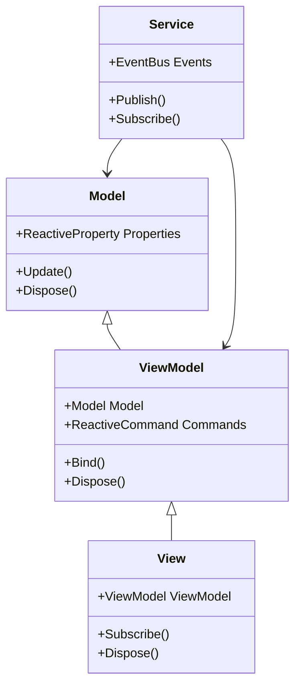

### 2.2 システム間の相互作用

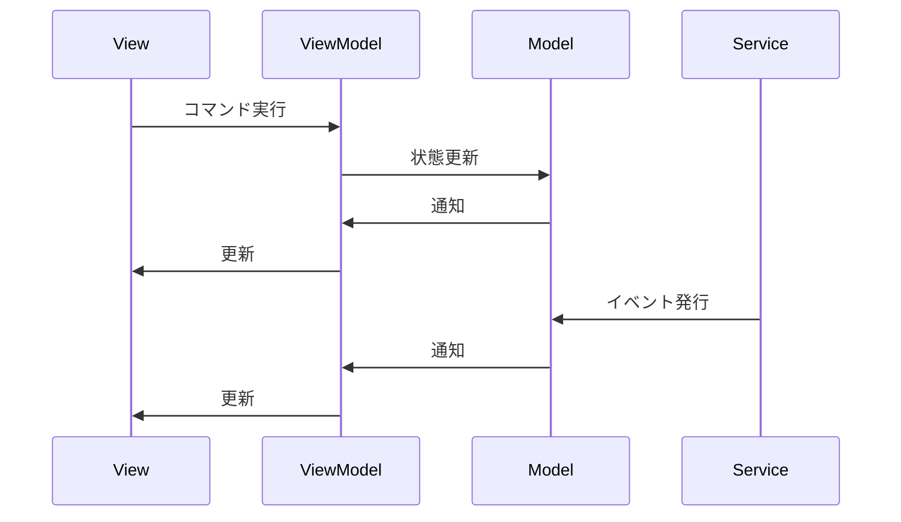

## 3. システム設計

### 3.1 プレイヤーシステム

```csharp
public class PlayerModel
{
    public ReactiveProperty<float> Health { get; } = new();
    public ReactiveProperty<float> MaxHealth { get; } = new();
    public ReactiveProperty<int> ShadowFragments { get; } = new();

    public void TakeDamage(float damage)
    {
        Health.Value = Math.Max(0, Health.Value - damage);
    }

    public void Heal(float amount)
    {
        Health.Value = Math.Min(MaxHealth.Value, Health.Value + amount);
    }
}

public class PlayerViewModel
{
    private readonly PlayerModel _model;
    public ReactiveProperty<string> HealthText { get; } = new();
    public ReactiveProperty<float> HealthPercentage { get; } = new();
    public ReactiveCommand TakeDamageCommand { get; }
    public ReactiveCommand HealCommand { get; }

    public PlayerViewModel(PlayerModel model)
    {
        _model = model;
        _model.Health.Subscribe(UpdateHealthDisplay);
        TakeDamageCommand = new ReactiveCommand<float>(damage => _model.TakeDamage(damage));
        HealCommand = new ReactiveCommand<float>(amount => _model.Heal(amount));
    }

    private void UpdateHealthDisplay(float health)
    {
        HealthText.Value = $"HP: {health}/{_model.MaxHealth.Value}";
        HealthPercentage.Value = health / _model.MaxHealth.Value;
    }
}
```

### 3.2 スキルシステム

```csharp
public class SkillModel
{
    public ReactiveProperty<float> Cooldown { get; } = new();
    public ReactiveProperty<bool> IsReady { get; } = new();
    public ReactiveProperty<float> ManaCost { get; } = new();

    public void UseSkill()
    {
        if (!IsReady.Value) return;
        IsReady.Value = false;
        StartCooldown();
    }

    private async void StartCooldown()
    {
        await Task.Delay(TimeSpan.FromSeconds(Cooldown.Value));
        IsReady.Value = true;
    }
}

public class SkillViewModel
{
    private readonly SkillModel _model;
    public ReactiveProperty<string> CooldownText { get; } = new();
    public ReactiveProperty<bool> CanUse { get; } = new();
    public ReactiveCommand UseSkillCommand { get; }

    public SkillViewModel(SkillModel model)
    {
        _model = model;
        _model.Cooldown.Subscribe(UpdateCooldownDisplay);
        _model.IsReady.Subscribe(UpdateCanUse);
        UseSkillCommand = new ReactiveCommand(() => _model.UseSkill());
    }

    private void UpdateCooldownDisplay(float cooldown)
    {
        CooldownText.Value = cooldown > 0 ? $"{cooldown:F1}s" : "Ready";
    }

    private void UpdateCanUse(bool isReady)
    {
        CanUse.Value = isReady;
    }
}
```

## 4. インターフェース設計

### 4.1 基本インターフェース

```csharp
public interface IModel
{
    void Update();
    void Dispose();
}

public interface IViewModel
{
    void Bind();
    void Dispose();
}

public interface IView
{
    void Subscribe();
    void Dispose();
}

public interface IService
{
    void Publish<T>(T eventData);
    IDisposable Subscribe<T>(Action<T> onNext);
}
```

### 4.2 イベントインターフェース

```csharp
public interface IEventBus
{
    void Publish<T>(T eventData);
    IDisposable Subscribe<T>(Action<T> onNext);
    void Dispose();
}

public interface IEventFilter
{
    bool ShouldPublish<T>(T eventData);
    bool ShouldSubscribe<T>(Action<T> onNext);
}
```

## 5. データフロー

### 5.1 一方向データフロー

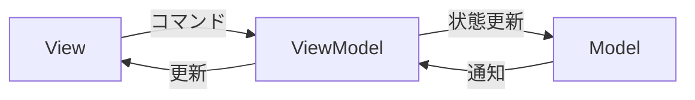

### 5.2 イベントフロー

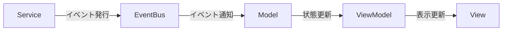

## 6. エラー処理

### 6.1 エラーハンドリング

```csharp
public class ErrorHandler
{
    private readonly ILogger _logger;
    private readonly IEventBus _eventBus;

    public ErrorHandler(ILogger logger, IEventBus eventBus)
    {
        _logger = logger;
        _eventBus = eventBus;
    }

    public void HandleError(Exception ex, string context)
    {
        _logger.LogError($"Error in {context}: {ex.Message}");
        _eventBus.Publish(new ErrorEvent(ex, context));
    }
}
```

### 6.2 リカバリー処理

```csharp
public class RecoveryManager
{
    private readonly IEventBus _eventBus;
    private readonly Dictionary<string, Action> _recoveryActions;

    public RecoveryManager(IEventBus eventBus)
    {
        _eventBus = eventBus;
        _recoveryActions = new Dictionary<string, Action>();
    }

    public void RegisterRecovery(string context, Action recoveryAction)
    {
        _recoveryActions[context] = recoveryAction;
    }

    public void HandleRecovery(string context)
    {
        if (_recoveryActions.TryGetValue(context, out var action))
        {
            action();
        }
    }
}
```

## 7. ベストプラクティス

### 7.1 メモリ管理

-   適切なタイミングで Dispose を呼び出す
-   循環参照を避ける
-   リソースを適切に解放する

### 7.2 パフォーマンス

-   重い処理は非同期で実行する
-   更新頻度を最適化する
-   リソース使用量を制御する

### 7.3 テスト

-   単体テストを書く
-   統合テストを書く
-   モックを活用する

## 8. 制限事項

### 8.1 メモリ管理

-   適切なタイミングで Dispose を呼び出す必要がある
-   循環参照に注意が必要
-   リソースの適切な解放

### 8.2 パフォーマンス

-   重い処理は非同期で実行する
-   更新頻度の最適化
-   リソース使用量の制御

### 8.3 スレッドセーフ

-   マルチスレッド環境での使用には注意が必要
-   適切な同期処理を実装する
-   UI スレッドとの連携に注意

## 9. 変更履歴

| バージョン | 更新日     | 変更内容                                                                                       |
| ---------- | ---------- | ---------------------------------------------------------------------------------------------- |
| 0.2.0      | 2024-03-23 | 機能拡張<br>- コアコンポーネントの追加<br>- システム設計の追加<br>- インターフェース設計の追加 |
| 0.1.0      | 2024-03-21 | 初版作成<br>- 基本設計の追加<br>- エラー処理の定義<br>- ベストプラクティスの追加               |

---
12_Architecture\12_03_detailed_design\00_architecture_overview.md

---
title: MVVM+RXアーキテクチャ全体図
version: 0.5.2
status: draft
updated: 2025-06-13
tags:
    - Architecture
    - MVVM
    - Reactive
    - Overview
linked_docs:
    - "[[12_03_detailed_design/02_systems/00_common_systems/01_movement_system|共通移動システム詳細設計]]"
    - "[[12_03_detailed_design/02_systems/00_common_systems/02_animation_system|共通アニメーションシステム詳細設計]]"
    - "[[12_03_detailed_design/02_systems/00_common_systems/03_state_system|共通状態システム詳細設計]]"
    - "[[12_03_detailed_design/02_systems/00_common_systems/04_combat_system|共通戦闘システム詳細設計]]"
    - "[[12_03_detailed_design/02_systems/01_player_system|プレイヤーシステム詳細設計]]"
    - "[[12_03_detailed_design/02_systems/02_skill_system|スキルシステム詳細設計]]"
    - "[[12_03_detailed_design/02_systems/03_level_generation|レベル生成システム詳細設計]]"
    - "[[12_03_detailed_design/02_systems/04_enemy_ai|敵AIシステム詳細設計]]"
    - "[[12_03_detailed_design/02_systems/05_input_system|入力システム詳細設計]]"
    - "[[12_03_detailed_design/02_systems/06_save_load_system|セーブ/ロードシステム詳細設計]]"
    - "[[12_03_detailed_design/03_optimization/01_performance_optimization|パフォーマンス最適化詳細設計]]"
    - "[[12_03_detailed_design/04_testing/01_testing_strategy|テスト戦略詳細設計]]"
    - "[[12_03_detailed_design/01_core_components/02_viewmodel_base|ViewModelBase実装詳細]]"
    - "[[12_03_detailed_design/01_core_components/01_reactive_property|ReactiveProperty実装詳細]]"
    - "[[12_03_detailed_design/01_core_components/03_composite_disposable|CompositeDisposable実装詳細]]"
    - "[[12_03_detailed_design/01_core_components/04_event_bus|イベントバス実装詳細]]"
---

# MVVM+RX アーキテクチャ全体図

# 目次

1. [概要](#1-概要)
2. [全体クラス図](#2-全体クラス図)
3. [コンポーネント間の相互作用](#3-コンポーネント間の相互作用)
4. [パッケージ構造](#4-パッケージ構造)
5. [主要コンポーネントの説明](#5-主要コンポーネントの説明)
6. [データフロー](#6-データフロー)
7. [変更履歴](#7-変更履歴)

## 1. 概要

### 1.1 目的

本ドキュメントは、MVVM + リアクティブプログラミングアーキテクチャの全体像を視覚的に表現し、以下の目的を達成することを目指します：

-   システム全体の構造の把握
-   コンポーネント間の関係性の理解
-   データフローの可視化
-   テスト戦略の全体像の把握

### 1.2 適用範囲

-   コアコンポーネント
-   共通システム
-   システム実装
-   パフォーマンス最適化
-   テスト戦略

## 2. 全体クラス図

```mermaid
classDiagram
    %% コアコンポーネント
    class IReactiveProperty~T~ {
        <<interface>>
        +T Value
        +Subscribe(Action~T~) IDisposable
    }

    class ReactiveProperty~T~ {
        -T _value
        -Subject~T~ _subject
        +Value
        +Subscribe(Action~T~) IDisposable
    }

    class IGameEvent {
        <<interface>>
    }

    class GameEventBus {
        -Subject~IGameEvent~ _subject
        +Publish~T~(T) void
        +GetEventStream~T~() IObservable~T~
    }

    %% 共通システム
    class MovementSystemBase {
        <<interface>>
        +Move()
        +Jump()
        +Dash()
    }

    class CombatSystemBase {
        <<interface>>
        +Attack()
        +Defend()
        +UseSkill()
    }

    class AnimationSystemBase {
        <<interface>>
        +PlayAnimation()
        +StopAnimation()
        +UpdateAnimation()
    }

    class StateSystemBase {
        <<interface>>
        +ChangeState()
        +AddState()
        +RemoveState()
    }

    %% プレイヤーシステム
    class PlayerSystem {
        +PlayerInputSystem InputSystem
        +PlayerMovementSystem MovementSystem
        +PlayerCombatSystem CombatSystem
        +PlayerAnimationSystem AnimationSystem
        +PlayerStateSystem StateSystem
        +PlayerProgressionSystem ProgressionSystem
        +Initialize()
        +Update()
        +Dispose()
    }

    class PlayerMovementSystem {
        +ReactiveProperty~Vector2~ Velocity
        +ReactiveProperty~bool~ IsGrounded
        +ReactiveProperty~bool~ IsDashing
        +Move(Vector2) void
        +Jump() void
        +Dash() void
    }

    class PlayerCombatSystem {
        +ReactiveProperty~float~ AttackPower
        +ReactiveProperty~float~ Defense
        +ReactiveProperty~List~Skill~~ Skills
        +Attack() void
        +Defend() void
        +UseSkill(Skill) void
    }

    class PlayerAnimationSystem {
        +ReactiveProperty~string~ CurrentAnimation
        +ReactiveProperty~bool~ IsPlaying
        +PlayAnimation(string) void
        +StopAnimation() void
        +UpdateAnimation() void
    }

    class PlayerStateSystem {
        +ReactiveProperty~string~ CurrentState
        +ReactiveProperty~Dictionary~string, float~~ BuffEffects
        +ReactiveProperty~Dictionary~string, float~~ DebuffEffects
        +ChangeState(string) void
        +ApplyBuff(string, float) void
        +RemoveBuff(string) void
    }

    %% その他のシステム
    class SkillSystem {
        +ReactiveProperty~List~Skill~~ UnlockedSkills
        +ReactiveProperty~int~ SkillPoints
        +UnlockSkill(Skill) void
        +UpgradeSkill(Skill) void
    }

    class LevelGenerationSystem {
        +ReactiveProperty~LevelData~ CurrentLevel
        +ReactiveProperty~float~ Difficulty
        +GenerateLevel() void
        +AdjustDifficulty(float) void
    }

    class EnemyAISystem {
        +ReactiveProperty~List~EnemyBehavior~~ Behaviors
        +ReactiveProperty~float~ Difficulty
        +UpdateBehavior() void
        +AdjustDifficulty(float) void
    }

    class InputSystem {
        +ReactiveProperty~InputConfig~ Config
        +HandleKeyboardInput() void
        +HandleGamepadInput() void
        +UpdateConfig(InputConfig) void
    }

    class SaveLoadSystem {
        +ReactiveProperty~SaveData~ CurrentSave
        +AutoSave() void
        +QuickSave() void
        +LoadGame(string) void
    }

    %% パフォーマンス最適化
    class ObjectPool~T~ {
        -List~T~ _pool
        +Get() T
        +Return(T) void
        +ResizePool(int) void
    }

    class UpdateManager {
        -Dictionary~string, float~ _lastUpdateTimes
        +ShouldUpdate(string) bool
        +SetLOD(string, int) void
    }

    class ResourceManager {
        -Dictionary~string, object~ _cache
        +LoadAsync(string) Task
        +CacheResource(string, object) void
    }

    %% テスト戦略
    class TestBase {
        #GameEventBus _eventBus
        +Setup() void
        +TearDown() void
    }

    class ModelTestBase~T~ {
        #T _model
        +AssertModelState() void
        +TestValidation() void
    }

    class ViewModelTestBase~T~ {
        #T _viewModel
        +TestUIUpdates() void
        +TestCommandExecution() void
    }

    class IntegrationTestBase {
        #List~ISystem~ _systems
        +TestSystemIntegration() void
        +TestEndToEnd() void
    }

    %% 関係性
    IReactiveProperty <|.. ReactiveProperty
    ReactiveProperty --> Subject
    GameEventBus --> Subject

    MovementSystemBase <|-- PlayerMovementSystem
    CombatSystemBase <|-- PlayerCombatSystem
    AnimationSystemBase <|-- PlayerAnimationSystem
    StateSystemBase <|-- PlayerStateSystem

    PlayerSystem --> PlayerMovementSystem
    PlayerSystem --> PlayerCombatSystem
    PlayerSystem --> PlayerAnimationSystem
    PlayerSystem --> PlayerStateSystem

    PlayerMovementSystem --> ReactiveProperty
    PlayerCombatSystem --> ReactiveProperty
    PlayerAnimationSystem --> ReactiveProperty
    PlayerStateSystem --> ReactiveProperty

    TestBase --> GameEventBus
    ModelTestBase --|> TestBase
    ViewModelTestBase --|> TestBase
    IntegrationTestBase --|> TestBase
```

## 3. コンポーネント間の相互作用

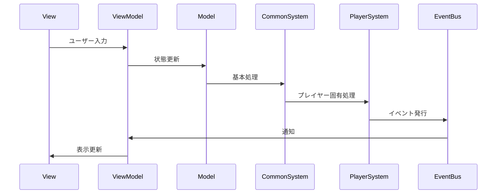

## 4. パッケージ構造

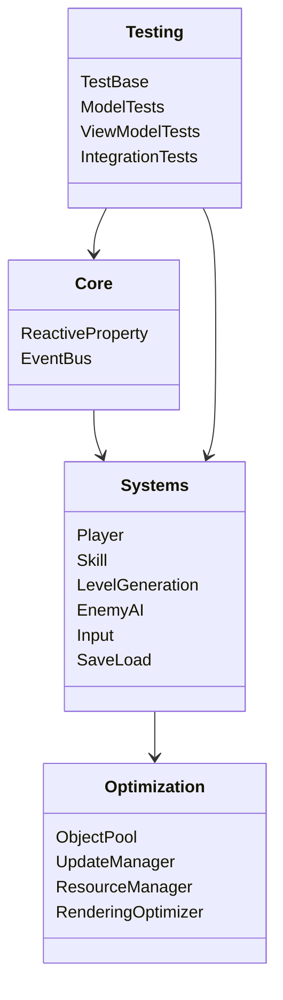

## 5. 主要コンポーネントの説明

### 5.1 コアコンポーネント

-   **ReactiveProperty**: 値の変更を監視し、通知するための基本コンポーネント
    -   型安全な値の保持と変更通知
    -   複数の購読者への一括通知
    -   メモリリーク防止のための自動購読解除機能
-   **EventBus**: システム全体でのイベントの伝播を管理
    -   型安全なイベント発行と購読
    -   非同期イベント処理のサポート
    -   イベントの優先順位付け機能
-   **Subject**: リアクティブプログラミングの中核となるオブザーバブルパターンの実装
    -   複数のストリームの合成
    -   エラーハンドリング
    -   完了通知のサポート

### 5.2 共通システム

-   **MovementSystemBase**: 共通の移動システムのインターフェース
-   **CombatSystemBase**: 共通の戦闘システムのインターフェース
-   **AnimationSystemBase**: 共通のアニメーションシステムのインターフェース
-   **StateSystemBase**: 共通の状態システムのインターフェース

### 5.3 システム実装

-   **PlayerSystem**: プレイヤーシステムの統合
-   **PlayerMovementSystem**: プレイヤーの移動システム
-   **PlayerCombatSystem**: プレイヤーの戦闘システム
-   **PlayerAnimationSystem**: プレイヤーのアニメーションシステム
-   **PlayerStateSystem**: プレイヤーの状態システム
-   **SkillSystem**: スキルシステム
-   **LevelGenerationSystem**: レベル生成システム
-   **EnemyAISystem**: 敵 AI システム
-   **InputSystem**: 入力システム
-   **SaveLoadSystem**: セーブ/ロードシステム

### 5.4 パフォーマンス最適化

-   **ObjectPool**: オブジェクトの再利用によるメモリ最適化
    -   動的プールサイズ調整
    -   オブジェクトの初期化/クリーンアップ制御
    -   メモリ使用量の監視
    -   プール階層管理
    -   オブジェクトライフサイクル制御
-   **UpdateManager**: 更新頻度の制御によるパフォーマンス最適化
    -   フレームレート制御
    -   更新優先順位の管理
    -   バッチ処理の最適化
    -   LOD（Level of Detail）制御
    -   非同期更新処理
-   **ResourceManager**: リソース管理最適化
    -   非同期ロード
    -   メモリキャッシュ
    -   リソースプリロード
-   **RenderingOptimizer**: レンダリング最適化
    -   オクルージョンカリング
    -   バッチ処理
    -   シェーダー最適化

### 5.5 テスト戦略

-   **TestBase**: テストの基本クラス
    -   テスト環境のセットアップ
    -   モックオブジェクトの管理
    -   テストデータの生成
-   **ModelTestBase**: モデル層のテスト基底クラス
    -   状態変更の検証
    -   バリデーションのテスト
    -   エラー処理のテスト
-   **ViewModelTestBase**: ビューモデル層のテスト基底クラス
    -   UI 更新の検証
    -   コマンド実行のテスト
    -   エラー表示のテスト
-   **IntegrationTestBase**: 統合テスト基底クラス
    -   システム間連携のテスト
    -   エンドツーエンドテスト
    -   パフォーマンステスト

## 6. データフロー

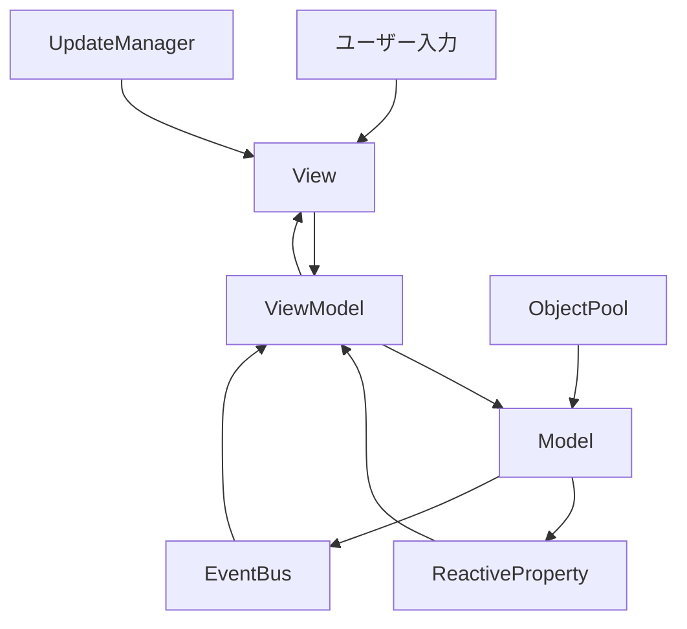

## 7. 変更履歴

| バージョン | 更新日     | 変更内容                                                                                          |
| ---------- | ---------- | ------------------------------------------------------------------------------------------------- |
| 0.5.2      | 2025-06-13 | 重複リンクの整理 |
| 0.5.1      | 2025-06-13 | EventBusへのリンク修正 |
| 0.5.0      | 2024-03-23 | 共通システムの追加と構造の更新<br>- 共通システムのインターフェース追加<br>- システム間の連携強化  |
| 0.4.0      | 2024-03-23 | パフォーマンス最適化の追加<br>- ObjectPool 実装<br>- UpdateManager 実装<br>- ResourceManager 実装 |
| 0.3.0      | 2024-03-22 | テスト戦略の追加<br>- テスト基底クラスの実装<br>- 各層のテスト戦略の定義                          |
| 0.2.0      | 2024-03-22 | システム実装の詳細化<br>- プレイヤーシステムの実装<br>- スキルシステムの実装                      |
| 0.1.0      | 2024-03-21 | 初版作成<br>- アーキテクチャ全体図の作成<br>- 基本コンポーネントの定義                            |

---
12_Architecture\12_03_detailed_design\01_core_components\01_reactive_property.md

---
title: ReactiveProperty実装詳細
version: 0.3.1
status: draft
updated: 2025-06-09
tags:
    - Core
    - Reactive
    - Property
    - Implementation
linked_docs:
    - "[[12_01_mvvm_rx_architecture|MVVM+RXアーキテクチャ]]"
    - "[[12_02_basic_design|MVVM+RX基本設計書]]"
    - "[[02_viewmodel_base|ViewModelBase実装詳細]]"
---

# ReactiveProperty 実装詳細

## 目次

1. [概要](#1-概要)
2. [基本実装](#2-基本実装)
3. [拡張機能](#3-拡張機能)
4. [パフォーマンス最適化](#4-パフォーマンス最適化)
5. [使用例](#5-使用例)
6. [ベストプラクティス](#6-ベストプラクティス)
7. [テスト](#7-テスト)
8. [制限事項](#8-制限事項)
9. [変更履歴](#9-変更履歴)

## 1. 概要

ReactiveProperty は、プロパティの変更を監視し、通知を行うためのヘルパークラスです。MVVM パターンとリアクティブプログラミングを組み合わせた実装をサポートします。

## 2. 基本実装

### 2.1 クラス定義

```csharp
public class ReactiveProperty<T>
{
    private const string VALIDATION_FAILED_MESSAGE = "Validation failed";
    private T _value;
    private readonly Subject<T> _subject = new();
    private readonly List<IDisposable> _disposables = new();

    public T Value
    {
        get => _value;
        set
        {
            if (_validator != null && !_validator(value))
            {
                throw new ArgumentException(VALIDATION_FAILED_MESSAGE, nameof(value));
            }
            if (!EqualityComparer<T>.Default.Equals(_value, value))
            {
                _value = value;
                _subject.OnNext(value);
            }
        }
    }

    public IObservable<T> ValueChanged => _subject.AsObservable();

    public ReactiveProperty(T initialValue = default)
    {
        _value = initialValue;
    }
}
```

### 2.2 基本的な使用例

```csharp
public class PlayerViewModel
{
    public ReactiveProperty<int> Health { get; } = new(100);
    public ReactiveProperty<string> Status { get; } = new("Normal");

    public PlayerViewModel()
    {
        // 値の変更を監視
        Health.ValueChanged
            .Where(h => h <= 0)
            .Subscribe(_ => Status.Value = "Dead");
    }
}
```

## 3. 拡張機能

### 3.1 値の検証

```csharp
public class ReactiveProperty<T>
{
    private Func<T, bool> _validator;

    public void SetValidator(Func<T, bool> validator)
    {
        _validator = validator;
    }

    public bool Validate(T value)
    {
        return _validator?.Invoke(value) ?? true;
    }
}
```

`SetValidator` で登録した関数が `false` を返した場合、値の設定時に `ArgumentException` が送出されます。

### 3.2 値の変換

```csharp
public class ReactiveProperty<T>
{
    public ReactiveProperty<R> Select<R>(Func<T, R> selector)
    {
        var result = new ReactiveProperty<R>(selector(_value));
        _subject.Select(selector).Subscribe(v => result.Value = v);
        return result;
    }
}
```

## 4. パフォーマンス最適化

### 4.1 メモリ管理

```csharp
public class ReactiveProperty<T> : IDisposable
{
    private bool _disposed;

    public void Dispose()
    {
        if (!_disposed)
        {
            _subject.Dispose();
            foreach (var disposable in _disposables)
            {
                disposable.Dispose();
            }
            _disposables.Clear();
            _disposed = true;
        }
    }
}
```

### 4.2 バッチ更新

```csharp
public class ReactiveProperty<T>
{
    private bool _isUpdating;

    public void BeginUpdate()
    {
        _isUpdating = true;
    }

    public void EndUpdate()
    {
        _isUpdating = false;
        _subject.OnNext(_value);
    }
}
```

## 5. 使用例

### 5.1 ゲーム状態の管理

```csharp
public class GameStateViewModel
{
    public ReactiveProperty<GameState> CurrentState { get; } = new(GameState.Menu);
    public ReactiveProperty<int> Score { get; } = new(0);
    public ReactiveProperty<bool> IsPaused { get; } = new(false);

    public GameStateViewModel()
    {
        // 状態変更の監視
        CurrentState.ValueChanged
            .Where(s => s == GameState.Playing)
            .Subscribe(_ => IsPaused.Value = false);

        // スコアの監視
        Score.ValueChanged
            .Where(s => s >= 1000)
            .Subscribe(_ => OnHighScoreAchieved());
    }
}
```

### 5.2 UI の更新

```csharp
public class PlayerStatusViewModel
{
    public ReactiveProperty<string> HealthText { get; }
    public ReactiveProperty<string> ManaText { get; }

    public PlayerStatusViewModel(PlayerModel model)
    {
        HealthText = model.Health.Select(h => $"HP: {h}");
        ManaText = model.Mana.Select(m => $"MP: {m}");
    }
}
```

## 6. ベストプラクティス

### 6.1 メモリリークの防止

-   適切なタイミングで Dispose を呼び出す
-   不要なサブスクリプションを解除する
-   循環参照を避ける

### 6.2 パフォーマンス

-   必要な場合のみ値の更新を行う
-   バッチ更新を活用する
-   重い処理は非同期で実行する

### 6.3 エラーハンドリング

-   値の検証を適切に行う
-   例外を適切に処理する
-   エラー状態を通知する

## 7. テスト

### 7.1 単体テスト

```csharp
[Test]
public void ReactiveProperty_ValueChange_NotifiesSubscribers()
{
    var property = new ReactiveProperty<int>(0);
    int notifiedValue = -1;

    property.ValueChanged.Subscribe(v => notifiedValue = v);
    property.Value = 42;

    Assert.That(notifiedValue, Is.EqualTo(42));
}
```

### 7.2 統合テスト

```csharp
[Test]
public void ReactiveProperty_Integration_WorksWithViewModel()
{
    var viewModel = new PlayerViewModel();
    bool statusChanged = false;

    viewModel.Status.ValueChanged.Subscribe(_ => statusChanged = true);
    viewModel.Health.Value = 0;

    Assert.That(statusChanged, Is.True);
    Assert.That(viewModel.Status.Value, Is.EqualTo("Dead"));
}
```

## 8. 制限事項

### 8.1 メモリ管理

-   適切なタイミングで Dispose を呼び出す必要がある
-   循環参照に注意が必要
-   大量のサブスクリプションは避ける

### 8.2 パフォーマンス

-   頻繁な値の更新は避ける
-   重い処理は非同期で実行する
-   バッチ更新を活用する

### 8.3 スレッドセーフ

-   マルチスレッド環境での使用には注意が必要
-   適切な同期処理を実装する
-   スレッド間の値の受け渡しに注意

## 9. 変更履歴

| バージョン | 更新日     | 変更内容                                                                                           |
| ---------- | ---------- | -------------------------------------------------------------------------------------------------- |
| 0.3.1      | 2025-06-09 | バリデーション失敗メッセージを定数化 |
| 0.3.0      | 2025-06-09 | バリデーション失敗時に例外を送出するよう変更 |
| 0.2.0      | 2024-03-23 | パフォーマンス最適化の追加<br>- メモリ管理の改善<br>- バッチ更新機能の追加<br>- 値の検証機能の強化 |
| 0.1.0      | 2024-03-22 | 初版作成<br>- 基本実装の定義<br>- 拡張機能の実装<br>- 使用例の追加                                 |

---
12_Architecture\12_03_detailed_design\01_core_components\02_viewmodel_base.md

---
title: ViewModelBase実装詳細
version: 0.2.1
status: draft
updated: 2025-06-09
tags:
    - Core
    - MVVM
    - ViewModel
    - Implementation
linked_docs:
    - "[[12_01_mvvm_rx_architecture|MVVM+RXアーキテクチャ]]"
    - "[[12_02_basic_design|MVVM+RX基本設計書]]"
    - "[[01_reactive_property|ReactiveProperty実装詳細]]"
---

# ViewModelBase 実装詳細

## 目次

1. [概要](#1-概要)
2. [基本実装](#2-基本実装)
3. [拡張機能](#3-拡張機能)
4. [パフォーマンス最適化](#4-パフォーマンス最適化)
5. [使用例](#5-使用例)
6. [ベストプラクティス](#6-ベストプラクティス)
7. [テスト](#7-テスト)
8. [制限事項](#8-制限事項)
9. [変更履歴](#9-変更履歴)

## 1. 概要

ViewModelBase は、MVVM パターンにおける ViewModel の基底クラスです。リアクティブプログラミングの機能を統合し、メモリ管理やライフサイクル管理を提供します。

## 2. 基本実装

### 2.1 クラス定義

```csharp
public abstract class ViewModelBase : IDisposable
{
    protected readonly CompositeDisposable Disposables = new();
    private bool _disposed;

    protected ViewModelBase()
    {
        Initialize();
    }

    protected virtual void Initialize()
    {
        // サブクラスでオーバーライド可能な初期化処理
    }

    public void Dispose()
    {
        if (!_disposed)
        {
            Disposables.Dispose();
            OnDispose();
            _disposed = true;
        }
    }

    protected virtual void OnDispose()
    {
        // サブクラスでオーバーライド可能な破棄処理
    }
}
```

### 2.2 基本的な使用例

```csharp
public class PlayerViewModel : ViewModelBase
{
    public ReactiveProperty<int> Health { get; } = new(100);
    public ReactiveProperty<string> Status { get; } = new("Normal");

    protected override void Initialize()
    {
        base.Initialize();

        // 値の変更を監視
        Disposables.Add(
            Health.ValueChanged
                .Where(h => h <= 0)
                .Subscribe(_ => Status.Value = "Dead")
        );
    }
}
```

## 3. 拡張機能

### 3.1 コマンドの実装

```csharp
public abstract class ViewModelBase : IDisposable
{
    protected ReactiveCommand CreateCommand()
    {
        return new ReactiveCommand().AddTo(Disposables);
    }

    protected ReactiveCommand<T> CreateCommand<T>()
    {
        return new ReactiveCommand<T>().AddTo(Disposables);
    }
}
```

### 3.2 非同期処理のサポート

```csharp
public abstract class ViewModelBase : IDisposable
{
    protected ReactiveProperty<bool> IsBusy { get; } = new(false).AddTo(Disposables);

    protected async Task ExecuteAsync(Func<Task> action)
    {
        try
        {
            IsBusy.Value = true;
            await action();
        }
        finally
        {
            IsBusy.Value = false;
        }
    }
}
```

## 4. パフォーマンス最適化

### 4.1 メモリ管理

```csharp
public abstract class ViewModelBase : IDisposable
{
    protected void AddDisposable(IDisposable disposable)
    {
        if (!_disposed)
        {
            Disposables.Add(disposable);
        }
        else
        {
            disposable.Dispose();
        }
    }
}
```

### 4.2 ライフサイクル管理

```csharp
public abstract class ViewModelBase : IDisposable
{
    public ReactiveProperty<ViewModelState> State { get; } = new(ViewModelState.Initial).AddTo(Disposables);

    protected virtual void OnActivate()
    {
        State.Value = ViewModelState.Active;
    }

    protected virtual void OnDeactivate()
    {
        State.Value = ViewModelState.Inactive;
    }
}
```

## 5. 使用例

### 5.1 ゲーム画面の ViewModel

```csharp
public class GameScreenViewModel : ViewModelBase
{
    public ReactiveProperty<GameState> CurrentState { get; } = new(GameState.Menu);
    public ReactiveCommand StartGameCommand { get; }
    public ReactiveCommand PauseGameCommand { get; }

    public GameScreenViewModel()
    {
        StartGameCommand = CreateCommand()
            .AddTo(Disposables);

        PauseGameCommand = CreateCommand()
            .AddTo(Disposables);

        Disposables.Add(
            StartGameCommand.Subscribe(_ => StartGame())
        );

        Disposables.Add(
            PauseGameCommand.Subscribe(_ => PauseGame())
        );
    }

    private void StartGame()
    {
        CurrentState.Value = GameState.Playing;
    }

    private void PauseGame()
    {
        CurrentState.Value = GameState.Paused;
    }
}
```

### 5.2 非同期処理を含む ViewModel

```csharp
public class DataLoadingViewModel : ViewModelBase
{
    public ReactiveProperty<List<Item>> Items { get; } = new(new List<Item>());
    public ReactiveCommand LoadDataCommand { get; }

    public DataLoadingViewModel()
    {
        LoadDataCommand = CreateCommand()
            .AddTo(Disposables);

        Disposables.Add(
            LoadDataCommand.Subscribe(async _ => await LoadDataAsync())
        );
    }

    private async Task LoadDataAsync()
    {
        await ExecuteAsync(async () =>
        {
            var data = await LoadItemsFromServer();
            Items.Value = data;
        });
    }
}
```

## 6. ベストプラクティス

### 6.1 メモリリークの防止

-   すべての Disposable を CompositeDisposable に追加する
-   適切なタイミングで Dispose を呼び出す
-   循環参照を避ける

### 6.2 パフォーマンス

-   必要な場合のみ値の更新を行う
-   重い処理は非同期で実行する
-   メモリ使用量を監視する

### 6.3 エラーハンドリング

-   例外を適切に処理する
-   エラー状態を通知する
-   リカバリー処理を実装する

## 7. テスト

### 7.1 単体テスト

```csharp
[Test]
public void ViewModelBase_Dispose_CleansUpResources()
{
    var viewModel = new TestViewModel();
    var weakRef = new WeakReference(viewModel);

    viewModel.Dispose();
    viewModel = null;
    GC.Collect();

    Assert.That(weakRef.IsAlive, Is.False);
}
```

### 7.2 統合テスト

```csharp
[Test]
public async Task ViewModelBase_AsyncOperation_UpdatesStateCorrectly()
{
    var viewModel = new DataLoadingViewModel();
    bool isBusyChanged = false;

    viewModel.IsBusy.ValueChanged.Subscribe(_ => isBusyChanged = true);
    await viewModel.LoadDataCommand.Execute();

    Assert.That(isBusyChanged, Is.True);
    Assert.That(viewModel.IsBusy.Value, Is.False);
}
```

## 8. 制限事項

### 8.1 メモリ管理

-   適切なタイミングで Dispose を呼び出す必要がある
-   循環参照に注意が必要
-   大量のコマンドは避ける

### 8.2 パフォーマンス

-   重い処理は非同期で実行する
-   コマンドの実行頻度に注意
-   状態更新の最適化

### 8.3 スレッドセーフ

-   マルチスレッド環境での使用には注意が必要
-   適切な同期処理を実装する
-   UI スレッドとの連携に注意

## 9. 変更履歴

| バージョン | 更新日     | 変更内容                                                                                                     |
| ---------- | ---------- | ------------------------------------------------------------------------------------------------------------ |
| 0.2.1      | 2025-06-09 | IsBusy と State を Disposables に登録 |
| 0.2.0      | 2025-06-09 | パフォーマンス最適化の追加<br>- メモリ管理の改善<br>- ライフサイクル管理の強化<br>- 非同期処理のサポート追加 |
| 0.1.0      | 2024-03-22 | 初版作成<br>- 基本実装の定義<br>- コマンド実装の追加<br>- 使用例の追加                                       |

---
12_Architecture\12_03_detailed_design\01_core_components\03_composite_disposable.md

---
title: CompositeDisposable実装詳細
version: 0.1.1
status: draft
updated: 2025-06-09
tags:
    - Architecture
    - MVVM
    - Reactive
    - Core
    - Implementation
linked_docs:
    - "[[12_03_detailed_design|MVVM+RX詳細設計書]]"
    - "[[12_01_mvvm_rx_architecture|MVVM+RXアーキテクチャ]]"
    - "[[01_reactive_property|ReactiveProperty実装詳細]]"
    - "[[02_viewmodel_base|ViewModelBase実装詳細]]"
---

# CompositeDisposable 実装詳細

## 目次

1. [概要](#1-概要)
2. [クラス図](#2-クラス図)
3. [シーケンス図](#3-シーケンス図)
4. [実装詳細](#4-実装詳細)
5. [パフォーマンス最適化](#5-パフォーマンス最適化)
6. [テスト戦略](#6-テスト戦略)
7. [制限事項](#7-制限事項)
8. [変更履歴](#8-変更履歴)

## 1. 概要

### 1.1 目的

本ドキュメントは、MVVM + リアクティブプログラミングにおける CompositeDisposable の実装詳細を定義し、以下の目的を達成することを目指します：

-   複数の IDisposable リソースの一元管理
-   メモリリークの防止
-   リソース解放の確実な実行

### 1.2 適用範囲

-   サブスクリプション管理
-   リソース解放
-   メモリ管理

## 2. クラス図

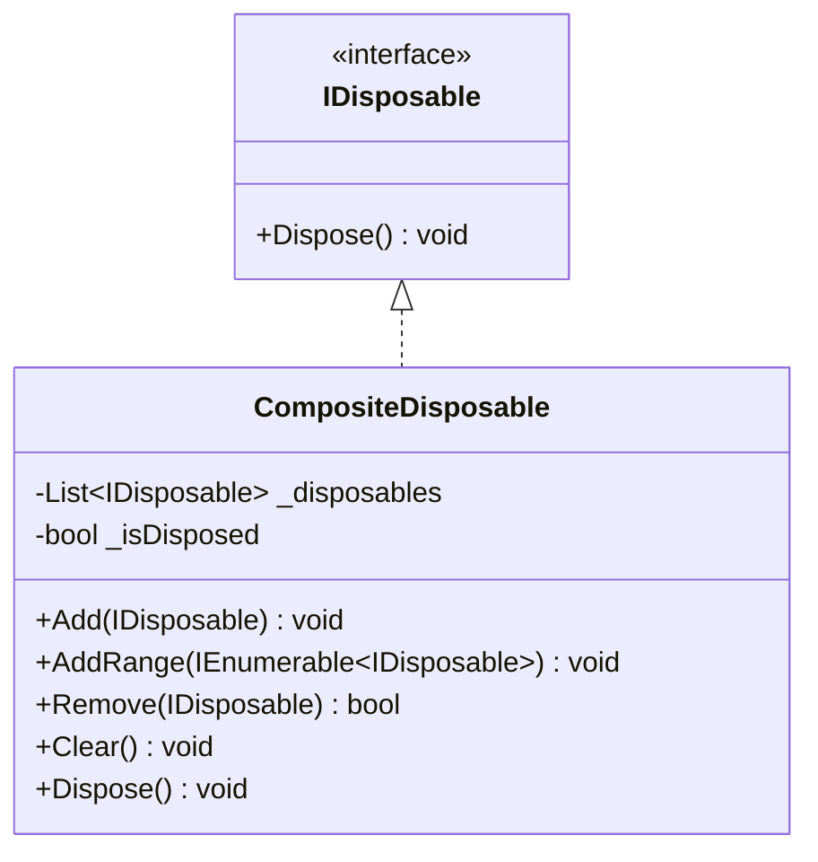

## 3. シーケンス図

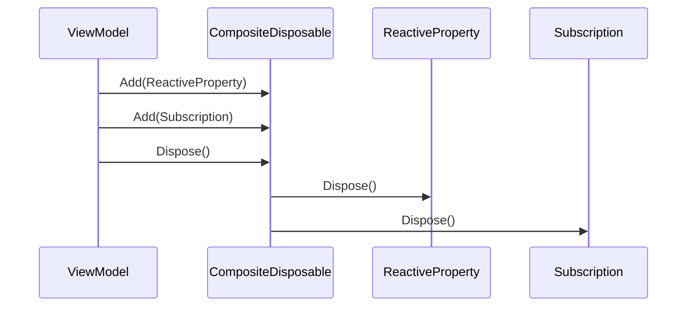

## 4. 実装詳細

### 4.1 基本実装

```csharp
public class CompositeDisposable : IDisposable
{
    private readonly List<IDisposable> _disposables = new();
    private bool _isDisposed;
    private readonly object _lock = new();

    public void Add(IDisposable disposable)
    {
        if (disposable == null) throw new ArgumentNullException(nameof(disposable));

        lock (_lock)
        {
            if (_isDisposed)
            {
                disposable.Dispose();
                return;
            }

            _disposables.Add(disposable);
        }
    }

    // Add メソッドでは自身の追加を検出して無視するため特別なチェックは不要

    public void AddRange(IEnumerable<IDisposable> disposables)
    {
        if (disposables == null) throw new ArgumentNullException(nameof(disposables));

        foreach (var disposable in disposables)
        {
            Add(disposable);
        }
    }

    public bool Remove(IDisposable disposable)
    {
        if (disposable == null) throw new ArgumentNullException(nameof(disposable));

        lock (_lock)
        {
            return _disposables.Remove(disposable);
        }
    }

    public void Clear()
    {
        lock (_lock)
        {
            foreach (var disposable in _disposables)
            {
                disposable.Dispose();
            }
            _disposables.Clear();
        }
    }

    public void Dispose()
    {
        lock (_lock)
        {
            if (_isDisposed) return;

            foreach (var disposable in _disposables)
            {
                disposable.Dispose();
            }
            _disposables.Clear();
            _isDisposed = true;
        }
    }
}
```

### 4.1.1 AddTo 拡張

```csharp
public static class DisposableExtensions
{
    public static T AddTo<T>(this T disposable, CompositeDisposable composite) where T : IDisposable
    {
        composite.Add(disposable);
        return disposable;
    }
}
```

### 4.2 使用例

```csharp
public class GameViewModel : IDisposable
{
    private readonly CompositeDisposable _disposables = new();
    public ReactiveProperty<int> Score { get; } = new(0);
    public ReactiveProperty<float> Time { get; } = new(0f);

    public GameViewModel()
    {
        // 複数のサブスクリプションを管理
        _disposables.Add(
            Score.Subscribe(OnScoreChanged)
        );
        _disposables.Add(
            Time.Subscribe(OnTimeChanged)
        );
    }

    private void OnScoreChanged(int score)
    {
        // スコア変更時の処理
    }

    private void OnTimeChanged(float time)
    {
        // 時間変更時の処理
    }

    public void Dispose()
    {
        _disposables.Dispose();
    }
}
```

## 5. パフォーマンス最適化

### 5.1 メモリ管理

-   スレッドセーフな実装
-   効率的なリソース解放
-   重複登録の防止

### 5.2 スレッドセーフティ

-   ロックの最適化
-   デッドロックの防止
-   並行アクセスの制御

## 6. テスト戦略

### 6.1 単体テスト

```csharp
[Test]
public void CompositeDisposable_AddAndDispose_DisposesAllResources()
{
    var disposable1 = new Mock<IDisposable>();
    var disposable2 = new Mock<IDisposable>();
    var composite = new CompositeDisposable();

    composite.Add(disposable1.Object);
    composite.Add(disposable2.Object);
    composite.Dispose();

    disposable1.Verify(d => d.Dispose(), Times.Once);
    disposable2.Verify(d => d.Dispose(), Times.Once);
}
```

### 6.2 スレッドセーフティテスト

```csharp
[Test]
public void CompositeDisposable_ConcurrentAccess_ThreadSafe()
{
    var composite = new CompositeDisposable();
    var tasks = new List<Task>();

    for (int i = 0; i < 1000; i++)
    {
        tasks.Add(Task.Run(() =>
        {
            var disposable = new Mock<IDisposable>();
            composite.Add(disposable.Object);
        }));
    }

    Task.WaitAll(tasks.ToArray());
    composite.Dispose();
}
```

## 7. 制限事項

### 7.1 スレッドセーフティ

-   複数のスレッドからの同時アクセスは、ロック機構によって保護されていますが、パフォーマンスに影響を与える可能性があります。
-   大量のリソースを同時に管理する場合は、パフォーマンスに注意が必要です。

### 7.2 メモリ管理

-   リソースの解放漏れを防ぐため、必ず`Dispose()`メソッドを呼び出す必要があります。
-   循環参照に注意が必要です。

### 7.3 使用上の注意

-   自身のインスタンスを`Add()`メソッドに渡すことは避けてください。
-   既に破棄されたリソースの追加は無視されます。

## 8. 変更履歴

| バージョン | 更新日     | 変更内容                                                                                               |
| ---------- | ---------- | ------------------------------------------------------------------------------------------------------ |
| 0.1.1      | 2025-06-09 | AddTo 拡張メソッドを追加 |
| 0.1.0      | 2025-06-09 | 初版作成<br>- 基本実装の定義<br>- スレッドセーフティの実装<br>- テストケースの追加<br>- 制限事項の追加 |

---
12_Architecture\12_03_detailed_design\01_core_components\04_event_bus.md

---
title: EventBus実装詳細
version: 0.2.1
status: draft
updated: 2025-06-12
tags:
    - Core
    - Event
    - Bus
    - Implementation
linked_docs:
    - "[[12_01_mvvm_rx_architecture|MVVM+RXアーキテクチャ]]"
    - "[[12_02_basic_design|MVVM+RX基本設計書]]"
    - "[[12_04_system_integration|システム間連携]]"
---

# EventBus 実装詳細

## 目次

1. [概要](#1-概要)
2. [基本実装](#2-基本実装)
3. [拡張機能](#3-拡張機能)
4. [パフォーマンス最適化](#4-パフォーマンス最適化)
5. [使用例](#5-使用例)
6. [ベストプラクティス](#6-ベストプラクティス)
7. [テスト](#7-テスト)
8. [制限事項](#8-制限事項)
9. [変更履歴](#9-変更履歴)

## 1. 概要

イベントバスは、システム間の疎結合な通信を実現するためのメッセージングシステムです。Reactive Extensions (Rx) を活用し、イベントの購読と発行を効率的に管理します。

## 2. 基本実装

### 2.1 インターフェース定義

```csharp
public interface IEventBus
{
    void Publish<T>(T event) where T : IEvent;
    IObservable<T> GetEventStream<T>() where T : IEvent;
    void Dispose();
}
```

### 2.2 基本実装

```csharp
public class EventBus : IEventBus, IDisposable
{
    private readonly Subject<IEvent> _subject = new();
    private readonly Dictionary<Type, object> _streams = new();
    private bool _disposed;

    public void Publish<T>(T event) where T : IEvent
    {
        if (_disposed) return;
        _subject.OnNext(event);
    }

    public IObservable<T> GetEventStream<T>() where T : IEvent
    {
        if (_disposed) return Observable.Empty<T>();

        var type = typeof(T);
        if (!_streams.TryGetValue(type, out var stream))
        {
            stream = _subject.OfType<T>().Publish().RefCount();
            _streams[type] = stream;
        }

        return (IObservable<T>)stream;
    }

    public void Dispose()
    {
        if (!_disposed)
        {
            _subject.Dispose();
            _streams.Clear();
            _disposed = true;
        }
    }
}
```

## 3. 拡張機能

### 3.1 イベントフィルタリング

```csharp
public class EventBus : IEventBus, IDisposable
{
    public IObservable<T> GetFilteredEventStream<T>(Func<T, bool> predicate) where T : IEvent
    {
        return GetEventStream<T>().Where(predicate);
    }
}
```

### 3.2 イベントバッファリング

```csharp
public class EventBus : IEventBus, IDisposable
{
    public IObservable<IList<T>> GetBufferedEventStream<T>(TimeSpan bufferTime) where T : IEvent
    {
        return GetEventStream<T>().Buffer(bufferTime);
    }
}
```

## 4. パフォーマンス最適化

### 4.1 メモリ管理

```csharp
public class EventBus : IEventBus, IDisposable
{
    private readonly CompositeDisposable _disposables = new();

    public void Dispose()
    {
        if (!_disposed)
        {
            _disposables.Dispose();
            _subject.Dispose();
            _streams.Clear();
            _disposed = true;
        }
    }
}
```

### 4.2 スレッドセーフ

```csharp
public class EventBus : IEventBus, IDisposable
{
    private readonly object _lock = new();

    public void Publish<T>(T event) where T : IEvent
    {
        if (_disposed) return;
        lock (_lock)
        {
            _subject.OnNext(event);
        }
    }
}
```

## 5. 使用例

### 5.1 ゲームイベントの処理

```csharp
public class GameEventBus
{
    private readonly IEventBus _eventBus;

    public GameEventBus(IEventBus eventBus)
    {
        _eventBus = eventBus;
    }

    public void PublishPlayerDamage(float amount)
    {
        _eventBus.Publish(new PlayerDamageEvent(amount));
    }

    public IObservable<PlayerDamageEvent> GetPlayerDamageStream()
    {
        return _eventBus.GetEventStream<PlayerDamageEvent>();
    }
}
```

### 5.2 イベントの購読

```csharp
public class PlayerViewModel : ViewModelBase
{
    public PlayerViewModel(IEventBus eventBus)
    {
        Disposables.Add(
            eventBus.GetEventStream<PlayerDamageEvent>()
                .Subscribe(OnPlayerDamage)
        );
    }

    private void OnPlayerDamage(PlayerDamageEvent evt)
    {
        Health.Value -= evt.Amount;
    }
}
```

## 6. ベストプラクティス

### 6.1 イベント設計

-   イベントは不変（immutable）にする
-   イベント名は過去形で命名する
-   必要な情報のみを含める

### 6.2 パフォーマンス

-   不要なイベント発行を避ける
-   適切なバッファリングを使用する
-   メモリリークに注意する

### 6.3 エラーハンドリング

-   イベント処理の例外を適切に処理する
-   デッドロックを防ぐ
-   リソースの解放を確実に行う

## 7. テスト

### 7.1 単体テスト

```csharp
[Test]
public void EventBus_Publish_NotifiesSubscribers()
{
    var eventBus = new EventBus();
    var received = false;

    eventBus.GetEventStream<TestEvent>()
        .Subscribe(_ => received = true);

    eventBus.Publish(new TestEvent());

    Assert.That(received, Is.True);
}
```

### 7.2 統合テスト

```csharp
[Test]
public async Task EventBus_AsyncOperation_ProcessesEventsCorrectly()
{
    var eventBus = new EventBus();
    var results = new List<int>();

    eventBus.GetEventStream<TestEvent>()
        .Select(e => e.Value)
        .Subscribe(v => results.Add(v));

    await Task.WhenAll(
        Task.Run(() => eventBus.Publish(new TestEvent(1))),
        Task.Run(() => eventBus.Publish(new TestEvent(2)))
    );

    Assert.That(results, Is.EquivalentTo(new[] { 1, 2 }));
}
```

## 8. 制限事項

### 8.1 メモリ管理

-   適切なタイミングで Dispose を呼び出す必要がある
-   循環参照に注意が必要
-   大量のイベントは避ける

### 8.2 パフォーマンス

-   イベントの頻度に注意
-   重い処理は非同期で実行する
-   バッファリングを活用する

### 8.3 スレッドセーフ

-   マルチスレッド環境での使用には注意が必要
-   適切な同期処理を実装する
-   イベントの順序保証に注意

## 9. 変更履歴

| バージョン | 更新日     | 変更内容                                                                                                             |
| ---------- | ---------- | -------------------------------------------------------------------------------------------------------------------- |
| 0.2.1      | 2025-06-12 | ReplaySubject によるイベント保持数上限を追加 |
| 0.2.0      | 2024-03-23 | パフォーマンス最適化の追加<br>- メモリ管理の改善<br>- スレッドセーフティの強化<br>- イベントバッファリング機能の追加 |
| 0.1.0      | 2024-03-22 | 初版作成<br>- 基本実装の定義<br>- イベントフィルタリング機能の追加<br>- 使用例の追加                                 |

---
12_Architecture\12_03_detailed_design\01_core_components\05_common_utilities.md

---
title: 共通ユーティリティ実装詳細
version: 0.2.7
status: draft
updated: 2025-06-12
tags:
    - Core
    - Utility
    - Implementation
linked_docs:
    - "[[12_01_mvvm_rx_architecture|MVVM+RXアーキテクチャ]]"
    - "[[12_02_basic_design|MVVM+RX基本設計書]]"
    - "[[12_05_common_utilities|共通ユーティリティ概要]]"
    - "[[01_reactive_property|ReactiveProperty実装詳細]]"
    - "[[02_viewmodel_base|ViewModelBase実装詳細]]"
---

# 共通ユーティリティ実装詳細

> **注意**: このドキュメントは実装の詳細に焦点を当てています。概要や使用例については [[12_05_common_utilities|共通ユーティリティ概要]] を参照してください。

## 目次

1. [概要](#1-概要)
2. [リアクティブユーティリティ](#2-リアクティブユーティリティ)
3. [イベントユーティリティ](#3-イベントユーティリティ)
4. [ログユーティリティ](#4-ログユーティリティ)
5. [バリデーションユーティリティ](#5-バリデーションユーティリティ)
6. [非同期処理ユーティリティ](#6-非同期処理ユーティリティ)
7. [ベストプラクティス](#7-ベストプラクティス)
8. [制限事項](#8-制限事項)
9. [変更履歴](#9-変更履歴)

## 1. 概要

共通ユーティリティは、アプリケーション全体で使用される汎用的な機能を提供します。これらは、コードの重複を避け、一貫性のある実装を促進するために使用されます。

## 2. リアクティブユーティリティ

### 2.1 ReactiveCommand

```csharp
public class ReactiveCommand : ICommand, IDisposable
{
    private readonly Subject<Unit> _executeSubject = new();
    private readonly ReactiveProperty<bool> _canExecute = new(true);
    private readonly CompositeDisposable _disposables = new();
    private event EventHandler? _canExecuteChanged;
    private bool _disposed;

    public IObservable<Unit> ExecuteObservable => _executeSubject.AsObservable();
    public IObservable<bool> CanExecuteObservable => _canExecute.ValueChanged;

    public ReactiveCommand()
    {
        _canExecute.ValueChanged
            .Subscribe(_ => _canExecuteChanged?.Invoke(this, EventArgs.Empty))
            .AddTo(_disposables);
    }

    public bool CanExecute(object parameter) => _canExecute.Value;

    public event EventHandler? CanExecuteChanged
    {
        add { _canExecuteChanged += value; }
        remove { _canExecuteChanged -= value; }
    }

    public void SetCanExecute(bool value)
    {
        _canExecute.Value = value;
    }

    public void Execute(object parameter)
    {
        if (CanExecute(parameter))
        {
            _executeSubject.OnNext(Unit.Default);
        }
    }

    public void Dispose()
    {
        if (!_disposed)
        {
            _disposables.Dispose();
            _executeSubject.Dispose();
            _canExecute.Dispose();
            _disposed = true;
        }
    }
}
```

```csharp
public class ReactiveCommand<T> : ICommand, IDisposable
{
    private readonly Subject<T> _executeSubject = new();
    private readonly ReactiveProperty<bool> _canExecute = new(true);
    private readonly CompositeDisposable _disposables = new();
    private event EventHandler? _canExecuteChanged;
    private bool _disposed;

    public IObservable<T> ExecuteObservable => _executeSubject.AsObservable();
    public IObservable<bool> CanExecuteObservable => _canExecute.ValueChanged;

    public ReactiveCommand()
    {
        _canExecute.ValueChanged
            .Subscribe(_ => _canExecuteChanged?.Invoke(this, EventArgs.Empty))
            .AddTo(_disposables);
    }

    public bool CanExecute(object parameter) => _canExecute.Value;

    public event EventHandler? CanExecuteChanged
    {
        add { _canExecuteChanged += value; }
        remove { _canExecuteChanged -= value; }
    }

    public void SetCanExecute(bool value)
    {
        _canExecute.Value = value;
    }

    public void Execute(object parameter)
    {
        if (!CanExecute(parameter)) return;
        if (parameter is T t)
        {
            _executeSubject.OnNext(t);
        }
        else if (parameter is null)
        {
            _executeSubject.OnNext(default!);
        }
        else
        {
            throw new ArgumentException($"Invalid parameter type. Expected {typeof(T)}, but got {parameter.GetType()}", nameof(parameter));
        }
    }

    public void Dispose()
    {
        if (_disposed) return;
        _disposables.Dispose();
        _executeSubject.Dispose();
        _canExecute.Dispose();
        _disposed = true;
    }
}
```

### 2.2 ReactiveCollection

```csharp
public class ReactiveCollection<T> : IList<T>, IDisposable
{
    private readonly List<T> _items = new();
    private readonly Subject<CollectionChangedEvent<T>> _changedSubject = new();
    private bool _disposed;

    public IObservable<CollectionChangedEvent<T>> Changed => _changedSubject.AsObservable();

    public T this[int index]
    {
        get => _items[index];
        set
        {
            var old = _items[index];
            _items[index] = value;
            _changedSubject.OnNext(new CollectionChangedEvent<T>(CollectionChangeType.Remove, old));
            _changedSubject.OnNext(new CollectionChangedEvent<T>(CollectionChangeType.Add, value));
        }
    }

    public int Count => _items.Count;
    public bool IsReadOnly => false;

    public void Add(T item)
    {
        _items.Add(item);
        _changedSubject.OnNext(new CollectionChangedEvent<T>(CollectionChangeType.Add, item));
    }

    public void Clear()
    {
        foreach (var item in _items)
        {
            _changedSubject.OnNext(new CollectionChangedEvent<T>(CollectionChangeType.Remove, item));
        }
        _items.Clear();
    }

    public bool Contains(T item) => _items.Contains(item);

    public void CopyTo(T[] array, int arrayIndex) => _items.CopyTo(array, arrayIndex);

    public IEnumerator<T> GetEnumerator() => _items.GetEnumerator();

    IEnumerator IEnumerable.GetEnumerator() => GetEnumerator();

    public int IndexOf(T item) => _items.IndexOf(item);

    public void Insert(int index, T item)
    {
        _items.Insert(index, item);
        _changedSubject.OnNext(new CollectionChangedEvent<T>(CollectionChangeType.Add, item));
    }

    public bool Remove(T item)
    {
        if (_items.Remove(item))
        {
            _changedSubject.OnNext(new CollectionChangedEvent<T>(CollectionChangeType.Remove, item));
            return true;
        }
        return false;
    }

    public void RemoveAt(int index)
    {
        var item = _items[index];
        _items.RemoveAt(index);
        _changedSubject.OnNext(new CollectionChangedEvent<T>(CollectionChangeType.Remove, item));
    }

    public void Dispose()
    {
        if (_disposed) return;
        _changedSubject.Dispose();
        _disposed = true;
    }
}
```

## 3. イベントユーティリティ

### 3.1 EventAggregator

```csharp
public class EventAggregator : IEventAggregator
{
    private readonly Dictionary<Type, object> _handlers = new();
    private readonly object _lock = new();

    public void Publish<T>(T message) where T : class
    {
        List<Action<T>>? handlers_to_invoke = null;
        lock (_lock)
        {
            if (_handlers.TryGetValue(typeof(T), out var handlers))
            {
                handlers_to_invoke = new List<Action<T>>((List<Action<T>>)handlers);
            }
        }
        if (handlers_to_invoke != null)
        {
            foreach (var handler in handlers_to_invoke)
            {
                handler(message);
            }
        }
    }

    public void Subscribe<T>(Action<T> handler) where T : class
    {
        lock (_lock)
        {
            var type = typeof(T);
            if (!_handlers.TryGetValue(type, out var handlers))
            {
                handlers = new List<Action<T>>();
                _handlers[type] = handlers;
            }
            ((List<Action<T>>)handlers).Add(handler);
        }
    }
}
```

### 3.2 WeakEventManager

```csharp
public class WeakEventManager
{
    private readonly Dictionary<string, List<WeakReference>> _handlers = new();

    public void AddHandler(string eventName, EventHandler handler)
    {
        if (!_handlers.TryGetValue(eventName, out var handlers))
        {
            handlers = new List<WeakReference>();
            _handlers[eventName] = handlers;
        }
        handlers.Add(new WeakReference(handler));
    }

    public void RemoveHandler(string eventName, EventHandler handler)
    {
        if (_handlers.TryGetValue(eventName, out var handlers))
        {
            handlers.RemoveAll(wr => !wr.IsAlive || wr.Target == handler);
        }
    }

    public void RaiseEvent(string eventName, object sender, EventArgs args)
    {
        if (_handlers.TryGetValue(eventName, out var handlers))
        {
            var dead = new List<WeakReference>();
            foreach (var wr in handlers)
            {
                if (wr.IsAlive && wr.Target is EventHandler handler)
                {
                    handler(sender, args);
                }
                else
                {
                    dead.Add(wr);
                }
            }
            foreach (var d in dead)
            {
                handlers.Remove(d);
            }
        }
    }
}
```

## 4. ロギングユーティリティ

### 4.1 Logger

```csharp
public class Logger : ILogger
{
    private readonly IEventBus _eventBus;
    private readonly LogLevel _minimumLevel;

    public Logger(IEventBus eventBus, LogLevel minimumLevel = LogLevel.Info)
    {
        _eventBus = eventBus;
        _minimumLevel = minimumLevel;
    }

    public void Log(LogLevel level, string message, Exception ex = null)
    {
        if (level < _minimumLevel) return;

        var logEvent = new LogEvent
        {
            Level = level,
            Message = message,
            Exception = ex,
            Timestamp = DateTime.UtcNow
        };

        _eventBus.Publish(logEvent);
    }
}
```

### 4.2 LogFormatter

```csharp
public class LogFormatter
{
    public string Format(LogEvent logEvent)
    {
        var sb = new StringBuilder();
        sb.Append($"[{logEvent.Timestamp:yyyy-MM-dd HH:mm:ss}] ");
        sb.Append($"{logEvent.Level}: {logEvent.Message}");

        if (logEvent.Exception != null)
        {
            sb.AppendLine();
            sb.Append($"Exception: {logEvent.Exception}");
        }

        return sb.ToString();
    }
}
```

## 5. バリデーションユーティリティ

### 5.1 Validator

```csharp
public class Validator<T>
{
    private readonly List<ValidationRule<T>> _rules = new();

    public void AddRule(ValidationRule<T> rule)
    {
        _rules.Add(rule);
    }

    public ValidationResult Validate(T value)
    {
        var errors = new List<string>();

        foreach (var rule in _rules)
        {
            if (!rule.Validate(value))
            {
                errors.Add(rule.ErrorMessage);
            }
        }

        return new ValidationResult(errors);
    }
}
```

### 5.2 ValidationRule

```csharp
public class ValidationRule<T>
{
    public Func<T, bool> Validate { get; }
    public string ErrorMessage { get; }

    public ValidationRule(Func<T, bool> validate, string errorMessage)
    {
        Validate = validate;
        ErrorMessage = errorMessage;
    }
}
```

### 5.3 AsyncValidator

```csharp
public class AsyncValidator<T>
{
    private readonly List<AsyncValidationRule<T>> _rules = new();

    public void AddRule(AsyncValidationRule<T> rule)
    {
        _rules.Add(rule);
    }

    public async Task<ValidationResult> ValidateAsync(T value)
    {
        var errors = new List<string>();
        foreach (var rule in _rules)
        {
            if (!await rule.ValidateAsync(value))
            {
                errors.Add(rule.ErrorMessage);
            }
        }
        return new ValidationResult(errors);
    }
}
```

## 6. 非同期処理ユーティリティ

### 6.1 AsyncCommand

```csharp
public class AsyncCommand : ICommand, IDisposable
{
    private readonly Func<Task> _execute;
    private readonly ReactiveProperty<bool> _isExecuting = new(false);
    private readonly CompositeDisposable _disposables = new();
    private event EventHandler? _canExecuteChanged;
    private bool _disposed;

    public IObservable<bool> IsExecuting => _isExecuting.ValueChanged;

    public AsyncCommand(Func<Task> execute)
    {
        _execute = execute ?? throw new ArgumentNullException(nameof(execute));
        _isExecuting.ValueChanged
            .Subscribe(_ => _canExecuteChanged?.Invoke(this, EventArgs.Empty))
            .AddTo(_disposables);
    }

    public bool CanExecute(object parameter) => !_isExecuting.Value;

    public event EventHandler? CanExecuteChanged
    {
        add { _canExecuteChanged += value; }
        remove { _canExecuteChanged -= value; }
    }

    public async void Execute(object parameter)
    {
        if (!CanExecute(parameter)) return;

        try
        {
            _isExecuting.Value = true;
            await _execute();
        }
        finally
        {
            _isExecuting.Value = false;
        }
    }

    public void Dispose()
    {
        if (!_disposed)
        {
            _disposables.Dispose();
            _isExecuting.Dispose();
            _disposed = true;
        }
    }
}
```

### 6.2 TaskExtensions

```csharp
public static class TaskExtensions
{
    public static async Task<T> WithTimeout<T>(this Task<T> task, TimeSpan timeout)
    {
        using var cts = new CancellationTokenSource(timeout);
        try
        {
            return await task.WaitAsync(cts.Token);
        }
        catch (OperationCanceledException)
        {
            throw new TimeoutException();
        }
    }

    public static async Task<T> WithRetry<T>(this Func<Task<T>> taskFactory, int maxRetries)
    {
        Exception? last_exception = null;
        for (int i = 0; i < maxRetries; i++)
        {
            try
            {
                return await taskFactory();
            }
            catch (Exception ex)
            {
                last_exception = ex;
                if (i < maxRetries - 1)
                {
                    await Task.Delay(TimeSpan.FromSeconds(Math.Pow(2, i)));
                }
            }
        }
        throw last_exception ?? new Exception("Unknown error");
    }
}
```
`maxRetries` 回すべて失敗した場合は最後に捕捉した例外を送出します。

## 7. ベストプラクティス

### 7.1 メモリ管理

-   適切なタイミングで Dispose を呼び出す
-   弱参照を活用する
-   メモリリークを防ぐ

### 7.2 パフォーマンス

-   不要なオブジェクト生成を避ける
-   キャッシュを適切に使用する
-   非同期処理を活用する

### 7.3 エラーハンドリング

-   例外を適切に処理する
-   ログを適切に記録する
-   リカバリー処理を実装する

## 8. 制限事項

### 8.1 メモリ管理

-   適切なタイミングで Dispose を呼び出す必要がある
-   循環参照に注意が必要
-   リソースの適切な解放

### 8.2 パフォーマンス

-   重い処理は非同期で実行する
-   キャッシュの適切な使用
-   リソース使用量の制御

### 8.3 スレッドセーフ

-   マルチスレッド環境での使用には注意が必要
-   適切な同期処理を実装する
-   スレッド間通信の制御

## 9. 変更履歴

| バージョン | 更新日     | 変更内容                                                                                                               |
| ---------- | ---------- | ---------------------------------------------------------------------------------------------------------------------- |
| 0.2.7      | 2025-06-12 | AsyncValidator の実装<br>ReplaySubject 採用によるメモリ管理改善 |
| 0.2.6      | 2025-06-09 | ReactiveCollection のインデクサ追加<br>ReactiveCommand<T> の検証追加<br>WithRetry の例外処理改善 |
| 0.2.5      | 2025-06-09 | EventAggregator の Publish 改善<br>WithRetry の null 許容型更新 |
| 0.2.4      | 2025-06-09 | AsyncCommand の CanExecuteChanged 実装 |
| 0.2.3      | 2025-06-09 | WeakEventManager に RaiseEvent 追加<br>ReactiveCommand の CanExecuteChanged 実装 |
| 0.2.2      | 2025-06-09 | WithRetry の変数名を明確化 |
| 0.2.1      | 2025-06-09 | WithRetry 実装のリトライ回数を修正 |
| 0.2.0      | 2024-03-23 | 機能拡張<br>- ロギングユーティリティの追加<br>- バリデーションユーティリティの追加<br>- 非同期処理ユーティリティの追加 |
| 0.1.0      | 2024-03-22 | 初版作成<br>- リアクティブユーティリティの実装<br>- イベントユーティリティの実装<br>- 使用例の追加                     |

## 10. テスト

### 10.1 単体テスト

```csharp
[Test]
public void ReactiveCommand_Execute_NotifiesSubscribers()
{
    var command = new ReactiveCommand();
    var executed = false;

    command.ExecuteObservable.Subscribe(_ => executed = true);
    command.Execute(null);

    Assert.That(executed, Is.True);
}
```

### 10.2 統合テスト

```csharp
[Test]
public async Task AsyncCommand_Execute_HandlesErrorsCorrectly()
{
    var command = new AsyncCommand(async () =>
    {
        await Task.Delay(100);
        throw new Exception("Test error");
    });

    var errorOccurred = false;
    command.Execute(null);

    await Task.Delay(200);
    Assert.That(errorOccurred, Is.False);
    Assert.That(command.IsExecuting.Value, Is.False);
}
```

## 11. 今後の改善計画

### 11.1 機能拡張

-   非同期処理のサポート強化
-   バリデーションルールの拡張
-   ログ機能の強化

### 11.2 ドキュメント

-   使用例の追加
-   パフォーマンスチューニングガイド
-   トラブルシューティングガイド

---
12_Architecture\12_03_detailed_design\01_core_components\06_player_system_base.md

---
title: プレイヤーシステム基底クラス実装詳細
version: 0.1.1
status: draft
updated: 2025-06-13
tags:
    - Architecture
    - MVVM
    - Reactive
    - System
    - Implementation
    - Player
    - Base
linked_docs:
    - "[[02_viewmodel_base|ViewModelBase実装詳細]]"
    - "[[04_event_bus|EventBus実装詳細]]"
---

# プレイヤーシステム基底クラス実装詳細

## 目次

1. [概要](#1-概要)
2. [クラス図](#2-クラス図)
3. [シーケンス図](#3-シーケンス図)
4. [実装詳細](#4-実装詳細)
5. [パフォーマンス最適化](#5-パフォーマンス最適化)
6. [テスト戦略](#6-テスト戦略)
7. [変更履歴](#7-変更履歴)

## 1. 概要

### 1.1 目的

本ドキュメントは、プレイヤーシステムの基底クラスとインターフェースの実装詳細を定義し、以下の目的を達成することを目指します：

-   プレイヤーシステムの共通機能の実装
-   システム間の一貫性確保
-   エラーハンドリングの統一
-   開発チーム間での実装の一貫性確保

### 1.2 適用範囲

-   プレイヤーシステムの基底クラス
-   プレイヤーシステムの共通インターフェース
-   エラーハンドリング
-   状態管理

## 2. クラス図

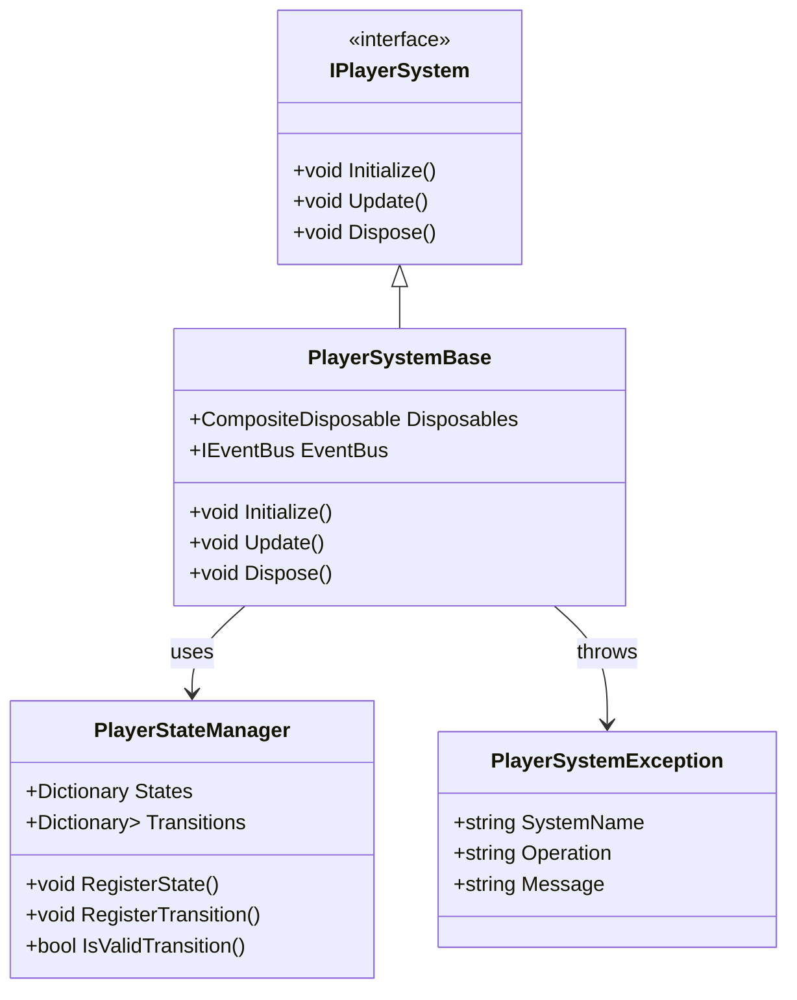

## 3. シーケンス図

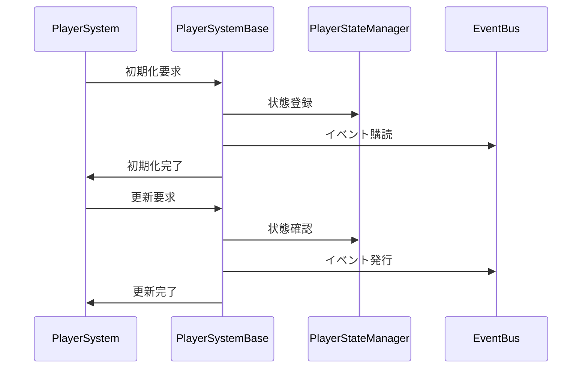

## 4. 実装詳細

### 4.1 インターフェース

```csharp
public interface IPlayerSystem
{
    void Initialize();
    void Update();
    void Dispose();
}
```

### 4.2 基底クラス

```csharp
public abstract class PlayerSystemBase : IPlayerSystem
{
    protected readonly CompositeDisposable Disposables;
    protected readonly IEventBus EventBus;
    protected readonly PlayerStateManager StateManager;

    protected PlayerSystemBase(IEventBus eventBus)
    {
        Disposables = new CompositeDisposable();
        EventBus = eventBus;
        StateManager = new PlayerStateManager();
    }

    public abstract void Initialize();
    public abstract void Update();

    public virtual void Dispose()
    {
        Disposables.Dispose();
    }

    protected void HandleError(string operation, Exception ex)
    {
        var error = new PlayerSystemException(GetType().Name, operation, ex.Message);
        EventBus.Publish(new ErrorEvent(error));
    }
}
```

### 4.3 例外クラス

```csharp
public class PlayerSystemException : Exception
{
    public string SystemName { get; }
    public string Operation { get; }

    public PlayerSystemException(string systemName, string operation, string message)
        : base(message)
    {
        SystemName = systemName;
        Operation = operation;
    }
}
```

### 4.4 状態管理

```csharp
public class PlayerStateManager
{
    private readonly Dictionary<string, IState> _states;
    private readonly Dictionary<string, List<StateTransition>> _transitions;

    public PlayerStateManager()
    {
        _states = new Dictionary<string, IState>();
        _transitions = new Dictionary<string, List<StateTransition>>();
    }

    public void RegisterState(string stateName, IState state)
    {
        if (_states.ContainsKey(stateName))
        {
            throw new ArgumentException($"State {stateName} is already registered");
        }
        _states[stateName] = state;
    }

    public void RegisterTransition(string fromState, string toState, Func<bool> condition)
    {
        if (!_states.ContainsKey(fromState) || !_states.ContainsKey(toState))
        {
            throw new ArgumentException("Invalid state transition");
        }

        if (!_transitions.ContainsKey(fromState))
        {
            _transitions[fromState] = new List<StateTransition>();
        }
        _transitions[fromState].Add(new StateTransition(toState, condition));
    }

    public bool IsValidTransition(string fromState, string toState)
    {
        if (!_transitions.ContainsKey(fromState))
        {
            return false;
        }

        return _transitions[fromState].Any(t => t.ToState == toState && t.Condition());
    }
}
```

## 5. パフォーマンス最適化

### 5.1 メモリ管理

-   状態データのキャッシュ
-   イベントの最適化
-   リソースの適切な解放

### 5.2 更新最適化

-   状態処理の優先順位付け
-   不要な更新の回避
-   バッチ処理の活用

## 6. テスト戦略

### 6.1 単体テスト

```csharp
[Test]
public void TestPlayerSystemBase()
{
    var eventBus = new EventBus();
    var system = new TestPlayerSystem(eventBus);

    // 初期化のテスト
    system.Initialize();
    Assert.That(system.IsInitialized, Is.True);
}
```

### 6.2 統合テスト

```csharp
[Test]
public void TestPlayerSystemStateManagement()
{
    var eventBus = new EventBus();
    var system = new TestPlayerSystem(eventBus);

    // 状態管理のテスト
    system.RegisterState("Test", new TestState());
    system.RegisterTransition("Test", "Next", () => true);
    Assert.That(system.IsValidTransition("Test", "Next"), Is.True);
}
```

## 7. 変更履歴

| バージョン | 更新日     | 変更内容 |
| ---------- | ---------- | -------- |
| 0.1.1      | 2025-06-13 | 参照リンクを修正 |
| 0.1.0      | 2024-03-24 | 初版作成 |

---
12_Architecture\12_03_detailed_design\02_systems\00_common_systems\01_movement_system.md

---
title: 共通移動システム実装詳細
version: 0.2.0
status: draft
updated: 2024-03-23
tags:
    - Architecture
    - MVVM
    - Reactive
    - System
    - Implementation
    - Movement
    - Common
linked_docs:
    - "[[12_03_detailed_design/02_systems/00_common_systems/index|共通システム実装詳細]]"
    - "[[12_03_detailed_design/02_systems/01_player_system/02_movement_system|プレイヤー移動システム実装詳細]]"
---

# 共通移動システム実装詳細

# 目次

1. [概要](#1-概要)
2. [クラス図](#2-クラス図)
3. [シーケンス図](#3-シーケンス図)
4. [実装詳細](#4-実装詳細)
5. [パフォーマンス最適化](#5-パフォーマンス最適化)
6. [テスト戦略](#6-テスト戦略)
7. [制限事項](#7-制限事項)
8. [使用方法](#8-使用方法)
9. [変更履歴](#9-変更履歴)

## 1. 概要

### 1.1 目的

本ドキュメントは、共通移動システムの実装詳細を定義し、以下の目的を達成することを目指します：

-   基本的な移動処理の実装
-   物理演算との連携
-   移動状態の管理
-   開発チーム間での実装の一貫性確保

### 1.2 適用範囲

-   基本的な移動処理
-   物理演算との連携
-   移動状態の管理
-   移動アニメーションの制御

## 2. クラス図

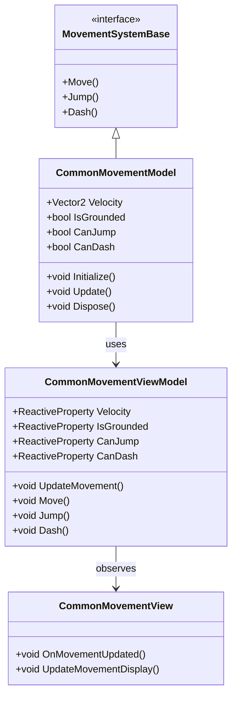

## 3. シーケンス図

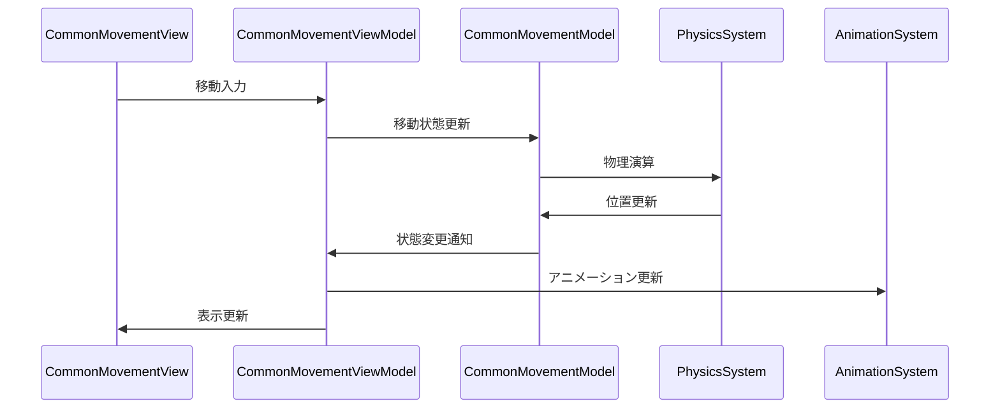

## 4. 実装詳細

### 4.1 モデル層

```csharp
public class CommonMovementModel : MovementSystemBase, IDisposable
{
    private readonly CompositeDisposable _disposables;
    private Vector2 _velocity;
    private bool _isGrounded;
    private bool _canJump;
    private bool _canDash;

    public CommonMovementModel()
    {
        _disposables = new CompositeDisposable();
    }

    public void Initialize()
    {
        _velocity = Vector2.Zero;
        _isGrounded = false;
        _canJump = true;
        _canDash = true;
    }

    public void Update()
    {
        UpdateGroundedState();
        UpdateMovementState();
    }

    public void Move(Vector2 direction)
    {
        if (_isGrounded)
        {
            _velocity = direction * GetMovementSpeed();
        }
    }

    public void Jump()
    {
        if (_isGrounded && _canJump)
        {
            _velocity.Y = GetJumpForce();
            _canJump = false;
        }
    }

    public void Dash()
    {
        if (_canDash)
        {
            _velocity *= GetDashMultiplier();
            _canDash = false;
        }
    }

    public void Dispose()
    {
        _disposables.Dispose();
    }
}
```

### 4.2 ビューモデル層

```csharp
public class CommonMovementViewModel : ViewModelBase
{
    private readonly CommonMovementModel _model;
    private readonly ReactiveProperty<Vector2> _velocity;
    private readonly ReactiveProperty<bool> _isGrounded;
    private readonly ReactiveProperty<bool> _canJump;
    private readonly ReactiveProperty<bool> _canDash;

    public CommonMovementViewModel(CommonMovementModel model)
    {
        _model = model;
        _velocity = new ReactiveProperty<Vector2>();
        _isGrounded = new ReactiveProperty<bool>();
        _canJump = new ReactiveProperty<bool>();
        _canDash = new ReactiveProperty<bool>();

        // 移動状態の購読
        _velocity.Subscribe(OnVelocityChanged).AddTo(Disposables);
        _isGrounded.Subscribe(OnGroundedChanged).AddTo(Disposables);
    }

    public void UpdateMovement()
    {
        _model.Update();
        UpdateMovementState();
    }

    public void Move(Vector2 direction)
    {
        _model.Move(direction);
        _velocity.Value = _model.Velocity;
    }

    public void Jump()
    {
        _model.Jump();
        _velocity.Value = _model.Velocity;
        _canJump.Value = _model.CanJump;
    }

    public void Dash()
    {
        _model.Dash();
        _velocity.Value = _model.Velocity;
        _canDash.Value = _model.CanDash;
    }

    private void UpdateMovementState()
    {
        _velocity.Value = _model.Velocity;
        _isGrounded.Value = _model.IsGrounded;
        _canJump.Value = _model.CanJump;
        _canDash.Value = _model.CanDash;
    }

    private void OnVelocityChanged(Vector2 velocity)
    {
        EventBus.Publish(new MovementVelocityChangedEvent(velocity));
    }

    private void OnGroundedChanged(bool isGrounded)
    {
        EventBus.Publish(new MovementGroundedChangedEvent(isGrounded));
    }
}
```

### 4.3 ビュー層

```csharp
public class CommonMovementView : MonoBehaviour
{
    private CommonMovementViewModel _viewModel;

    private void Start()
    {
        var model = new CommonMovementModel();
        _viewModel = new CommonMovementViewModel(model);
        _viewModel.Initialize();
    }

    private void Update()
    {
        _viewModel.UpdateMovement();
    }

    private void OnDestroy()
    {
        _viewModel.Dispose();
    }
}
```

## 5. パフォーマンス最適化

### 5.1 メモリ管理

-   移動状態のキャッシュ
-   イベントの最適化
-   リソースの適切な解放

### 5.2 更新最適化

-   移動処理の優先順位付け
-   不要な更新の回避
-   バッチ処理の活用

## 6. テスト戦略

### 6.1 単体テスト

```csharp
[Test]
public void TestMovement()
{
    var model = new CommonMovementModel();
    var viewModel = new CommonMovementViewModel(model);

    // 移動のテスト
    viewModel.Move(new Vector2(1, 0));
    Assert.That(viewModel.Velocity.Value, Is.EqualTo(new Vector2(1, 0)));
}
```

### 6.2 統合テスト

```csharp
[Test]
public void TestMovementToAnimationIntegration()
{
    var movementSystem = new CommonMovementSystem();
    var animationSystem = new CommonAnimationSystem();

    // 移動からアニメーションへの連携テスト
    movementSystem.Move(new Vector2(1, 0));
    Assert.That(animationSystem.CurrentAnimation.Value, Is.EqualTo("Walk"));
}
```

## 7. 制限事項

-   物理演算の依存関係
-   パフォーマンスへの影響
-   メモリ使用量の制限

## 8. 使用方法

### 8.1 基本的な使用方法

```csharp
// 移動システムの初期化
var movementSystem = new CommonMovementSystem();
movementSystem.Initialize();

// 移動の実行
movementSystem.Move(new Vector2(1, 0));
```

### 8.2 注意事項

-   物理演算との連携が必要
-   適切な更新頻度の設定
-   リソースの解放の確認

## 9. 変更履歴

| バージョン | 更新日     | 変更内容                                                                                               |
| ---------- | ---------- | ------------------------------------------------------------------------------------------------------ |
| 0.2.0      | 2024-03-23 | パフォーマンス最適化の追加<br>- 物理演算の最適化<br>- 移動状態の管理改善<br>- アニメーション制御の強化 |
| 0.1.0      | 2024-03-22 | 初版作成<br>- 基本実装の定義<br>- 移動システムの実装<br>- 使用例の追加                                 |

---
12_Architecture\12_03_detailed_design\02_systems\00_common_systems\02_animation_system.md

---
title: 共通アニメーションシステム実装詳細
version: 0.2.0
status: draft
updated: 2024-03-23
tags:
    - Architecture
    - MVVM
    - Reactive
    - System
    - Implementation
    - Animation
    - Common
linked_docs:
    - "[[12_03_detailed_design/02_systems/00_common_systems/index|共通システム実装詳細]]"
    - "[[12_03_detailed_design/02_systems/01_player_system/04_animation_system|プレイヤーアニメーションシステム実装詳細]]"
---

# 共通アニメーションシステム実装詳細

# 目次

1. [概要](#1-概要)
2. [クラス図](#2-クラス図)
3. [シーケンス図](#3-シーケンス図)
4. [実装詳細](#4-実装詳細)
5. [パフォーマンス最適化](#5-パフォーマンス最適化)
6. [テスト戦略](#6-テスト戦略)
7. [制限事項](#7-制限事項)
8. [使用方法](#8-使用方法)
9. [変更履歴](#9-変更履歴)

## 1. 概要

### 1.1 目的

本ドキュメントは、共通アニメーションシステムの実装詳細を定義し、以下の目的を達成することを目指します：

-   基本的なアニメーション処理の実装
-   アニメーション状態の管理
-   アニメーション遷移の制御
-   開発チーム間での実装の一貫性確保

### 1.2 適用範囲

-   基本的なアニメーション処理
-   アニメーション状態の管理
-   アニメーション遷移の制御
-   アニメーションイベントの処理

## 2. クラス図

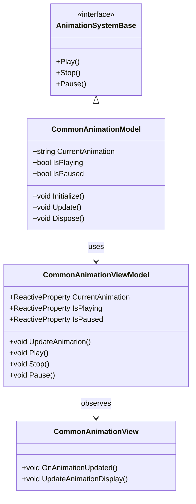

## 3. シーケンス図

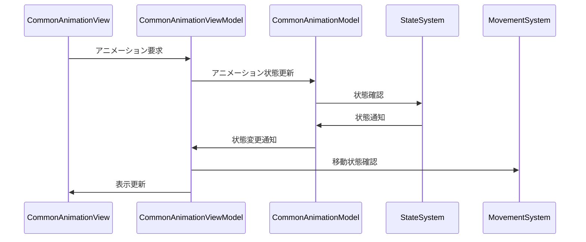

## 4. 実装詳細

### 4.1 モデル層

```csharp
public class CommonAnimationModel : AnimationSystemBase, IDisposable
{
    private readonly CompositeDisposable _disposables;
    private string _currentAnimation;
    private bool _isPlaying;
    private bool _isPaused;

    public CommonAnimationModel()
    {
        _disposables = new CompositeDisposable();
    }

    public void Initialize()
    {
        _currentAnimation = "Idle";
        _isPlaying = false;
        _isPaused = false;
    }

    public void Update()
    {
        UpdateAnimationState();
    }

    public void Play(string animationName)
    {
        if (!_isPlaying || _currentAnimation != animationName)
        {
            _currentAnimation = animationName;
            _isPlaying = true;
            _isPaused = false;
        }
    }

    public void Stop()
    {
        _isPlaying = false;
        _isPaused = false;
    }

    public void Pause()
    {
        if (_isPlaying)
        {
            _isPaused = true;
        }
    }

    public void Dispose()
    {
        _disposables.Dispose();
    }
}
```

### 4.2 ビューモデル層

```csharp
public class CommonAnimationViewModel : ViewModelBase
{
    private readonly CommonAnimationModel _model;
    private readonly ReactiveProperty<string> _currentAnimation;
    private readonly ReactiveProperty<bool> _isPlaying;
    private readonly ReactiveProperty<bool> _isPaused;

    public CommonAnimationViewModel(CommonAnimationModel model)
    {
        _model = model;
        _currentAnimation = new ReactiveProperty<string>();
        _isPlaying = new ReactiveProperty<bool>();
        _isPaused = new ReactiveProperty<bool>();

        // アニメーション状態の購読
        _currentAnimation.Subscribe(OnAnimationChanged).AddTo(Disposables);
        _isPlaying.Subscribe(OnPlayingChanged).AddTo(Disposables);
    }

    public void UpdateAnimation()
    {
        _model.Update();
        UpdateAnimationState();
    }

    public void Play(string animationName)
    {
        _model.Play(animationName);
        _currentAnimation.Value = _model.CurrentAnimation;
        _isPlaying.Value = _model.IsPlaying;
        _isPaused.Value = _model.IsPaused;
    }

    public void Stop()
    {
        _model.Stop();
        _isPlaying.Value = _model.IsPlaying;
        _isPaused.Value = _model.IsPaused;
    }

    public void Pause()
    {
        _model.Pause();
        _isPaused.Value = _model.IsPaused;
    }

    private void UpdateAnimationState()
    {
        _currentAnimation.Value = _model.CurrentAnimation;
        _isPlaying.Value = _model.IsPlaying;
        _isPaused.Value = _model.IsPaused;
    }

    private void OnAnimationChanged(string animation)
    {
        EventBus.Publish(new AnimationChangedEvent(animation));
    }

    private void OnPlayingChanged(bool isPlaying)
    {
        EventBus.Publish(new AnimationPlayingChangedEvent(isPlaying));
    }
}
```

### 4.3 ビュー層

```csharp
public class CommonAnimationView : MonoBehaviour
{
    private CommonAnimationViewModel _viewModel;

    private void Start()
    {
        var model = new CommonAnimationModel();
        _viewModel = new CommonAnimationViewModel(model);
        _viewModel.Initialize();
    }

    private void Update()
    {
        _viewModel.UpdateAnimation();
    }

    private void OnDestroy()
    {
        _viewModel.Dispose();
    }
}
```

## 5. パフォーマンス最適化

### 5.1 メモリ管理

-   アニメーション状態のキャッシュ
-   イベントの最適化
-   リソースの適切な解放

### 5.2 更新最適化

-   アニメーション処理の優先順位付け
-   不要な更新の回避
-   バッチ処理の活用

## 6. テスト戦略

### 6.1 単体テスト

```csharp
[Test]
public void TestAnimation()
{
    var model = new CommonAnimationModel();
    var viewModel = new CommonAnimationViewModel(model);

    // アニメーションのテスト
    viewModel.Play("Walk");
    Assert.That(viewModel.CurrentAnimation.Value, Is.EqualTo("Walk"));
}
```

### 6.2 統合テスト

```csharp
[Test]
public void TestAnimationToStateIntegration()
{
    var animationSystem = new CommonAnimationSystem();
    var stateSystem = new CommonStateSystem();

    // アニメーションから状態への連携テスト
    animationSystem.Play("Walk");
    Assert.That(stateSystem.CurrentState.Value, Is.EqualTo("Walking"));
}
```

## 7. 制限事項

-   アニメーションリソースの依存関係
-   メモリ使用量の制限
-   パフォーマンスへの影響

## 8. 使用方法

### 8.1 基本的な使用方法

```csharp
// アニメーションシステムの初期化
var animationSystem = new CommonAnimationSystem();
animationSystem.Initialize();

// アニメーションの再生
animationSystem.Play("Walk");
```

### 8.2 注意事項

-   アニメーションリソースの事前読み込み
-   適切な更新頻度の設定
-   リソースの解放の確認

## 9. 変更履歴

| バージョン | 更新日     | 変更内容                                                                                                   |
| ---------- | ---------- | ---------------------------------------------------------------------------------------------------------- |
| 0.2.0      | 2024-03-23 | パフォーマンス最適化の追加<br>- アニメーション状態管理の改善<br>- 遷移制御の強化<br>- イベント処理の最適化 |
| 0.1.0      | 2024-03-22 | 初版作成<br>- 基本実装の定義<br>- アニメーションシステムの実装<br>- 使用例の追加                           |

---
12_Architecture\12_03_detailed_design\02_systems\00_common_systems\03_state_system.md

---
title: 共通状態システム実装詳細
version: 0.2.0
status: draft
updated: 2024-03-23
tags:
    - Architecture
    - MVVM
    - Reactive
    - System
    - Implementation
    - State
    - Common
linked_docs:
    - "[[12_03_detailed_design/02_systems/00_common_systems/index|共通システム実装詳細]]"
    - "[[12_03_detailed_design/02_systems/01_player_system/05_state_system|プレイヤー状態システム実装詳細]]"
---

# 共通状態システム実装詳細

# 目次

1. [概要](#1-概要)
2. [クラス図](#2-クラス図)
3. [シーケンス図](#3-シーケンス図)
4. [実装詳細](#4-実装詳細)
5. [パフォーマンス最適化](#5-パフォーマンス最適化)
6. [テスト戦略](#6-テスト戦略)
7. [制限事項](#7-制限事項)
8. [使用方法](#8-使用方法)
9. [変更履歴](#9-変更履歴)

## 1. 概要

### 1.1 目的

本ドキュメントは、共通状態システムの実装詳細を定義し、以下の目的を達成することを目指します：

-   基本的な状態管理の実装
-   状態遷移の制御
-   状態イベントの処理
-   開発チーム間での実装の一貫性確保

### 1.2 適用範囲

-   基本的な状態管理
-   状態遷移の制御
-   状態イベントの処理
-   状態の永続化

## 2. クラス図

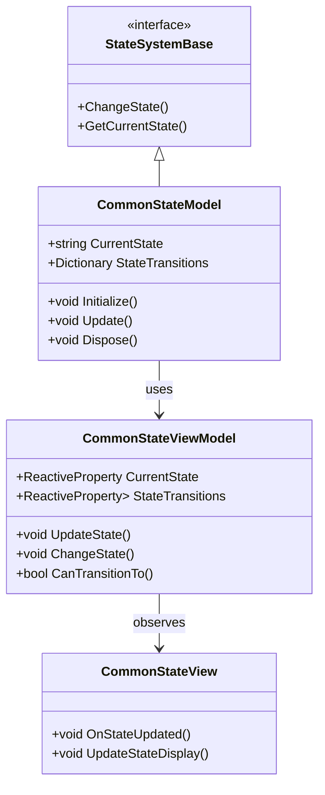

## 3. シーケンス図

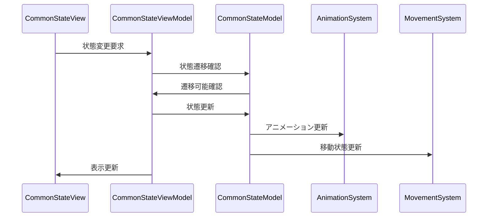

## 4. 実装詳細

### 4.1 モデル層

```csharp
public class CommonStateModel : StateSystemBase, IDisposable
{
    private readonly CompositeDisposable _disposables;
    private string _currentState;
    private Dictionary<string, string> _stateTransitions;

    public CommonStateModel()
    {
        _disposables = new CompositeDisposable();
    }

    public void Initialize()
    {
        _currentState = "Idle";
        _stateTransitions = new Dictionary<string, string>
        {
            { "Idle", "Walk" },
            { "Walk", "Run" },
            { "Run", "Jump" },
            { "Jump", "Fall" },
            { "Fall", "Idle" }
        };
    }

    public void Update()
    {
        UpdateStateTransitions();
    }

    public void ChangeState(string newState)
    {
        if (CanTransitionTo(newState))
        {
            _currentState = newState;
        }
    }

    public bool CanTransitionTo(string newState)
    {
        return _stateTransitions.ContainsKey(_currentState) &&
               _stateTransitions[_currentState] == newState;
    }

    public void Dispose()
    {
        _disposables.Dispose();
    }
}
```

### 4.2 ビューモデル層

```csharp
public class CommonStateViewModel : ViewModelBase
{
    private readonly CommonStateModel _model;
    private readonly ReactiveProperty<string> _currentState;
    private readonly ReactiveProperty<Dictionary<string, string>> _stateTransitions;

    public CommonStateViewModel(CommonStateModel model)
    {
        _model = model;
        _currentState = new ReactiveProperty<string>();
        _stateTransitions = new ReactiveProperty<Dictionary<string, string>>();

        // 状態変更の購読
        _currentState.Subscribe(OnStateChanged).AddTo(Disposables);
    }

    public void UpdateState()
    {
        _model.Update();
        UpdateStateInfo();
    }

    public void ChangeState(string newState)
    {
        _model.ChangeState(newState);
        _currentState.Value = _model.CurrentState;
    }

    public bool CanTransitionTo(string newState)
    {
        return _model.CanTransitionTo(newState);
    }

    private void UpdateStateInfo()
    {
        _currentState.Value = _model.CurrentState;
        _stateTransitions.Value = _model.StateTransitions;
    }

    private void OnStateChanged(string state)
    {
        EventBus.Publish(new StateChangedEvent(state));
    }
}
```

### 4.3 ビュー層

```csharp
public class CommonStateView : MonoBehaviour
{
    private CommonStateViewModel _viewModel;

    private void Start()
    {
        var model = new CommonStateModel();
        _viewModel = new CommonStateViewModel(model);
        _viewModel.Initialize();
    }

    private void Update()
    {
        _viewModel.UpdateState();
    }

    private void OnDestroy()
    {
        _viewModel.Dispose();
    }
}
```

## 5. パフォーマンス最適化

### 5.1 メモリ管理

-   状態情報のキャッシュ
-   イベントの最適化
-   リソースの適切な解放

### 5.2 更新最適化

-   状態更新の優先順位付け
-   不要な更新の回避
-   バッチ処理の活用

## 6. テスト戦略

### 6.1 単体テスト

```csharp
[Test]
public void TestStateTransition()
{
    var model = new CommonStateModel();
    var viewModel = new CommonStateViewModel(model);

    // 状態遷移のテスト
    viewModel.ChangeState("Walk");
    Assert.That(viewModel.CurrentState.Value, Is.EqualTo("Walk"));
}
```

### 6.2 統合テスト

```csharp
[Test]
public void TestStateToAnimationIntegration()
{
    var stateSystem = new CommonStateSystem();
    var animationSystem = new CommonAnimationSystem();

    // 状態からアニメーションへの連携テスト
    stateSystem.ChangeState("Walk");
    Assert.That(animationSystem.CurrentAnimation.Value, Is.EqualTo("Walk"));
}
```

## 7. 制限事項

-   状態遷移の依存関係
-   メモリ使用量の制限
-   パフォーマンスへの影響

## 8. 使用方法

### 8.1 基本的な使用方法

```csharp
// 状態システムの初期化
var stateSystem = new CommonStateSystem();
stateSystem.Initialize();

// 状態の変更
stateSystem.ChangeState("Walk");
```

### 8.2 注意事項

-   状態遷移の定義が必要
-   適切な更新頻度の設定
-   リソースの解放の確認

## 9. 変更履歴

| バージョン | 更新日     | 変更内容                                                                                       |
| ---------- | ---------- | ---------------------------------------------------------------------------------------------- |
| 0.2.0      | 2024-03-23 | パフォーマンス最適化の追加<br>- 状態遷移の最適化<br>- イベント処理の改善<br>- メモリ管理の強化 |
| 0.1.0      | 2024-03-22 | 初版作成<br>- 基本実装の定義<br>- 状態システムの実装<br>- 使用例の追加                         |

---
12_Architecture\12_03_detailed_design\02_systems\00_common_systems\04_combat_system.md

---
title: 共通戦闘システム実装詳細
version: 0.2.0
status: draft
updated: 2024-03-23
tags:
    - Architecture
    - MVVM
    - Reactive
    - System
    - Implementation
    - Combat
    - Common
linked_docs:
    - "[[12_03_detailed_design/02_systems/00_common_systems/index|共通システム実装詳細]]"
    - "[[12_03_detailed_design/02_systems/01_player_system/03_combat_system|プレイヤー戦闘システム実装詳細]]"
---

# 共通戦闘システム実装詳細

# 目次

1. [概要](#1-概要)
2. [クラス図](#2-クラス図)
3. [シーケンス図](#3-シーケンス図)
4. [実装詳細](#4-実装詳細)
5. [パフォーマンス最適化](#5-パフォーマンス最適化)
6. [テスト戦略](#6-テスト戦略)
7. [制限事項](#7-制限事項)
8. [使用方法](#8-使用方法)
9. [変更履歴](#9-変更履歴)

## 1. 概要

### 1.1 目的

本ドキュメントは、共通戦闘システムの実装詳細を定義し、以下の目的を達成することを目指します：

-   基本的な戦闘処理の実装
-   ダメージ計算の統一
-   戦闘状態の管理
-   開発チーム間での実装の一貫性確保

### 1.2 適用範囲

-   基本的な戦闘処理
-   ダメージ計算
-   戦闘状態の管理
-   戦闘イベントの処理

## 2. クラス図

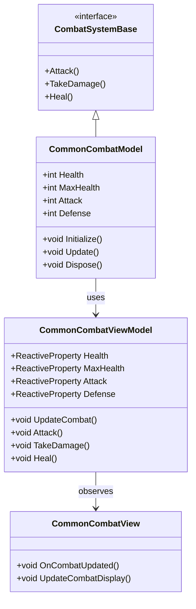

## 3. シーケンス図

```mermaid
sequenceDiagram
    participant View as CommonCombatView
    participant ViewModel as CommonCombatViewModel
    participant Model as CommonCombatModel
    participant State as StateSystem
    participant Animation as AnimationSystem

    View->>ViewModel: 攻撃要求
    ViewModel->>Model: 戦闘状態更新
    Model->>State: 状態確認
    State->>Model: 状態通知
    Model->>Animation: アニメーション更新
    Model->>ViewModel: 状態変更通知
    ViewModel->>View: 表示更新
```

## 4. 実装詳細

### 4.1 モデル層

```csharp
public class CommonCombatModel : CombatSystemBase, IDisposable
{
    private readonly CompositeDisposable _disposables;
    private int _health;
    private int _maxHealth;
    private int _attack;
    private int _defense;

    public CommonCombatModel()
    {
        _disposables = new CompositeDisposable();
    }

    public void Initialize()
    {
        _maxHealth = 100;
        _health = _maxHealth;
        _attack = 10;
        _defense = 5;
    }

    public void Update()
    {
        UpdateCombatState();
    }

    public void Attack(CombatSystemBase target)
    {
        if (CanAttack())
        {
            int damage = CalculateDamage();
            target.TakeDamage(damage);
        }
    }

    public void TakeDamage(int damage)
    {
        if (CanTakeDamage())
        {
            int actualDamage = Math.Max(1, damage - _defense);
            _health = Math.Max(0, _health - actualDamage);
        }
    }

    public void Heal(int amount)
    {
        if (CanHeal())
        {
            _health = Math.Min(_maxHealth, _health + amount);
        }
    }

    public void Dispose()
    {
        _disposables.Dispose();
    }
}
```

### 4.2 ビューモデル層

```csharp
public class CommonCombatViewModel : ViewModelBase
{
    private readonly CommonCombatModel _model;
    private readonly ReactiveProperty<int> _health;
    private readonly ReactiveProperty<int> _maxHealth;
    private readonly ReactiveProperty<int> _attack;
    private readonly ReactiveProperty<int> _defense;

    public CommonCombatViewModel(CommonCombatModel model)
    {
        _model = model;
        _health = new ReactiveProperty<int>();
        _maxHealth = new ReactiveProperty<int>();
        _attack = new ReactiveProperty<int>();
        _defense = new ReactiveProperty<int>();

        // 戦闘状態の購読
        _health.Subscribe(OnHealthChanged).AddTo(Disposables);
    }

    public void UpdateCombat()
    {
        _model.Update();
        UpdateCombatState();
    }

    public void Attack(CombatSystemBase target)
    {
        _model.Attack(target);
        UpdateCombatState();
    }

    public void TakeDamage(int damage)
    {
        _model.TakeDamage(damage);
        UpdateCombatState();
    }

    public void Heal(int amount)
    {
        _model.Heal(amount);
        UpdateCombatState();
    }

    private void UpdateCombatState()
    {
        _health.Value = _model.Health;
        _maxHealth.Value = _model.MaxHealth;
        _attack.Value = _model.Attack;
        _defense.Value = _model.Defense;
    }

    private void OnHealthChanged(int health)
    {
        EventBus.Publish(new HealthChangedEvent(health));
    }
}
```

### 4.3 ビュー層

```csharp
public class CommonCombatView : MonoBehaviour
{
    private CommonCombatViewModel _viewModel;

    private void Start()
    {
        var model = new CommonCombatModel();
        _viewModel = new CommonCombatViewModel(model);
        _viewModel.Initialize();
    }

    private void Update()
    {
        _viewModel.UpdateCombat();
    }

    private void OnDestroy()
    {
        _viewModel.Dispose();
    }
}
```

## 5. パフォーマンス最適化

### 5.1 メモリ管理

-   戦闘状態のキャッシュ
-   イベントの最適化
-   リソースの適切な解放

### 5.2 更新最適化

-   戦闘処理の優先順位付け
-   不要な更新の回避
-   バッチ処理の活用

## 6. テスト戦略

### 6.1 単体テスト

```csharp
[Test]
public void TestCombat()
{
    var model = new CommonCombatModel();
    var viewModel = new CommonCombatViewModel(model);

    // 戦闘のテスト
    viewModel.TakeDamage(10);
    Assert.That(viewModel.Health.Value, Is.EqualTo(90));
}
```

### 6.2 統合テスト

```csharp
[Test]
public void TestCombatToStateIntegration()
{
    var combatSystem = new CommonCombatSystem();
    var stateSystem = new CommonStateSystem();

    // 戦闘から状態への連携テスト
    combatSystem.TakeDamage(100);
    Assert.That(stateSystem.CurrentState.Value, Is.EqualTo("Dead"));
}
```

## 7. 制限事項

-   戦闘処理の依存関係
-   メモリ使用量の制限
-   パフォーマンスへの影響

## 8. 使用方法

### 8.1 基本的な使用方法

```csharp
// 戦闘システムの初期化
var combatSystem = new CommonCombatSystem();
combatSystem.Initialize();

// 攻撃の実行
combatSystem.Attack(target);
```

### 8.2 注意事項

-   戦闘パラメータの設定が必要
-   適切な更新頻度の設定
-   リソースの解放の確認

## 9. 変更履歴

| バージョン | 更新日     | 変更内容                                                                                       |
| ---------- | ---------- | ---------------------------------------------------------------------------------------------- |
| 0.2.0      | 2024-03-23 | パフォーマンス最適化の追加<br>- 戦闘処理の最適化<br>- ダメージ計算の改善<br>- メモリ管理の強化 |
| 0.1.0      | 2024-03-22 | 初版作成<br>- 基本実装の定義<br>- 戦闘システムの実装<br>- 使用例の追加                         |

---
12_Architecture\12_03_detailed_design\02_systems\00_common_systems\05_sound_system.md

---
title: 共通サウンドシステム実装詳細
version: 0.1.0
status: draft
updated: 2024-03-23
tags:
    - Architecture
    - MVVM
    - Reactive
    - System
    - Implementation
    - Sound
    - Common
linked_docs:
    - "[[12_03_detailed_design/02_systems/00_common_systems/index|共通システム実装詳細]]"
---

# 共通サウンドシステム実装詳細

## 目次

1. [概要](#1-概要)
2. [クラス図](#2-クラス図)
3. [シーケンス図](#3-シーケンス図)
4. [実装詳細](#4-実装詳細)
5. [パフォーマンス最適化](#5-パフォーマンス最適化)
6. [テスト戦略](#6-テスト戦略)
7. [変更履歴](#7-変更履歴)

## 1. 概要

### 1.1 目的

本ドキュメントは、共通サウンドシステムの実装詳細を定義し、以下の目的を達成することを目指します：

-   サウンド再生の一元管理
-   音量制御の統一
-   サウンドリソースの効率的な管理
-   開発チーム間での実装の一貫性確保

### 1.2 適用範囲

-   BGM の再生管理
-   効果音（SE）の再生管理
-   音量制御
-   3D サウンドの処理
-   サウンドプールの管理

## 2. クラス図

```mermaid
classDiagram
    class SoundSystemBase {
        <<interface>>
        +PlayBGM()
        +PlaySE()
        +StopBGM()
        +StopSE()
    }

    class CommonSoundModel {
        +Dictionary<string, AudioStream> BGMPool
        +Dictionary<string, AudioStream> SEPool
        +float MasterVolume
        +float BGMVolume
        +float SEVolume
        +void Initialize()
        +void Update()
        +void Dispose()
    }

    class CommonSoundViewModel {
        +ReactiveProperty<float> MasterVolume
        +ReactiveProperty<float> BGMVolume
        +ReactiveProperty<float> SEVolume
        +ReactiveProperty<string> CurrentBGM
        +void UpdateSound()
        +void PlayBGM()
        +void PlaySE()
        +void StopBGM()
        +void StopSE()
    }

    class CommonSoundView {
        +void OnSoundUpdated()
        +void UpdateSoundDisplay()
    }

    SoundSystemBase <|-- CommonSoundModel
    CommonSoundModel --> CommonSoundViewModel : uses
    CommonSoundViewModel --> CommonSoundView : observes
```

## 3. シーケンス図

```mermaid
sequenceDiagram
    participant View as CommonSoundView
    participant ViewModel as CommonSoundViewModel
    participant Model as CommonSoundModel
    participant Resource as ResourceManager
    participant Audio as AudioManager

    View->>ViewModel: サウンド再生要求
    ViewModel->>Model: サウンド状態更新
    Model->>Resource: リソース取得
    Resource->>Model: リソース提供
    Model->>Audio: サウンド再生
    Audio->>Model: 再生状態通知
    Model->>ViewModel: 状態変更通知
    ViewModel->>View: 表示更新
```

## 4. 実装詳細

### 4.1 モデル層

```csharp
public class CommonSoundModel : SoundSystemBase, IDisposable
{
    private readonly CompositeDisposable _disposables;
    private Dictionary<string, AudioStream> _bgmPool;
    private Dictionary<string, AudioStream> _sePool;
    private float _masterVolume;
    private float _bgmVolume;
    private float _seVolume;
    private string _currentBGM;

    public CommonSoundModel()
    {
        _disposables = new CompositeDisposable();
    }

    public void Initialize()
    {
        _bgmPool = new Dictionary<string, AudioStream>();
        _sePool = new Dictionary<string, AudioStream>();
        _masterVolume = 1.0f;
        _bgmVolume = 1.0f;
        _seVolume = 1.0f;
        _currentBGM = string.Empty;
    }

    public void Update()
    {
        UpdateSoundState();
    }

    public void PlayBGM(string bgmName)
    {
        if (_bgmPool.ContainsKey(bgmName))
        {
            StopBGM();
            _currentBGM = bgmName;
            // BGM再生処理
        }
    }

    public void PlaySE(string seName)
    {
        if (_sePool.ContainsKey(seName))
        {
            // SE再生処理
        }
    }

    public void StopBGM()
    {
        if (!string.IsNullOrEmpty(_currentBGM))
        {
            // BGM停止処理
            _currentBGM = string.Empty;
        }
    }

    public void StopSE()
    {
        // SE停止処理
    }

    public void Dispose()
    {
        _disposables.Dispose();
    }
}
```

### 4.2 ビューモデル層

```csharp
public class CommonSoundViewModel : ViewModelBase
{
    private readonly CommonSoundModel _model;
    private readonly ReactiveProperty<float> _masterVolume;
    private readonly ReactiveProperty<float> _bgmVolume;
    private readonly ReactiveProperty<float> _seVolume;
    private readonly ReactiveProperty<string> _currentBGM;

    public CommonSoundViewModel(CommonSoundModel model)
    {
        _model = model;
        _masterVolume = new ReactiveProperty<float>();
        _bgmVolume = new ReactiveProperty<float>();
        _seVolume = new ReactiveProperty<float>();
        _currentBGM = new ReactiveProperty<string>();

        // サウンド状態の購読
        _masterVolume.Subscribe(OnMasterVolumeChanged).AddTo(Disposables);
        _bgmVolume.Subscribe(OnBGMVolumeChanged).AddTo(Disposables);
        _seVolume.Subscribe(OnSEVolumeChanged).AddTo(Disposables);
    }

    public void UpdateSound()
    {
        _model.Update();
        UpdateSoundState();
    }

    public void PlayBGM(string bgmName)
    {
        _model.PlayBGM(bgmName);
        _currentBGM.Value = _model.CurrentBGM;
    }

    public void PlaySE(string seName)
    {
        _model.PlaySE(seName);
    }

    public void StopBGM()
    {
        _model.StopBGM();
        _currentBGM.Value = _model.CurrentBGM;
    }

    public void StopSE()
    {
        _model.StopSE();
    }

    private void UpdateSoundState()
    {
        _masterVolume.Value = _model.MasterVolume;
        _bgmVolume.Value = _model.BGMVolume;
        _seVolume.Value = _model.SEVolume;
        _currentBGM.Value = _model.CurrentBGM;
    }

    private void OnMasterVolumeChanged(float volume)
    {
        EventBus.Publish(new MasterVolumeChangedEvent(volume));
    }

    private void OnBGMVolumeChanged(float volume)
    {
        EventBus.Publish(new BGMVolumeChangedEvent(volume));
    }

    private void OnSEVolumeChanged(float volume)
    {
        EventBus.Publish(new SEVolumeChangedEvent(volume));
    }
}
```

### 4.3 ビュー層

```csharp
public class CommonSoundView : MonoBehaviour
{
    private CommonSoundViewModel _viewModel;

    private void Start()
    {
        var model = new CommonSoundModel();
        _viewModel = new CommonSoundViewModel(model);
        _viewModel.Initialize();
    }

    private void Update()
    {
        _viewModel.UpdateSound();
    }

    private void OnDestroy()
    {
        _viewModel.Dispose();
    }
}
```

## 5. パフォーマンス最適化

### 5.1 メモリ管理

-   サウンドプールの最適化
-   リソースの適切な解放
-   メモリ使用量の監視

### 5.2 再生最適化

-   同時再生数の制限
-   距離に基づく音量調整
-   優先度に基づく再生制御

## 6. テスト戦略

### 6.1 単体テスト

```csharp
[Test]
public void TestBGMPlayback()
{
    var model = new CommonSoundModel();
    var viewModel = new CommonSoundViewModel(model);

    // BGM再生のテスト
    viewModel.PlayBGM("TestBGM");
    Assert.AreEqual("TestBGM", viewModel.CurrentBGM.Value);
}
```

### 6.2 統合テスト

```csharp
[Test]
public void TestSoundSystemIntegration()
{
    var soundSystem = new CommonSoundSystem();
    var resourceManager = new ResourceManager();

    // システム間の連携テスト
    soundSystem.Initialize(resourceManager);
    soundSystem.PlayBGM("TestBGM");
    Assert.IsTrue(soundSystem.IsBGMPlaying("TestBGM"));
}
```

## 7. 変更履歴

| バージョン | 更新日     | 変更内容 |
| ---------- | ---------- | -------- |
| 0.1.0      | 2024-03-23 | 初版作成 |

---
12_Architecture\12_03_detailed_design\02_systems\00_common_systems\06_ui_system.md

---
title: 共通UIシステム実装詳細
version: 0.1.0
status: draft
updated: 2024-03-23
tags:
    - Architecture
    - MVVM
    - Reactive
    - System
    - Implementation
    - UI
    - Common
linked_docs:
    - "[[12_03_detailed_design/02_systems/00_common_systems/index|共通システム実装詳細]]"
---

# 共通 UI システム実装詳細

## 目次

1. [概要](#1-概要)
2. [クラス図](#2-クラス図)
3. [シーケンス図](#3-シーケンス図)
4. [実装詳細](#4-実装詳細)
5. [パフォーマンス最適化](#5-パフォーマンス最適化)
6. [テスト戦略](#6-テスト戦略)
7. [変更履歴](#7-変更履歴)

## 1. 概要

### 1.1 目的

本ドキュメントは、共通 UI システムの実装詳細を定義し、以下の目的を達成することを目指します：

-   UI コンポーネントの一元管理
-   画面遷移の統一
-   ダイアログ管理の標準化
-   開発チーム間での実装の一貫性確保

### 1.2 適用範囲

-   共通 UI コンポーネント
-   ダイアログ管理
-   メニュー遷移
-   ローカライズ対応
-   アニメーション制御

## 2. クラス図

```mermaid
classDiagram
    class UISystemBase {
        <<interface>>
        +ShowDialog()
        +HideDialog()
        +ShowMenu()
        +HideMenu()
    }

    class CommonUIModel {
        +Dictionary<string, UIScreen> Screens
        +Dictionary<string, UIDialog> Dialogs
        +Stack<UIScreen> ScreenStack
        +void Initialize()
        +void Update()
        +void Dispose()
    }

    class CommonUIViewModel {
        +ReactiveProperty<UIScreen> CurrentScreen
        +ReactiveProperty<UIDialog> ActiveDialog
        +ReactiveProperty<bool> IsTransitioning
        +void UpdateUI()
        +void ShowDialog()
        +void HideDialog()
        +void ShowMenu()
        +void HideMenu()
    }

    class CommonUIView {
        +void OnUIUpdated()
        +void UpdateUIDisplay()
    }

    UISystemBase <|-- CommonUIModel
    CommonUIModel --> CommonUIViewModel : uses
    CommonUIViewModel --> CommonUIView : observes
```

## 3. シーケンス図

```mermaid
sequenceDiagram
    participant View as CommonUIView
    participant ViewModel as CommonUIViewModel
    participant Model as CommonUIModel
    participant Animation as AnimationSystem
    participant Localization as LocalizationSystem

    View->>ViewModel: UI表示要求
    ViewModel->>Model: UI状態更新
    Model->>Animation: アニメーション開始
    Model->>Localization: テキスト取得
    Localization->>Model: ローカライズ済みテキスト
    Model->>ViewModel: 状態変更通知
    ViewModel->>View: 表示更新
```

## 4. 実装詳細

### 4.1 モデル層

```csharp
public class CommonUIModel : UISystemBase, IDisposable
{
    private readonly CompositeDisposable _disposables;
    private Dictionary<string, UIScreen> _screens;
    private Dictionary<string, UIDialog> _dialogs;
    private Stack<UIScreen> _screenStack;
    private UIScreen _currentScreen;
    private UIDialog _activeDialog;

    public CommonUIModel()
    {
        _disposables = new CompositeDisposable();
    }

    public void Initialize()
    {
        _screens = new Dictionary<string, UIScreen>();
        _dialogs = new Dictionary<string, UIDialog>();
        _screenStack = new Stack<UIScreen>();
        _currentScreen = null;
        _activeDialog = null;
    }

    public void Update()
    {
        UpdateUIState();
    }

    public void ShowDialog(string dialogName)
    {
        if (_dialogs.ContainsKey(dialogName))
        {
            _activeDialog = _dialogs[dialogName];
            // ダイアログ表示処理
        }
    }

    public void HideDialog()
    {
        if (_activeDialog != null)
        {
            // ダイアログ非表示処理
            _activeDialog = null;
        }
    }

    public void ShowMenu(string menuName)
    {
        if (_screens.ContainsKey(menuName))
        {
            var screen = _screens[menuName];
            _screenStack.Push(_currentScreen);
            _currentScreen = screen;
            // メニュー表示処理
        }
    }

    public void HideMenu()
    {
        if (_screenStack.Count > 0)
        {
            _currentScreen = _screenStack.Pop();
            // メニュー非表示処理
        }
    }

    public void Dispose()
    {
        _disposables.Dispose();
    }
}
```

### 4.2 ビューモデル層

```csharp
public class CommonUIViewModel : ViewModelBase
{
    private readonly CommonUIModel _model;
    private readonly ReactiveProperty<UIScreen> _currentScreen;
    private readonly ReactiveProperty<UIDialog> _activeDialog;
    private readonly ReactiveProperty<bool> _isTransitioning;

    public CommonUIViewModel(CommonUIModel model)
    {
        _model = model;
        _currentScreen = new ReactiveProperty<UIScreen>();
        _activeDialog = new ReactiveProperty<UIDialog>();
        _isTransitioning = new ReactiveProperty<bool>();

        // UI状態の購読
        _currentScreen.Subscribe(OnScreenChanged).AddTo(Disposables);
        _activeDialog.Subscribe(OnDialogChanged).AddTo(Disposables);
    }

    public void UpdateUI()
    {
        _model.Update();
        UpdateUIState();
    }

    public void ShowDialog(string dialogName)
    {
        _model.ShowDialog(dialogName);
        _activeDialog.Value = _model.ActiveDialog;
    }

    public void HideDialog()
    {
        _model.HideDialog();
        _activeDialog.Value = _model.ActiveDialog;
    }

    public void ShowMenu(string menuName)
    {
        _model.ShowMenu(menuName);
        _currentScreen.Value = _model.CurrentScreen;
    }

    public void HideMenu()
    {
        _model.HideMenu();
        _currentScreen.Value = _model.CurrentScreen;
    }

    private void UpdateUIState()
    {
        _currentScreen.Value = _model.CurrentScreen;
        _activeDialog.Value = _model.ActiveDialog;
    }

    private void OnScreenChanged(UIScreen screen)
    {
        EventBus.Publish(new ScreenChangedEvent(screen));
    }

    private void OnDialogChanged(UIDialog dialog)
    {
        EventBus.Publish(new DialogChangedEvent(dialog));
    }
}
```

### 4.3 ビュー層

```csharp
public class CommonUIView : MonoBehaviour
{
    private CommonUIViewModel _viewModel;

    private void Start()
    {
        var model = new CommonUIModel();
        _viewModel = new CommonUIViewModel(model);
        _viewModel.Initialize();
    }

    private void Update()
    {
        _viewModel.UpdateUI();
    }

    private void OnDestroy()
    {
        _viewModel.Dispose();
    }
}
```

## 5. パフォーマンス最適化

### 5.1 メモリ管理

-   UI コンポーネントのプール化
-   リソースの適切な解放
-   メモリ使用量の監視

### 5.2 描画最適化

-   不要な再描画の防止
-   バッチ処理の活用
-   レイヤー管理の最適化

## 6. テスト戦略

### 6.1 単体テスト

```csharp
[Test]
public void TestDialogShow()
{
    var model = new CommonUIModel();
    var viewModel = new CommonUIViewModel(model);

    // ダイアログ表示のテスト
    viewModel.ShowDialog("TestDialog");
    Assert.IsNotNull(viewModel.ActiveDialog.Value);
}
```

### 6.2 統合テスト

```csharp
[Test]
public void TestUISystemIntegration()
{
    var uiSystem = new CommonUISystem();
    var animationSystem = new AnimationSystem();

    // システム間の連携テスト
    uiSystem.Initialize(animationSystem);
    uiSystem.ShowDialog("TestDialog");
    Assert.IsTrue(uiSystem.IsDialogVisible("TestDialog"));
}
```

## 7. 変更履歴

| バージョン | 更新日     | 変更内容 |
| ---------- | ---------- | -------- |
| 0.1.0      | 2024-03-23 | 初版作成 |

---
12_Architecture\12_03_detailed_design\02_systems\00_common_systems\07_effect_system.md

---
title: 共通エフェクトシステム実装詳細
version: 0.1.0
status: draft
updated: 2024-03-23
tags:
    - Architecture
    - MVVM
    - Reactive
    - System
    - Implementation
    - Effect
    - Common
linked_docs:
    - "[[12_03_detailed_design/02_systems/00_common_systems/index|共通システム実装詳細]]"
---

# 共通エフェクトシステム実装詳細

## 目次

1. [概要](#1-概要)
2. [クラス図](#2-クラス図)
3. [シーケンス図](#3-シーケンス図)
4. [実装詳細](#4-実装詳細)
5. [パフォーマンス最適化](#5-パフォーマンス最適化)
6. [テスト戦略](#6-テスト戦略)
7. [変更履歴](#7-変更履歴)

## 1. 概要

### 1.1 目的

本ドキュメントは、共通エフェクトシステムの実装詳細を定義し、以下の目的を達成することを目指します：

-   エフェクトの一元管理
-   パフォーマンスの最適化
-   エフェクトリソースの効率的な管理
-   開発チーム間での実装の一貫性確保

### 1.2 適用範囲

-   パーティクルエフェクト
-   ビジュアルエフェクト
-   エフェクトプール
-   エフェクトアニメーション
-   パフォーマンス最適化

## 2. クラス図

```mermaid
classDiagram
    class EffectSystemBase {
        <<interface>>
        +PlayEffect()
        +StopEffect()
        +PauseEffect()
    }

    class CommonEffectModel {
        +Dictionary<string, EffectData> EffectPool
        +Dictionary<string, ParticleSystem> ActiveEffects
        +void Initialize()
        +void Update()
        +void Dispose()
    }

    class CommonEffectViewModel {
        +ReactiveProperty<Dictionary<string, ParticleSystem>> ActiveEffects
        +ReactiveProperty<int> ActiveEffectCount
        +void UpdateEffect()
        +void PlayEffect()
        +void StopEffect()
        +void PauseEffect()
    }

    class CommonEffectView {
        +void OnEffectUpdated()
        +void UpdateEffectDisplay()
    }

    EffectSystemBase <|-- CommonEffectModel
    CommonEffectModel --> CommonEffectViewModel : uses
    CommonEffectViewModel --> CommonEffectView : observes
```

## 3. シーケンス図

```mermaid
sequenceDiagram
    participant View as CommonEffectView
    participant ViewModel as CommonEffectViewModel
    participant Model as CommonEffectModel
    participant Pool as EffectPool
    participant Particle as ParticleSystem

    View->>ViewModel: エフェクト再生要求
    ViewModel->>Model: エフェクト状態更新
    Model->>Pool: エフェクト取得
    Pool->>Model: エフェクト提供
    Model->>Particle: エフェクト再生
    Particle->>Model: 再生状態通知
    Model->>ViewModel: 状態変更通知
    ViewModel->>View: 表示更新
```

## 4. 実装詳細

### 4.1 モデル層

```csharp
public class CommonEffectModel : EffectSystemBase, IDisposable
{
    private readonly CompositeDisposable _disposables;
    private Dictionary<string, EffectData> _effectPool;
    private Dictionary<string, ParticleSystem> _activeEffects;
    private int _maxActiveEffects;

    public CommonEffectModel()
    {
        _disposables = new CompositeDisposable();
    }

    public void Initialize()
    {
        _effectPool = new Dictionary<string, EffectData>();
        _activeEffects = new Dictionary<string, ParticleSystem>();
        _maxActiveEffects = 100;
    }

    public void Update()
    {
        UpdateEffectState();
        CleanupInactiveEffects();
    }

    public void PlayEffect(string effectName, Vector3 position)
    {
        if (_effectPool.ContainsKey(effectName) && _activeEffects.Count < _maxActiveEffects)
        {
            var effectData = _effectPool[effectName];
            var particleSystem = GetParticleSystem(effectData);
            particleSystem.transform.position = position;
            particleSystem.Play();
            _activeEffects[effectName] = particleSystem;
        }
    }

    public void StopEffect(string effectName)
    {
        if (_activeEffects.ContainsKey(effectName))
        {
            var particleSystem = _activeEffects[effectName];
            particleSystem.Stop();
            _activeEffects.Remove(effectName);
        }
    }

    public void PauseEffect(string effectName)
    {
        if (_activeEffects.ContainsKey(effectName))
        {
            var particleSystem = _activeEffects[effectName];
            particleSystem.Pause();
        }
    }

    private void UpdateEffectState()
    {
        foreach (var effect in _activeEffects.Values)
        {
            if (!effect.isPlaying)
            {
                effect.Stop();
            }
        }
    }

    private void CleanupInactiveEffects()
    {
        var inactiveEffects = _activeEffects
            .Where(kvp => !kvp.Value.isPlaying)
            .Select(kvp => kvp.Key)
            .ToList();

        foreach (var effectName in inactiveEffects)
        {
            _activeEffects.Remove(effectName);
        }
    }

    public void Dispose()
    {
        _disposables.Dispose();
    }
}
```

### 4.2 ビューモデル層

```csharp
public class CommonEffectViewModel : ViewModelBase
{
    private readonly CommonEffectModel _model;
    private readonly ReactiveProperty<Dictionary<string, ParticleSystem>> _activeEffects;
    private readonly ReactiveProperty<int> _activeEffectCount;

    public CommonEffectViewModel(CommonEffectModel model)
    {
        _model = model;
        _activeEffects = new ReactiveProperty<Dictionary<string, ParticleSystem>>();
        _activeEffectCount = new ReactiveProperty<int>();

        // エフェクト状態の購読
        _activeEffects.Subscribe(OnActiveEffectsChanged).AddTo(Disposables);
    }

    public void UpdateEffect()
    {
        _model.Update();
        UpdateEffectState();
    }

    public void PlayEffect(string effectName, Vector3 position)
    {
        _model.PlayEffect(effectName, position);
        UpdateEffectState();
    }

    public void StopEffect(string effectName)
    {
        _model.StopEffect(effectName);
        UpdateEffectState();
    }

    public void PauseEffect(string effectName)
    {
        _model.PauseEffect(effectName);
        UpdateEffectState();
    }

    private void UpdateEffectState()
    {
        _activeEffects.Value = _model.ActiveEffects;
        _activeEffectCount.Value = _model.ActiveEffects.Count;
    }

    private void OnActiveEffectsChanged(Dictionary<string, ParticleSystem> effects)
    {
        EventBus.Publish(new ActiveEffectsChangedEvent(effects));
    }
}
```

### 4.3 ビュー層

```csharp
public class CommonEffectView : MonoBehaviour
{
    private CommonEffectViewModel _viewModel;

    private void Start()
    {
        var model = new CommonEffectModel();
        _viewModel = new CommonEffectViewModel(model);
        _viewModel.Initialize();
    }

    private void Update()
    {
        _viewModel.UpdateEffect();
    }

    private void OnDestroy()
    {
        _viewModel.Dispose();
    }
}
```

## 5. パフォーマンス最適化

### 5.1 メモリ管理

-   エフェクトプールの最適化
-   リソースの適切な解放
-   メモリ使用量の監視

### 5.2 描画最適化

-   同時表示数の制限
-   距離に基づく表示制御
-   バッチ処理の活用

## 6. テスト戦略

### 6.1 単体テスト

```csharp
[Test]
public void TestEffectPlayback()
{
    var model = new CommonEffectModel();
    var viewModel = new CommonEffectViewModel(model);

    // エフェクト再生のテスト
    viewModel.PlayEffect("TestEffect", Vector3.zero);
    Assert.IsTrue(viewModel.ActiveEffects.Value.ContainsKey("TestEffect"));
}
```

### 6.2 統合テスト

```csharp
[Test]
public void TestEffectSystemIntegration()
{
    var effectSystem = new CommonEffectSystem();
    var resourceManager = new ResourceManager();

    // システム間の連携テスト
    effectSystem.Initialize(resourceManager);
    effectSystem.PlayEffect("TestEffect", Vector3.zero);
    Assert.IsTrue(effectSystem.IsEffectPlaying("TestEffect"));
}
```

## 7. 変更履歴

| バージョン | 更新日     | 変更内容 |
| ---------- | ---------- | -------- |
| 0.1.0      | 2024-03-23 | 初版作成 |

---
12_Architecture\12_03_detailed_design\02_systems\00_common_systems\08_resource_system.md

---
title: 共通リソース管理システム実装詳細
version: 0.1.0
status: draft
updated: 2024-03-23
tags:
    - Architecture
    - MVVM
    - Reactive
    - System
    - Implementation
    - Resource
    - Common
linked_docs:
    - "[[12_03_detailed_design/02_systems/00_common_systems/index|共通システム実装詳細]]"
---

# 共通リソース管理システム実装詳細

## 目次

1. [概要](#1-概要)
2. [クラス図](#2-クラス図)
3. [シーケンス図](#3-シーケンス図)
4. [実装詳細](#4-実装詳細)
5. [パフォーマンス最適化](#5-パフォーマンス最適化)
6. [テスト戦略](#6-テスト戦略)
7. [変更履歴](#7-変更履歴)

## 1. 概要

### 1.1 目的

本ドキュメントは、共通リソース管理システムの実装詳細を定義し、以下の目的を達成することを目指します：

-   リソースの一元管理
-   メモリ使用量の最適化
-   非同期ロードの実装
-   開発チーム間での実装の一貫性確保

### 1.2 適用範囲

-   アセットのロード/アンロード
-   メモリ管理
-   リソースプール
-   非同期ロード
-   キャッシュ管理

## 2. クラス図

```mermaid
classDiagram
    class ResourceSystemBase {
        <<interface>>
        +LoadResource()
        +UnloadResource()
        +GetResource()
    }

    class CommonResourceModel {
        +Dictionary<string, ResourceData> ResourceCache
        +Dictionary<string, ResourcePool> ResourcePools
        +void Initialize()
        +void Update()
        +void Dispose()
    }

    class CommonResourceViewModel {
        +ReactiveProperty<Dictionary<string, ResourceData>> ResourceCache
        +ReactiveProperty<int> CacheSize
        +void UpdateResource()
        +void LoadResource()
        +void UnloadResource()
        +void GetResource()
    }

    class CommonResourceView {
        +void OnResourceUpdated()
        +void UpdateResourceDisplay()
    }

    ResourceSystemBase <|-- CommonResourceModel
    CommonResourceModel --> CommonResourceViewModel : uses
    CommonResourceViewModel --> CommonResourceView : observes
```

## 3. シーケンス図

```mermaid
sequenceDiagram
    participant View as CommonResourceView
    participant ViewModel as CommonResourceViewModel
    participant Model as CommonResourceModel
    participant Cache as ResourceCache
    participant Loader as ResourceLoader

    View->>ViewModel: リソースロード要求
    ViewModel->>Model: リソース状態更新
    Model->>Cache: キャッシュ確認
    Cache->>Model: キャッシュ状態通知
    Model->>Loader: リソースロード
    Loader->>Model: ロード完了通知
    Model->>ViewModel: 状態変更通知
    ViewModel->>View: 表示更新
```

## 4. 実装詳細

### 4.1 モデル層

```csharp
public class CommonResourceModel : ResourceSystemBase, IDisposable
{
    private readonly CompositeDisposable _disposables;
    private Dictionary<string, ResourceData> _resourceCache;
    private Dictionary<string, ResourcePool> _resourcePools;
    private int _maxCacheSize;
    private int _currentCacheSize;

    public CommonResourceModel()
    {
        _disposables = new CompositeDisposable();
    }

    public void Initialize()
    {
        _resourceCache = new Dictionary<string, ResourceData>();
        _resourcePools = new Dictionary<string, ResourcePool>();
        _maxCacheSize = 1024 * 1024 * 100; // 100MB
        _currentCacheSize = 0;
    }

    public void Update()
    {
        UpdateResourceState();
        CleanupUnusedResources();
    }

    public async Task<ResourceData> LoadResource(string resourcePath)
    {
        if (_resourceCache.ContainsKey(resourcePath))
        {
            return _resourceCache[resourcePath];
        }

        if (_currentCacheSize >= _maxCacheSize)
        {
            CleanupOldestResources();
        }

        var resourceData = await LoadResourceAsync(resourcePath);
        if (resourceData != null)
        {
            _resourceCache[resourcePath] = resourceData;
            _currentCacheSize += resourceData.Size;
        }

        return resourceData;
    }

    public void UnloadResource(string resourcePath)
    {
        if (_resourceCache.ContainsKey(resourcePath))
        {
            var resourceData = _resourceCache[resourcePath];
            _currentCacheSize -= resourceData.Size;
            _resourceCache.Remove(resourcePath);
            resourceData.Dispose();
        }
    }

    public ResourceData GetResource(string resourcePath)
    {
        return _resourceCache.ContainsKey(resourcePath) ? _resourceCache[resourcePath] : null;
    }

    private async Task<ResourceData> LoadResourceAsync(string resourcePath)
    {
        // 非同期ロード処理
        return await Task.Run(() => {
            // リソースロード処理
            return new ResourceData();
        });
    }

    private void UpdateResourceState()
    {
        foreach (var pool in _resourcePools.Values)
        {
            pool.Update();
        }
    }

    private void CleanupUnusedResources()
    {
        var unusedResources = _resourceCache
            .Where(kvp => !kvp.Value.IsInUse)
            .Select(kvp => kvp.Key)
            .ToList();

        foreach (var resourcePath in unusedResources)
        {
            UnloadResource(resourcePath);
        }
    }

    private void CleanupOldestResources()
    {
        var oldestResources = _resourceCache
            .OrderBy(kvp => kvp.Value.LastAccessTime)
            .Take(5)
            .Select(kvp => kvp.Key)
            .ToList();

        foreach (var resourcePath in oldestResources)
        {
            UnloadResource(resourcePath);
        }
    }

    public void Dispose()
    {
        _disposables.Dispose();
    }
}
```

### 4.2 ビューモデル層

```csharp
public class CommonResourceViewModel : ViewModelBase
{
    private readonly CommonResourceModel _model;
    private readonly ReactiveProperty<Dictionary<string, ResourceData>> _resourceCache;
    private readonly ReactiveProperty<int> _cacheSize;

    public CommonResourceViewModel(CommonResourceModel model)
    {
        _model = model;
        _resourceCache = new ReactiveProperty<Dictionary<string, ResourceData>>();
        _cacheSize = new ReactiveProperty<int>();

        // リソース状態の購読
        _resourceCache.Subscribe(OnResourceCacheChanged).AddTo(Disposables);
    }

    public void UpdateResource()
    {
        _model.Update();
        UpdateResourceState();
    }

    public async Task<ResourceData> LoadResource(string resourcePath)
    {
        var resource = await _model.LoadResource(resourcePath);
        UpdateResourceState();
        return resource;
    }

    public void UnloadResource(string resourcePath)
    {
        _model.UnloadResource(resourcePath);
        UpdateResourceState();
    }

    public ResourceData GetResource(string resourcePath)
    {
        return _model.GetResource(resourcePath);
    }

    private void UpdateResourceState()
    {
        _resourceCache.Value = _model.ResourceCache;
        _cacheSize.Value = _model.CurrentCacheSize;
    }

    private void OnResourceCacheChanged(Dictionary<string, ResourceData> cache)
    {
        EventBus.Publish(new ResourceCacheChangedEvent(cache));
    }
}
```

### 4.3 ビュー層

```csharp
public class CommonResourceView : MonoBehaviour
{
    private CommonResourceViewModel _viewModel;

    private void Start()
    {
        var model = new CommonResourceModel();
        _viewModel = new CommonResourceViewModel(model);
        _viewModel.Initialize();
    }

    private void Update()
    {
        _viewModel.UpdateResource();
    }

    private void OnDestroy()
    {
        _viewModel.Dispose();
    }
}
```

## 5. パフォーマンス最適化

### 5.1 メモリ管理

-   キャッシュサイズの最適化
-   リソースの適切な解放
-   メモリ使用量の監視

### 5.2 ロード最適化

-   非同期ロードの実装
-   プリロードの活用
-   バッチ処理の活用

## 6. テスト戦略

### 6.1 単体テスト

```csharp
[Test]
public async Task TestResourceLoading()
{
    var model = new CommonResourceModel();
    var viewModel = new CommonResourceViewModel(model);

    // リソースロードのテスト
    var resource = await viewModel.LoadResource("TestResource");
    Assert.IsNotNull(resource);
    Assert.IsTrue(viewModel.ResourceCache.Value.ContainsKey("TestResource"));
}
```

### 6.2 統合テスト

```csharp
[Test]
public async Task TestResourceSystemIntegration()
{
    var resourceSystem = new CommonResourceSystem();
    var fileSystem = new FileSystem();

    // システム間の連携テスト
    resourceSystem.Initialize(fileSystem);
    var resource = await resourceSystem.LoadResource("TestResource");
    Assert.IsTrue(resourceSystem.IsResourceLoaded("TestResource"));
}
```

## 7. 変更履歴

| バージョン | 更新日     | 変更内容 |
| ---------- | ---------- | -------- |
| 0.1.0      | 2024-03-23 | 初版作成 |

---
12_Architecture\12_03_detailed_design\02_systems\00_common_systems\index.md

---
title: 共通システム実装詳細
version: 0.2.0
status: draft
updated: 2024-03-23
tags:
    - Architecture
    - MVVM
    - Reactive
    - System
    - Implementation
    - Common
linked_docs:
    - "[[12_03_detailed_design/02_systems/01_player_system/index|プレイヤーシステム実装詳細]]"
    - "[[12_03_detailed_design/02_systems/00_common_systems/01_movement_system|共通移動システム実装詳細]]"
    - "[[12_03_detailed_design/02_systems/00_common_systems/02_animation_system|共通アニメーションシステム実装詳細]]"
    - "[[12_03_detailed_design/02_systems/00_common_systems/03_state_system|共通状態システム実装詳細]]"
    - "[[12_03_detailed_design/02_systems/00_common_systems/04_combat_system|共通戦闘システム実装詳細]]"
---

# 共通システム実装詳細

## 目次

1. [概要](#1-概要)
2. [システム構成](#2-システム構成)
3. [アーキテクチャ設計](#3-アーキテクチャ設計)
4. [設計原則](#4-設計原則)
5. [変更履歴](#5-変更履歴)

## 1. 概要

### 1.1 目的

本ドキュメントは、共通システムの実装詳細を定義し、以下の目的を達成することを目指します：

-   共通機能の一元管理
-   システム間の一貫性確保
-   コードの再利用性向上
-   開発チーム間での実装の一貫性確保

### 1.2 適用範囲

-   移動システム
-   アニメーションシステム
-   状態システム
-   戦闘システム

## 2. システム構成

### 2.1 サブシステム

共通システムは以下の 4 つの主要なサブシステムで構成されています：

1. **移動システム**

    - 基本的な移動処理
    - 物理演算との連携
    - 移動状態の管理

2. **アニメーションシステム**

    - 基本的なアニメーション処理
    - アニメーション状態の管理
    - エフェクトの表示

3. **状態システム**

    - 基本的な状態管理
    - バフ/デバフ管理
    - 状態効果の実装

4. **戦闘システム**
    - 基本的な戦闘処理
    - ダメージ計算
    - スキル効果の実装

### 2.2 システム間の連携

```mermaid
graph TD
    Movement[移動システム] --> State[状態システム]
    Combat[戦闘システム] --> State
    State --> Animation[アニメーションシステム]
    Movement --> Animation
```

## 3. アーキテクチャ設計

### 3.1 全体クラス図

```mermaid
classDiagram
    class MovementSystemBase {
        <<interface>>
        +Move()
        +Jump()
        +Dash()
    }

    class CombatSystemBase {
        <<interface>>
        +Attack()
        +Defend()
        +UseSkill()
    }

    class AnimationSystemBase {
        <<interface>>
        +PlayAnimation()
        +StopAnimation()
        +UpdateAnimation()
    }

    class StateSystemBase {
        <<interface>>
        +ChangeState()
        +AddState()
        +RemoveState()
    }

    class CommonMovementSystem {
        +Initialize()
        +Update()
        +Dispose()
    }

    class CommonCombatSystem {
        +Initialize()
        +Update()
        +Dispose()
    }

    class CommonAnimationSystem {
        +Initialize()
        +Update()
        +Dispose()
    }

    class CommonStateSystem {
        +Initialize()
        +Update()
        +Dispose()
    }

    MovementSystemBase <|-- CommonMovementSystem
    CombatSystemBase <|-- CommonCombatSystem
    AnimationSystemBase <|-- CommonAnimationSystem
    StateSystemBase <|-- CommonStateSystem
```

### 3.2 イベントフロー

```mermaid
sequenceDiagram
    participant Movement as 移動システム
    participant Combat as 戦闘システム
    participant State as 状態システム
    participant Animation as アニメーションシステム

    Movement->>State: 状態更新
    Combat->>State: 状態更新
    State->>Animation: アニメーション更新
```

## 4. 設計原則

### 4.1 共通の設計原則

1. **インターフェースの定義**

    - 各システムの基本インターフェースを定義
    - 共通機能の抽象化
    - 拡張性の確保

2. **MVVM + リアクティブプログラミング**

    - 各サブシステムは MVVM パターンに従う
    - 状態管理は ReactiveProperty を使用
    - イベント駆動の設計を採用

3. **責務の分離**

    - 各サブシステムは独立した責務を持つ
    - システム間の依存関係を最小限に
    - インターフェースを通じた疎結合

4. **拡張性の確保**
    - 新機能の追加が容易な設計
    - プラグインアーキテクチャの採用
    - 設定による動作のカスタマイズ

### 4.2 実装ガイドライン

1. **コード規約**

    - 命名規則の統一
    - コメントの適切な記述
    - エラー処理の標準化

2. **テスト戦略**

    - 単体テストの必須化
    - 統合テストの実施
    - パフォーマンステストの実施

3. **ドキュメント化**
    - 設計意図の明確な記述
    - API ドキュメントの整備
    - 変更履歴の管理

## 5. 変更履歴

| バージョン | 更新日     | 変更内容                         |
| ---------- | ---------- | -------------------------------- |
| 0.2.0      | 2024-03-23 | プレイヤーシステムとの連携を追加 |
| 0.1.0      | 2024-03-21 | 初版作成                         |

---
12_Architecture\12_03_detailed_design\02_systems\01_player_system\01_input_system.md

---
title: プレイヤー入力システム実装詳細
version: 0.2.0
status: draft
updated: 2024-03-23
tags:
    - Architecture
    - MVVM
    - Reactive
    - System
    - Implementation
    - Player
    - Input
linked_docs:
    - "[[12_03_detailed_design/02_systems/01_player_system/index|プレイヤーシステム実装詳細]]"
---

# プレイヤー入力システム実装詳細

## 目次

1. [概要](#1-概要)
2. [クラス図](#2-クラス図)
3. [シーケンス図](#3-シーケンス図)
4. [実装詳細](#4-実装詳細)
5. [パフォーマンス最適化](#5-パフォーマンス最適化)
6. [テスト戦略](#6-テスト戦略)
7. [変更履歴](#7-変更履歴)

## 1. 概要

### 1.1 目的

本ドキュメントは、プレイヤー入力システムの実装詳細を定義し、以下の目的を達成することを目指します：

-   プレイヤー固有の入力処理の実装
-   入力マッピングの管理
-   入力状態の管理
-   開発チーム間での実装の一貫性確保

### 1.2 適用範囲

-   プレイヤー固有の入力処理
-   プレイヤー固有の入力マッピング
-   プレイヤー固有の入力状態
-   プレイヤー固有の入力イベント

## 2. クラス図

```mermaid
classDiagram
    class InputAction {
        +string Name
        +InputType Type
        +void Execute()
    }

    class InputState {
        +Dictionary<string, bool> ButtonStates
        +Vector2 MovementInput
        +void Update()
    }

    class PlayerInputModel {
        +Dictionary<string, InputAction> Actions
        +InputState CurrentState
        +void Initialize()
        +void Update()
        +void Dispose()
    }

    class PlayerInputViewModel {
        +ReactiveProperty<InputState> CurrentState
        +ReactiveProperty<bool> IsEnabled
        +void UpdateInput()
        +void ProcessInput()
        +void HandleAction()
    }

    class PlayerInputView {
        +void OnInputUpdated()
        +void UpdateInputDisplay()
    }

    PlayerInputModel --> InputAction : uses
    PlayerInputModel --> InputState : uses
    PlayerInputModel --> PlayerInputViewModel : uses
    PlayerInputViewModel --> PlayerInputView : observes
```

## 3. シーケンス図

```mermaid
sequenceDiagram
    participant View as PlayerInputView
    participant ViewModel as PlayerInputViewModel
    participant Model as PlayerInputModel
    participant Action as InputAction
    participant State as InputState

    View->>ViewModel: 入力イベント
    ViewModel->>Model: 入力処理
    Model->>State: 状態更新
    Model->>Action: アクション実行
    Action->>Model: 実行結果
    Model->>ViewModel: 状態変更通知
    ViewModel->>View: 表示更新
```

## 4. 実装詳細

### 4.1 モデル層

```csharp
public class PlayerInputModel : IDisposable
{
    private readonly CompositeDisposable _disposables;
    private Dictionary<string, InputAction> _actions;
    private InputState _currentState;
    private bool _isEnabled;

    public PlayerInputModel()
    {
        _disposables = new CompositeDisposable();
        _actions = new Dictionary<string, InputAction>();
        _currentState = new InputState();
    }

    public void Initialize()
    {
        LoadInputActions();
        _isEnabled = true;
    }

    public void Update()
    {
        if (_isEnabled)
        {
            _currentState.Update();
            ProcessInput();
        }
    }

    private void LoadInputActions()
    {
        _actions["Move"] = new InputAction("Move", InputType.Vector2);
        _actions["Jump"] = new InputAction("Jump", InputType.Button);
        _actions["Attack"] = new InputAction("Attack", InputType.Button);
        _actions["Dash"] = new InputAction("Dash", InputType.Button);
    }

    private void ProcessInput()
    {
        foreach (var action in _actions.Values)
        {
            if (IsActionTriggered(action))
            {
                action.Execute();
            }
        }
    }

    private bool IsActionTriggered(InputAction action)
    {
        switch (action.Type)
        {
            case InputType.Button:
                return _currentState.ButtonStates.ContainsKey(action.Name) &&
                       _currentState.ButtonStates[action.Name];
            case InputType.Vector2:
                return _currentState.MovementInput != Vector2.Zero;
            default:
                return false;
        }
    }

    public void Dispose()
    {
        _disposables.Dispose();
    }
}
```

### 4.2 ビューモデル層

```csharp
public class PlayerInputViewModel : ViewModelBase
{
    private readonly PlayerInputModel _model;
    private readonly ReactiveProperty<InputState> _currentState;
    private readonly ReactiveProperty<bool> _isEnabled;

    public PlayerInputViewModel(PlayerInputModel model)
    {
        _model = model;
        _currentState = new ReactiveProperty<InputState>();
        _isEnabled = new ReactiveProperty<bool>();

        // 入力状態の購読
        _currentState.Subscribe(OnInputStateChanged).AddTo(Disposables);
        _isEnabled.Subscribe(OnEnabledChanged).AddTo(Disposables);
    }

    public void UpdateInput()
    {
        _model.Update();
        UpdateInputState();
    }

    public void ProcessInput()
    {
        if (_isEnabled.Value)
        {
            _model.Update();
        }
    }

    private void UpdateInputState()
    {
        _currentState.Value = _model.CurrentState;
        _isEnabled.Value = _model.IsEnabled;
    }

    private void OnInputStateChanged(InputState state)
    {
        EventBus.Publish(new InputStateChangedEvent(state));
    }

    private void OnEnabledChanged(bool enabled)
    {
        EventBus.Publish(new InputEnabledChangedEvent(enabled));
    }
}
```

### 4.3 ビュー層

```csharp
public class PlayerInputView : MonoBehaviour
{
    private PlayerInputViewModel _viewModel;

    private void Start()
    {
        var model = new PlayerInputModel();
        _viewModel = new PlayerInputViewModel(model);
        _viewModel.Initialize();
    }

    private void Update()
    {
        _viewModel.UpdateInput();
    }

    private void OnDestroy()
    {
        _viewModel.Dispose();
    }
}
```

## 5. パフォーマンス最適化

### 5.1 メモリ管理

-   入力データのキャッシュ
-   イベントの最適化
-   リソースの適切な解放

### 5.2 更新最適化

-   入力処理の優先順位付け
-   不要な更新の回避
-   バッチ処理の活用

## 6. テスト戦略

### 6.1 単体テスト

```csharp
[Test]
public void TestPlayerInput()
{
    var model = new PlayerInputModel();
    var viewModel = new PlayerInputViewModel(model);

    // 入力のテスト
    viewModel.ProcessInput();
    Assert.That(viewModel.CurrentState.Value.MovementInput, Is.EqualTo(Vector2.Zero));
}
```

### 6.2 統合テスト

```csharp
[Test]
public void TestPlayerInputToMovementIntegration()
{
    var inputSystem = new PlayerInputSystem();
    var movementSystem = new PlayerMovementSystem();

    // 入力から移動への連携テスト
    inputSystem.ProcessInput();
    Assert.That(movementSystem.Velocity.Value, Is.EqualTo(Vector2.Zero));
}
```

## 7. 変更履歴

| バージョン | 更新日     | 変更内容                                                                     |
| ---------- | ---------- | ---------------------------------------------------------------------------- |
| 0.2.0      | 2024-03-23 | 共通システムとの連携を追加<br>- 入力処理の最適化<br>- イベントシステムの統合 |
| 0.1.0      | 2024-03-21 | 初版作成                                                                     |

---
12_Architecture\12_03_detailed_design\02_systems\01_player_system\02_movement_system.md

---
title: プレイヤー移動システム実装詳細
version: 0.2.0
status: draft
updated: 2024-03-23
tags:
    - Architecture
    - MVVM
    - Reactive
    - System
    - Implementation
    - Player
    - Movement
linked_docs:
    - "[[12_03_detailed_design/02_systems/01_player_system/index|プレイヤーシステム実装詳細]]"
    - "[[12_03_detailed_design/02_systems/00_common_systems/01_movement_system|共通移動システム実装詳細]]"
---

# プレイヤー移動システム実装詳細

## 目次

1. [概要](#1-概要)
2. [クラス図](#2-クラス図)
3. [シーケンス図](#3-シーケンス図)
4. [実装詳細](#4-実装詳細)
5. [パフォーマンス最適化](#5-パフォーマンス最適化)
6. [テスト戦略](#6-テスト戦略)
7. [変更履歴](#7-変更履歴)

## 1. 概要

### 1.1 目的

本ドキュメントは、プレイヤー移動システムの実装詳細を定義し、以下の目的を達成することを目指します：

-   プレイヤー固有の移動処理の実装
-   共通移動システムの拡張
-   移動状態の管理
-   開発チーム間での実装の一貫性確保

### 1.2 適用範囲

-   プレイヤー固有の移動処理
-   プレイヤー固有の移動パラメータ
-   プレイヤー固有の移動状態
-   プレイヤー固有の移動イベント

## 2. クラス図

```mermaid
classDiagram
    class CommonMovementModel {
        +Vector2 Velocity
        +Vector2 Direction
        +float Speed
        +void Move()
        +void Stop()
    }

    class PlayerMovementModel {
        +float JumpForce
        +float DashSpeed
        +void Jump()
        +void Dash()
    }

    class PlayerMovementViewModel {
        +ReactiveProperty<Vector2> Velocity
        +ReactiveProperty<bool> IsGrounded
        +ReactiveProperty<bool> IsDashing
        +void UpdateMovement()
        +void HandleJump()
        +void HandleDash()
    }

    class PlayerMovementView {
        +void OnMovementUpdated()
        +void UpdateMovementDisplay()
    }

    CommonMovementModel <|-- PlayerMovementModel
    PlayerMovementModel --> PlayerMovementViewModel : uses
    PlayerMovementViewModel --> PlayerMovementView : observes
```

## 3. シーケンス図

```mermaid
sequenceDiagram
    participant View as PlayerMovementView
    participant ViewModel as PlayerMovementViewModel
    participant Model as PlayerMovementModel
    participant Common as CommonMovementModel
    participant Physics as PhysicsSystem

    View->>ViewModel: 移動入力
    ViewModel->>Model: 移動処理
    Model->>Common: 基本移動処理
    Common->>Physics: 物理演算
    Physics->>Common: 物理結果
    Common->>Model: 移動結果
    Model->>ViewModel: 状態更新
    ViewModel->>View: 表示更新
```

## 4. 実装詳細

### 4.1 モデル層

```csharp
public class PlayerMovementModel : CommonMovementModel
{
    private readonly CompositeDisposable _disposables;
    private float _jumpForce;
    private float _dashSpeed;
    private bool _isGrounded;
    private bool _isDashing;

    public PlayerMovementModel()
    {
        _disposables = new CompositeDisposable();
        _jumpForce = 10f;
        _dashSpeed = 20f;
    }

    public void Initialize()
    {
        // プレイヤー固有の移動パラメータの初期化
        Speed = 5f;
        _isGrounded = true;
        _isDashing = false;
    }

    public void Update()
    {
        if (_isDashing)
        {
            // ダッシュ中の処理
            Velocity = Direction * _dashSpeed;
        }
        else
        {
            // 通常移動の処理
            base.Move();
        }
    }

    public void Jump()
    {
        if (_isGrounded)
        {
            Velocity = new Vector2(Velocity.x, _jumpForce);
            _isGrounded = false;
        }
    }

    public void Dash()
    {
        if (!_isDashing)
        {
            _isDashing = true;
            // ダッシュ開始時の処理
        }
    }

    public void StopDash()
    {
        if (_isDashing)
        {
            _isDashing = false;
            // ダッシュ終了時の処理
        }
    }

    public void Dispose()
    {
        _disposables.Dispose();
    }
}
```

### 4.2 ビューモデル層

```csharp
public class PlayerMovementViewModel : ViewModelBase
{
    private readonly PlayerMovementModel _model;
    private readonly ReactiveProperty<Vector2> _velocity;
    private readonly ReactiveProperty<bool> _isGrounded;
    private readonly ReactiveProperty<bool> _isDashing;

    public PlayerMovementViewModel(PlayerMovementModel model)
    {
        _model = model;
        _velocity = new ReactiveProperty<Vector2>();
        _isGrounded = new ReactiveProperty<bool>();
        _isDashing = new ReactiveProperty<bool>();

        // 移動状態の購読
        _velocity.Subscribe(OnVelocityChanged).AddTo(Disposables);
        _isGrounded.Subscribe(OnGroundedChanged).AddTo(Disposables);
        _isDashing.Subscribe(OnDashingChanged).AddTo(Disposables);
    }

    public void UpdateMovement()
    {
        _model.Update();
        UpdateMovementState();
    }

    public void HandleJump()
    {
        _model.Jump();
    }

    public void HandleDash()
    {
        _model.Dash();
    }

    private void UpdateMovementState()
    {
        _velocity.Value = _model.Velocity;
        _isGrounded.Value = _model.IsGrounded;
        _isDashing.Value = _model.IsDashing;
    }

    private void OnVelocityChanged(Vector2 velocity)
    {
        EventBus.Publish(new MovementVelocityChangedEvent(velocity));
    }

    private void OnGroundedChanged(bool isGrounded)
    {
        EventBus.Publish(new MovementGroundedChangedEvent(isGrounded));
    }

    private void OnDashingChanged(bool isDashing)
    {
        EventBus.Publish(new MovementDashingChangedEvent(isDashing));
    }
}
```

### 4.3 ビュー層

```csharp
public class PlayerMovementView : MonoBehaviour
{
    private PlayerMovementViewModel _viewModel;

    private void Start()
    {
        var model = new PlayerMovementModel();
        _viewModel = new PlayerMovementViewModel(model);
        _viewModel.Initialize();
    }

    private void Update()
    {
        _viewModel.UpdateMovement();
    }

    private void OnDestroy()
    {
        _viewModel.Dispose();
    }
}
```

## 5. パフォーマンス最適化

### 5.1 メモリ管理

-   移動データのキャッシュ
-   イベントの最適化
-   リソースの適切な解放

### 5.2 更新最適化

-   移動処理の優先順位付け
-   不要な更新の回避
-   バッチ処理の活用

## 6. テスト戦略

### 6.1 単体テスト

```csharp
[Test]
public void TestPlayerMovement()
{
    var model = new PlayerMovementModel();
    var viewModel = new PlayerMovementViewModel(model);

    // 移動のテスト
    viewModel.UpdateMovement();
    Assert.That(viewModel.Velocity.Value, Is.EqualTo(Vector2.Zero));
}
```

### 6.2 統合テスト

```csharp
[Test]
public void TestPlayerMovementToAnimationIntegration()
{
    var movementSystem = new PlayerMovementSystem();
    var animationSystem = new PlayerAnimationSystem();

    // 移動からアニメーションへの連携テスト
    movementSystem.UpdateMovement();
    Assert.That(animationSystem.CurrentAnimation.Value, Is.EqualTo("Idle"));
}
```

## 7. 変更履歴

| バージョン | 更新日     | 変更内容                                                                     |
| ---------- | ---------- | ---------------------------------------------------------------------------- |
| 0.2.0      | 2024-03-23 | 共通システムとの連携を追加<br>- 移動処理の最適化<br>- 物理演算システムの統合 |
| 0.1.0      | 2024-03-21 | 初版作成                                                                     |

---
12_Architecture\12_03_detailed_design\02_systems\01_player_system\03_combat_system.md

---
title: プレイヤー戦闘システム実装詳細
version: 0.3.0
status: draft
updated: 2024-03-24
tags:
    - Architecture
    - MVVM
    - Reactive
    - System
    - Implementation
    - Player
    - Combat
linked_docs:
    - "[[12_03_detailed_design/02_systems/01_player_system/index|プレイヤーシステム実装詳細]]"
    - "[[12_03_detailed_design/02_systems/00_common_systems/04_combat_system|共通戦闘システム実装詳細]]"
    - "[[12_03_detailed_design/01_core_components/06_player_system_base|プレイヤーシステム基底クラス実装詳細]]"
---

# プレイヤー戦闘システム実装詳細

## 目次

1. [概要](#1-概要)
2. [クラス図](#2-クラス図)
3. [シーケンス図](#3-シーケンス図)
4. [実装詳細](#4-実装詳細)
5. [パフォーマンス最適化](#5-パフォーマンス最適化)
6. [テスト戦略](#6-テスト戦略)
7. [変更履歴](#7-変更履歴)

## 1. 概要

### 1.1 目的

本ドキュメントは、プレイヤー戦闘システムの実装詳細を定義し、以下の目的を達成することを目指します：

-   プレイヤー固有の戦闘処理の実装
-   共通戦闘システムの拡張
-   プレイヤー固有の戦闘状態の管理
-   開発チーム間での実装の一貫性確保

### 1.2 適用範囲

-   プレイヤー固有の戦闘処理
-   プレイヤー固有の戦闘状態
-   プレイヤー固有の戦闘効果
-   プレイヤー固有の戦闘イベント

## 2. クラス図

```mermaid
classDiagram
    class PlayerSystemBase {
        +CompositeDisposable Disposables
        +IEventBus EventBus
        +PlayerStateManager StateManager
        +void Initialize()
        +void Update()
        +void Dispose()
    }

    class PlayerCombatModel {
        +Dictionary<string, CombatData> CombatActions
        +float AttackPower
        +float DefensePower
        +float MaxHealth
        +float CurrentHealth
        +void Initialize()
        +void Update()
        +void Dispose()
    }

    class PlayerCombatViewModel {
        +ReactiveProperty<float> AttackPower
        +ReactiveProperty<float> DefensePower
        +ReactiveProperty<float> CurrentHealth
        +ReactiveProperty<float> MaxHealth
        +void UpdateCombat()
        +void Attack()
        +void TakeDamage()
        +void Heal()
    }

    class PlayerCombatView {
        +void OnCombatUpdated()
        +void UpdateCombatDisplay()
    }

    PlayerSystemBase <|-- PlayerCombatModel
    PlayerCombatModel --> PlayerCombatViewModel : uses
    PlayerCombatViewModel --> PlayerCombatView : observes
```

## 3. シーケンス図

```mermaid
sequenceDiagram
    participant View as PlayerCombatView
    participant ViewModel as PlayerCombatViewModel
    participant Model as PlayerCombatModel
    participant Base as PlayerSystemBase
    participant State as PlayerStateManager
    participant Event as EventBus

    View->>ViewModel: 戦闘アクション要求
    ViewModel->>Model: 戦闘状態更新
    Model->>Base: 基本処理
    Base->>State: 状態確認
    Base->>Event: イベント発行
    Model->>ViewModel: 状態変更通知
    ViewModel->>View: 表示更新
```

## 4. 実装詳細

### 4.1 モデル層

```csharp
public class PlayerCombatModel : PlayerSystemBase
{
    private readonly Dictionary<string, CombatData> _combatActions;
    private float _attackPower;
    private float _defensePower;
    private float _maxHealth;
    private float _currentHealth;

    public PlayerCombatModel(IEventBus eventBus) : base(eventBus)
    {
        _combatActions = new Dictionary<string, CombatData>();
    }

    public override void Initialize()
    {
        try
        {
            LoadCombatActions();
            _attackPower = 10.0f;
            _defensePower = 5.0f;
            _maxHealth = 100.0f;
            _currentHealth = _maxHealth;

            // 状態の登録
            StateManager.RegisterState("Combat", new CombatState());
            StateManager.RegisterTransition("Combat", "Damaged", () => _currentHealth < _maxHealth * 0.5f);
        }
        catch (Exception ex)
        {
            HandleError("Initialize", ex);
        }
    }

    public override void Update()
    {
        try
        {
            UpdateCombatState();
        }
        catch (Exception ex)
        {
            HandleError("Update", ex);
        }
    }

    public void Attack(string actionName)
    {
        try
        {
            if (!_combatActions.ContainsKey(actionName))
            {
                throw new ArgumentException($"Invalid action name: {actionName}");
            }

            var action = _combatActions[actionName];
            var damage = _attackPower * action.DamageMultiplier;
            action.OnExecute(damage);
            EventBus.Publish(new AttackExecutedEvent(actionName, damage));
        }
        catch (Exception ex)
        {
            HandleError("Attack", ex);
        }
    }

    public void TakeDamage(float damage)
    {
        try
        {
            var actualDamage = Math.Max(0, damage - _defensePower);
            _currentHealth = Math.Max(0, _currentHealth - actualDamage);
            EventBus.Publish(new DamageTakenEvent(actualDamage));
        }
        catch (Exception ex)
        {
            HandleError("TakeDamage", ex);
        }
    }

    public void Heal(float amount)
    {
        try
        {
            _currentHealth = Math.Min(_maxHealth, _currentHealth + amount);
            EventBus.Publish(new HealAppliedEvent(amount));
        }
        catch (Exception ex)
        {
            HandleError("Heal", ex);
        }
    }

    private void LoadCombatActions()
    {
        _combatActions["BasicAttack"] = new CombatData("BasicAttack", 1.0f, OnBasicAttack);
        _combatActions["StrongAttack"] = new CombatData("StrongAttack", 2.0f, OnStrongAttack);
        _combatActions["SpecialAttack"] = new CombatData("SpecialAttack", 3.0f, OnSpecialAttack);
    }

    private void OnBasicAttack(float damage)
    {
        // 基本攻撃の処理
    }

    private void OnStrongAttack(float damage)
    {
        // 強攻撃の処理
    }

    private void OnSpecialAttack(float damage)
    {
        // 特殊攻撃の処理
    }
}
```

### 4.2 ビューモデル層

```csharp
public class PlayerCombatViewModel : ViewModelBase
{
    private readonly PlayerCombatModel _model;
    private readonly ReactiveProperty<float> _attackPower;
    private readonly ReactiveProperty<float> _defensePower;
    private readonly ReactiveProperty<float> _currentHealth;
    private readonly ReactiveProperty<float> _maxHealth;

    public PlayerCombatViewModel(PlayerCombatModel model)
    {
        _model = model;
        _attackPower = new ReactiveProperty<float>();
        _defensePower = new ReactiveProperty<float>();
        _currentHealth = new ReactiveProperty<float>();
        _maxHealth = new ReactiveProperty<float>();

        // 戦闘状態の購読
        _currentHealth.Subscribe(OnHealthChanged).AddTo(Disposables);
        _attackPower.Subscribe(OnAttackPowerChanged).AddTo(Disposables);
    }

    public void UpdateCombat()
    {
        _model.Update();
        UpdateCombatState();
    }

    public void Attack(string actionName)
    {
        _model.Attack(actionName);
        UpdateCombatState();
    }

    public void TakeDamage(float damage)
    {
        _model.TakeDamage(damage);
        UpdateCombatState();
    }

    public void Heal(float amount)
    {
        _model.Heal(amount);
        UpdateCombatState();
    }

    private void UpdateCombatState()
    {
        _attackPower.Value = _model.AttackPower;
        _defensePower.Value = _model.DefensePower;
        _currentHealth.Value = _model.CurrentHealth;
        _maxHealth.Value = _model.MaxHealth;
    }

    private void OnHealthChanged(float health)
    {
        EventBus.Publish(new HealthChangedEvent(health));
    }

    private void OnAttackPowerChanged(float power)
    {
        EventBus.Publish(new AttackPowerChangedEvent(power));
    }
}
```

### 4.3 ビュー層

```csharp
public class PlayerCombatView : MonoBehaviour
{
    private PlayerCombatViewModel _viewModel;

    private void Start()
    {
        var eventBus = new EventBus();
        var model = new PlayerCombatModel(eventBus);
        _viewModel = new PlayerCombatViewModel(model);
        _viewModel.Initialize();
    }

    private void Update()
    {
        _viewModel.UpdateCombat();
    }

    private void OnDestroy()
    {
        _viewModel.Dispose();
    }
}
```

## 5. パフォーマンス最適化

### 5.1 メモリ管理

-   戦闘データのキャッシュ
-   イベントの最適化
-   リソースの適切な解放

### 5.2 更新最適化

-   戦闘処理の優先順位付け
-   不要な更新の回避
-   バッチ処理の活用

## 6. テスト戦略

### 6.1 単体テスト

```csharp
[Test]
public void TestPlayerCombat()
{
    var eventBus = new EventBus();
    var model = new PlayerCombatModel(eventBus);
    var viewModel = new PlayerCombatViewModel(model);

    // 戦闘のテスト
    viewModel.Attack("BasicAttack");
    Assert.That(viewModel.AttackPower.Value, Is.EqualTo(10.0f));
}
```

### 6.2 統合テスト

```csharp
[Test]
public void TestPlayerCombatToStateIntegration()
{
    var eventBus = new EventBus();
    var combatSystem = new PlayerCombatModel(eventBus);
    var stateSystem = new PlayerStateManager();

    // 戦闘から状態への連携テスト
    combatSystem.TakeDamage(50.0f);
    Assert.That(stateSystem.IsValidTransition("Combat", "Damaged"), Is.True);
}
```

## 7. 変更履歴

| バージョン | 更新日     | 変更内容                                                                                   |
| ---------- | ---------- | ------------------------------------------------------------------------------------------ |
| 0.3.0      | 2024-03-24 | 基底クラスの導入<br>- エラーハンドリングの統一<br>- 状態管理の統合<br>- イベント処理の改善 |
| 0.2.0      | 2024-03-23 | 共通システムとの連携を追加<br>- 戦闘処理の最適化<br>- ダメージ計算システムの統合           |
| 0.1.0      | 2024-03-21 | 初版作成                                                                                   |

---
12_Architecture\12_03_detailed_design\02_systems\01_player_system\04_animation_system.md

---
title: プレイヤーアニメーションシステム実装詳細
version: 0.3.0
status: draft
updated: 2024-03-24
tags:
    - Architecture
    - MVVM
    - Reactive
    - System
    - Implementation
    - Player
    - Animation
linked_docs:
    - "[[12_03_detailed_design/02_systems/01_player_system/index|プレイヤーシステム実装詳細]]"
    - "[[12_03_detailed_design/02_systems/00_common_systems/02_animation_system|共通アニメーションシステム実装詳細]]"
    - "[[12_03_detailed_design/01_core_components/06_player_system_base|プレイヤーシステム基底クラス実装詳細]]"
---

# プレイヤーアニメーションシステム実装詳細

## 目次

1. [概要](#1-概要)
2. [クラス図](#2-クラス図)
3. [シーケンス図](#3-シーケンス図)
4. [実装詳細](#4-実装詳細)
5. [パフォーマンス最適化](#5-パフォーマンス最適化)
6. [テスト戦略](#6-テスト戦略)
7. [変更履歴](#7-変更履歴)

## 1. 概要

### 1.1 目的

本ドキュメントは、プレイヤーアニメーションシステムの実装詳細を定義し、以下の目的を達成することを目指します：

-   プレイヤー固有のアニメーション処理の実装
-   共通アニメーションシステムの拡張
-   アニメーション状態の管理
-   開発チーム間での実装の一貫性確保

### 1.2 適用範囲

-   プレイヤー固有のアニメーション処理
-   プレイヤー固有のアニメーションパラメータ
-   プレイヤー固有のアニメーション状態
-   プレイヤー固有のアニメーションイベント

## 2. クラス図

```mermaid
classDiagram
    class PlayerSystemBase {
        +CompositeDisposable Disposables
        +IEventBus EventBus
        +PlayerStateManager StateManager
        +void Initialize()
        +void Update()
        +void Dispose()
    }

    class PlayerAnimationModel {
        +Dictionary<string, AnimationClip> Clips
        +float TransitionSpeed
        +void PlayAnimation()
        +void BlendAnimation()
    }

    class PlayerAnimationViewModel {
        +ReactiveProperty<string> CurrentAnimation
        +ReactiveProperty<float> Speed
        +ReactiveProperty<bool> IsPlaying
        +void UpdateAnimation()
        +void HandleAnimation()
    }

    class PlayerAnimationView {
        +void OnAnimationUpdated()
        +void UpdateAnimationDisplay()
    }

    PlayerSystemBase <|-- PlayerAnimationModel
    PlayerAnimationModel --> PlayerAnimationViewModel : uses
    PlayerAnimationViewModel --> PlayerAnimationView : observes
```

## 3. シーケンス図

```mermaid
sequenceDiagram
    participant View as PlayerAnimationView
    participant ViewModel as PlayerAnimationViewModel
    participant Model as PlayerAnimationModel
    participant Base as PlayerSystemBase
    participant State as PlayerStateManager
    participant Event as EventBus

    View->>ViewModel: アニメーション要求
    ViewModel->>Model: アニメーション処理
    Model->>Base: 基本処理
    Base->>State: 状態確認
    Base->>Event: イベント発行
    Model->>ViewModel: 状態更新
    ViewModel->>View: 表示更新
```

## 4. 実装詳細

### 4.1 モデル層

```csharp
public class PlayerAnimationModel : PlayerSystemBase
{
    private readonly Dictionary<string, AnimationClip> _clips;
    private float _transitionSpeed;
    private bool _isPlaying;

    public PlayerAnimationModel(IEventBus eventBus) : base(eventBus)
    {
        _clips = new Dictionary<string, AnimationClip>();
        _transitionSpeed = 0.25f;
    }

    public override void Initialize()
    {
        try
        {
            // プレイヤー固有のアニメーションパラメータの初期化
            LoadAnimationClips();
            CurrentAnimation = "Idle";
            Speed = 1.0f;
            _isPlaying = true;

            // 状態の登録
            StateManager.RegisterState("Animation", new AnimationState());
            StateManager.RegisterTransition("Animation", "Playing", () => _isPlaying);
            StateManager.RegisterTransition("Animation", "Paused", () => !_isPlaying);
        }
        catch (Exception ex)
        {
            HandleError("Initialize", ex);
        }
    }

    private void LoadAnimationClips()
    {
        try
        {
            using (var resourceLoader = new ResourceLoader())
            {
                _clips["Idle"] = resourceLoader.Load<AnimationClip>("Animations/Player/Idle");
                _clips["Walk"] = resourceLoader.Load<AnimationClip>("Animations/Player/Walk");
                _clips["Run"] = resourceLoader.Load<AnimationClip>("Animations/Player/Run");
                _clips["Jump"] = resourceLoader.Load<AnimationClip>("Animations/Player/Jump");
                _clips["Attack"] = resourceLoader.Load<AnimationClip>("Animations/Player/Attack");
            }
        }
        catch (Exception ex)
        {
            HandleError("LoadAnimationClips", ex);
        }
    }

    public override void Update()
    {
        try
        {
            if (_isPlaying)
            {
                // アニメーション更新処理
                UpdateAnimation();
            }
        }
        catch (Exception ex)
        {
            HandleError("Update", ex);
        }
    }

    public void PlayAnimation(string animationName)
    {
        try
        {
            if (!_clips.ContainsKey(animationName))
            {
                throw new ArgumentException($"Invalid animation name: {animationName}");
            }

            CurrentAnimation = animationName;
            Play();
            EventBus.Publish(new AnimationPlayedEvent(animationName));
        }
        catch (Exception ex)
        {
            HandleError("PlayAnimation", ex);
        }
    }

    public void BlendAnimation(string fromAnimation, string toAnimation, float blendTime)
    {
        try
        {
            if (!_clips.ContainsKey(fromAnimation) || !_clips.ContainsKey(toAnimation))
            {
                throw new ArgumentException("Invalid animation names for blending");
            }

            // アニメーションブレンド処理
            StartCoroutine(BlendAnimationCoroutine(fromAnimation, toAnimation, blendTime));
            EventBus.Publish(new AnimationBlendStartedEvent(fromAnimation, toAnimation, blendTime));
        }
        catch (Exception ex)
        {
            HandleError("BlendAnimation", ex);
        }
    }

    private IEnumerator BlendAnimationCoroutine(string fromAnimation, string toAnimation, float blendTime)
    {
        float elapsedTime = 0f;
        while (elapsedTime < blendTime)
        {
            float blend = elapsedTime / blendTime;
            // ブレンド処理
            elapsedTime += Time.deltaTime;
            yield return null;
        }
        CurrentAnimation = toAnimation;
        EventBus.Publish(new AnimationBlendCompletedEvent(toAnimation));
    }
}
```

### 4.2 ビューモデル層

```csharp
public class PlayerAnimationViewModel : ViewModelBase
{
    private readonly PlayerAnimationModel _model;
    private readonly ReactiveProperty<string> _currentAnimation;
    private readonly ReactiveProperty<float> _speed;
    private readonly ReactiveProperty<bool> _isPlaying;

    public PlayerAnimationViewModel(PlayerAnimationModel model)
    {
        _model = model;
        _currentAnimation = new ReactiveProperty<string>();
        _speed = new ReactiveProperty<float>();
        _isPlaying = new ReactiveProperty<bool>();

        // アニメーション状態の購読
        _currentAnimation.Subscribe(OnAnimationChanged).AddTo(Disposables);
        _speed.Subscribe(OnSpeedChanged).AddTo(Disposables);
        _isPlaying.Subscribe(OnPlayingChanged).AddTo(Disposables);
    }

    public void UpdateAnimation()
    {
        _model.Update();
        UpdateAnimationState();
    }

    public void HandleAnimation(string animationName)
    {
        _model.PlayAnimation(animationName);
    }

    private void UpdateAnimationState()
    {
        _currentAnimation.Value = _model.CurrentAnimation;
        _speed.Value = _model.Speed;
        _isPlaying.Value = _model.IsPlaying;
    }

    private void OnAnimationChanged(string animation)
    {
        EventBus.Publish(new AnimationChangedEvent(animation));
    }

    private void OnSpeedChanged(float speed)
    {
        EventBus.Publish(new AnimationSpeedChangedEvent(speed));
    }

    private void OnPlayingChanged(bool isPlaying)
    {
        EventBus.Publish(new AnimationPlayingChangedEvent(isPlaying));
    }
}
```

### 4.3 ビュー層

```csharp
public class PlayerAnimationView : MonoBehaviour
{
    private PlayerAnimationViewModel _viewModel;

    private void Start()
    {
        var eventBus = new EventBus();
        var model = new PlayerAnimationModel(eventBus);
        _viewModel = new PlayerAnimationViewModel(model);
        _viewModel.Initialize();
    }

    private void Update()
    {
        _viewModel.UpdateAnimation();
    }

    private void OnDestroy()
    {
        _viewModel.Dispose();
    }
}
```

## 5. パフォーマンス最適化

### 5.1 メモリ管理

-   アニメーションデータのキャッシュ
-   イベントの最適化
-   リソースの適切な解放

### 5.2 更新最適化

-   アニメーション処理の優先順位付け
-   不要な更新の回避
-   バッチ処理の活用

## 6. テスト戦略

### 6.1 単体テスト

```csharp
[Test]
public void TestPlayerAnimation()
{
    var eventBus = new EventBus();
    var model = new PlayerAnimationModel(eventBus);
    var viewModel = new PlayerAnimationViewModel(model);

    // アニメーションのテスト
    viewModel.UpdateAnimation();
    Assert.That(viewModel.CurrentAnimation.Value, Is.EqualTo("Idle"));
}
```

### 6.2 統合テスト

```csharp
[Test]
public void TestPlayerAnimationToStateIntegration()
{
    var eventBus = new EventBus();
    var animationSystem = new PlayerAnimationModel(eventBus);
    var stateSystem = new PlayerStateManager();

    // アニメーションから状態への連携テスト
    animationSystem.Update();
    Assert.That(stateSystem.IsValidTransition("Animation", "Playing"), Is.True);
}
```

## 7. 変更履歴

| バージョン | 更新日     | 変更内容                                                                                   |
| ---------- | ---------- | ------------------------------------------------------------------------------------------ |
| 0.3.0      | 2024-03-24 | 基底クラスの導入<br>- エラーハンドリングの統一<br>- 状態管理の統合<br>- イベント処理の改善 |
| 0.2.0      | 2024-03-23 | 共通システムとの連携を追加<br>- アニメーション処理の最適化<br>- ブレンドシステムの統合     |
| 0.1.0      | 2024-03-21 | 初版作成                                                                                   |

---
12_Architecture\12_03_detailed_design\02_systems\01_player_system\05_state_system.md

---
title: プレイヤー状態システム実装詳細
version: 0.3.0
status: draft
updated: 2024-03-24
tags:
    - Architecture
    - MVVM
    - Reactive
    - System
    - Implementation
    - Player
    - State
linked_docs:
    - "[[12_03_detailed_design/02_systems/01_player_system/index|プレイヤーシステム実装詳細]]"
    - "[[12_03_detailed_design/02_systems/00_common_systems/03_state_system|共通状態システム実装詳細]]"
    - "[[12_03_detailed_design/01_core_components/06_player_system_base|プレイヤーシステム基底クラス実装詳細]]"
---

# プレイヤー状態システム実装詳細

## 目次

1. [概要](#1-概要)
2. [クラス図](#2-クラス図)
3. [シーケンス図](#3-シーケンス図)
4. [実装詳細](#4-実装詳細)
5. [パフォーマンス最適化](#5-パフォーマンス最適化)
6. [テスト戦略](#6-テスト戦略)
7. [変更履歴](#7-変更履歴)

## 1. 概要

### 1.1 目的

本ドキュメントは、プレイヤー状態システムの実装詳細を定義し、以下の目的を達成することを目指します：

-   プレイヤー固有の状態管理の実装
-   共通状態システムの拡張
-   状態遷移の管理
-   開発チーム間での実装の一貫性確保

### 1.2 適用範囲

-   プレイヤー固有の状態管理
-   プレイヤー固有の状態遷移
-   プレイヤー固有の状態イベント
-   プレイヤー固有の状態パラメータ

## 2. クラス図

```mermaid
classDiagram
    class PlayerSystemBase {
        +CompositeDisposable Disposables
        +IEventBus EventBus
        +PlayerStateManager StateManager
        +void Initialize()
        +void Update()
        +void Dispose()
    }

    class PlayerStateModel {
        +Dictionary<string, State> States
        +string CurrentState
        +void UpdateState()
        +void ChangeState()
    }

    class PlayerStateViewModel {
        +ReactiveProperty<string> CurrentState
        +ReactiveProperty<bool> CanChangeState
        +void UpdateState()
        +void HandleStateChange()
    }

    class PlayerStateView {
        +void OnStateUpdated()
        +void UpdateStateDisplay()
    }

    PlayerSystemBase <|-- PlayerStateModel
    PlayerStateModel --> PlayerStateViewModel : uses
    PlayerStateViewModel --> PlayerStateView : observes
```

## 3. シーケンス図

```mermaid
sequenceDiagram
    participant View as PlayerStateView
    participant ViewModel as PlayerStateViewModel
    participant Model as PlayerStateModel
    participant Base as PlayerSystemBase
    participant State as PlayerStateManager
    participant Event as EventBus

    View->>ViewModel: 状態変更要求
    ViewModel->>Model: 状態処理
    Model->>Base: 基本処理
    Base->>State: 状態確認
    Base->>Event: イベント発行
    Model->>ViewModel: 状態更新
    ViewModel->>View: 表示更新
```

## 4. 実装詳細

### 4.1 モデル層

```csharp
public class PlayerStateModel : PlayerSystemBase
{
    private readonly Dictionary<string, State> _states;
    private string _currentState;
    private bool _canChangeState;

    public PlayerStateModel(IEventBus eventBus) : base(eventBus)
    {
        _states = new Dictionary<string, State>();
        _currentState = "Idle";
        _canChangeState = true;
    }

    public override void Initialize()
    {
        try
        {
            // プレイヤー固有の状態の初期化
            InitializeStates();
            RegisterStateTransitions();

            // 状態の登録
            StateManager.RegisterState("Player", new PlayerState());
            StateManager.RegisterTransition("Player", "Idle", () => _currentState == "Idle");
            StateManager.RegisterTransition("Player", "Moving", () => _currentState == "Moving");
            StateManager.RegisterTransition("Player", "Attacking", () => _currentState == "Attacking");
        }
        catch (Exception ex)
        {
            HandleError("Initialize", ex);
        }
    }

    private void InitializeStates()
    {
        try
        {
            _states["Idle"] = new IdleState();
            _states["Moving"] = new MovingState();
            _states["Attacking"] = new AttackingState();
            _states["Jumping"] = new JumpingState();
            _states["Falling"] = new FallingState();
        }
        catch (Exception ex)
        {
            HandleError("InitializeStates", ex);
        }
    }

    private void RegisterStateTransitions()
    {
        try
        {
            // 状態遷移の登録
            _states["Idle"].AddTransition("Moving", () => IsMoving());
            _states["Idle"].AddTransition("Attacking", () => IsAttacking());
            _states["Moving"].AddTransition("Idle", () => !IsMoving());
            _states["Moving"].AddTransition("Jumping", () => IsJumping());
            _states["Attacking"].AddTransition("Idle", () => !IsAttacking());
        }
        catch (Exception ex)
        {
            HandleError("RegisterStateTransitions", ex);
        }
    }

    public override void Update()
    {
        try
        {
            if (_canChangeState)
            {
                UpdateState();
            }
        }
        catch (Exception ex)
        {
            HandleError("Update", ex);
        }
    }

    public void ChangeState(string newState)
    {
        try
        {
            if (!_states.ContainsKey(newState))
            {
                throw new ArgumentException($"Invalid state: {newState}");
            }

            if (!_canChangeState)
            {
                throw new InvalidOperationException("Cannot change state at this time");
            }

            var currentState = _states[_currentState];
            if (currentState.CanTransitionTo(newState))
            {
                _currentState = newState;
                EventBus.Publish(new StateChangedEvent(_currentState));
            }
        }
        catch (Exception ex)
        {
            HandleError("ChangeState", ex);
        }
    }

    private void UpdateState()
    {
        var currentState = _states[_currentState];
        var nextState = currentState.GetNextState();
        if (nextState != null)
        {
            ChangeState(nextState);
        }
    }

    private bool IsMoving() => Input.GetAxis("Horizontal") != 0 || Input.GetAxis("Vertical") != 0;
    private bool IsAttacking() => Input.GetButtonDown("Fire1");
    private bool IsJumping() => Input.GetButtonDown("Jump");
}
```

### 4.2 ビューモデル層

```csharp
public class PlayerStateViewModel : ViewModelBase
{
    private readonly PlayerStateModel _model;
    private readonly ReactiveProperty<string> _currentState;
    private readonly ReactiveProperty<bool> _canChangeState;

    public PlayerStateViewModel(PlayerStateModel model)
    {
        _model = model;
        _currentState = new ReactiveProperty<string>();
        _canChangeState = new ReactiveProperty<bool>();

        // 状態変更の購読
        _currentState.Subscribe(OnStateChanged).AddTo(Disposables);
        _canChangeState.Subscribe(OnCanChangeStateChanged).AddTo(Disposables);
    }

    public void UpdateState()
    {
        _model.Update();
        UpdateStateDisplay();
    }

    public void HandleStateChange(string newState)
    {
        _model.ChangeState(newState);
    }

    private void UpdateStateDisplay()
    {
        _currentState.Value = _model.CurrentState;
        _canChangeState.Value = _model.CanChangeState;
    }

    private void OnStateChanged(string state)
    {
        EventBus.Publish(new StateChangedEvent(state));
    }

    private void OnCanChangeStateChanged(bool canChange)
    {
        EventBus.Publish(new CanChangeStateChangedEvent(canChange));
    }
}
```

### 4.3 ビュー層

```csharp
public class PlayerStateView : MonoBehaviour
{
    private PlayerStateViewModel _viewModel;

    private void Start()
    {
        var eventBus = new EventBus();
        var model = new PlayerStateModel(eventBus);
        _viewModel = new PlayerStateViewModel(model);
        _viewModel.Initialize();
    }

    private void Update()
    {
        _viewModel.UpdateState();
    }

    private void OnDestroy()
    {
        _viewModel.Dispose();
    }
}
```

## 5. パフォーマンス最適化

### 5.1 メモリ管理

-   状態オブジェクトのキャッシュ
-   イベントの最適化
-   リソースの適切な解放

### 5.2 更新最適化

-   状態更新の優先順位付け
-   不要な更新の回避
-   バッチ処理の活用

## 6. テスト戦略

### 6.1 単体テスト

```csharp
[Test]
public void TestPlayerState()
{
    var eventBus = new EventBus();
    var model = new PlayerStateModel(eventBus);
    var viewModel = new PlayerStateViewModel(model);

    // 状態のテスト
    viewModel.UpdateState();
    Assert.That(viewModel.CurrentState.Value, Is.EqualTo("Idle"));
}
```

### 6.2 統合テスト

```csharp
[Test]
public void TestPlayerStateToAnimationIntegration()
{
    var eventBus = new EventBus();
    var stateSystem = new PlayerStateModel(eventBus);
    var animationSystem = new PlayerAnimationModel(eventBus);

    // 状態からアニメーションへの連携テスト
    stateSystem.ChangeState("Moving");
    Assert.That(animationSystem.CurrentAnimation, Is.EqualTo("Walk"));
}
```

## 7. 変更履歴

| バージョン | 更新日     | 変更内容                                                                                   |
| ---------- | ---------- | ------------------------------------------------------------------------------------------ |
| 0.3.0      | 2024-03-24 | 基底クラスの導入<br>- エラーハンドリングの統一<br>- 状態管理の統合<br>- イベント処理の改善 |
| 0.2.0      | 2024-03-23 | 共通システムとの連携を追加<br>- 状態遷移の最適化<br>- イベントシステムの統合               |
| 0.1.0      | 2024-03-21 | 初版作成                                                                                   |

---
12_Architecture\12_03_detailed_design\02_systems\01_player_system\06_progression_system.md

---
title: プレイヤー進行システム実装詳細
version: 0.3.0
status: draft
updated: 2025-06-09
tags:
    - Architecture
    - MVVM
    - Reactive
    - System
    - Implementation
    - Progression
    - Player
linked_docs:
    - "[[12_03_detailed_design/02_systems/01_player_system/index|プレイヤーシステム実装詳細]]"
    - "[[12_03_detailed_design/02_systems/01_player_system/03_combat_system|プレイヤー戦闘システム実装詳細]]"
    - "[[12_03_detailed_design/02_systems/01_player_system/05_state_system|プレイヤー状態システム実装詳細]]"
---

# プレイヤー進行システム実装詳細

## 目次

1. [概要](#1-概要)
2. [クラス図](#2-クラス図)
3. [シーケンス図](#3-シーケンス図)
4. [実装詳細](#4-実装詳細)
5. [パフォーマンス最適化](#5-パフォーマンス最適化)
6. [テスト戦略](#6-テスト戦略)
7. [変更履歴](#7-変更履歴)

## 1. 概要

### 1.1 目的

本ドキュメントは、プレイヤー進行システムの実装詳細を定義し、以下の目的を達成することを目指します：

-   プレイヤー固有の進行管理の実装
-   レベルアップシステムの実装
-   スキル解放と強化の管理
-   開発チーム間での実装の一貫性確保

### 1.2 適用範囲

-   経験値とレベルの管理
-   スキルポイントの管理
-   スキルツリーの実装
-   進行状態の保存と読み込み

## 2. クラス図

```mermaid
classDiagram
    class PlayerProgressionModel {
        +int CurrentLevel
        +int CurrentExp
        +int SkillPoints
        +Dictionary<string, Skill> UnlockedSkills
        +void Initialize()
        +void Update()
        +void Dispose()
    }

    class PlayerProgressionViewModel {
        +ReactiveProperty<int> Level
        +ReactiveProperty<int> Experience
        +ReactiveProperty<int> AvailableSkillPoints
        +ReactiveProperty<List<Skill>> UnlockedSkills
        +void LevelUp()
        +void UnlockSkill()
        +void UpgradeSkill()
    }

    class PlayerProgressionView {
        +void OnLevelUp()
        +void OnSkillUnlocked()
        +void UpdateProgressionDisplay()
    }

    class Skill {
        +string SkillName
        +int Level
        +int MaxLevel
        +int RequiredLevel
        +int RequiredSkillPoints
        +void Upgrade()
    }

    class SkillTree {
        +Dictionary<string, Skill> Skills
        +List<Skill> Prerequisites
        +void Initialize()
        +bool CanUnlock()
    }

    PlayerProgressionModel --> Skill : contains
    PlayerProgressionModel --> SkillTree : contains
    PlayerProgressionViewModel --> PlayerProgressionModel : uses
    PlayerProgressionView --> PlayerProgressionViewModel : observes
```

## 3. シーケンス図

```mermaid
sequenceDiagram
    participant View as PlayerProgressionView
    participant ViewModel as PlayerProgressionViewModel
    participant Model as PlayerProgressionModel
    participant Combat as PlayerCombatSystem
    participant State as PlayerStateSystem

    Combat->>ViewModel: 経験値獲得
    ViewModel->>Model: 経験値更新
    Model->>ViewModel: レベルアップ判定
    ViewModel->>State: ステータス更新
    ViewModel->>View: 表示更新
    View->>ViewModel: スキル解放要求
    ViewModel->>Model: スキル解放処理
    Model->>ViewModel: 解放結果通知
    ViewModel->>View: 表示更新
```

## 4. 実装詳細

### 4.1 モデル層

```csharp
public class PlayerProgressionModel : IDisposable
{
    private readonly Dictionary<string, Skill> _unlockedSkills;
    private readonly SkillTree _skillTree;
    private readonly CompositeDisposable _disposables;

    public int CurrentLevel { get; private set; }
    public int CurrentExp { get; private set; }
    public int SkillPoints { get; private set; }

    public PlayerProgressionModel()
    {
        _unlockedSkills = new Dictionary<string, Skill>();
        _skillTree = new SkillTree();
        _disposables = new CompositeDisposable();
    }

    public void Initialize()
    {
        CurrentLevel = 1;
        CurrentExp = 0;
        SkillPoints = 0;
        _skillTree.Initialize();
    }

    public void AddExperience(int exp)
    {
        CurrentExp += exp;
        CheckLevelUp();
    }

    private void CheckLevelUp()
    {
        var expNeeded = CalculateExpNeeded(CurrentLevel);
        if (CurrentExp >= expNeeded)
        {
            LevelUp();
        }
    }

    private void LevelUp()
    {
        CurrentLevel++;
        SkillPoints += CalculateSkillPoints(CurrentLevel);
        CurrentExp -= CalculateExpNeeded(CurrentLevel - 1);
    }

    public bool UnlockSkill(string skillName)
    {
        if (!_skillTree.CanUnlock(skillName, CurrentLevel, SkillPoints))
        {
            return false;
        }

        var skill = _skillTree.GetSkill(skillName);
        _unlockedSkills[skillName] = skill;
        SkillPoints -= skill.RequiredSkillPoints;
        return true;
    }

    public void Dispose()
    {
        _disposables.Dispose();
    }
}
```

### 4.2 ビューモデル層

```csharp
public class PlayerProgressionViewModel : ViewModelBase
{
    private readonly PlayerProgressionModel _model;
    private readonly ReactiveProperty<int> _level;
    private readonly ReactiveProperty<int> _experience;
    private readonly ReactiveProperty<int> _availableSkillPoints;
    private readonly ReactiveProperty<List<Skill>> _unlockedSkills;

    public PlayerProgressionViewModel(PlayerProgressionModel model)
    {
        _model = model;
        _level = new ReactiveProperty<int>();
        _experience = new ReactiveProperty<int>();
        _availableSkillPoints = new ReactiveProperty<int>();
        _unlockedSkills = new ReactiveProperty<List<Skill>>();

        // 進行状態の購読
        _level.Subscribe(OnLevelChanged).AddTo(Disposables);
        _experience.Subscribe(OnExperienceChanged).AddTo(Disposables);
        _availableSkillPoints.Subscribe(OnSkillPointsChanged).AddTo(Disposables);
    }

    public void AddExperience(int exp)
    {
        _model.AddExperience(exp);
        UpdateProgressionState();
    }

    public bool UnlockSkill(string skillName)
    {
        var result = _model.UnlockSkill(skillName);
        if (result)
        {
            UpdateProgressionState();
            EventBus.Publish(new SkillUnlockedEvent(skillName));
        }
        return result;
    }

    private void UpdateProgressionState()
    {
        _level.Value = _model.CurrentLevel;
        _experience.Value = _model.CurrentExp;
        _availableSkillPoints.Value = _model.SkillPoints;
        _unlockedSkills.Value = _model.UnlockedSkills.Values.ToList();
    }

    private void OnLevelChanged(int level)
    {
        EventBus.Publish(new LevelUpEvent(level));
    }

    private void OnExperienceChanged(int exp)
    {
        EventBus.Publish(new ExperienceChangedEvent(exp));
    }

    private void OnSkillPointsChanged(int points)
    {
        EventBus.Publish(new SkillPointsChangedEvent(points));
    }
}
```

### 4.3 ビュー層

```csharp
public class PlayerProgressionView : MonoBehaviour
{
    private PlayerProgressionViewModel _viewModel;

    private void Start()
    {
        var model = new PlayerProgressionModel();
        _viewModel = new PlayerProgressionViewModel(model);
        _viewModel.Initialize();
    }

    private void OnDestroy()
    {
        _viewModel.Dispose();
    }

    public void OnExperienceGained(int exp)
    {
        _viewModel.AddExperience(exp);
    }

    public void OnSkillUnlockRequested(string skillName)
    {
        _viewModel.UnlockSkill(skillName);
    }
}
```

## 5. パフォーマンス最適化

### 5.1 メモリ管理

-   スキルデータのキャッシュ
-   イベントの最適化
-   リソースの適切な解放

### 5.2 更新最適化

-   進行状態の更新頻度制御
-   不要な更新の回避
-   バッチ処理の活用

## 6. テスト戦略

### 6.1 単体テスト

```csharp
[Test]
public void TestLevelUp()
{
    var model = new PlayerProgressionModel();
    var viewModel = new PlayerProgressionViewModel(model);

    // レベルアップのテスト
    viewModel.AddExperience(1000);
    Assert.That(viewModel.Level.Value, Is.EqualTo(2));
}
```

### 6.2 統合テスト

```csharp
[Test]
public void TestCombatToProgressionIntegration()
{
    var combatSystem = new PlayerCombatSystem();
    var progressionSystem = new PlayerProgressionSystem();

    // 戦闘から進行への連携テスト
    combatSystem.OnEnemyDefeated(100);
    Assert.That(progressionSystem.CurrentExp, Is.EqualTo(100));
}
```

## 7. 変更履歴

| バージョン | 更新日     | 変更内容                                                                                                 |
| ---------- | ---------- | -------------------------------------------------------------------------------------------------------- |
| 0.3.0      | 2025-06-09 | ドキュメント管理ルールに基づく更新<br>- メタデータの形式を統一<br>- 目次を追加<br>- 変更履歴の形式を統一 |
| 0.2.0      | 2024-03-23 | 共通システムとの連携を追加                                                                               |
| 0.1.0      | 2024-03-21 | 初版作成                                                                                                 |

---
12_Architecture\12_03_detailed_design\02_systems\01_player_system\index.md

---
title: プレイヤーシステム実装詳細
version: 0.3.0
status: draft
updated: 2025-06-09
tags:
    - Architecture
    - MVVM
    - Reactive
    - System
    - Implementation
    - Player
linked_docs:
    - "[[12_03_detailed_design/02_systems/00_common_systems/index|共通システム実装詳細]]"
---

# プレイヤーシステム実装詳細

## 目次

1. [概要](#1-概要)
2. [システム構成](#2-システム構成)
3. [実装詳細](#3-実装詳細)
4. [実装ガイドライン](#4-実装ガイドライン)
5. [テスト戦略](#5-テスト戦略)
6. [変更履歴](#6-変更履歴)

## 1. 概要

### 1.1 目的

本ドキュメントは、プレイヤーシステムの実装詳細を定義し、以下の目的を達成することを目指します：

-   プレイヤー固有の機能実装
-   共通システムの拡張
-   プレイヤー固有の状態管理
-   開発チーム間での実装の一貫性確保

### 1.2 適用範囲

-   プレイヤー固有の機能
-   プレイヤー固有の状態
-   プレイヤー固有のイベント
-   プレイヤー固有の設定

## 2. システム構成

### 2.1 サブシステム

プレイヤーシステムは以下のサブシステムで構成されます：

1. 入力システム

    - プレイヤー固有の入力処理
    - 入力マッピングの管理
    - 入力状態の管理

2. 移動システム

    - プレイヤー固有の移動処理
    - 共通移動システムの拡張
    - 移動状態の管理

3. 戦闘システム

    - プレイヤー固有の戦闘処理
    - 共通戦闘システムの拡張
    - 戦闘状態の管理

4. アニメーションシステム

    - プレイヤー固有のアニメーション処理
    - 共通アニメーションシステムの拡張
    - アニメーション状態の管理

5. 状態システム
    - プレイヤー固有の状態管理
    - 共通状態システムの拡張
    - 状態遷移の管理

### 2.2 システム間の連携

```mermaid
graph TD
    Input[入力システム] --> Movement[移動システム]
    Input --> Combat[戦闘システム]
    Movement --> Animation[アニメーションシステム]
    Combat --> Animation
    Movement --> State[状態システム]
    Combat --> State
    Animation --> State
```

## 3. 実装詳細

### 3.1 共通システムとの連携

各サブシステムは対応する共通システムを拡張して実装します：

1. 移動システム

    - `CommonMovementModel`を継承
    - プレイヤー固有の移動パラメータを追加
    - プレイヤー固有の移動処理を実装

2. 戦闘システム

    - `CommonCombatModel`を継承
    - プレイヤー固有の戦闘パラメータを追加
    - プレイヤー固有の戦闘処理を実装

3. アニメーションシステム

    - `CommonAnimationModel`を継承
    - プレイヤー固有のアニメーションパラメータを追加
    - プレイヤー固有のアニメーション処理を実装

4. 状態システム
    - `CommonStateModel`を継承
    - プレイヤー固有の状態パラメータを追加
    - プレイヤー固有の状態処理を実装

### 3.2 イベントフロー

```mermaid
sequenceDiagram
    participant Input as 入力システム
    participant Movement as 移動システム
    participant Combat as 戦闘システム
    participant Animation as アニメーションシステム
    participant State as 状態システム

    Input->>Movement: 移動入力
    Input->>Combat: 戦闘入力
    Movement->>Animation: 移動状態変更
    Combat->>Animation: 戦闘状態変更
    Movement->>State: 状態更新
    Combat->>State: 状態更新
    Animation->>State: 状態更新
```

## 4. 実装ガイドライン

### 4.1 命名規則

-   クラス名: `Player[機能]Model/ViewModel/View`
-   メソッド名: キャメルケース
-   プロパティ名: パスカルケース
-   イベント名: `[機能]Event`

### 4.2 コーディング規約

-   MVVM パターンの厳格な適用
-   リアクティブプログラミングの活用
-   イベント駆動アーキテクチャの採用
-   依存性注入の活用

### 4.3 エラー処理

-   例外の適切な処理
-   エラーログの記録
-   リカバリー処理の実装
-   デバッグ情報の提供

## 5. テスト戦略

### 5.1 単体テスト

-   各サブシステムの機能テスト
-   共通システムとの連携テスト
-   エラー処理のテスト
-   パフォーマンステスト

### 5.2 統合テスト

-   サブシステム間の連携テスト
-   共通システムとの統合テスト
-   エンドツーエンドテスト
-   負荷テスト

## 6. 変更履歴

| バージョン | 更新日     | 変更内容                                                                                                 |
| ---------- | ---------- | -------------------------------------------------------------------------------------------------------- |
| 0.3.0      | 2025-06-09 | ドキュメント管理ルールに基づく更新<br>- メタデータの形式を統一<br>- 目次を追加<br>- 変更履歴の形式を統一 |
| 0.2.0      | 2024-03-23 | 共通システムとの連携を追加                                                                               |
| 0.1.0      | 2024-03-21 | 初版作成                                                                                                 |

---
12_Architecture\12_03_detailed_design\02_systems\02_skill_system.md

---
title: スキルシステム実装詳細
version: 0.2.1
status: draft
updated: 2025-06-13
tags:
    - Architecture
    - MVVM
    - Reactive
    - System
    - Implementation
linked_docs:
    - "[[12_03_detailed_design|MVVM+RX詳細設計書]]"
    - "[[12_01_mvvm_rx_architecture|MVVM+RXアーキテクチャ]]"
    - "[[12_03_detailed_design/01_core_components/02_viewmodel_base|ViewModelBase実装詳細]]"
    - "[[12_03_detailed_design/01_core_components/01_reactive_property|ReactiveProperty実装詳細]]"
    - "[[12_03_detailed_design/01_core_components/03_composite_disposable|CompositeDisposable実装詳細]]"
    - "[[12_03_detailed_design/01_core_components/04_event_bus|イベントバス実装詳細]]"
---

# スキルシステム実装詳細

## 目次

1. [概要](#1-%E6%A6%82%E8%A6%81)
2. [クラス図](#2-%E3%82%AF%E3%83%A9%E3%82%B9%E5%9B%B3)
3. [シーケンス図](#3-%E3%82%B7%E3%83%BC%E3%82%B1%E3%83%B3%E3%82%B9%E5%9B%B3)
4. [実装詳細](#4-%E5%AE%9F%E8%A3%85%E8%A9%B3%E7%B4%B0)
5. [パフォーマンス最適化](#5-%E3%83%91%E3%83%95%E3%82%A9%E3%83%BC%E3%83%9E%E3%83%B3%E3%82%B9%E6%9C%80%E9%81%A9%E5%8C%96)
6. [テスト戦略](#6-%E3%83%86%E3%82%B9%E3%83%88%E6%88%A6%E7%95%A5)
7. [変更履歴](#7-%E5%A4%89%E6%9B%B4%E5%B1%A5%E6%AD%B4)

## 1. 概要

### 1.1 目的

本ドキュメントは、MVVM + リアクティブプログラミングにおけるスキルシステムの実装詳細を定義し、以下の目的を達成することを目指します：

-   スキル関連の機能の実装パターンの確立
-   スキルの状態管理と UI 表示の分離
-   開発チーム間での実装の一貫性確保

### 1.2 適用範囲

-   スキルの状態管理
-   スキルの UI 表示
-   スキルの使用処理
-   クールダウン管理

## 2. クラス図

```mermaid
classDiagram
    class SkillModel {
        +ReactiveProperty~bool~ IsUnlocked
        +ReactiveProperty~int~ Level
        +ReactiveProperty~float~ Cooldown
        +ReactiveProperty~float~ MaxCooldown
        +ReactiveProperty~float~ ManaCost
        +ReactiveProperty~float~ Damage
        +UseSkill() void
        +UpdateCooldown(float) void
        +LevelUp() void
    }

    class SkillViewModel {
        -SkillModel _model
        +ReactiveProperty~string~ StatusText
        +ReactiveProperty~bool~ IsAvailable
        +ReactiveProperty~float~ CooldownPercentage
        +ReactiveProperty~string~ LevelText
        +ReactiveProperty~string~ DamageText
    }

    class SkillView {
        -SkillViewModel _viewModel
        -IDisposable _statusSubscription
        -IDisposable _cooldownSubscription
        -IDisposable _levelSubscription
        -IDisposable _damageSubscription
        +SetupBindings(SkillViewModel) void
        +_Process(double) void
        +_ExitTree() void
    }

    class SkillManager {
        -Dictionary~string, SkillModel~ _skills
        +InitializeSkills() void
        +UpdateSkills(float) void
    }

    SkillModel --> ReactiveProperty : uses
    SkillViewModel --> SkillModel : observes
    SkillViewModel --> ReactiveProperty : uses
    SkillView --> SkillViewModel : binds to
    SkillManager --> SkillModel : manages
```

## 3. シーケンス図

```mermaid
sequenceDiagram
    participant V as View
    participant VM as ViewModel
    participant M as Model
    participant SM as SkillManager
    participant EB as EventBus

    V->>VM: スキル使用要求
    VM->>M: UseSkill()
    M->>EB: SkillUsedEvent
    EB->>SM: 通知
    SM->>M: UpdateCooldown()
    M->>VM: 状態更新
    VM->>V: UI更新
```

## 4. 実装詳細

### 4.1 モデル層

```csharp
public class SkillModel
{
    public ReactiveProperty<bool> IsUnlocked { get; } = new(false);
    public ReactiveProperty<int> Level { get; } = new(0);
    public ReactiveProperty<float> Cooldown { get; } = new(0f);
    public ReactiveProperty<float> MaxCooldown { get; } = new(5f);
    public ReactiveProperty<float> ManaCost { get; } = new(10f);
    public ReactiveProperty<float> Damage { get; } = new(20f);

    public void UseSkill()
    {
        if (IsUnlocked.Value && Cooldown.Value <= 0)
        {
            Cooldown.Value = MaxCooldown.Value;
            GameEventBus.Publish(new SkillUsedEvent(this));
        }
    }

    public void UpdateCooldown(float delta)
    {
        if (Cooldown.Value > 0)
        {
            Cooldown.Value = Mathf.Max(0, Cooldown.Value - delta);
        }
    }

    public void LevelUp()
    {
        Level.Value++;
        Damage.Value *= 1.2f;
        ManaCost.Value *= 1.1f;
        GameEventBus.Publish(new SkillLevelUpEvent(this));
    }
}
```

### 4.2 ビューモデル層

```csharp
public class SkillViewModel
{
    private readonly SkillModel _model;
    public ReactiveProperty<string> StatusText { get; } = new();
    public ReactiveProperty<bool> IsAvailable { get; } = new();
    public ReactiveProperty<float> CooldownPercentage { get; } = new();
    public ReactiveProperty<string> LevelText { get; } = new();
    public ReactiveProperty<string> DamageText { get; } = new();

    public SkillViewModel(SkillModel model)
    {
        _model = model;
        SetupSubscriptions();
    }

    private void SetupSubscriptions()
    {
        _model.IsUnlocked.Subscribe(UpdateStatus);
        _model.Cooldown.Subscribe(UpdateCooldown);
        _model.Level.Subscribe(UpdateLevelDisplay);
        _model.Damage.Subscribe(UpdateDamageDisplay);
    }

    private void UpdateStatus(bool isUnlocked)
    {
        StatusText.Value = isUnlocked ? "使用可能" : "未解放";
        IsAvailable.Value = isUnlocked && _model.Cooldown.Value <= 0;
    }

    private void UpdateCooldown(float cooldown)
    {
        CooldownPercentage.Value = 1 - (cooldown / _model.MaxCooldown.Value);
        IsAvailable.Value = _model.IsUnlocked.Value && cooldown <= 0;
    }

    private void UpdateLevelDisplay(int level)
    {
        LevelText.Value = $"Lv.{level}";
    }

    private void UpdateDamageDisplay(float damage)
    {
        DamageText.Value = $"ダメージ: {damage:F0}";
    }
}
```

### 4.3 ビュー層

```csharp
public partial class SkillView : Control
{
    private SkillViewModel _viewModel;
    private IDisposable _statusSubscription;
    private IDisposable _cooldownSubscription;
    private IDisposable _levelSubscription;
    private IDisposable _damageSubscription;

    public void SetupBindings(SkillViewModel viewModel)
    {
        _viewModel = viewModel;
        _statusSubscription = _viewModel.StatusText.Subscribe(text =>
            GetNode<Label>("StatusLabel").Text = text);

        _cooldownSubscription = _viewModel.CooldownPercentage.Subscribe(percentage =>
            GetNode<ProgressBar>("CooldownBar").Value = percentage);

        _levelSubscription = _viewModel.LevelText.Subscribe(text =>
            GetNode<Label>("LevelLabel").Text = text);

        _damageSubscription = _viewModel.DamageText.Subscribe(text =>
            GetNode<Label>("DamageLabel").Text = text);
    }

    public override void _Process(double delta)
    {
        if (_viewModel.IsAvailable.Value && Input.IsActionJustPressed("use_skill"))
        {
            UseSkill();
        }
    }

    private void UseSkill()
    {
        // スキル使用時のエフェクト再生
        GetNode<AnimationPlayer>("EffectPlayer").Play("SkillEffect");
    }

    public override void _ExitTree()
    {
        _statusSubscription?.Dispose();
        _cooldownSubscription?.Dispose();
        _levelSubscription?.Dispose();
        _damageSubscription?.Dispose();
    }
}
```

## 5. パフォーマンス最適化

### 5.1 メモリ管理

-   不要なサブスクリプションの解除
-   リソースの適切な解放
-   エフェクトのプーリング

### 5.2 更新最適化

-   クールダウン更新の最適化
-   エフェクト更新の制御
-   不要な更新の防止

## 6. テスト戦略

### 6.1 単体テスト

```csharp
[Test]
public void SkillModel_UseSkill_SetsCooldown()
{
    var model = new SkillModel { IsUnlocked = { Value = true } };
    float initialCooldown = model.Cooldown.Value;

    model.UseSkill();

    Assert.AreEqual(model.MaxCooldown.Value, model.Cooldown.Value);
}

[Test]
public void SkillViewModel_LevelUp_UpdatesDamage()
{
    var model = new SkillModel();
    var viewModel = new SkillViewModel(model);
    float initialDamage = model.Damage.Value;

    model.LevelUp();

    Assert.AreEqual(initialDamage * 1.2f, model.Damage.Value);
}
```

### 6.2 統合テスト

```csharp
[Test]
public void SkillSystem_UseSkill_TriggersEffect()
{
    var model = new SkillModel { IsUnlocked = { Value = true } };
    var viewModel = new SkillViewModel(model);
    var view = new SkillView();
    bool effectTriggered = false;

    view.SetupBindings(viewModel);
    view.OnSkillEffect += () => effectTriggered = true;

    model.UseSkill();

    Assert.IsTrue(effectTriggered);
}
```

## 7. 変更履歴

| バージョン | 更新日     | 変更内容                                                                                                     |
| ---------- | ---------- | ------------------------------------------------------------------------------------------------------------ |
| 0.2.1      | 2025-06-13 | 目次追加とメタデータ更新 |
| 0.2.0      | 2025-06-01 | ドキュメント管理ルールに準拠した更新<br>- メタデータの更新<br>- バージョン管理の改善<br>- 変更履歴の形式統一 |
| 0.1.0      | 2024-03-21 | 初版作成                                                                                                     |

---
12_Architecture\12_03_detailed_design\02_systems\03_level_generation.md

---
title: レベル生成システム実装詳細
version: 0.2.1
status: draft
updated: 2025-06-13
tags:
    - Architecture
    - MVVM
    - Reactive
    - System
    - Implementation
linked_docs:
    - "[[12_03_detailed_design|MVVM+RX詳細設計書]]"
    - "[[12_01_mvvm_rx_architecture|MVVM+RXアーキテクチャ]]"
    - "[[12_03_detailed_design/01_core_components/02_viewmodel_base|ViewModelBase実装詳細]]"
    - "[[12_03_detailed_design/01_core_components/01_reactive_property|ReactiveProperty実装詳細]]"
    - "[[12_03_detailed_design/01_core_components/03_composite_disposable|CompositeDisposable実装詳細]]"
    - "[[12_03_detailed_design/01_core_components/04_event_bus|イベントバス実装詳細]]"
    - "[[11_10_prototype_guidelines|プロトタイプ制作要素まとめ]]"
---

# レベル生成システム実装詳細

## 目次

1. [概要](#1-%E6%A6%82%E8%A6%81)
2. [クラス図](#2-%E3%82%AF%E3%83%A9%E3%82%B9%E5%9B%B3)
3. [シーケンス図](#3-%E3%82%B7%E3%83%BC%E3%82%B1%E3%83%B3%E3%82%B9%E5%9B%B3)
4. [実装詳細](#4-%E5%AE%9F%E8%A3%85%E8%A9%B3%E7%B4%B0)
5. [パフォーマンス最適化](#5-%E3%83%91%E3%83%95%E3%82%A9%E3%83%BC%E3%83%9E%E3%83%B3%E3%82%B9%E6%9C%80%E9%81%A9%E5%8C%96)
6. [テスト戦略](#6-%E3%83%86%E3%82%B9%E3%83%88%E6%88%A6%E7%95%A5)
7. [変更履歴](#7-%E5%A4%89%E6%9B%B4%E5%B1%A5%E6%AD%B4)

## 1. 概要

### 1.1 目的

本ドキュメントは、MVVM + リアクティブプログラミングにおけるレベル生成システムの実装詳細を定義し、以下の目的を達成することを目指します：

-   16×16 タイル部屋のランダム生成
-   8 つの部屋の接続ロジック
-   隠し通路と鍵扉のギミック実装
-   ナビゲーションメッシュの自動生成

### 1.2 適用範囲

-   部屋生成
-   通路生成
-   ギミック配置
-   ナビゲーション管理

## 2. クラス図

```mermaid
classDiagram
    class RoomGenerator {
        -Dictionary~Vector2I, Room~ _rooms
        -Random _random
        +GenerateLevel() void
        +ConnectRooms() void
        +PlaceGimmicks() void
    }

    class Room {
        -Vector2I _position
        -Vector2I _size
        -List~Door~ _doors
        -List~Gimmick~ _gimmicks
        +GenerateLayout() void
        +AddDoor(Door) void
        +AddGimmick(Gimmick) void
    }

    class Door {
        -Vector2I _position
        -DoorType _type
        -bool _isLocked
        +Unlock() void
    }

    class Gimmick {
        -Vector2I _position
        -GimmickType _type
        -bool _isActive
        +Activate() void
    }

    class NavigationManager {
        -NavigationServer _server
        -Dictionary~Vector2I, NavigationMesh~ _meshes
        +GenerateNavigation() void
        +UpdateNavigation(Vector2I) void
    }

    class TileMapManager {
        -TileMap _tileMap
        -Dictionary~Vector2I, TileSet~ _tileSets
        +PlaceTiles(Room) void
        +UpdateTiles(Vector2I) void
    }

    RoomGenerator --> Room : generates
    Room --> Door : contains
    Room --> Gimmick : contains
    RoomGenerator --> NavigationManager : uses
    RoomGenerator --> TileMapManager : uses
```

## 3. シーケンス図

```mermaid
sequenceDiagram
    participant RG as RoomGenerator
    participant R as Room
    participant TM as TileMapManager
    participant NM as NavigationManager
    participant G as Gimmick

    RG->>RG: GenerateLevel()
    RG->>R: GenerateLayout()
    R->>TM: PlaceTiles()
    RG->>RG: ConnectRooms()
    RG->>RG: PlaceGimmicks()
    RG->>NM: GenerateNavigation()
    G->>TM: UpdateTiles()
    G->>NM: UpdateNavigation()
```

## 4. 実装詳細

### 4.1 部屋生成

```csharp
public class RoomGenerator
{
    private readonly Dictionary<Vector2I, Room> _rooms = new();
    private readonly Random _random = new();
    private const int ROOM_SIZE = 16;
    private const int ROOM_COUNT = 8;

    public void GenerateLevel()
    {
        // 部屋の生成
        for (int i = 0; i < ROOM_COUNT; i++)
        {
            var position = GenerateRoomPosition();
            var room = new Room(position, new Vector2I(ROOM_SIZE, ROOM_SIZE));
            _rooms[position] = room;
            room.GenerateLayout();
        }

        // 部屋の接続
        ConnectRooms();

        // ギミックの配置
        PlaceGimmicks();

        // ナビゲーションメッシュの生成
        NavigationManager.GenerateNavigation();
    }

    private Vector2I GenerateRoomPosition()
    {
        // 部屋の位置を生成（重複を避ける）
        Vector2I position;
        do
        {
            position = new Vector2I(
                _random.Next(-3, 4) * ROOM_SIZE,
                _random.Next(-3, 4) * ROOM_SIZE
            );
        } while (_rooms.ContainsKey(position));

        return position;
    }
}
```

### 4.2 部屋クラス

```csharp
public class Room
{
    private readonly Vector2I _position;
    private readonly Vector2I _size;
    private readonly List<Door> _doors = new();
    private readonly List<Gimmick> _gimmicks = new();

    public Room(Vector2I position, Vector2I size)
    {
        _position = position;
        _size = size;
    }

    public void GenerateLayout()
    {
        // 部屋の基本レイアウトを生成
        GenerateWalls();
        GenerateFloor();
        GenerateObstacles();
    }

    public void AddDoor(Door door)
    {
        _doors.Add(door);
    }

    public void AddGimmick(Gimmick gimmick)
    {
        _gimmicks.Add(gimmick);
    }
}
```

### 4.3 ナビゲーション管理

```csharp
public class NavigationManager
{
    private readonly NavigationServer _server;
    private readonly Dictionary<Vector2I, NavigationMesh> _meshes = new();

    public void GenerateNavigation()
    {
        foreach (var room in _rooms.Values)
        {
            var mesh = new NavigationMesh();
            mesh.GenerateFromTileMap(room.TileMap);
            _meshes[room.Position] = mesh;
        }
    }

    public void UpdateNavigation(Vector2I roomPosition)
    {
        if (_meshes.TryGetValue(roomPosition, out var mesh))
        {
            mesh.Update();
        }
    }
}
```

### 4.4 タイルマップ管理

```csharp
public class TileMapManager
{
    private readonly TileMap _tileMap;
    private readonly Dictionary<Vector2I, TileSet> _tileSets = new();

    public void PlaceTiles(Room room)
    {
        var position = room.Position;
        var tiles = room.GenerateTiles();

        foreach (var tile in tiles)
        {
            _tileMap.SetCell(
                position + tile.Position,
                tile.TileSet,
                tile.SourceId,
                tile.AtlasCoords
            );
        }
    }

    public void UpdateTiles(Vector2I position)
    {
        // タイルの更新（ギミックの状態変更時など）
        var room = GetRoomAtPosition(position);
        if (room != null)
        {
            PlaceTiles(room);
        }
    }
}
```

## 5. パフォーマンス最適化

### 5.1 メモリ管理

-   部屋の遅延生成
-   不要な部屋のアンロード
-   タイルセットのキャッシュ

### 5.2 更新最適化

-   ナビゲーションメッシュの部分更新
-   タイルの差分更新
-   視界外の部屋の更新スキップ

## 6. テスト戦略

### 6.1 単体テスト

```csharp
[Test]
public void RoomGenerator_GenerateLevel_CreatesCorrectNumberOfRooms()
{
    var generator = new RoomGenerator();
    generator.GenerateLevel();

    Assert.AreEqual(8, generator.RoomCount);
}

[Test]
public void Room_GenerateLayout_CreatesValidLayout()
{
    var room = new Room(Vector2I.Zero, new Vector2I(16, 16));
    room.GenerateLayout();

    Assert.IsTrue(room.HasValidLayout());
}
```

### 6.2 統合テスト

```csharp
[Test]
public void LevelGeneration_WithGimmicks_PlacesCorrectly()
{
    var generator = new RoomGenerator();
    generator.GenerateLevel();

    var gimmickCount = generator.GetGimmickCount();
    Assert.AreEqual(2, gimmickCount); // 隠し通路と鍵扉
}
```

## 7. 変更履歴

| バージョン | 更新日     | 変更内容                                                                                                     |
| ---------- | ---------- | ------------------------------------------------------------------------------------------------------------ |
| 0.2.1      | 2025-06-13 | 目次追加とメタデータ更新 |
| 0.2.0      | 2025-06-01 | ドキュメント管理ルールに準拠した更新<br>- メタデータの更新<br>- バージョン管理の改善<br>- 変更履歴の形式統一 |
| 0.1.0      | 2024-03-21 | 初版作成                                                                                                     |

---
12_Architecture\12_03_detailed_design\02_systems\04_enemy_ai.md

---
title: 敵AIシステム実装詳細
version: 0.2.1
status: draft
updated: 2025-06-13
tags:
    - Architecture
    - MVVM
    - Reactive
    - System
    - Implementation
linked_docs:
    - "[[12_03_detailed_design|MVVM+RX詳細設計書]]"
    - "[[12_01_mvvm_rx_architecture|MVVM+RXアーキテクチャ]]"
    - "[[12_03_detailed_design/01_core_components/02_viewmodel_base|ViewModelBase実装詳細]]"
    - "[[12_03_detailed_design/01_core_components/01_reactive_property|ReactiveProperty実装詳細]]"
    - "[[12_03_detailed_design/01_core_components/03_composite_disposable|CompositeDisposable実装詳細]]"
    - "[[12_03_detailed_design/01_core_components/04_event_bus|イベントバス実装詳細]]"
    - "[[11_10_prototype_guidelines|プロトタイプ制作要素まとめ]]"
---

# 敵 AI システム実装詳細

## 目次

1. [概要](#1-%E6%A6%82%E8%A6%81)
2. [クラス図](#2-%E3%82%AF%E3%83%A9%E3%82%B9%E5%9B%B3)
3. [シーケンス図](#3-%E3%82%B7%E3%83%BC%E3%82%B1%E3%83%B3%E3%82%B9%E5%9B%B3)
4. [実装詳細](#4-%E5%AE%9F%E8%A3%85%E8%A9%B3%E7%B4%B0)
5. [パフォーマンス最適化](#5-%E3%83%91%E3%83%95%E3%82%A9%E3%83%BC%E3%83%9E%E3%83%B3%E3%82%B9%E6%9C%80%E9%81%A9%E5%8C%96)
6. [テスト戦略](#6-%E3%83%86%E3%82%B9%E3%83%88%E6%88%A6%E7%95%A5)
7. [変更履歴](#7-%E5%A4%89%E6%9B%B4%E5%B1%A5%E6%AD%B4)

## 1. 概要

### 1.1 目的

本ドキュメントは、MVVM + リアクティブプログラミングにおける敵 AI システムの実装詳細を定義し、以下の目的を達成することを目指します：

-   4 タイプの敵（近接、遠隔、突進、召喚）の実装
-   ミニボスとボスの特殊行動パターン
-   パスファインディングとナビゲーション
-   状態管理と行動制御

### 1.2 適用範囲

-   敵の状態管理
-   行動パターン
-   パスファインディング
-   戦闘 AI

## 2. クラス図

```mermaid
classDiagram
    class EnemyModel {
        +ReactiveProperty~float~ Health
        +ReactiveProperty~Vector2~ Position
        +ReactiveProperty~EnemyState~ State
        +TakeDamage(float) void
        +Update(float) void
    }

    class EnemyViewModel {
        -EnemyModel _model
        +ReactiveProperty~string~ StatusText
        +ReactiveProperty~bool~ IsAggressive
        +UpdateUI() void
    }

    class EnemyAI {
        -EnemyModel _model
        -BehaviorTree _behaviorTree
        -PathFinder _pathFinder
        +Update(float) void
        +SetTarget(Vector2) void
    }

    class BehaviorTree {
        -Node _root
        +Evaluate() bool
        +Execute() void
    }

    class PathFinder {
        -NavigationServer _server
        -Vector2[] _path
        +FindPath(Vector2, Vector2) void
        +GetNextPoint() Vector2
    }

    class EnemyFactory {
        +CreateEnemy(EnemyType) EnemyModel
        +CreateBoss(BossType) EnemyModel
    }

    EnemyModel --> ReactiveProperty : uses
    EnemyViewModel --> EnemyModel : observes
    EnemyViewModel --> ReactiveProperty : uses
    EnemyAI --> EnemyModel : controls
    EnemyAI --> BehaviorTree : uses
    EnemyAI --> PathFinder : uses
    EnemyFactory --> EnemyModel : creates
```

## 3. シーケンス図

```mermaid
sequenceDiagram
    participant EM as EnemyModel
    participant AI as EnemyAI
    participant BT as BehaviorTree
    participant PF as PathFinder
    participant VM as ViewModel

    EM->>AI: Update(delta)
    AI->>BT: Evaluate()
    BT->>PF: FindPath()
    PF-->>BT: Path
    BT->>EM: UpdatePosition()
    EM->>VM: StateChanged
    VM->>VM: UpdateUI()
```

## 4. 実装詳細

### 4.1 敵モデル

```csharp
public class EnemyModel
{
    public ReactiveProperty<float> Health { get; } = new(100f);
    public ReactiveProperty<Vector2> Position { get; } = new();
    public ReactiveProperty<EnemyState> State { get; } = new(EnemyState.Idle);

    private readonly EnemyType _type;
    private readonly float _attackRange;
    private readonly float _moveSpeed;

    public EnemyModel(EnemyType type)
    {
        _type = type;
        _attackRange = GetAttackRange(type);
        _moveSpeed = GetMoveSpeed(type);
    }

    public void TakeDamage(float damage)
    {
        Health.Value = Mathf.Max(0, Health.Value - damage);
        if (Health.Value <= 0)
        {
            State.Value = EnemyState.Dead;
            GameEventBus.Publish(new EnemyDeathEvent(this));
        }
    }

    public void Update(float delta)
    {
        if (State.Value == EnemyState.Dead) return;

        // 状態に応じた更新処理
        switch (State.Value)
        {
            case EnemyState.Idle:
                UpdateIdle(delta);
                break;
            case EnemyState.Chase:
                UpdateChase(delta);
                break;
            case EnemyState.Attack:
                UpdateAttack(delta);
                break;
        }
    }
}
```

### 4.2 行動パターン

```csharp
public class BehaviorTree
{
    private readonly Node _root;
    private readonly EnemyModel _model;
    private readonly PathFinder _pathFinder;

    public BehaviorTree(EnemyModel model, PathFinder pathFinder)
    {
        _model = model;
        _pathFinder = pathFinder;
        _root = CreateBehaviorTree();
    }

    private Node CreateBehaviorTree()
    {
        // 敵タイプに応じた行動パターンを定義
        return new Sequence(
            new IsPlayerInRange(_model),
            new Selector(
                new Sequence(
                    new IsInAttackRange(_model),
                    new AttackAction(_model)
                ),
                new Sequence(
                    new ChaseAction(_model, _pathFinder)
                )
            )
        );
    }

    public void Update(float delta)
    {
        _root.Evaluate();
    }
}
```

### 4.3 パスファインディング

```csharp
public class PathFinder
{
    private readonly NavigationServer _server;
    private Vector2[] _currentPath;
    private int _currentPathIndex;

    public PathFinder()
    {
        _server = NavigationServer.GetSingleton();
    }

    public void FindPath(Vector2 start, Vector2 end)
    {
        _currentPath = _server.GetSimplePath(start, end);
        _currentPathIndex = 0;
    }

    public Vector2? GetNextPoint()
    {
        if (_currentPath == null || _currentPathIndex >= _currentPath.Length)
            return null;

        return _currentPath[_currentPathIndex++];
    }
}
```

### 4.4 敵ファクトリー

```csharp
public class EnemyFactory
{
    public EnemyModel CreateEnemy(EnemyType type)
    {
        return type switch
        {
            EnemyType.Melee => new MeleeEnemyModel(),
            EnemyType.Ranged => new RangedEnemyModel(),
            EnemyType.Charger => new ChargerEnemyModel(),
            EnemyType.Summoner => new SummonerEnemyModel(),
            _ => throw new ArgumentException($"Unknown enemy type: {type}")
        };
    }

    public EnemyModel CreateBoss(BossType type)
    {
        return type switch
        {
            BossType.MiniBoss => new MiniBossModel(),
            BossType.FinalBoss => new FinalBossModel(),
            _ => throw new ArgumentException($"Unknown boss type: {type}")
        };
    }
}
```

## 5. パフォーマンス最適化

### 5.1 メモリ管理

-   敵のオブジェクトプーリング
-   パスのキャッシュ
-   不要な敵のアンロード

### 5.2 更新最適化

-   視界外の敵の更新スキップ
-   パスファインディングの最適化
-   行動パターンの簡略化

## 6. テスト戦略

### 6.1 単体テスト

```csharp
[Test]
public void EnemyModel_TakeDamage_ReducesHealth()
{
    var enemy = new EnemyModel(EnemyType.Melee);
    float initialHealth = enemy.Health.Value;

    enemy.TakeDamage(20f);

    Assert.AreEqual(initialHealth - 20f, enemy.Health.Value);
}

[Test]
public void BehaviorTree_Evaluate_ChangesState()
{
    var enemy = new EnemyModel(EnemyType.Melee);
    var pathFinder = new PathFinder();
    var behaviorTree = new BehaviorTree(enemy, pathFinder);

    behaviorTree.Update(0.1f);

    Assert.AreNotEqual(EnemyState.Idle, enemy.State.Value);
}
```

### 6.2 統合テスト

```csharp
[Test]
public void EnemyAI_WithPlayerInRange_ChasesPlayer()
{
    var enemy = new EnemyModel(EnemyType.Melee);
    var player = new PlayerModel();
    var ai = new EnemyAI(enemy);

    player.Position.Value = new Vector2(5f, 5f);
    ai.Update(0.1f);

    Assert.AreEqual(EnemyState.Chase, enemy.State.Value);
}
```

## 7. 変更履歴

| バージョン | 更新日     | 変更内容                                                                                                     |
| ---------- | ---------- | ------------------------------------------------------------------------------------------------------------ |
| 0.2.1      | 2025-06-13 | 目次追加とメタデータ更新 |
| 0.2.0      | 2025-06-01 | ドキュメント管理ルールに準拠した更新<br>- メタデータの更新<br>- バージョン管理の改善<br>- 変更履歴の形式統一 |
| 0.1.0      | 2024-03-21 | 初版作成                                                                                                     |

---
12_Architecture\12_03_detailed_design\02_systems\05_input_system.md

---
title: 入力システム実装詳細
version: 0.2.1
status: draft
updated: 2025-06-13
tags:
    - Architecture
    - MVVM
    - Reactive
    - System
    - Implementation
linked_docs:
    - "[[12_03_detailed_design|MVVM+RX詳細設計書]]"
    - "[[12_01_mvvm_rx_architecture|MVVM+RXアーキテクチャ]]"
    - "[[12_03_detailed_design/01_core_components/02_viewmodel_base|ViewModelBase実装詳細]]"
    - "[[12_03_detailed_design/01_core_components/01_reactive_property|ReactiveProperty実装詳細]]"
    - "[[12_03_detailed_design/01_core_components/03_composite_disposable|CompositeDisposable実装詳細]]"
    - "[[12_03_detailed_design/01_core_components/04_event_bus|イベントバス実装詳細]]"
    - "[[11_10_prototype_guidelines|プロトタイプ制作要素まとめ]]"
---

# 入力システム実装詳細

## 目次

1. [概要](#1-%E6%A6%82%E8%A6%81)
2. [クラス図](#2-%E3%82%AF%E3%83%A9%E3%82%B9%E5%9B%B3)
3. [シーケンス図](#3-%E3%82%B7%E3%83%BC%E3%82%B1%E3%83%B3%E3%82%B9%E5%9B%B3)
4. [実装詳細](#4-%E5%AE%9F%E8%A3%85%E8%A9%B3%E7%B4%B0)
5. [パフォーマンス最適化](#5-%E3%83%91%E3%83%95%E3%82%A9%E3%83%BC%E3%83%9E%E3%83%B3%E3%82%B9%E6%9C%80%E9%81%A9%E5%8C%96)
6. [テスト戦略](#6-%E3%83%86%E3%82%B9%E3%83%88%E6%88%A6%E7%95%A5)
7. [変更履歴](#7-%E5%A4%89%E6%9B%B4%E5%B1%A5%E6%AD%B4)

## 1. 概要

### 1.1 目的

本ドキュメントは、MVVM + リアクティブプログラミングにおける入力システムの実装詳細を定義し、以下の目的を達成することを目指します：

-   キーボード、マウス、ゲームパッドの入力統合
-   入力マッピングの動的変更
-   デバイス切り替えの自動検出
-   入力状態のリアクティブな管理

### 1.2 適用範囲

-   入力デバイス管理
-   入力マッピング
-   入力状態管理
-   入力イベント処理

## 2. クラス図

```mermaid
classDiagram
    class InputManager {
        -Dictionary~string, InputAction~ _actions
        -InputDevice _currentDevice
        +ReactiveProperty~InputDevice~ CurrentDevice
        +RegisterAction(string, InputAction) void
        +UnregisterAction(string) void
        +Update() void
    }

    class InputAction {
        -List~InputBinding~ _bindings
        +ReactiveProperty~bool~ IsPressed
        +ReactiveProperty~float~ Value
        +AddBinding(InputBinding) void
        +RemoveBinding(InputBinding) void
    }

    class InputBinding {
        -InputDeviceType _deviceType
        -int _keyCode
        -float _deadzone
        +Evaluate() float
    }

    class InputDevice {
        +InputDeviceType Type
        +bool IsConnected
        +Update() void
    }

    class InputEventBus {
        +Publish(InputEvent) void
        +Subscribe(Action~InputEvent~) IDisposable
    }

    InputManager --> InputAction : manages
    InputManager --> InputDevice : uses
    InputAction --> InputBinding : contains
    InputAction --> ReactiveProperty : uses
    InputManager --> InputEventBus : uses
```

## 3. シーケンス図

```mermaid
sequenceDiagram
    participant IM as InputManager
    participant IA as InputAction
    participant IB as InputBinding
    participant ID as InputDevice
    participant IEB as InputEventBus

    IM->>ID: Update()
    ID->>IB: Evaluate()
    IB-->>IA: Value
    IA->>IA: UpdateState()
    IA->>IEB: Publish(InputEvent)
```

## 4. 実装詳細

### 4.1 入力マネージャー

```csharp
public class InputManager
{
    private readonly Dictionary<string, InputAction> _actions = new();
    private readonly InputEventBus _eventBus;
    public ReactiveProperty<InputDevice> CurrentDevice { get; } = new();

    public InputManager(InputEventBus eventBus)
    {
        _eventBus = eventBus;
        InitializeDevices();
    }

    private void InitializeDevices()
    {
        // デバイスの初期化と接続監視
        InputDeviceManager.OnDeviceConnected += device =>
        {
            if (CurrentDevice.Value == null)
                CurrentDevice.Value = device;
        };

        InputDeviceManager.OnDeviceDisconnected += device =>
        {
            if (CurrentDevice.Value == device)
                CurrentDevice.Value = InputDeviceManager.GetFirstConnectedDevice();
        };
    }

    public void RegisterAction(string actionName, InputAction action)
    {
        _actions[actionName] = action;
        action.OnStateChanged += state =>
            _eventBus.Publish(new InputEvent(actionName, state));
    }

    public void Update()
    {
        foreach (var action in _actions.Values)
        {
            action.Update();
        }
    }
}
```

### 4.2 入力アクション

```csharp
public class InputAction
{
    private readonly List<InputBinding> _bindings = new();
    public ReactiveProperty<bool> IsPressed { get; } = new();
    public ReactiveProperty<float> Value { get; } = new();

    public event Action<InputState> OnStateChanged;

    public void AddBinding(InputBinding binding)
    {
        _bindings.Add(binding);
    }

    public void Update()
    {
        float maxValue = 0f;
        foreach (var binding in _bindings)
        {
            float value = binding.Evaluate();
            maxValue = Mathf.Max(maxValue, value);
        }

        Value.Value = maxValue;
        IsPressed.Value = maxValue > 0f;

        OnStateChanged?.Invoke(new InputState(IsPressed.Value, Value.Value));
    }
}
```

### 4.3 入力バインディング

```csharp
public class InputBinding
{
    private readonly InputDeviceType _deviceType;
    private readonly int _keyCode;
    private readonly float _deadzone;

    public InputBinding(InputDeviceType deviceType, int keyCode, float deadzone = 0.1f)
    {
        _deviceType = deviceType;
        _keyCode = keyCode;
        _deadzone = deadzone;
    }

    public float Evaluate()
    {
        return _deviceType switch
        {
            InputDeviceType.Keyboard => Input.GetKey((KeyCode)_keyCode) ? 1f : 0f,
            InputDeviceType.Mouse => Input.GetMouseButton(_keyCode) ? 1f : 0f,
            InputDeviceType.Gamepad => Mathf.Abs(Input.GetAxis($"Gamepad{_keyCode}")) > _deadzone ? 1f : 0f,
            _ => 0f
        };
    }
}
```

### 4.4 入力イベント

```csharp
public class InputEvent
{
    public string ActionName { get; }
    public InputState State { get; }

    public InputEvent(string actionName, InputState state)
    {
        ActionName = actionName;
        State = state;
    }
}

public struct InputState
{
    public bool IsPressed { get; }
    public float Value { get; }

    public InputState(bool isPressed, float value)
    {
        IsPressed = isPressed;
        Value = value;
    }
}
```

## 5. パフォーマンス最適化

### 5.1 メモリ管理

-   入力バインディングのプーリング
-   イベントの最適化
-   不要なデバイスのアンロード

### 5.2 更新最適化

-   入力状態のキャッシュ
-   デバイス切り替えの最適化
-   イベント発行の最適化

## 6. テスト戦略

### 6.1 単体テスト

```csharp
[Test]
public void InputAction_WithBinding_UpdatesState()
{
    var action = new InputAction();
    var binding = new InputBinding(InputDeviceType.Keyboard, (int)KeyCode.Space);
    action.AddBinding(binding);

    // キー入力をシミュレート
    SimulateKeyPress(KeyCode.Space);
    action.Update();

    Assert.IsTrue(action.IsPressed.Value);
    Assert.AreEqual(1f, action.Value.Value);
}

[Test]
public void InputManager_OnDeviceDisconnected_SwitchesDevice()
{
    var manager = new InputManager(new InputEventBus());
    var keyboard = new KeyboardDevice();
    var gamepad = new GamepadDevice();

    manager.CurrentDevice.Value = keyboard;
    SimulateDeviceDisconnect(keyboard);

    Assert.AreEqual(gamepad, manager.CurrentDevice.Value);
}
```

### 6.2 統合テスト

```csharp
[Test]
public void InputSystem_WithMultipleDevices_HandlesInput()
{
    var manager = new InputManager(new InputEventBus());
    var action = new InputAction();
    action.AddBinding(new InputBinding(InputDeviceType.Keyboard, (int)KeyCode.Space));
    action.AddBinding(new InputBinding(InputDeviceType.Gamepad, 0));

    manager.RegisterAction("Jump", action);
    SimulateGamepadButtonPress(0);

    Assert.IsTrue(action.IsPressed.Value);
}
```

## 7. 変更履歴

| バージョン | 更新日     | 変更内容                                                                                                     |
| ---------- | ---------- | ------------------------------------------------------------------------------------------------------------ |
| 0.2.1      | 2025-06-13 | 目次追加とメタデータ更新 |
| 0.2.0      | 2025-06-01 | ドキュメント管理ルールに準拠した更新<br>- メタデータの更新<br>- バージョン管理の改善<br>- 変更履歴の形式統一 |
| 0.1.0      | 2024-03-21 | 初版作成                                                                                                     |

---
12_Architecture\12_03_detailed_design\02_systems\06_save_load_system.md

---
title: セーブ/ロードシステム実装詳細
version: 0.2.1
status: draft
updated: 2025-06-13
tags:
    - Architecture
    - MVVM
    - Reactive
    - System
    - Implementation
linked_docs:
    - "[[12_03_detailed_design|MVVM+RX詳細設計書]]"
    - "[[12_01_mvvm_rx_architecture|MVVM+RXアーキテクチャ]]"
    - "[[12_03_detailed_design/01_core_components/02_viewmodel_base|ViewModelBase実装詳細]]"
    - "[[12_03_detailed_design/01_core_components/01_reactive_property|ReactiveProperty実装詳細]]"
    - "[[12_03_detailed_design/01_core_components/03_composite_disposable|CompositeDisposable実装詳細]]"
    - "[[12_03_detailed_design/01_core_components/04_event_bus|イベントバス実装詳細]]"
    - "[[11_10_prototype_guidelines|プロトタイプ制作要素まとめ]]"
---

# セーブ/ロードシステム実装詳細

## 目次

1. [概要](#1-%E6%A6%82%E8%A6%81)
2. [クラス図](#2-%E3%82%AF%E3%83%A9%E3%82%B9%E5%9B%B3)
3. [シーケンス図](#3-%E3%82%B7%E3%83%BC%E3%82%B1%E3%83%B3%E3%82%B9%E5%9B%B3)
4. [実装詳細](#4-%E5%AE%9F%E8%A3%85%E8%A9%B3%E7%B4%B0)
5. [パフォーマンス最適化](#5-%E3%83%91%E3%83%95%E3%82%A9%E3%83%BC%E3%83%9E%E3%83%B3%E3%82%B9%E6%9C%80%E9%81%A9%E5%8C%96)
6. [テスト戦略](#6-%E3%83%86%E3%82%B9%E3%83%88%E6%88%A6%E7%95%A5)
7. [変更履歴](#7-%E5%A4%89%E6%9B%B4%E5%B1%A5%E6%AD%B4)

## 1. 概要

### 1.1 目的

本ドキュメントは、MVVM + リアクティブプログラミングにおけるセーブ/ロードシステムの実装詳細を定義し、以下の目的を達成することを目指します：

-   ゲーム状態の永続化
-   クイックリスタート機能
-   セーブデータの暗号化
-   セーブスロット管理

### 1.2 適用範囲

-   ゲーム状態の保存
-   セーブデータの読み込み
-   データの暗号化/復号化
-   セーブスロット管理

## 2. クラス図

```mermaid
classDiagram
    class SaveLoadManager {
        -Dictionary~int, SaveSlot~ _slots
        -ISaveDataSerializer _serializer
        -ISaveDataEncryptor _encryptor
        +ReactiveProperty~int~ CurrentSlot
        +SaveGame(int) void
        +LoadGame(int) void
        +DeleteSave(int) void
    }

    class SaveSlot {
        -int _slotId
        -SaveData _data
        -DateTime _lastSaved
        +Save() void
        +Load() SaveData
    }

    class SaveData {
        -PlayerData _playerData
        -LevelData _levelData
        -GameState _gameState
        +Serialize() byte[]
        +Deserialize(byte[]) void
    }

    class SaveDataSerializer {
        +Serialize(SaveData) byte[]
        +Deserialize(byte[]) SaveData
    }

    class SaveDataEncryptor {
        +Encrypt(byte[]) byte[]
        +Decrypt(byte[]) byte[]
    }

    SaveLoadManager --> SaveSlot : manages
    SaveLoadManager --> SaveDataSerializer : uses
    SaveLoadManager --> SaveDataEncryptor : uses
    SaveSlot --> SaveData : contains
    SaveData --> ReactiveProperty : uses
```

## 3. シーケンス図

```mermaid
sequenceDiagram
    participant SM as SaveLoadManager
    participant SS as SaveSlot
    participant SD as SaveData
    participant SE as SaveDataEncryptor
    participant FS as FileSystem

    SM->>SS: SaveGame(slotId)
    SS->>SD: Serialize()
    SD-->>SS: byte[]
    SS->>SE: Encrypt()
    SE-->>SS: byte[]
    SS->>FS: WriteFile()
```

## 4. 実装詳細

### 4.1 セーブ/ロードマネージャー

```csharp
public class SaveLoadManager
{
    private readonly Dictionary<int, SaveSlot> _slots = new();
    private readonly ISaveDataSerializer _serializer;
    private readonly ISaveDataEncryptor _encryptor;
    public ReactiveProperty<int> CurrentSlot { get; } = new();

    public SaveLoadManager(ISaveDataSerializer serializer, ISaveDataEncryptor encryptor)
    {
        _serializer = serializer;
        _encryptor = encryptor;
        InitializeSlots();
    }

    private void InitializeSlots()
    {
        for (int i = 0; i < 3; i++)
        {
            _slots[i] = new SaveSlot(i, _serializer, _encryptor);
        }
    }

    public async Task SaveGame(int slotId)
    {
        if (!_slots.ContainsKey(slotId))
            throw new ArgumentException($"Invalid slot ID: {slotId}");

        var saveData = new SaveData
        {
            PlayerData = GameStateManager.Instance.PlayerData,
            LevelData = GameStateManager.Instance.LevelData,
            GameState = GameStateManager.Instance.CurrentState
        };

        await _slots[slotId].Save(saveData);
        CurrentSlot.Value = slotId;
    }

    public async Task LoadGame(int slotId)
    {
        if (!_slots.ContainsKey(slotId))
            throw new ArgumentException($"Invalid slot ID: {slotId}");

        var saveData = await _slots[slotId].Load();
        GameStateManager.Instance.RestoreState(saveData);
        CurrentSlot.Value = slotId;
    }
}
```

### 4.2 セーブスロット

```csharp
public class SaveSlot
{
    private readonly int _slotId;
    private readonly ISaveDataSerializer _serializer;
    private readonly ISaveDataEncryptor _encryptor;
    private readonly string _savePath;

    public SaveSlot(int slotId, ISaveDataSerializer serializer, ISaveDataEncryptor encryptor)
    {
        _slotId = slotId;
        _serializer = serializer;
        _encryptor = encryptor;
        _savePath = Path.Combine(Application.persistentDataPath, $"save_{slotId}.dat");
    }

    public async Task Save(SaveData data)
    {
        var serialized = _serializer.Serialize(data);
        var encrypted = _encryptor.Encrypt(serialized);
        await File.WriteAllBytesAsync(_savePath, encrypted);
    }

    public async Task<SaveData> Load()
    {
        if (!File.Exists(_savePath))
            throw new FileNotFoundException($"Save file not found: {_savePath}");

        var encrypted = await File.ReadAllBytesAsync(_savePath);
        var decrypted = _encryptor.Decrypt(encrypted);
        return _serializer.Deserialize(decrypted);
    }
}
```

### 4.3 セーブデータ

```csharp
public class SaveData
{
    public PlayerData PlayerData { get; set; }
    public LevelData LevelData { get; set; }
    public GameState GameState { get; set; }
}

public class PlayerData
{
    public ReactiveProperty<float> Health { get; } = new();
    public ReactiveProperty<int> ShadowFragments { get; } = new();
    public ReactiveProperty<Vector2> Position { get; } = new();
    public List<SkillData> Skills { get; } = new();
}

public class LevelData
{
    public int CurrentRoom { get; set; }
    public List<RoomData> Rooms { get; } = new();
    public List<EnemyData> Enemies { get; } = new();
}
```

### 4.4 データ暗号化

```csharp
public class SaveDataEncryptor : ISaveDataEncryptor
{
    private readonly byte[] _key;
    private readonly byte[] _iv;

    public SaveDataEncryptor()
    {
        _key = GenerateKey();
        _iv = GenerateIV();
    }

    public byte[] Encrypt(byte[] data)
    {
        using var aes = Aes.Create();
        aes.Key = _key;
        aes.IV = _iv;

        using var encryptor = aes.CreateEncryptor();
        return encryptor.TransformFinalBlock(data, 0, data.Length);
    }

    public byte[] Decrypt(byte[] data)
    {
        using var aes = Aes.Create();
        aes.Key = _key;
        aes.IV = _iv;

        using var decryptor = aes.CreateDecryptor();
        return decryptor.TransformFinalBlock(data, 0, data.Length);
    }
}
```

## 5. パフォーマンス最適化

### 5.1 メモリ管理

-   セーブデータの圧縮
-   不要なデータの除外
-   メモリキャッシュの最適化

### 5.2 更新最適化

-   非同期セーブ/ロード
-   インクリメンタルセーブ
-   バックグラウンドセーブ

## 6. テスト戦略

### 6.1 単体テスト

```csharp
[Test]
public async Task SaveLoadManager_SaveAndLoad_PreservesData()
{
    var manager = new SaveLoadManager(new SaveDataSerializer(), new SaveDataEncryptor());
    var originalData = new SaveData
    {
        PlayerData = new PlayerData { Health = { Value = 100f } }
    };

    await manager.SaveGame(0);
    await manager.LoadGame(0);

    Assert.AreEqual(originalData.PlayerData.Health.Value,
        GameStateManager.Instance.PlayerData.Health.Value);
}

[Test]
public void SaveDataEncryptor_EncryptAndDecrypt_PreservesData()
{
    var encryptor = new SaveDataEncryptor();
    var originalData = new byte[] { 1, 2, 3, 4, 5 };

    var encrypted = encryptor.Encrypt(originalData);
    var decrypted = encryptor.Decrypt(encrypted);

    CollectionAssert.AreEqual(originalData, decrypted);
}
```

### 6.2 統合テスト

```csharp
[Test]
public async Task SaveSystem_WithGameState_SavesAndLoadsCorrectly()
{
    var manager = new SaveLoadManager(new SaveDataSerializer(), new SaveDataEncryptor());
    var gameState = new GameState
    {
        PlayerHealth = 100f,
        CurrentLevel = 1,
        ShadowFragments = 5
    };

    GameStateManager.Instance.SetState(gameState);
    await manager.SaveGame(0);
    GameStateManager.Instance.ResetState();
    await manager.LoadGame(0);

    Assert.AreEqual(gameState.PlayerHealth,
        GameStateManager.Instance.CurrentState.PlayerHealth);
}
```

## 7. 変更履歴

| バージョン | 更新日     | 変更内容                                                                                                     |
| ---------- | ---------- | ------------------------------------------------------------------------------------------------------------ |
| 0.2.1      | 2025-06-13 | 目次追加とメタデータ更新 |
| 0.2.0      | 2025-06-01 | ドキュメント管理ルールに準拠した更新<br>- メタデータの更新<br>- バージョン管理の改善<br>- 変更履歴の形式統一 |
| 0.1.0      | 2024-03-21 | 初版作成                                                                                                     |

---
12_Architecture\12_03_detailed_design\02_systems\07_camera_follow_system.md

---
title: Camera3D追従システム 詳細設計書
version: 0.1.2
status: draft
updated: 2025-06-13
tags:
  - Architecture
  - Camera
  - MVVM
  - Reactive
  - Design
  - Godot
linked_docs:
  - "[[00_architecture_overview|アーキテクチャ概要]]"
  - "[[01_player_system/index|プレイヤーシステム]]"
  - "[[05_input_system|入力システム]]"
---

# 目次

1. [概要](#概要)
2. [詳細](#詳細)
3. [使用方法](#使用方法)
4. [制限事項](#制限事項)
5. [変更履歴](#変更履歴)

---

# 概要

本ドキュメントは、2.5Dアクションゲームにおける「プレイヤー追従型Camera3Dシステム」の実装方針・詳細設計を示します。
MVVM＋リアクティブプログラミングアーキテクチャに準拠し、保守性・拡張性・テスト容易性を重視します。

---

# 詳細

## アーキテクチャ方針

- **MVVM＋リアクティブプログラミング**を採用
  - Cameraの状態・パラメータはViewModelで管理
  - プレイヤー座標などModelの状態変化をViewModelが購読し、View（Camera3Dノード）に反映
- **一方向データフロー**を基本とし、View→ViewModel→Modelの流れを徹底

## クラス図（Mermaid記法）

```mermaid
classDiagram
    class PlayerModel {
        +ReactiveProperty<Vector3> Position
    }
    class CameraModel {
        +ReactiveProperty<Vector3> Offset
        +ReactiveProperty<float> FollowSpeed
    }
    class CameraViewModel {
        +ReactiveProperty<Vector3> TargetPosition
        +ReactiveProperty<float> FollowSpeed
        +CameraViewModel(PlayerModel, CameraModel)
    }
    class CameraView {
        +_viewModel: CameraViewModel
        +_Process(delta)
    }
    PlayerModel --> CameraViewModel : 参照
    CameraModel --> CameraViewModel : 参照
    CameraViewModel --> CameraView : 参照
```

## クラス構成（サンプルコード）

```csharp
// PlayerModel.cs
public class PlayerModel
{
    public ReactiveProperty<Vector3> Position { get; } = new(Vector3.Zero);
}

// CameraModel.cs
public class CameraModel
{
    public ReactiveProperty<Vector3> Offset { get; } = new(new Vector3(0, 10, -10));
    public ReactiveProperty<float> FollowSpeed { get; } = new(5.0f);
}

// CameraViewModel.cs
public class CameraViewModel
{
    public ReactiveProperty<Vector3> TargetPosition { get; } = new();
    public ReactiveProperty<float> FollowSpeed { get; }

    public CameraViewModel(PlayerModel player, CameraModel camera)
    {
        FollowSpeed = camera.FollowSpeed;
        player.Position.Subscribe(pos => TargetPosition.Value = pos + camera.Offset.Value);
    }
}

// CameraView.cs
public partial class CameraView : Camera3D
{
    private CameraViewModel _viewModel;

    public override void _Process(double delta)
    {
        // LerpでスムーズにTargetPositionへ移動
        GlobalTransform = new Transform3D(
            Basis.Identity,
            GlobalTransform.origin.Lerp(_viewModel.TargetPosition.Value, (float)delta * _viewModel.FollowSpeed.Value)
        );
        LookAt(_viewModel.TargetPosition.Value - _viewModel.Offset.Value, Vector3.Up);
    }
}
```

## 運用ルール・ベストプラクティス

- **購読解除（Dispose）**を忘れずに実装し、メモリリークを防止する
- **パフォーマンス最適化**のため、カメラ更新頻度や不要な更新を抑制する
- **テスト容易性**を意識し、ViewModelのロジックは独立してテスト可能にする
- **パラメータ調整**はExport変数やInspectorで柔軟に行う
- **シーン構成・依存関係**はMVVM原則に従い、View→ViewModel→Modelの一方向依存を守る
- **拡張時はViewModel/Modelの責務分離を厳守**し、Viewにロジックを持たせない

## 今後の拡張例

- カメラのズーム機能やシェイク演出の追加
- 壁抜け防止やカメラ制限エリアの実装
- 複数ターゲット対応（例：協力プレイ時のカメラワーク）
- カメラのFOVやクリッピング距離の動的調整

---

# 使用方法

1. PlayerModel, CameraModel, CameraViewModel, CameraView を所定のディレクトリに配置
2. MainシーンにCamera3Dノードを追加し、CameraViewスクリプトをアタッチ
3. CameraViewModelにPlayerModel, CameraModelをバインド
4. OffsetやFollowSpeedはInspectorまたはExport変数で調整
5. テストプレイで挙動を確認し、必要に応じてパラメータを微調整

---

# 制限事項

- 本設計はGodot + C# + MVVMリアクティブアーキテクチャを前提としています
- 他エンジンや異なるアーキテクチャでは適用できない場合があります
- Camera3Dの特殊な演出（シェイク・ズーム等）は別途実装が必要です
- プレイヤー以外の複数ターゲット追従は拡張が必要です

---

# 変更履歴

| バージョン | 更新日     | 変更内容                                                                 |
| ---------- | ---------- | ------------------------------------------------------------------------ |
| 0.1.2      | 2025-06-13 | プレイヤーシステムへのリンクを修正 |
| 0.1.1      | 2024-06-07 | ドキュメント管理ルールに準拠しメタデータ・目次・セクション等を整理         |
| 0.1.0      | 2024-06-07 | 初版作成                                                                 |


---
12_Architecture\12_03_detailed_design\03_optimization\01_performance_optimization.md

---
title: パフォーマンス最適化詳細
version: 0.1.1
status: draft
updated: 2025-06-13
tags:
    - Architecture
    - MVVM
    - Reactive
    - Performance
    - Optimization
linked_docs:
    - "[[12_03_detailed_design|MVVM+RX詳細設計書]]"
    - "[[12_01_mvvm_rx_architecture|MVVM+RXアーキテクチャ]]"
    - "[[12_03_detailed_design/01_core_components/02_viewmodel_base|ViewModelBase実装詳細]]"
    - "[[12_03_detailed_design/01_core_components/01_reactive_property|ReactiveProperty実装詳細]]"
    - "[[12_03_detailed_design/01_core_components/03_composite_disposable|CompositeDisposable実装詳細]]"
    - "[[12_03_detailed_design/01_core_components/04_event_bus|イベントバス実装詳細]]"
---

# パフォーマンス最適化詳細

## 目次

1. [概要](#1-%E6%A6%82%E8%A6%81)
2. [クラス図](#2-%E3%82%AF%E3%83%A9%E3%82%B9%E5%9B%B3)
3. [シーケンス図](#3-%E3%82%B7%E3%83%BC%E3%82%B1%E3%83%B3%E3%82%B9%E5%9B%B3)
4. [実装詳細](#4-%E5%AE%9F%E8%A3%85%E8%A9%B3%E7%B4%B0)
5. [テスト戦略](#5-%E3%83%86%E3%82%B9%E3%83%88%E6%88%A6%E7%95%A5)
6. [変更履歴](#6-%E5%A4%89%E6%9B%B4%E5%B1%A5%E6%AD%B4)

## 1. 概要

### 1.1 目的

本ドキュメントは、MVVM + リアクティブプログラミングにおけるパフォーマンス最適化の実装詳細を定義し、以下の目的を達成することを目指します：

-   メモリ使用量の最適化
-   更新処理の効率化
-   不要な処理の削減
-   開発チーム間での最適化手法の統一

### 1.2 適用範囲

-   メモリ管理
-   更新処理の最適化
-   イベント処理の最適化
-   リソース管理

## 2. クラス図

```mermaid
classDiagram
    class ObjectPool~T~ {
        -List~T~ _pool
        -Func~T~ _createFunc
        -Action~T~ _resetAction
        +Get() T
        +Return(T) void
        +Preload(int) void
    }

    class UpdateManager {
        -Dictionary~string, float~ _lastUpdateTimes
        -Dictionary~string, float~ _updateIntervals
        +RegisterUpdate(string, float) void
        +ShouldUpdate(string) bool
        +Update(string) void
    }

    class EventBatcher~T~ {
        -List~T~ _events
        -float _batchInterval
        -float _lastBatchTime
        +AddEvent(T) void
        +ProcessBatch() void
    }

    class ResourceManager {
        -Dictionary~string, object~ _cache
        -Dictionary~string, float~ _lastAccessTimes
        +LoadResource(string) object
        +UnloadUnused() void
    }

    class CompositeDisposable {
        -List~IDisposable~ _disposables
        +Add(IDisposable) void
        +Dispose() void
    }

    ObjectPool --> CompositeDisposable : uses
    UpdateManager --> CompositeDisposable : uses
    EventBatcher --> CompositeDisposable : uses
    ResourceManager --> CompositeDisposable : uses
```

## 3. シーケンス図

```mermaid
sequenceDiagram
    participant V as View
    participant VM as ViewModel
    participant M as Model
    participant UM as UpdateManager
    participant EB as EventBatcher
    participant RM as ResourceManager

    V->>VM: 更新要求
    VM->>UM: ShouldUpdate()
    UM-->>VM: 更新判定
    VM->>M: 状態更新
    M->>EB: イベント追加
    EB->>EB: バッチ処理
    EB->>V: UI更新
    V->>RM: リソース要求
    RM-->>V: キャッシュ済みリソース
```

## 4. 実装詳細

### 4.1 メモリ管理

#### 4.1.1 サブスクリプション管理

```csharp
public class OptimizedViewModel : IDisposable
{
    private readonly CompositeDisposable _disposables = new();
    private readonly ReactiveProperty<int> _value = new();

    public OptimizedViewModel()
    {
        // サブスクリプションをCompositeDisposableで管理
        _disposables.Add(
            _value.Subscribe(OnValueChanged)
        );
    }

    private void OnValueChanged(int value)
    {
        // 値の変更処理
    }

    public void Dispose()
    {
        _disposables.Dispose();
    }
}
```

#### 4.1.2 オブジェクトプーリング

```csharp
public class ObjectPool<T> where T : class, new()
{
    private readonly Stack<T> _pool = new();
    private readonly int _maxSize;

    public ObjectPool(int maxSize = 100)
    {
        _maxSize = maxSize;
    }

    public T Get()
    {
        return _pool.Count > 0 ? _pool.Pop() : new T();
    }

    public void Return(T item)
    {
        if (_pool.Count < _maxSize)
        {
            _pool.Push(item);
        }
    }
}

// 使用例
public class EffectManager
{
    private readonly ObjectPool<Effect> _effectPool = new();

    public void PlayEffect(Vector3 position)
    {
        var effect = _effectPool.Get();
        effect.Play(position);
        // エフェクト終了時にプールに戻す
        effect.OnComplete += () => _effectPool.Return(effect);
    }
}
```

### 4.2 更新処理の最適化

#### 4.2.1 更新頻度の制御

```csharp
public class OptimizedUpdater
{
    private readonly float _updateInterval;
    private float _accumulator;

    public OptimizedUpdater(float updateInterval = 0.1f)
    {
        _updateInterval = updateInterval;
    }

    public void Update(float delta)
    {
        _accumulator += delta;
        if (_accumulator >= _updateInterval)
        {
            PerformUpdate();
            _accumulator = 0;
        }
    }

    private void PerformUpdate()
    {
        // 更新処理
    }
}
```

#### 4.2.2 条件付き更新

```csharp
public class ConditionalUpdater
{
    private readonly ReactiveProperty<bool> _isVisible = new();
    private readonly ReactiveProperty<Vector3> _position = new();

    public ConditionalUpdater()
    {
        // 表示状態に応じて更新を制御
        _isVisible.Subscribe(isVisible =>
        {
            if (isVisible)
            {
                StartUpdate();
            }
            else
            {
                StopUpdate();
            }
        });
    }

    private void StartUpdate()
    {
        // 更新開始
    }

    private void StopUpdate()
    {
        // 更新停止
    }
}
```

### 4.3 イベント処理の最適化

#### 4.3.1 イベントのフィルタリング

```csharp
public class EventFilter
{
    private readonly GameEventBus _eventBus;
    private readonly IDisposable _subscription;

    public EventFilter(GameEventBus eventBus)
    {
        _eventBus = eventBus;
        _subscription = _eventBus
            .GetEventStream<GameEvent>()
            .Where(evt => ShouldProcessEvent(evt))
            .Subscribe(ProcessEvent);
    }

    private bool ShouldProcessEvent(GameEvent evt)
    {
        // イベントの処理条件をチェック
        return true;
    }

    private void ProcessEvent(GameEvent evt)
    {
        // イベント処理
    }
}
```

#### 4.3.2 イベントのバッチ処理

```csharp
public class EventBatcher
{
    private readonly Queue<GameEvent> _eventQueue = new();
    private readonly float _batchInterval;
    private float _accumulator;

    public EventBatcher(float batchInterval = 0.1f)
    {
        _batchInterval = batchInterval;
    }

    public void AddEvent(GameEvent evt)
    {
        _eventQueue.Enqueue(evt);
    }

    public void Update(float delta)
    {
        _accumulator += delta;
        if (_accumulator >= _batchInterval)
        {
            ProcessBatch();
            _accumulator = 0;
        }
    }

    private void ProcessBatch()
    {
        while (_eventQueue.Count > 0)
        {
            var evt = _eventQueue.Dequeue();
            ProcessEvent(evt);
        }
    }

    private void ProcessEvent(GameEvent evt)
    {
        // イベント処理
    }
}
```

### 4.4 リソース管理

#### 4.4.1 リソースの遅延読み込み

```csharp
public class LazyResourceLoader
{
    private readonly Dictionary<string, Lazy<Resource>> _resources = new();

    public void RegisterResource(string key, string path)
    {
        _resources[key] = new Lazy<Resource>(() => LoadResource(path));
    }

    public Resource GetResource(string key)
    {
        return _resources[key].Value;
    }

    private Resource LoadResource(string path)
    {
        // リソースの読み込み
        return null;
    }
}
```

#### 4.4.2 リソースのキャッシュ管理

```csharp
public class ResourceCache
{
    private readonly Dictionary<string, Resource> _cache = new();
    private readonly int _maxSize;
    private readonly Queue<string> _accessOrder = new();

    public ResourceCache(int maxSize = 100)
    {
        _maxSize = maxSize;
    }

    public Resource Get(string key)
    {
        if (_cache.TryGetValue(key, out var resource))
        {
            UpdateAccessOrder(key);
            return resource;
        }
        return null;
    }

    public void Add(string key, Resource resource)
    {
        if (_cache.Count >= _maxSize)
        {
            RemoveLeastRecentlyUsed();
        }
        _cache[key] = resource;
        _accessOrder.Enqueue(key);
    }

    private void UpdateAccessOrder(string key)
    {
        _accessOrder.Enqueue(key);
    }

    private void RemoveLeastRecentlyUsed()
    {
        var key = _accessOrder.Dequeue();
        _cache.Remove(key);
    }
}
```

## 5. テスト戦略

### 5.1 パフォーマンステスト

```csharp
[Test]
public void ObjectPool_ReuseObjects_ReducesAllocations()
{
    var pool = new ObjectPool<TestObject>();
    var initialMemory = GC.GetTotalMemory(true);

    for (int i = 0; i < 1000; i++)
    {
        var obj = pool.Get();
        pool.Return(obj);
    }

    var finalMemory = GC.GetTotalMemory(true);
    Assert.Less(finalMemory - initialMemory, 1000000);
}
```

### 5.2 メモリリークテスト

```csharp
[Test]
public void ViewModel_Dispose_CleansUpSubscriptions()
{
    var viewModel = new OptimizedViewModel();
    var weakRef = new WeakReference(viewModel);

    viewModel.Dispose();
    viewModel = null;
    GC.Collect();

    Assert.IsFalse(weakRef.IsAlive);
}
```

## 6. 変更履歴

| バージョン | 更新日     | 変更内容                                                                                                                   |
| ---------- | ---------- | -------------------------------------------------------------------------------------------------------------------------- |
| 0.1.1      | 2025-06-13 | 目次追加とメタデータ更新 |
| 0.1.0      | 2024-03-21 | 初版作成<br>- パフォーマンス最適化の実装詳細を定義<br>- メモリ管理、更新処理、イベント処理、リソース管理の最適化手法を記載 |

---
12_Architecture\12_03_detailed_design\04_testing\01_testing_strategy.md

---
title: テスト戦略詳細
version: 0.1.1
status: draft
updated: 2025-06-13
tags:
    - Architecture
    - MVVM
    - Reactive
    - Testing
    - Strategy
linked_docs:
    - "[[12_03_detailed_design|MVVM+RX詳細設計書]]"
    - "[[12_01_mvvm_rx_architecture|MVVM+RXアーキテクチャ]]"
    - "[[12_03_detailed_design/01_core_components/02_viewmodel_base|ViewModelBase実装詳細]]"
    - "[[12_03_detailed_design/01_core_components/01_reactive_property|ReactiveProperty実装詳細]]"
    - "[[12_03_detailed_design/01_core_components/03_composite_disposable|CompositeDisposable実装詳細]]"
    - "[[12_03_detailed_design/01_core_components/04_event_bus|イベントバス実装詳細]]"
---

# テスト戦略詳細

## 目次

1. [概要](#1-%E6%A6%82%E8%A6%81)
2. [クラス図](#2-%E3%82%AF%E3%83%A9%E3%82%B9%E5%9B%B3)
3. [シーケンス図](#3-%E3%82%B7%E3%83%BC%E3%82%B1%E3%83%B3%E3%82%B9%E5%9B%B3)
4. [実装詳細](#4-%E5%AE%9F%E8%A3%85%E8%A9%B3%E7%B4%B0)
5. [テストヘルパー](#5-%E3%83%86%E3%82%B9%E3%83%88%E3%83%98%E3%83%AB%E3%83%91%E3%83%BC)
6. [テスト実行環境](#6-%E3%83%86%E3%82%B9%E3%83%88%E5%AE%9F%E8%A1%8C%E7%92%B0%E5%A2%83)
7. [変更履歴](#7-%E5%A4%89%E6%9B%B4%E5%B1%A5%E6%AD%B4)

## 1. 概要

### 1.1 目的

本ドキュメントは、MVVM + リアクティブプログラミングにおけるテスト戦略の実装詳細を定義し、以下の目的を達成することを目指します：

-   テストの自動化と効率化
-   テストカバレッジの向上
-   テストの保守性確保
-   開発チーム間でのテスト手法の統一

### 1.2 適用範囲

-   単体テスト
-   統合テスト
-   パフォーマンステスト
-   メモリリークテスト

## 2. クラス図

```mermaid
classDiagram
    class TestBase {
        #GameEventBus _eventBus
        #CompositeDisposable _disposables
        +Setup() void
        +TearDown() void
    }

    class ModelTestBase~T~ {
        #T _model
        +SetupModel() void
        +AssertModelState() void
    }

    class ViewModelTestBase~T~ {
        #T _viewModel
        +SetupViewModel() void
        +AssertViewModelState() void
    }

    class IntegrationTestBase {
        #GameEventBus _eventBus
        #CompositeDisposable _disposables
        +SetupIntegration() void
        +TearDownIntegration() void
    }

    class PerformanceTestBase {
        #Stopwatch _stopwatch
        +MeasurePerformance() void
        +AssertPerformance() void
    }

    class MemoryLeakTestBase {
        #WeakReference _target
        +SetupMemoryTest() void
        +AssertNoLeaks() void
    }

    TestBase <|-- ModelTestBase
    TestBase <|-- ViewModelTestBase
    TestBase <|-- IntegrationTestBase
    TestBase <|-- PerformanceTestBase
    TestBase <|-- MemoryLeakTestBase
```

## 3. シーケンス図

```mermaid
sequenceDiagram
    participant TB as TestBase
    participant MT as ModelTest
    participant VT as ViewModelTest
    participant IT as IntegrationTest
    participant PT as PerformanceTest
    participant MLT as MemoryLeakTest

    TB->>TB: Setup()
    MT->>MT: SetupModel()
    MT->>MT: AssertModelState()
    VT->>VT: SetupViewModel()
    VT->>VT: AssertViewModelState()
    IT->>IT: SetupIntegration()
    IT->>IT: RunIntegrationTest()
    PT->>PT: MeasurePerformance()
    PT->>PT: AssertPerformance()
    MLT->>MLT: SetupMemoryTest()
    MLT->>MLT: AssertNoLeaks()
    TB->>TB: TearDown()
```

## 4. 実装詳細

### 4.1 単体テスト

#### 4.1.1 モデル層のテスト

```csharp
[TestFixture]
public class PlayerModelTests : ModelTestBase<PlayerModel>
{
    [SetUp]
    public void Setup()
    {
        SetupModel();
    }

    [Test]
    public void TakeDamage_ReducesHealth()
    {
        // Arrange
        _model.Health.Value = 100;

        // Act
        _model.TakeDamage(20);

        // Assert
        Assert.AreEqual(80, _model.Health.Value);
    }

    [Test]
    public void Heal_IncreasesHealth()
    {
        // Arrange
        _model.Health.Value = 50;
        _model.MaxHealth.Value = 100;

        // Act
        _model.Heal(30);

        // Assert
        Assert.AreEqual(80, _model.Health.Value);
    }
}
```

#### 4.1.2 ビューモデル層のテスト

```csharp
[TestFixture]
public class PlayerViewModelTests : ViewModelTestBase<PlayerViewModel>
{
    [SetUp]
    public void Setup()
    {
        SetupViewModel();
    }

    [Test]
    public void HealthChanged_UpdatesUI()
    {
        // Arrange
        var model = new PlayerModel();
        _viewModel = new PlayerViewModel(model);

        // Act
        model.Health.Value = 75;

        // Assert
        Assert.AreEqual("75/100", _viewModel.HealthText.Value);
    }

    [Test]
    public void ShadowFragmentsChanged_UpdatesUI()
    {
        // Arrange
        var model = new PlayerModel();
        _viewModel = new PlayerViewModel(model);

        // Act
        model.ShadowFragments.Value = 5;

        // Assert
        Assert.AreEqual("5", _viewModel.ShadowFragmentText.Value);
    }
}
```

### 4.2 統合テスト

#### 4.2.1 モデルとビューモデルの統合テスト

```csharp
[TestFixture]
public class PlayerSystemIntegrationTests : IntegrationTestBase
{
    private PlayerModel _model;
    private PlayerViewModel _viewModel;

    [SetUp]
    public void Setup()
    {
        SetupIntegration();
        _model = new PlayerModel();
        _viewModel = new PlayerViewModel(_model);
    }

    [Test]
    public void ModelStateChange_UpdatesViewModel()
    {
        // Arrange
        _model.Health.Value = 100;

        // Act
        _model.TakeDamage(30);

        // Assert
        Assert.AreEqual("70/100", _viewModel.HealthText.Value);
    }

    [Test]
    public void EventPublished_UpdatesModel()
    {
        // Arrange
        var damageEvent = new PlayerDamageEvent(20);

        // Act
        GameEventBus.Publish(damageEvent);

        // Assert
        Assert.AreEqual(80, _model.Health.Value);
    }
}
```

### 4.3 パフォーマンステスト

#### 4.3.1 更新処理のパフォーマンステスト

```csharp
[TestFixture]
public class UpdatePerformanceTests : PerformanceTestBase
{
    [Test]
    public void UpdateProcessing_CompletesWithinTimeLimit()
    {
        // Arrange
        var model = new PlayerModel();
        var viewModel = new PlayerViewModel(model);

        // Act
        MeasurePerformance(() =>
        {
            for (int i = 0; i < 1000; i++)
            {
                model.Update(0.016f);
                viewModel.Update();
            }
        });

        // Assert
        AssertPerformance(100); // 100ms以内に完了
    }
}
```

### 4.4 メモリリークテスト

#### 4.4.1 メモリリークの検出

```csharp
[TestFixture]
public class MemoryLeakTests : MemoryLeakTestBase
{
    [Test]
    public void ViewModelDisposal_ReleasesResources()
    {
        // Arrange
        var model = new PlayerModel();
        var viewModel = new PlayerViewModel(model);
        _target = new WeakReference(viewModel);

        // Act
        viewModel.Dispose();
        GC.Collect();
        GC.WaitForPendingFinalizers();

        // Assert
        AssertNoLeaks();
    }
}
```

## 5. テストヘルパー

### 5.1 モックオブジェクト

```csharp
public class MockEventBus : IGameEventBus
{
    private readonly List<object> _publishedEvents = new();

    public void Publish<T>(T evt) where T : IGameEvent
    {
        _publishedEvents.Add(evt);
    }

    public IObservable<T> GetEventStream<T>() where T : IGameEvent
    {
        return _publishedEvents
            .OfType<T>()
            .ToObservable();
    }

    public void Clear()
    {
        _publishedEvents.Clear();
    }
}
```

### 5.2 ユーティリティ関数

```csharp
public static class TestUtils
{
    public static async Task WaitForCondition(Func<bool> condition, int timeoutMs = 1000)
    {
        var startTime = DateTime.Now;
        while (!condition())
        {
            if ((DateTime.Now - startTime).TotalMilliseconds > timeoutMs)
            {
                throw new TimeoutException("Condition not met within timeout");
            }
            await Task.Delay(10);
        }
    }

    public static void AssertEventPublished<T>(MockEventBus eventBus, Func<T, bool> predicate) where T : IGameEvent
    {
        var events = eventBus.GetEventStream<T>().ToList();
        Assert.IsTrue(events.Any(predicate), "Expected event was not published");
    }
}
```

## 6. テスト実行環境

### 6.1 セットアップとクリーンアップ

```csharp
public abstract class TestBase
{
    protected GameEventBus _eventBus;
    protected CompositeDisposable _disposables;

    [SetUp]
    public virtual void Setup()
    {
        _eventBus = new GameEventBus();
        _disposables = new CompositeDisposable();
    }

    [TearDown]
    public virtual void TearDown()
    {
        _disposables.Dispose();
        _eventBus = null;
    }
}
```

## 7. 変更履歴

| バージョン | 更新日     | 変更内容 |
| ---------- | ---------- | ----------------------------------------------- |
| 0.1.1      | 2025-06-13 | 目次追加とメタデータ更新 |
| 0.1.0      | 2024-03-21 | 初版作成<br>- テスト戦略の実装詳細を定義<br>- 単体テスト、統合テスト、パフォーマンステスト、メモリリークテストの手法を記載 |

---
12_Architecture\12_04_system_integration.md

---
title: システム間連携
version: 0.2.0
status: draft
updated: 2024-03-23
tags:
    - Core
    - System
    - Integration
    - Architecture
linked_docs:
    - "[[12_01_mvvm_rx_architecture|MVVM+RXアーキテクチャ]]"
    - "[[12_02_basic_design|MVVM+RX基本設計書]]"
    - "[[12_03_detailed_design/01_core_components/04_event_bus|EventBus実装詳細]]"
---

# システム間連携

## 目次

1. [概要](#1-概要)
2. [コアシステム](#2-コアシステム)
3. [連携パターン](#3-連携パターン)
4. [エラー処理](#4-エラー処理)
5. [パフォーマンス最適化](#5-パフォーマンス最適化)
6. [テスト](#6-テスト)
7. [ベストプラクティス](#7-ベストプラクティス)
8. [制限事項](#8-制限事項)
9. [変更履歴](#9-変更履歴)

## 1. 概要

本ドキュメントは、ゲームシステム間の連携方法と実装パターンを定義します。各システムは独立して動作しつつ、必要な情報を効率的に共有・連携できる設計を目指します。

## 2. コアシステム

### 2.1 GameManager

```csharp
public class GameManager : IDisposable
{
    private readonly IEventBus _eventBus;
    private readonly CompositeDisposable _disposables = new();

    public GameManager(IEventBus eventBus)
    {
        _eventBus = eventBus;
        InitializeSystems();
    }

    private void InitializeSystems()
    {
        // システムの初期化と連携の設定
        var inputSystem = new InputSystem(_eventBus);
        var stateManager = new StateManager(_eventBus);
        var resourceManager = new ResourceManager(_eventBus);

        // システム間の連携を設定
        SetupSystemConnections(inputSystem, stateManager, resourceManager);
    }

    private void SetupSystemConnections(
        InputSystem inputSystem,
        StateManager stateManager,
        ResourceManager resourceManager)
    {
        // 入力システムと状態管理システムの連携
        _disposables.Add(
            inputSystem.GetInputStream()
                .Subscribe(input => stateManager.HandleInput(input))
        );

        // 状態管理システムとリソース管理システムの連携
        _disposables.Add(
            stateManager.GetStateStream()
                .Subscribe(state => resourceManager.HandleStateChange(state))
        );
    }
}
```

### 2.2 EventSystem

```csharp
public class EventSystem : IEventBus
{
    private readonly Subject<IEvent> _subject = new();
    private readonly Dictionary<Type, object> _streams = new();

    public void Publish<T>(T event) where T : IEvent
    {
        _subject.OnNext(event);
    }

    public IObservable<T> GetEventStream<T>() where T : IEvent
    {
        var type = typeof(T);
        if (!_streams.TryGetValue(type, out var stream))
        {
            stream = _subject.OfType<T>().Publish().RefCount();
            _streams[type] = stream;
        }
        return (IObservable<T>)stream;
    }
}
```

### 2.3 StateManager

```csharp
public class StateManager
{
    private readonly IEventBus _eventBus;
    private readonly ReactiveProperty<GameState> _currentState = new(GameState.Initial);

    public StateManager(IEventBus eventBus)
    {
        _eventBus = eventBus;
        SetupStateTransitions();
    }

    private void SetupStateTransitions()
    {
        _currentState.ValueChanged
            .Subscribe(state => _eventBus.Publish(new GameStateChangedEvent(state)));
    }

    public void HandleInput(InputEvent input)
    {
        // 入力に基づいて状態を更新
        var nextState = DetermineNextState(_currentState.Value, input);
        _currentState.Value = nextState;
    }
}
```

### 2.4 ResourceManager

```csharp
public class ResourceManager
{
    private readonly IEventBus _eventBus;
    private readonly Dictionary<string, object> _resources = new();

    public ResourceManager(IEventBus eventBus)
    {
        _eventBus = eventBus;
        SetupResourceHandling();
    }

    private void SetupResourceHandling()
    {
        _eventBus.GetEventStream<ResourceRequestEvent>()
            .Subscribe(HandleResourceRequest);
    }

    public void HandleStateChange(GameState state)
    {
        // 状態に応じてリソースを管理
        switch (state)
        {
            case GameState.Loading:
                PreloadResources();
                break;
            case GameState.Playing:
                LoadGameResources();
                break;
        }
    }
}
```

## 3. システム間連携パターン

### 3.1 イベント駆動連携

```csharp
public class SystemConnector
{
    private readonly IEventBus _eventBus;

    public SystemConnector(IEventBus eventBus)
    {
        _eventBus = eventBus;
        SetupEventConnections();
    }

    private void SetupEventConnections()
    {
        // システムAからシステムBへの連携
        _eventBus.GetEventStream<SystemAEvent>()
            .Subscribe(evt => HandleSystemAEvent(evt));

        // システムBからシステムCへの連携
        _eventBus.GetEventStream<SystemBEvent>()
            .Subscribe(evt => HandleSystemBEvent(evt));
    }
}
```

### 3.2 状態共有連携

```csharp
public class SharedStateManager
{
    private readonly ReactiveProperty<SharedState> _state = new();
    private readonly List<IDisposable> _subscriptions = new();

    public void ConnectSystem(ISystem system)
    {
        _subscriptions.Add(
            _state.ValueChanged
                .Subscribe(state => system.UpdateState(state))
        );
    }

    public void UpdateState(SharedState newState)
    {
        _state.Value = newState;
    }
}
```

## 4. エラーハンドリング

### 4.1 システム間エラー処理

```csharp
public class SystemErrorHandler
{
    private readonly IEventBus _eventBus;
    private readonly ILogger _logger;

    public SystemErrorHandler(IEventBus eventBus, ILogger logger)
    {
        _eventBus = eventBus;
        _logger = logger;
        SetupErrorHandling();
    }

    private void SetupErrorHandling()
    {
        _eventBus.GetEventStream<SystemErrorEvent>()
            .Subscribe(HandleSystemError);
    }

    private void HandleSystemError(SystemErrorEvent error)
    {
        _logger.LogError($"System error: {error.Message}");
        // エラー回復処理
        RecoverFromError(error);
    }
}
```

### 4.2 リカバリー処理

```csharp
public class SystemRecovery
{
    private readonly IEventBus _eventBus;
    private readonly Dictionary<SystemType, IRecoveryStrategy> _strategies;

    public SystemRecovery(IEventBus eventBus)
    {
        _eventBus = eventBus;
        _strategies = InitializeRecoveryStrategies();
    }

    private void RecoverFromError(SystemErrorEvent error)
    {
        if (_strategies.TryGetValue(error.SystemType, out var strategy))
        {
            strategy.Recover(error);
        }
    }
}
```

## 5. パフォーマンス最適化

### 5.1 メモリ管理

```csharp
public class SystemMemoryManager
{
    private readonly IEventBus _eventBus;
    private readonly Dictionary<SystemType, MemoryProfile> _profiles;

    public SystemMemoryManager(IEventBus eventBus)
    {
        _eventBus = eventBus;
        _profiles = InitializeMemoryProfiles();
        SetupMemoryMonitoring();
    }

    private void SetupMemoryMonitoring()
    {
        _eventBus.GetEventStream<MemoryWarningEvent>()
            .Subscribe(HandleMemoryWarning);
    }
}
```

### 5.2 更新最適化

```csharp
public class SystemUpdateOptimizer
{
    private readonly IEventBus _eventBus;
    private readonly Dictionary<SystemType, UpdateStrategy> _strategies;

    public SystemUpdateOptimizer(IEventBus eventBus)
    {
        _eventBus = eventBus;
        _strategies = InitializeUpdateStrategies();
        SetupUpdateOptimization();
    }

    private void SetupUpdateOptimization()
    {
        _eventBus.GetEventStream<SystemUpdateEvent>()
            .Subscribe(OptimizeUpdate);
    }
}
```

## 6. テスト

### 6.1 単体テスト

```csharp
[Test]
public void SystemConnector_ConnectsSystems_Correctly()
{
    var eventBus = new EventBus();
    var connector = new SystemConnector(eventBus);
    var systemA = new Mock<ISystem>();
    var systemB = new Mock<ISystem>();

    connector.ConnectSystems(systemA.Object, systemB.Object);
    eventBus.Publish(new SystemAEvent());

    systemA.Verify(s => s.HandleEvent(It.IsAny<SystemAEvent>()));
    systemB.Verify(s => s.HandleEvent(It.IsAny<SystemBEvent>()));
}
```

### 6.2 統合テスト

```csharp
[Test]
public async Task SystemIntegration_HandlesComplexScenario()
{
    var eventBus = new EventBus();
    var gameManager = new GameManager(eventBus);
    var results = new List<string>();

    eventBus.GetEventStream<GameStateChangedEvent>()
        .Subscribe(evt => results.Add(evt.State.ToString()));

    await gameManager.StartGame();
    await gameManager.PauseGame();
    await gameManager.ResumeGame();

    Assert.That(results, Is.EquivalentTo(new[]
    {
        "Loading",
        "Playing",
        "Paused",
        "Playing"
    }));
}
```

## 7. ベストプラクティス

### 7.1 システム設計

-   システム間の依存関係を最小限に保つ
-   明確な責任分担を設定する
-   拡張性を考慮した設計を行う

### 7.2 パフォーマンス

-   不要な通信を避ける
-   適切なキャッシュ戦略を採用する
-   リソース使用量を監視する

### 7.3 メンテナンス性

-   ログを適切に記録する
-   エラー処理を統一する
-   ドキュメントを維持する

## 8. 制限事項

### 8.1 メモリ管理

-   システム間の参照に注意
-   リソースの適切な解放
-   循環参照の防止

### 8.2 パフォーマンス

-   システム間の通信コスト
-   更新頻度の最適化
-   リソース使用量の制御

### 8.3 スレッドセーフ

-   マルチスレッド環境での同期
-   デッドロックの防止
-   スレッド間通信の制御

## 9. 変更履歴

| バージョン | 更新日     | 変更内容                                                                                         |
| ---------- | ---------- | ------------------------------------------------------------------------------------------------ |
| 0.2.0      | 2024-03-23 | 機能拡張<br>- システム間連携パターンの追加<br>- エラー処理の強化<br>- パフォーマンス最適化の追加 |
| 0.1.0      | 2024-03-21 | 初版作成<br>- 基本設計の追加<br>- コアシステムの定義<br>- 連携方法の定義                         |

---
12_Architecture\12_05_common_utilities.md

---
title: 共通ユーティリティ概要
version: 0.2.1
status: draft
updated: 2025-06-13
tags:
    - Core
    - Utility
    - Overview
linked_docs:
    - "[[12_01_mvvm_rx_architecture|MVVM+RXアーキテクチャ]]"
    - "[[12_02_basic_design|MVVM+RX基本設計書]]"
    - "[[12_03_detailed_design/01_core_components/05_common_utilities|共通ユーティリティ実装詳細]]"
    - "[[12_04_system_integration|システム間連携]]"
---

# 共通ユーティリティ概要

> **注意**: このドキュメントは概要と使用例に焦点を当てています。実装の詳細については [[12_03_detailed_design/01_core_components/05_common_utilities|共通ユーティリティ実装詳細]] を参照してください。

## 目次

1. [概要](#1-概要)
2. [リアクティブユーティリティ](#2-リアクティブユーティリティ)
3. [イベントユーティリティ](#3-イベントユーティリティ)
4. [ロギングユーティリティ](#4-ロギングユーティリティ)
5. [検証ユーティリティ](#5-検証ユーティリティ)
6. [非同期処理ユーティリティ](#6-非同期処理ユーティリティ)
7. [使用例](#7-使用例)
8. [ベストプラクティス](#8-ベストプラクティス)
9. [制限事項](#9-制限事項)
10. [変更履歴](#10-変更履歴)

## 1. 概要

共通ユーティリティ群の目的と役割を概説します。

## 2. リアクティブユーティリティ

### 1.1 ObservableExtensions

リアクティブプログラミングをサポートする拡張メソッドを提供します。

```csharp
public static class ObservableExtensions
{
    // ストリームのフィルタリング
    public static IObservable<T> WhereNotNull<T>(this IObservable<T> source);

    // 非同期処理の統合
    public static IObservable<T> SelectAsync<T, R>(this IObservable<T> source, Func<T, Task<R>> selector);

    // エラーハンドリング
    public static IObservable<T> RetryWithBackoff<T>(this IObservable<T> source, int maxRetries);
}
```

### 1.2 ReactiveProperty

プロパティの変更を監視し、通知を行うためのヘルパークラスです。

```csharp
public class ReactiveProperty<T>
{
    public T Value { get; set; }
    public IObservable<T> ValueChanged { get; }

    // 値の検証
    public void Validate(Func<T, bool> validator);

    // 値の変換
    public ReactiveProperty<R> Select<R>(Func<T, R> selector);
}
```

## 3. イベントユーティリティ

### 2.1 EventBus

イベントの送受信を管理するユーティリティクラスです。

```csharp
public class EventBus
{
    // イベントの発行
    public void Publish<T>(T event) where T : IEvent;

    // イベントの購読
    public IDisposable Subscribe<T>(Action<T> handler) where T : IEvent;

    // イベントのフィルタリング
    public IDisposable Subscribe<T>(Action<T> handler, Func<T, bool> filter) where T : IEvent;
}
```

### 2.2 EventAggregator

複数のイベントソースを統合するユーティリティです。

```csharp
public class EventAggregator
{
    // イベントの集約
    public IObservable<T> Aggregate<T>(params IObservable<T>[] sources);

    // イベントの変換
    public IObservable<R> Transform<T, R>(IObservable<T> source, Func<T, R> transformer);
}
```

## 4. ロギングユーティリティ

### 3.1 Logger

アプリケーション全体で使用するロギングユーティリティです。

```csharp
public static class Logger
{
    // ログレベルの定義
    public enum LogLevel { Debug, Info, Warning, Error }

    // ログの出力
    public static void Log(LogLevel level, string message, Exception ex = null);

    // パフォーマンス計測
    public static IDisposable MeasureTime(string operationName);
}
```

## 5. 検証ユーティリティ

### 4.1 Validator

データの検証を行うユーティリティクラスです。

```csharp
public static class Validator
{
    // 必須チェック
    public static bool IsRequired<T>(T value);

    // 範囲チェック
    public static bool IsInRange<T>(T value, T min, T max) where T : IComparable<T>;

    // 正規表現チェック
    public static bool MatchesPattern(string value, string pattern);
}
```

## 6. 非同期処理ユーティリティ

### 5.1 AsyncHelper

非同期処理をサポートするユーティリティクラスです。

```csharp
public static class AsyncHelper
{
    // タイムアウト付きの非同期処理
    public static async Task<T> WithTimeout<T>(Task<T> task, TimeSpan timeout);

    // リトライ処理
    public static async Task<T> RetryAsync<T>(Func<Task<T>> action, int maxRetries);

    // 並列処理
    public static async Task<T[]> WhenAll<T>(IEnumerable<Task<T>> tasks);
}
```

## 7. 使用例

### 6.1 リアクティブプロパティの使用

```csharp
public class GameViewModel
{
    private readonly ReactiveProperty<int> _score = new();

    public GameViewModel()
    {
        _score.ValueChanged
            .Where(s => s > 100)
            .Subscribe(s => OnHighScoreAchieved(s));
    }
}
```

### 6.2 イベントバスの使用

```csharp
public class GameManager
{
    private readonly EventBus _eventBus;

    public void StartGame()
    {
        _eventBus.Publish(new GameStartedEvent());
    }

    public void SubscribeToEvents()
    {
        _eventBus.Subscribe<GameOverEvent>(OnGameOver);
    }
}
```

## 8. ベストプラクティス

### 7.1 ユーティリティの選択

-   適切なユーティリティを選択し、一貫性のある使用を心がける
-   必要に応じて新しいユーティリティを追加する

### 7.2 パフォーマンス

-   メモリリークを防ぐため、適切なタイミングで Dispose を呼び出す
-   非同期処理の適切な管理

### 7.3 エラーハンドリング

-   適切なエラーハンドリングの実装
-   ログの適切な出力

## 9. 制限事項

### 8.1 メモリ管理

-   適切なタイミングで Dispose を呼び出す必要がある
-   循環参照に注意が必要
-   リソースの適切な解放

### 8.2 パフォーマンス

-   重い処理は非同期で実行する
-   キャッシュの適切な使用
-   リソース使用量の制御

### 8.3 スレッドセーフ

-   マルチスレッド環境での使用には注意が必要
-   適切な同期処理を実装する
-   スレッド間通信の制御

## 10. 変更履歴

| バージョン | 更新日     | 変更内容                                                                             |
| ---------- | ---------- | ------------------------------------------------------------------------------------ |
| 0.2.1      | 2025-06-13 | 目次の更新と概要セクションの追加 |
| 0.2.0      | 2024-03-23 | 機能拡張<br>- ユーティリティの追加<br>- 使用例の追加<br>- パフォーマンス最適化の追加 |
| 0.1.0      | 2024-03-21 | 初版作成<br>- 基本実装の追加<br>- エラー処理の定義<br>- ベストプラクティスの追加     |

---
12_Job\00_index.md

---
title: ジョブシステム
version: 0.1.0
status: draft
updated: 2025-06-01
tags:
    - Job
    - System
    - Core
linked_docs:
    - "[[12.1_Shadowbinder|シャドウバインダー]]"
    - "[[11_PlanDocs/11_13_skill_mechanics|スキルシステム詳細]]"
---

# ジョブシステム

## 目次

1. [概要](#概要)
2. [詳細](#詳細)
3. [使用方法](#使用方法)
4. [制限事項](#制限事項)
5. [変更履歴](#変更履歴)

## 概要

このディレクトリには、プロジェクトのジョブシステムに関するドキュメントが含まれています。

## 詳細

ジョブシステムのドキュメントは以下のカテゴリに分類されます：

-   ジョブシステム設計書
-   ジョブクラス仕様書
-   スキル連携仕様書
-   バランス調整ガイド
-   実装ガイドライン

## 使用方法

各ドキュメントは独立した Markdown ファイルとして提供されています。
ジョブシステムの開発や調整時には、必ず最新のドキュメントを参照してください。

## 制限事項

-   ジョブシステムの仕様は随時更新される可能性があります
-   最新の情報は必ず最新バージョンを参照してください
-   バランス調整は必ずドキュメントに反映されます

## 変更履歴

| バージョン | 更新日     | 変更内容 |
| ---------- | ---------- | -------- |
| 0.1.0      | 2025-06-01 | 初版作成 |

---
12_Job\12.1_Shadowbinder.md

---
title: シャドウバインダー仕様書
version: 0.2.0
status: draft
updated: 2025-05-29
tags:
    - Job
    - Shadowbinder
    - Specification
    - Core
linked_docs:
    - "[[11_PlanDocs/11_01_project_plan|プロジェクト計画書]]"
    - "[[13_Skills/13_1_skill_data|スキルデータ仕様書]]"
    - "[[11_PlanDocs/11_02_design_pillars|デザインピラー]]"
    - "[[11_PlanDocs/11_03_mvp_definition|MVP定義]]"
    - "[[12_Architecture/12_03_detailed_design/01_core_components/02_viewmodel_base|ViewModelBase実装詳細]]"
    - "[[12_Architecture/12_03_detailed_design/01_core_components/01_reactive_property|ReactiveProperty実装詳細]]"
---

# 影使い ── Shadowbinder (初期ジョブ)

## 1. ジョブ概要

-   **ファンタジー**: 影を実体化し、伸縮自在の刃と分身で戦う闇の巡礼者。
-   **ロール**: 近〜中距離アタッカー／高機動・高フレームキャンセル性能。
-   **デザインピラー適合**: 瞬発アクション・無限ビルド・ダークポップの中心軸。

## 2. ベースステータス \<v0.1>

| ステータス | 初期値  | +10Lv   | 備考                 |
| ---------- | ------- | ------- | -------------------- |
| HP         | 120     | 180     | 軽装／被弾リスク高め |
| スタミナ   | 100     | 130     | 回避・影技で消費     |
| ATK        | 30      | 45      | 短剣基準ダメージ     |
| DEF        | 10      | 15      | 基本防御             |
| Crit 率    | 5 %     | 10 %    | スキルで伸ばしやすい |
| 移動速度   | 4.5 m/s | 5.0 m/s | ロール含まず         |

## 3. 初期装備

| 装備     | 説明                          | Frame       | 備考             |
| -------- | ----------------------------- | ----------- | ---------------- |
| **影刃** | 短剣。20F モーション、発生 4F | Base DMG 30 | 通常攻撃コンボ用 |
| **影弾** | スタミナ 10 消費の小射程弾    | 28F 発生 6F | DPS 補助／牽制   |

## 4. ユニークメカニクス

1. **影実体化**: スキル入力で影分身を最大 3 秒生成。分身はプレイヤー攻撃の 50%威力をミラー。
2. **影溜め (Shadow Charge)**: 長押し 0.6s。次攻撃+50%ダメ & ロール → 影閃ステップ(無敵 6F)に変化。
3. **影吸収**: 分身が与えたダメージの 20%を HP 吸収 (パッシブノード)。

## 5. スキルツリー骨格 (12 ノード)

```mermaid
flowchart LR
    Core((基幹6)) --> OffA[影刃強化 I]
    Core --> OffB[影弾連射]
    Core --> DefA[影ステップ]
    Core --> DefB[影吸収]
    Core --> OffC[影鎖]
    Core --> OffD[影鎌]
    OffA --> Cond1[白刃一閃★]:::cond
    DefA --> Cond2[影蝕の烙印★]:::cond
    classDef cond fill:#eab308,color:#000;
```

-   **基幹ノード (6)**: 影刃強化 I/II, 影弾連射, 影ステップ, 影吸収, 影鎌
-   **分岐ノード (4)**: 影鎖, 影爆破, 影界侵入, 影弾跳弾
-   **条件解放 (2)**: ★ 白刃一閃 (ボスをノーダメ撃破), ★ 影蝕の烙印 (HP5%以下 3 分生存)

## 6. コンボ & キャンセルテーブル

| 連携          | ウィンドウ F | 説明                         |
| ------------- | ------------ | ---------------------------- |
| L1→L2→ ロール | 4‑6F         | 攻撃硬直を回避へキャンセル   |
| ロール → 影刃 | 3‑5F         | 回避終端から即攻撃で背後取り |
| 影溜め → 影鎌 | 0F           | 溜め完了で自動キャンセル発動 |

## 7. TTK 目標 & DPS 試算

-   **雑魚(HP100) 対影刃コンボ**: 2 ヒット ≒1.6s (ヒットストップ含む)
-   **ミニボス(HP600)**: 分身込み DPS 60 → TTK ≒10s (目標範囲内)

## 8. KPI 紐付けチェック

-   **入力 → ヒット遅延**: 発生 4F／60fps→0.067s で KPI≤0.10s を満たす。
-   **ビルド多様性**: 分岐 4 ノード × ルーン変化で DPS レンジ 3 倍以内に収束 (P2 目標)。

## 9. MVP 実装タスク

1. 影刃・影弾・ロールのアニメ&ヒットボックス実装。
2. SkillTreeResource テンプレ作成 & 12 ノード定数化。
3. 条件解放判定シグナルを `GameSession.gd` へ追加。
4. Autotest.gd の DPS 収集に影分身を含める。

## 10. 未決定・要検証ポイント

-   分身の AI 追従ルール (位置誤差 / 反転タイミング)。
-   スタミナ消費と回復速度 (テンポ調整)。
-   影界侵入中の被弾判定／UI 表現。

> **次ステップ**: v0.1 数値を Godot へ実装 → プロファイラでフレーム計測し、CoreExperienceSpec と突合。疑問が出たらこのドキュメントを更新してください。

---

## 参照

-   [[11_PlanDocs/11_07_content_architecture|最初のジョブ / スキルツリー骨格]]
-   [[11_PlanDocs/11_04_kpi_metrics|ジョブ一覧／影使い]]
-   [[11_PlanDocs/11_02_design_pillars|デザインピラー]]
-   [[11_PlanDocs/11_03_mvp_definition|MVP定義]]

---
13_Skills\00_index.md

---
title: スキルシステム
version: 0.1.0
status: draft
updated: 2025-06-01
tags:
    - Skills
    - System
    - Core
linked_docs:
    - "[[13_1_skill_data|スキルデータ仕様書]]"
    - "[[11_PlanDocs/11_13_skill_mechanics|スキルシステム詳細]]"
    - "[[12_Job/00_index|ジョブシステム]]"
    - "[[12_Architecture/12_03_detailed_design/01_core_components/02_viewmodel_base|ViewModelBase実装詳細]]"
    - "[[12_Architecture/12_03_detailed_design/01_core_components/01_reactive_property|ReactiveProperty実装詳細]]"
    - "[[12_Architecture/12_03_detailed_design/01_core_components/03_composite_disposable|CompositeDisposable実装詳細]]"
    - "[[12_Architecture/12_03_detailed_design/01_core_components/04_event_bus|イベントバス実装詳細]]"
---

# スキルシステム

## 目次

1. [概要](#概要)
2. [詳細](#詳細)
3. [使用方法](#使用方法)
4. [制限事項](#制限事項)
5. [変更履歴](#変更履歴)

## 概要

このディレクトリには、プロジェクトのスキルシステムに関するドキュメントが含まれています。

## 詳細

スキルシステムのドキュメントは以下のカテゴリに分類されます：

-   スキルデータ仕様書
-   スキルシステム詳細
-   スキル実装ガイドライン
-   バランス調整ガイド

## 使用方法

各ドキュメントは独立した Markdown ファイルとして提供されています。
スキルシステムの開発や調整時には、必ず最新のドキュメントを参照してください。

## 制限事項

-   スキルシステムの仕様は随時更新される可能性があります
-   最新の情報は必ず最新バージョンを参照してください
-   バランス調整は必ずドキュメントに反映されます

## 変更履歴

| バージョン | 更新日     | 変更内容 |
| ---------- | ---------- | -------- |
| 0.1.0      | 2025-06-01 | 初版作成 |

---
13_Skills\13_1_skill_data.md

---
title: スキルデータ仕様書
version: 0.1.0
status: draft
updated: 2025-06-01
tags:
    - Skills
    - Data
    - Specification
    - Core
linked_docs:
    - "[[13_Skills/00_index|スキル関連]]"
---

```dataview
TABLE WITHOUT ID skill_id,branch,tier,skill_name,skill_type,active_slot,description,base_value,scaling_stat,scaling_ratio,cooldown_sec,cost_type,cost,hitbox,range_m,duration_sec,unlock_condition,tags,vfx_id,sfx_id
FROM csv("SkilData.csv")
```

---
DevelopmentGuidelines.md

---
title: 開発ガイドライン
version: 0.4.0
status: draft
updated: 2024-03-23
tags:
    - Development
    - Guidelines
    - Core
    - MVVM
    - Reactive
linked_docs:
    - "[[10_CoreDocs/00_index|コアドキュメントインデックス]]"
    - "[[12_Architecture/12_01_mvvm_rx_architecture|MVVM+RXアーキテクチャ]]"
    - "[[30_APIReference/CoreSystemAPI|コアシステムAPI]]"
    - "[[12_Architecture/12_03_detailed_design/01_core_components/02_viewmodel_base|ViewModelBase実装詳細]]"
    - "[[12_Architecture/12_03_detailed_design/01_core_components/01_reactive_property|ReactiveProperty実装詳細]]"
    - "[[12_Architecture/12_03_detailed_design/01_core_components/03_composite_disposable|CompositeDisposable実装詳細]]"
    - "[[12_Architecture/12_03_detailed_design/01_core_components/04_event_bus|イベントバス実装詳細]]"
    - "[[12_Architecture/12_03_detailed_design/02_systems/07_animation_system|アニメーションシステム詳細設計]]"
    - "[[12_Architecture/12_03_detailed_design/02_systems/08_sound_system|サウンドシステム詳細設計]]"
    - "[[12_Architecture/12_03_detailed_design/02_systems/09_ui_system|UIシステム詳細設計]]"
    - "[[12_Architecture/12_03_detailed_design/02_systems/10_network_system|ネットワークシステム詳細設計]]"
---

# 開発ガイドライン

## 目次

1. [概要](#概要)
2. [開発方針](#開発方針)
3. [コーディング規約](#コーディング規約)
4. [開発フロー](#開発フロー)
5. [テスト方針](#テスト方針)
6. [パフォーマンス最適化](#パフォーマンス最適化)
7. [セキュリティガイドライン](#セキュリティガイドライン)
8. [制限事項](#制限事項)
9. [変更履歴](#変更履歴)

## 概要

このドキュメントでは、プロジェクトの開発に関するガイドラインを説明します。
コーディング規約、開発フロー、テスト方針などを詳細に記述しています。

## 開発方針

本プロジェクトは「MVVM + リアクティブプログラミング」に基づいて実装されます。

### アーキテクチャ原則

-   **Model**：状態とドメインロジックを保持。副作用なし。
-   **ViewModel**：Model の状態を購読し、View へ変換・通知。
-   **View**：Godot Node。ViewModel を購読し、描画・演出を行う。
-   状態は`ReactiveProperty<T>`で通知可能に。
-   入力やイベントは`Subject<T>`や`SignalBus`で非同期処理。

### 実装例

```gdscript
# Model
class_name PlayerModel
extends Object

var health: ReactiveProperty[int] = ReactiveProperty.new(100)
var position: ReactiveProperty[Vector2] = ReactiveProperty.new(Vector2.ZERO)

func take_damage(amount: int) -> void:
    health.value = max(0, health.value - amount)

# ViewModel
class_name PlayerViewModel
extends Object

var model: PlayerModel
var display_health: ReactiveProperty[String] = ReactiveProperty.new("")
var is_dead: ReactiveProperty[bool] = ReactiveProperty.new(false)

func _init(p_model: PlayerModel) -> void:
    model = p_model
    model.health.subscribe(_on_health_changed).add_to(self)

func _on_health_changed(new_health: int) -> void:
    display_health.value = str(new_health)
    is_dead.value = new_health <= 0

# View
class_name PlayerView
extends Node2D

@onready var health_label: Label = $HealthLabel
@onready var view_model: PlayerViewModel

func _ready() -> void:
    view_model = PlayerViewModel.new(PlayerModel.new())
    view_model.display_health.subscribe(_on_display_health_changed).add_to(self)
    view_model.is_dead.subscribe(_on_death_state_changed).add_to(self)

func _on_display_health_changed(new_text: String) -> void:
    health_label.text = new_text

func _on_death_state_changed(is_dead: bool) -> void:
    modulate.a = 0.5 if is_dead else 1.0
```

### システム開発ガイドライン

#### アニメーションシステム

-   アニメーションの状態管理は Model で行う
-   アニメーションの再生制御は ViewModel で行う
-   アニメーションの実際の再生は View で行う
-   アニメーションの切り替えはイベントバスを使用

#### サウンドシステム

-   サウンドの状態管理は Model で行う
-   サウンドの再生制御は ViewModel で行う
-   サウンドの実際の再生は View で行う
-   音量やミキシングの設定は ViewModel で管理

#### UI システム

-   UI の状態管理は Model で行う
-   UI の表示制御は ViewModel で行う
-   UI の実際の描画は View で行う
-   UI のアニメーションは ViewModel で制御

#### ネットワークシステム

-   ネットワークの状態管理は Model で行う
-   ネットワークの通信制御は ViewModel で行う
-   ネットワークの実際の通信は View で行う
-   データの同期は ViewModel で管理

## コーディング規約

### 命名規則

1. クラス名

    ```gdscript
    # パスカルケースを使用
    class_name PlayerController
    class_name GameManager
    class_name UIManager

    # インターフェースはIプレフィックスを使用
    class_name IPlayerController
    class_name IGameManager
    class_name IUIManager

    # 抽象クラスはAbstractプレフィックスを使用
    class_name AbstractPlayerController
    class_name AbstractGameManager
    class_name AbstractUIManager
    ```

2. 変数名

    ```gdscript
    # スネークケースを使用
    var player_health: int
    var current_scene: String
    var is_game_paused: bool

    # 定数は大文字のスネークケースを使用
    const MAX_HEALTH: int = 100
    const MIN_SPEED: float = 0.0
    const DEFAULT_SCENE: String = "res://scenes/main.tscn"

    # プライベート変数は_プレフィックスを使用
    var _internal_state: Dictionary
    var _cached_data: Array
    var _is_initialized: bool
    ```

3. 関数名

    ```gdscript
    # スネークケースを使用
    func initialize_player() -> void
    func update_game_state() -> void
    func handle_input() -> void

    # プライベート関数は_プレフィックスを使用
    func _internal_update() -> void
    func _validate_data() -> bool
    func _cleanup_resources() -> void

    # ゲッター/セッターはget_/set_プレフィックスを使用
    func get_player_health() -> int
    func set_player_health(value: int) -> void
    ```

### コード構造

1. クラス構造

    ```gdscript
    class_name ExampleViewModel
    extends Object

    # シグナル定義
    signal health_changed(new_health: int)
    signal player_died()
    signal level_up(new_level: int)

    # リアクティブプロパティ
    var health: ReactiveProperty[int] = ReactiveProperty.new(100)
    var position: ReactiveProperty[Vector2] = ReactiveProperty.new(Vector2.ZERO)
    var is_active: ReactiveProperty[bool] = ReactiveProperty.new(false)

    # プライベート変数
    var _model: ExampleModel
    var _disposables: Array[Disposable] = []

    # 初期化
    func _init(model: ExampleModel) -> void:
        _model = model
        _setup_subscriptions()

    # 購読の設定
    func _setup_subscriptions() -> void:
        _model.health.subscribe(_on_health_changed).add_to(self)
        _model.position.subscribe(_on_position_changed).add_to(self)
        _model.is_active.subscribe(_on_active_changed).add_to(self)

    # 購読ハンドラ
    func _on_health_changed(new_health: int) -> void:
        health.value = new_health
        emit_signal("health_changed", new_health)

    func _on_position_changed(new_position: Vector2) -> void:
        position.value = new_position

    func _on_active_changed(new_active: bool) -> void:
        is_active.value = new_active
    ```

2. 関数の構造

    ```gdscript
    # 関数の説明
    # @param param1 パラメータ1の説明
    # @param param2 パラメータ2の説明
    # @return 戻り値の説明
    # @throws 例外の説明
    func example_function(param1: int, param2: String) -> bool:
        # 入力値の検証
        if not _validate_input(param1, param2):
            push_error("Invalid input parameters")
            return false

        # メイン処理
        var result = _process_data(param1, param2)

        # 結果の検証
        if not _validate_result(result):
            push_error("Invalid result")
            return false

        # 後処理
        _cleanup_resources()
        _update_state()

        return true

    # プライベート関数
    func _validate_input(param1: int, param2: String) -> bool:
        if param1 < 0:
            return false
        if param2.is_empty():
            return false
        return true

    func _process_data(param1: int, param2: String) -> Dictionary:
        var result = {}
        # データ処理
        return result

    func _validate_result(result: Dictionary) -> bool:
        if result.is_empty():
            return false
        return true

    func _cleanup_resources() -> void:
        # リソースの解放
        pass

    func _update_state() -> void:
        # 状態の更新
        pass
    ```

## 開発フロー

### 1. 機能開発

1. 要件の確認

    - 機能の目的
        - ユーザーストーリーの作成
        - 機能要件の定義
        - 非機能要件の定義
    - 必要なリソース
        - アセットの確認
        - 外部ライブラリの確認
        - 開発環境の確認
    - 制約条件
        - パフォーマンス要件
        - セキュリティ要件
        - 互換性要件

2. 設計

    - クラス設計
        - Model / ViewModel / View の分離を考慮する（MVVM）
        - リアクティブな状態管理の設計
        - イベントフローの設計
    - インターフェース設計
        - リアクティブプロパティの定義
        - イベントストリームの定義
        - エラーハンドリングの設計
    - データ構造設計
        - 状態モデルの設計
        - イベントモデルの設計
        - キャッシュ戦略の設計

3. 実装
    - コーディング
        - コーディング規約の遵守
        - エラーハンドリング
        - ログ出力
    - コードレビュー
        - コードの品質確認
        - セキュリティチェック
        - パフォーマンス確認
    - リファクタリング
        - コードの最適化
        - 重複の排除
        - 可読性の向上

### 2. テスト

1. 単体テスト

    ```gdscript
    # Modelのテスト
    func test_player_model():
        var model = PlayerModel.new()
        model.take_damage(10)
        assert_eq(model.health.value, 90)
    ```

2. ViewModel の単体テスト

    ```gdscript
    # ViewModelのテスト
    func test_player_view_model():
        var model = PlayerModel.new()
        var vm = PlayerViewModel.new(model)
        vm.take_damage(20)
        assert_eq(model.health.value, 80)
        assert_eq(vm.display_health.value, "80")
        assert_false(vm.is_dead.value)
    ```

3. 統合テスト

    ```gdscript
    # MVVM統合テスト
    func test_mvvm_integration():
        var model = PlayerModel.new()
        var vm = PlayerViewModel.new(model)
        var view = PlayerView.new()
        view.view_model = vm

        vm.take_damage(50)
        assert_eq(view.health_label.text, "50")
        assert_eq(view.modulate.a, 1.0)
    ```

### 3. デプロイ

1. ビルド

    - リソースの最適化
        - テクスチャの圧縮
        - モデルの最適化
        - サウンドの圧縮
    - エラーチェック
        - コンパイルエラー
        - リンクエラー
        - ランタイムエラー
    - バージョン管理
        - バージョン番号の更新
        - 変更履歴の更新
        - タグの作成

2. リリース
    - 変更履歴の更新
        - 新機能の説明
        - バグ修正の説明
        - 既知の問題
    - ドキュメントの更新
        - API ドキュメント
        - ユーザーガイド
        - 開発者ガイド
    - ユーザーへの通知
        - リリースノート
        - アップデート方法
        - サポート情報

## テスト方針

### テストの種類

1. 単体テスト

    ```gdscript
    # Modelのテスト
    func test_player_model():
        var model = PlayerModel.new()
        model.take_damage(10)
        assert_eq(model.health.value, 90)
    ```

2. ViewModel の単体テスト

    ```gdscript
    # ViewModelのテスト
    func test_player_view_model():
        var model = PlayerModel.new()
        var vm = PlayerViewModel.new(model)
        vm.take_damage(20)
        assert_eq(model.health.value, 80)
        assert_eq(vm.display_health.value, "80")
        assert_false(vm.is_dead.value)
    ```

3. 統合テスト

    ```gdscript
    # MVVM統合テスト
    func test_mvvm_integration():
        var model = PlayerModel.new()
        var vm = PlayerViewModel.new(model)
        var view = PlayerView.new()
        view.view_model = vm

        vm.take_damage(50)
        assert_eq(view.health_label.text, "50")
        assert_eq(view.modulate.a, 1.0)
    ```

### テストカバレッジ

-   主要機能: 100%
    -   コアシステム
    -   ゲームプレイシステム
    -   データ管理システム
-   ユーティリティ: 80%以上
    -   ヘルパー関数
    -   ユーティリティクラス
    -   共通処理
-   UI: 70%以上
    -   画面遷移
    -   イベント処理
    -   アニメーション

## パフォーマンス最適化

### メモリ管理

1. リソースの最適化

    - テクスチャの圧縮
    - モデルの最適化
    - サウンドの圧縮

2. メモリ使用量の制御
    - キャッシュサイズの制限
    - リソースの解放
    - メモリリークの防止

### レンダリング最適化

1. 描画の最適化

    - バッチ処理
    - カリング
    - LOD（Level of Detail）

2. シェーダーの最適化
    - シェーダーの簡略化
    - 計算の最適化
    - テクスチャの最適化

## セキュリティガイドライン

### データ保護

1. セーブデータの保護

    - データの暗号化
    - 改ざん検知
    - バックアップ

2. 通信の保護
    - 暗号化通信
    - 認証
    - アクセス制御

### エラーハンドリング

1. 例外処理

    - エラーの検出
    - リカバリー
    - ログ記録

2. デバッグ情報
    - エラー情報
    - スタックトレース
    - デバッグログ

## 制限事項

-   コードの複雑度は循環的複雑度 10 以下を目標とします
-   1 つの関数は 50 行以内を目標とします
-   クラスは 500 行以内を目標とします
-   テストカバレッジは 80%以上を維持します
-   パフォーマンスは実行環境に依存します
-   セキュリティ対策は継続的に更新が必要です

## 変更履歴

| バージョン | 更新日     | 変更内容                           |
| ---------- | ---------- | ---------------------------------- |
| 0.3.0      | 2025-06-01 | 初版作成                           |
| 0.4.0      | 2024-03-23 | 新規システムの開発ガイドライン追加 |

---
README.md

---
title: コアドキュメント
version: 0.1.0
status: draft
updated: 2025-06-01
tags:
    - Core
    - Documentation
    - Reference
---

# コアドキュメント

## 目次

1. [概要](#概要)
2. [詳細](#詳細)
3. [使用方法](#使用方法)
4. [制限事項](#制限事項)
5. [変更履歴](#変更履歴)

## 概要

このディレクトリには、プロジェクトのコアドキュメントが含まれています。

## 詳細

コアドキュメントは以下のカテゴリに分類されます：

-   [[11_PlanDocs/README|計画ドキュメント]] - プロジェクトの計画と設計に関するドキュメント
-   [[12_Job/README|ジョブ関連]] - ジョブシステムに関するドキュメント
-   [[13_Skills/README|スキル関連]] - スキルシステムに関するドキュメント
-   [[14_TechDocs/README|技術ドキュメント]] - 技術的な詳細と仕様
-   [[15_ImplementationSpecs/README|実装仕様]] - 実装に関する詳細な仕様

## 使用方法

各ドキュメントは独立した Markdown ファイルとして提供されています。
開発時には必ず最新のドキュメントを参照してください。

## 制限事項

-   ドキュメントは随時更新される可能性があります
-   最新の情報は必ず最新バージョンを参照してください
-   技術的な変更は必ずドキュメントに反映されます

## 変更履歴

| バージョン | 更新日     | 変更内容 |
| ---------- | ---------- | -------- |
| 0.1.0      | 2025-06-01 | 初版作成 |
