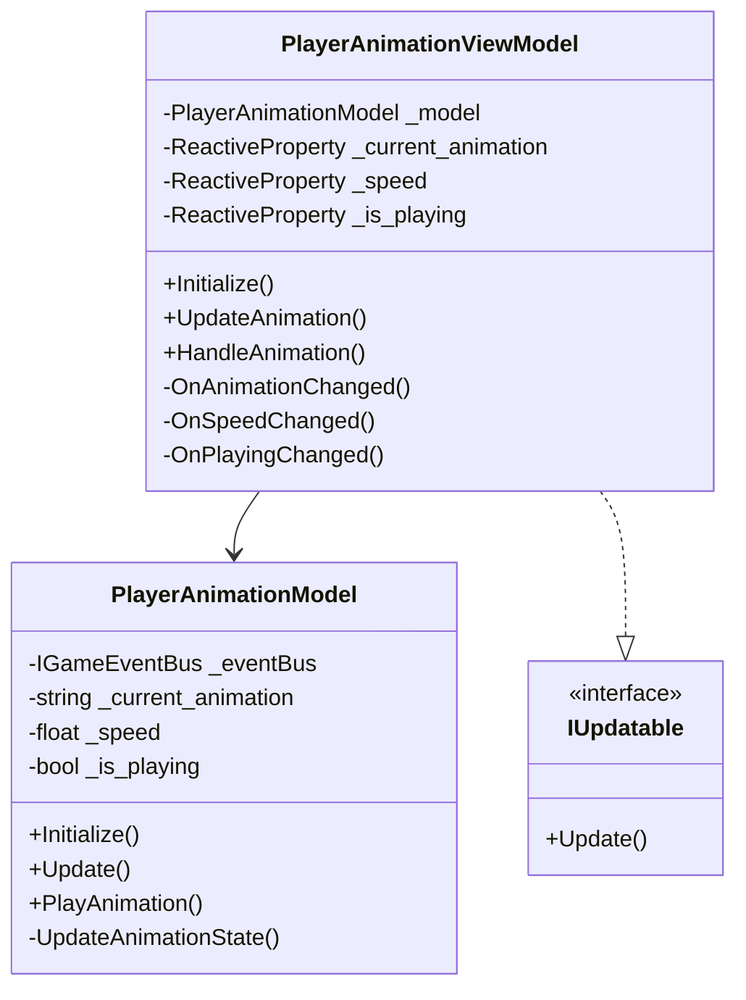
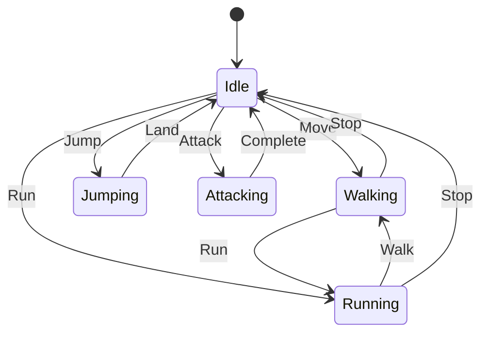
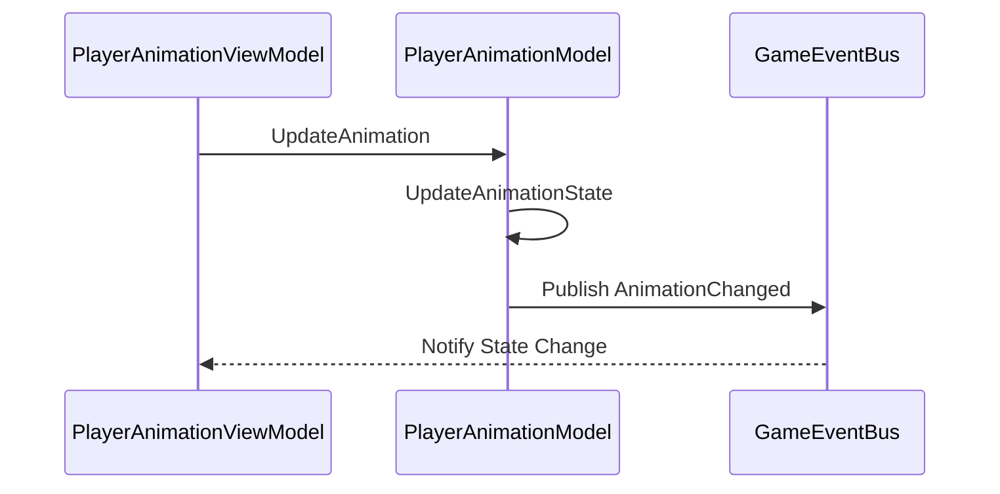
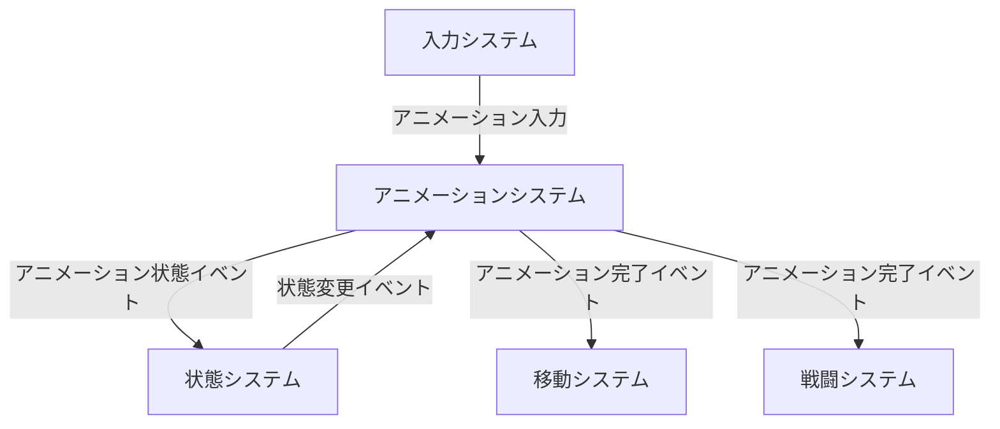

# Player Animation System

## 目次

1. [概要](#概要)
2. [システム構成](#システム構成)
3. [主要コンポーネント](#主要コンポーネント)
4. [イベントシステム](#イベントシステム)
5. [エラー処理](#エラー処理)
6. [使用例とベストプラクティス](#使用例とベストプラクティス)
7. [関連システム](#関連システム)
8. [変更履歴](#変更履歴)

## 概要

PlayerAnimationSystem は、プレイヤーのアニメーションを管理するシステムです。MVVM パターンに基づいて実装され、以下の主要な機能を提供します：

-   アニメーション再生制御
-   アニメーション状態管理
-   アニメーションブレンド
-   イベント通知
-   アニメーション速度制御

## システム構成

### 全体構成図



### アニメーション状態遷移図



### アニメーション更新シーケンス



## 主要コンポーネント

### PlayerAnimationViewModel

アニメーション管理のビューモデルクラスです。

#### 主要プロパティ

| プロパティ名     | 型                       | 説明                 |
| ---------------- | ------------------------ | -------------------- |
| CurrentAnimation | ReactiveProperty<string> | 現在のアニメーション |
| Speed            | ReactiveProperty<float>  | アニメーション速度   |
| IsPlaying        | ReactiveProperty<bool>   | 再生状態             |

#### 主要メソッド

| メソッド名      | 説明               | パラメータ            | 戻り値 |
| --------------- | ------------------ | --------------------- | ------ |
| Initialize      | システムの初期化   | なし                  | void   |
| UpdateAnimation | アニメーション更新 | なし                  | void   |
| HandleAnimation | アニメーション処理 | animationName: string | void   |

### PlayerAnimationModel

アニメーション管理のモデルクラスです。

#### 主要メソッド

| メソッド名           | 説明               | パラメータ            | 戻り値 |
| -------------------- | ------------------ | --------------------- | ------ |
| Initialize           | システムの初期化   | なし                  | void   |
| Update               | 状態の更新         | なし                  | void   |
| PlayAnimation        | アニメーション再生 | animationName: string | void   |
| UpdateAnimationState | 状態の更新         | なし                  | void   |

## イベントシステム

## エラー処理

## 使用例とベストプラクティス

### 基本的な実装例

```csharp
// ビューモデルの初期化
var viewModel = new PlayerAnimationViewModel(model, eventBus);
viewModel.Initialize();

// アニメーション状態の監視
viewModel.State.Subscribe(state => {
    // アニメーション状態が変更された時の処理
});

// アニメーションの再生
viewModel.PlayAnimation("Walk");
```

### エラー処理

```csharp
try {
    viewModel.PlayAnimation("Walk");
} catch (PlayerAnimationException ex) {
    // エラー処理
    Debug.LogError($"アニメーション再生に失敗: {ex.Message}");
}
```

## 関連システム

### プレイヤーシステム

-   [PlayerSystem](PlayerSystem.md) - プレイヤー全体の管理を担当
    -   サブシステムの初期化と管理
    -   イベントバスの提供
    -   エラー処理の一元管理

### 入力システム

-   [PlayerInputSystem](PlayerInputSystem.md) - アニメーション入力の処理を担当
    -   アニメーション切り替え入力の検出
    -   アニメーション速度入力の検出
    -   アニメーション入力イベントの発生

### 状態システム

-   [PlayerStateSystem](PlayerStateSystem.md) - アニメーション状態の管理を担当
    -   アニメーション可能状態の判定
    -   状態遷移の制御
    -   状態変更イベントの発生

### 移動システム

-   [PlayerMovementSystem](PlayerMovementSystem.md) - 移動アニメーションの制御を担当
    -   移動アニメーションの再生
    -   移動速度に応じたアニメーション制御
    -   移動イベントの発生

### 戦闘システム

-   [PlayerCombatSystem](PlayerCombatSystem.md) - 戦闘アニメーションの制御を担当
    -   攻撃アニメーションの再生
    -   防御アニメーションの再生
    -   戦闘イベントの発生

### システム間の連携

1. **アニメーション → 入力**

    - アニメーションシステムが入力の有効性を検証
    - 入力システムがアニメーションに必要な入力情報を提供

2. **アニメーション → 状態**

    - アニメーションシステムがアニメーション状態を通知
    - 状態システムがアニメーション状態に応じた状態遷移を制御

3. **アニメーション → 移動**

    - アニメーションシステムが移動アニメーションを再生
    - 移動システムが移動状態に応じたアニメーション制御を実行

4. **アニメーション → 戦闘**
    - アニメーションシステムが戦闘アニメーションを再生
    - 戦闘システムが戦闘状態に応じたアニメーション制御を実行

### イベントフロー



## 変更履歴

| バージョン | 更新日     | 変更内容                                                                                     |
| ---------- | ---------- | -------------------------------------------------------------------------------------------- |
| 0.2.0      | 2024-03-24 | システム間の相互参照を追加<br>- 各サブシステムとの関連性を明確化<br>- イベントフロー図を追加 |
| 0.1.0      | 2024-03-21 | 初版作成                                                                                     |
