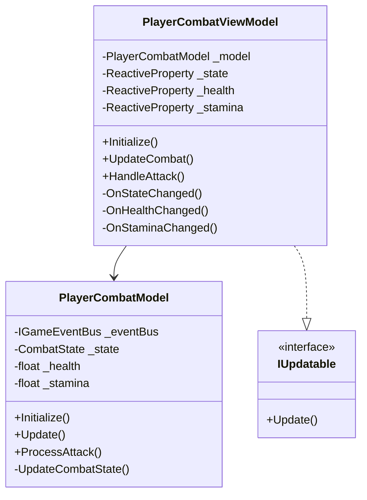
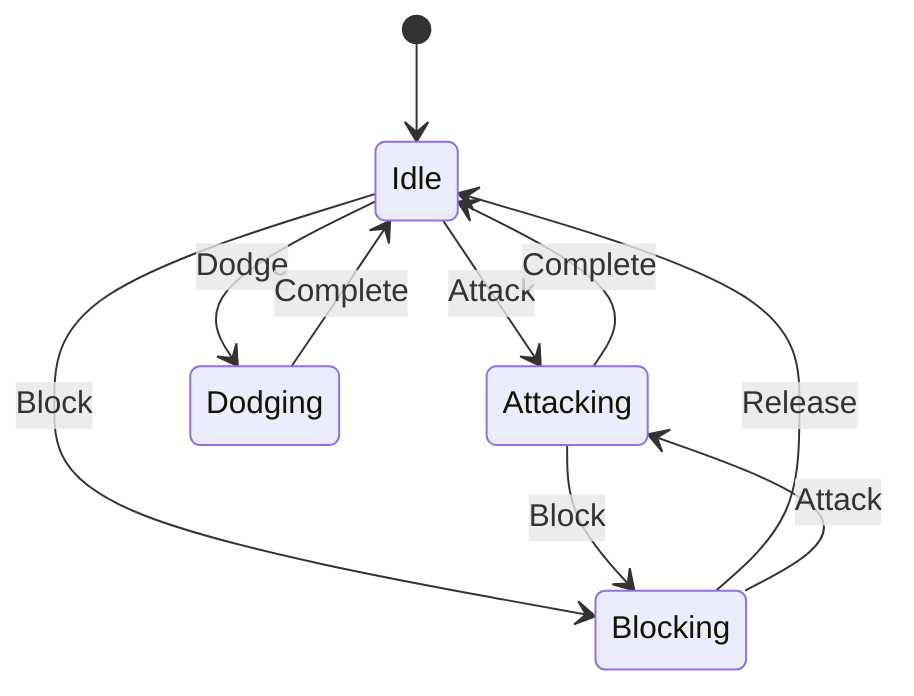
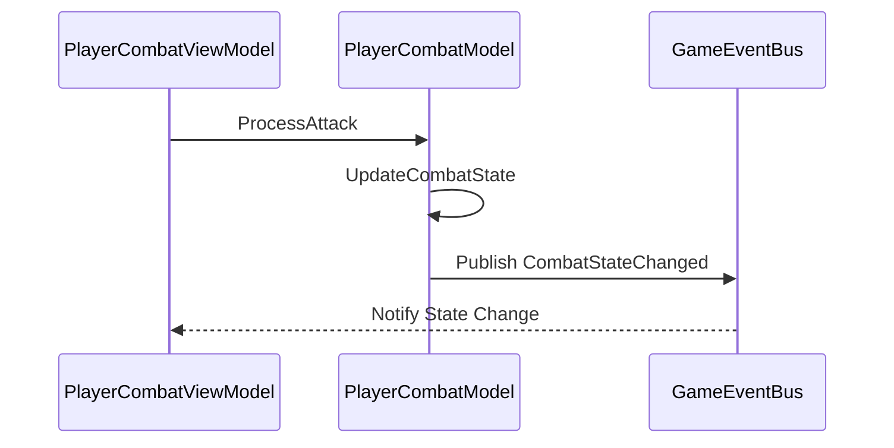
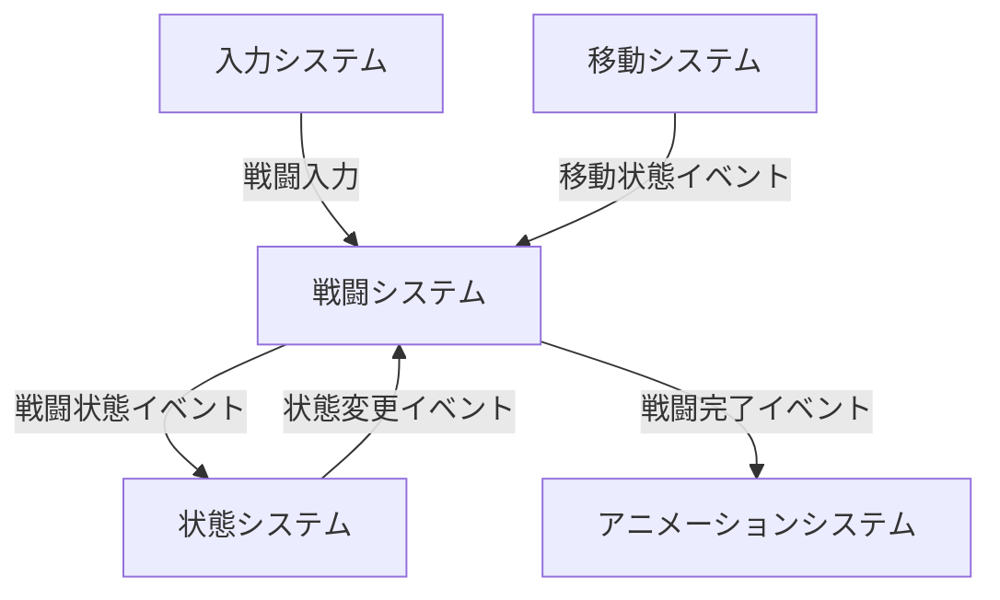

# Player Combat System

## 目次

1. [概要](#概要)
2. [システム構成](#システム構成)
3. [主要コンポーネント](#主要コンポーネント)
4. [イベントシステム](#イベントシステム)
5. [エラー処理](#エラー処理)
6. [使用例とベストプラクティス](#使用例とベストプラクティス)
7. [関連システム](#関連システム)
8. [変更履歴](#変更履歴)

## 概要

PlayerCombatSystem は、プレイヤーの戦闘関連の機能を管理するシステムです。MVVM パターンに基づいて実装され、以下の主要な機能を提供します：

-   戦闘状態の管理
-   攻撃処理
-   ダメージ計算
-   戦闘イベントの発行
-   戦闘アニメーション制御

## システム構成

### 全体構成図



### 戦闘状態遷移図



### 戦闘処理シーケンス



## 主要コンポーネント

### PlayerCombatViewModel

戦闘管理のビューモデルクラスです。

#### 主要プロパティ

| プロパティ名 | 型                            | 説明       |
| ------------ | ----------------------------- | ---------- |
| State        | ReactiveProperty<CombatState> | 戦闘状態   |
| Health       | ReactiveProperty<float>       | 体力値     |
| Stamina      | ReactiveProperty<float>       | スタミナ値 |

#### 主要メソッド

| メソッド名   | 説明             | パラメータ | 戻り値 |
| ------------ | ---------------- | ---------- | ------ |
| Initialize   | システムの初期化 | なし       | void   |
| UpdateCombat | 戦闘状態の更新   | なし       | void   |
| HandleAttack | 攻撃処理         | なし       | void   |

### PlayerCombatModel

戦闘管理のモデルクラスです。

#### 主要メソッド

| メソッド名        | 説明             | パラメータ | 戻り値 |
| ----------------- | ---------------- | ---------- | ------ |
| Initialize        | システムの初期化 | なし       | void   |
| Update            | 状態の更新       | なし       | void   |
| ProcessAttack     | 攻撃処理         | なし       | void   |
| UpdateCombatState | 状態の更新       | なし       | void   |

## イベントシステム

### 戦闘状態変更イベント

```csharp
// 戦闘状態変更イベントの購読
eventBus.GetEventStream<CombatStateChangedEvent>()
    .Subscribe(evt => {
        // 戦闘状態変更イベントの処理
    })
    .AddTo(disposables);
```

## エラー処理

### 戦闘状態の変更は必ず State プロパティを通して行う必要があります

### 攻撃処理は必ず HandleAttack メソッドを通して行う必要があります

### 戦闘状態の更新は必ず UpdateCombat メソッドを通して行う必要があります

### イベントの購読は必ず Disposables に追加する必要があります

## 使用例とベストプラクティス

### 戦闘状態の定義

```csharp
// 戦闘状態の定義
public enum CombatState
{
    Idle,
    Attacking,
    Blocking,
    Dodging,
    Stunned,
    Dead
}

// 戦闘パラメータの定義
public class CombatParameters
{
    public static readonly float BaseAttackDamage = 10f;
    public static readonly float BaseDefense = 5f;
    public static readonly float BaseStamina = 100f;
    public static readonly float StaminaRegenRate = 5f;
    public static readonly float AttackStaminaCost = 20f;
    public static readonly float BlockStaminaCost = 10f;
    public static readonly float DodgeStaminaCost = 30f;
}
```

### 戦闘システムの初期化

```csharp
// 戦闘モデルの作成
var combatModel = new PlayerCombatModel(eventBus);

// 戦闘ビューモデルの作成
var combatViewModel = new PlayerCombatViewModel(combatModel, eventBus);

// 戦闘パラメータの設定
combatViewModel.SetBaseStats(
    CombatParameters.BaseAttackDamage,
    CombatParameters.BaseDefense,
    CombatParameters.BaseStamina
);

// システムの初期化
combatViewModel.Initialize();
```

### 戦闘状態の監視

```csharp
// 現在の戦闘状態の監視
combatViewModel.State
    .Subscribe(state => {
        switch (state)
        {
            case CombatState.Idle:
                Debug.Log("Player is idle");
                break;
            case CombatState.Attacking:
                Debug.Log("Player is attacking");
                break;
            case CombatState.Blocking:
                Debug.Log("Player is blocking");
                break;
            case CombatState.Dodging:
                Debug.Log("Player is dodging");
                break;
            case CombatState.Stunned:
                Debug.Log("Player is stunned");
                break;
            case CombatState.Dead:
                Debug.Log("Player is dead");
                break;
        }
    })
    .AddTo(_disposables);

// 体力値の監視
combatViewModel.Health
    .Subscribe(health => {
        Debug.Log($"Player health: {health}");
    })
    .AddTo(_disposables);

// スタミナ値の監視
combatViewModel.Stamina
    .Subscribe(stamina => {
        Debug.Log($"Player stamina: {stamina}");
    })
    .AddTo(_disposables);
```

### 戦闘イベントの処理

```csharp
// 戦闘状態変更イベントの処理
eventBus.GetEventStream<CombatStateChangedEvent>()
    .Subscribe(evt => {
        Debug.Log($"Combat state changed from {evt.PreviousState} to {evt.NewState}");

        // 状態に応じた処理
        switch (evt.NewState)
        {
            case CombatState.Attacking:
                // 攻撃開始時の処理
                combatViewModel.Stamina.Value -= CombatParameters.AttackStaminaCost;
                break;
            case CombatState.Blocking:
                // 防御開始時の処理
                combatViewModel.Stamina.Value -= CombatParameters.BlockStaminaCost;
                break;
            case CombatState.Dodging:
                // 回避開始時の処理
                combatViewModel.Stamina.Value -= CombatParameters.DodgeStaminaCost;
                break;
            case CombatState.Stunned:
                // スタン開始時の処理
                break;
            case CombatState.Dead:
                // 死亡時の処理
                break;
        }
    })
    .AddTo(_disposables);

// ダメージイベントの処理
eventBus.GetEventStream<DamageEvent>()
    .Subscribe(evt => {
        Debug.Log($"Player took {evt.Damage} damage");

        // ダメージ計算
        var actualDamage = Mathf.Max(0, evt.Damage - CombatParameters.BaseDefense);
        combatViewModel.Health.Value -= actualDamage;

        // 死亡判定
        if (combatViewModel.Health.Value <= 0)
        {
            combatViewModel.State.Value = CombatState.Dead;
        }
    })
    .AddTo(_disposables);
```

### ベストプラクティス

1. **戦闘状態の定義**

    - 状態は明確な目的を持つ
    - 状態の遷移条件は明確に定義する
    - 状態の数は必要最小限に抑える

2. **戦闘パラメータの管理**

    - パラメータは適切な範囲に設定する
    - パラメータの変更は一貫性を保つ
    - パラメータのバランスは適切に調整する

3. **イベントの購読**

    - イベントの購読は必ず`CompositeDisposable`に追加する
    - 不要になったイベントの購読は適切に解除する
    - イベントハンドラー内での例外は適切に処理する

4. **パフォーマンス**

    - 不要な状態の更新を避ける
    - ダメージ計算は効率的に行う
    - リソースの使用は適切に管理する

5. **エラー処理**

    - 戦闘状態の遷移失敗は適切に処理する
    - ダメージ計算中の例外は適切に処理する
    - エラー状態の回復処理を実装する

6. **テスト容易性**
    - 戦闘状態はテスト可能な形で実装する
    - ダメージ計算は単体テスト可能な形で実装する
    - 戦闘パラメータはモック可能な形で実装する

## 関連システム

### プレイヤーシステム

-   [PlayerSystem](PlayerSystem.md) - プレイヤー全体の管理を担当
    -   サブシステムの初期化と管理
    -   イベントバスの提供
    -   エラー処理の一元管理

### 入力システム

-   [PlayerInputSystem](PlayerInputSystem.md) - 戦闘入力の処理を担当
    -   攻撃入力の検出
    -   防御入力の検出
    -   戦闘入力イベントの発生

### 状態システム

-   [PlayerStateSystem](PlayerStateSystem.md) - 戦闘状態の管理を担当
    -   戦闘可能状態の判定
    -   状態遷移の制御
    -   状態変更イベントの発生

### 移動システム

-   [PlayerMovementSystem](PlayerMovementSystem.md) - 戦闘中の移動制御を担当
    -   戦闘中の移動制限
    -   移動速度の調整
    -   移動イベントの発生

### アニメーションシステム

-   [PlayerAnimationSystem](PlayerAnimationSystem.md) - 戦闘アニメーションの制御を担当
    -   攻撃アニメーションの再生
    -   防御アニメーションの再生
    -   アニメーションイベントの発生

### システム間の連携

1. **戦闘 → 入力**

    - 戦闘システムが入力の有効性を検証
    - 入力システムが戦闘に必要な入力情報を提供

2. **戦闘 → 状態**

    - 戦闘システムが戦闘状態を通知
    - 状態システムが戦闘状態に応じた状態遷移を制御

3. **戦闘 → 移動**

    - 戦闘システムが戦闘中の移動制限を通知
    - 移動システムが戦闘状態に応じた移動制御を実行

4. **戦闘 → アニメーション**
    - 戦闘システムが戦闘状態を通知
    - アニメーションシステムが戦闘状態に応じたアニメーションを再生

### イベントフロー



## 変更履歴

| バージョン | 更新日     | 変更内容                                                                                     |
| ---------- | ---------- | -------------------------------------------------------------------------------------------- |
| 0.2.0      | 2024-03-24 | システム間の相互参照を追加<br>- 各サブシステムとの関連性を明確化<br>- イベントフロー図を追加 |
| 0.1.0      | 2024-03-21 | 初版作成                                                                                     |
