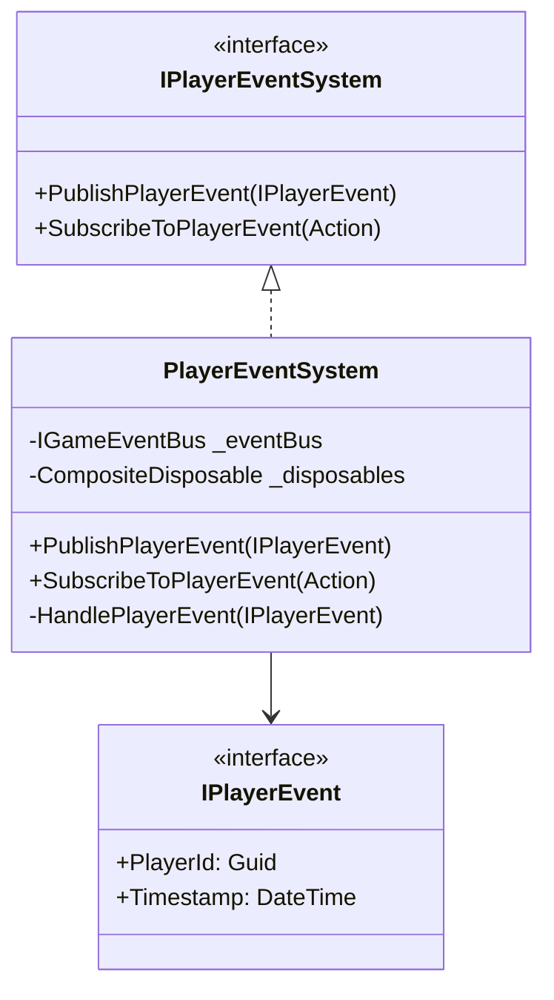

# PlayerEventSystem API Reference

## 目次

1. [概要](#概要)
2. [イベント一覧](#イベント一覧)
3. [使用方法](#使用方法)
4. [制限事項](#制限事項)
5. [変更履歴](#変更履歴)

## 概要

PlayerEventSystem は、プレイヤー関連のイベントを管理するシステムです。以下の主要な機能を提供します：

-   プレイヤーの状態変更イベント
-   プレイヤーのアクションイベント
-   プレイヤーの進捗イベント
-   プレイヤーの戦闘イベント

### システム構成図



## イベント一覧

### 状態変更イベント

| イベント名                | 説明                             | プロパティ         |
| ------------------------- | -------------------------------- | ------------------ |
| PlayerStateChangedEvent   | プレイヤーの状態が変更された     | State: PlayerState |
| PlayerHealthChangedEvent  | プレイヤーの体力が変更された     | Health: int        |
| PlayerStaminaChangedEvent | プレイヤーのスタミナが変更された | Stamina: int       |

### アクションイベント

| イベント名        | 説明                     | プロパティ             |
| ----------------- | ------------------------ | ---------------------- |
| PlayerMoveEvent   | プレイヤーが移動した     | Position: Vector3      |
| PlayerJumpEvent   | プレイヤーがジャンプした | Height: float          |
| PlayerAttackEvent | プレイヤーが攻撃した     | AttackType: AttackType |

### 進捗イベント

| イベント名                  | 説明                         | プロパティ      |
| --------------------------- | ---------------------------- | --------------- |
| PlayerLevelUpEvent          | プレイヤーがレベルアップした | NewLevel: int   |
| PlayerExperienceGainedEvent | プレイヤーが経験値を獲得した | Experience: int |
| PlayerSkillUnlockedEvent    | プレイヤーがスキルを解放した | SkillId: string |

### 戦闘イベント

| イベント名          | 説明                         | プロパティ      |
| ------------------- | ---------------------------- | --------------- |
| PlayerDamagedEvent  | プレイヤーがダメージを受けた | Damage: int     |
| PlayerHealedEvent   | プレイヤーが回復した         | HealAmount: int |
| PlayerDefeatedEvent | プレイヤーが倒された         | Reason: string  |

## 使用方法

### イベントの発行

```csharp
// イベントの発行例
var damageEvent = new PlayerDamagedEvent
{
    PlayerId = playerId,
    Damage = 10
};
playerEventSystem.PublishPlayerEvent(damageEvent);
```

### イベントの購読

```csharp
// イベントの購読例
playerEventSystem.SubscribeToPlayerEvent<PlayerDamagedEvent>(evt =>
{
    // ダメージ処理
    HandlePlayerDamage(evt.Damage);
});
```

## 制限事項

1. イベントの発行は必ず`PublishPlayerEvent`メソッドを使用する必要があります
2. イベントの購読は必ず`SubscribeToPlayerEvent`メソッドを使用する必要があります
3. イベントの購読は適切なタイミングで解除する必要があります

## 変更履歴

| バージョン | 更新日     | 変更内容 |
| ---------- | ---------- | -------- |
| 0.1.0      | 2024-03-21 | 初版作成 |
