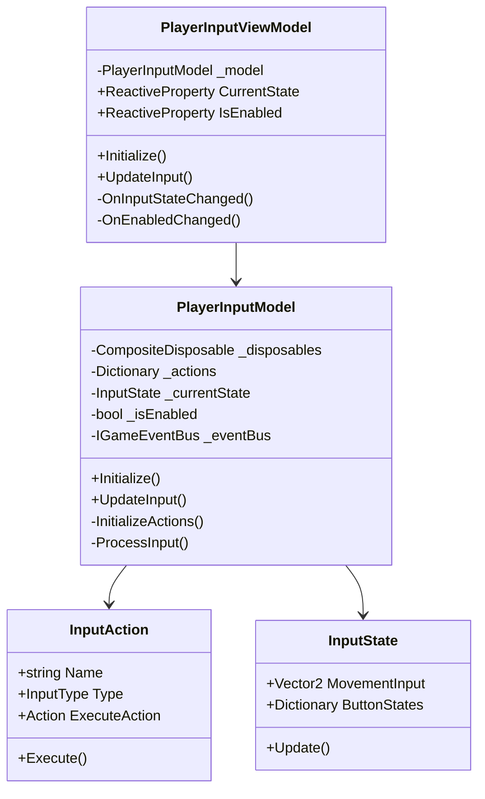
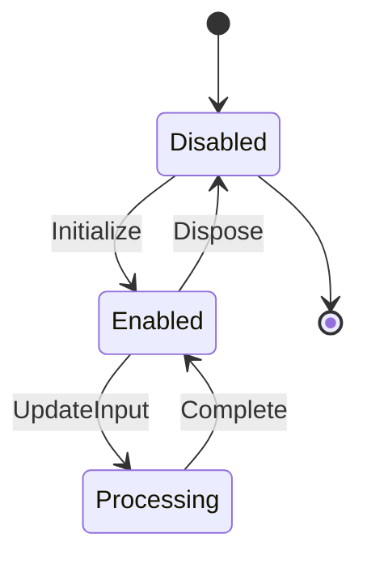
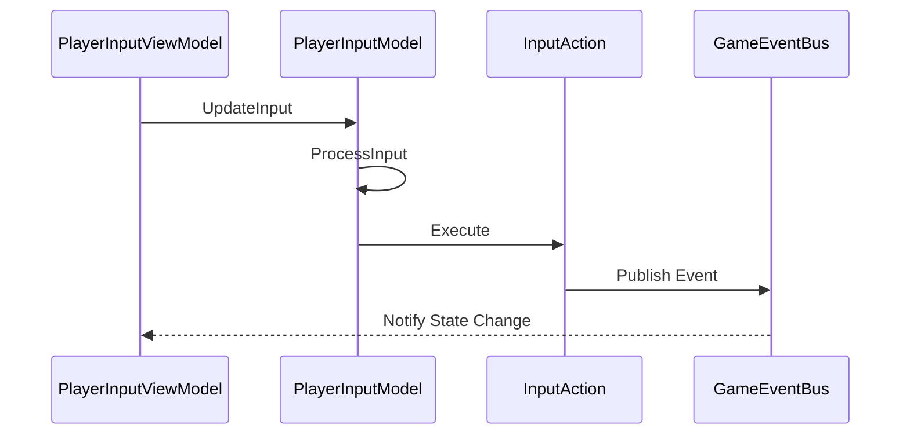
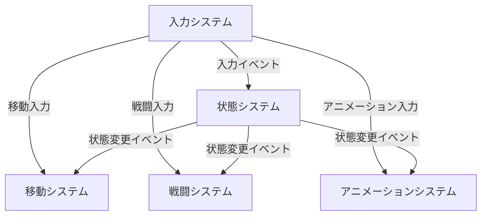

# Player Input System

## 目次

1. [概要](#概要)
2. [システム構成](#システム構成)
3. [主要コンポーネント](#主要コンポーネント)
4. [イベントシステム](#イベントシステム)
5. [エラー処理](#エラー処理)
6. [使用例とベストプラクティス](#使用例とベストプラクティス)
7. [関連システム](#関連システム)
8. [変更履歴](#変更履歴)

## 概要

PlayerInputSystem は、プレイヤーの入力を管理するシステムです。MVVM パターンに基づいて実装され、以下の主要な機能を提供します：

-   入力状態の管理
-   入力イベントの発行
-   入力の検証
-   入力のマッピング
-   キー設定の管理

## システム構成

### 全体構成図



### 状態遷移図



### 入力処理シーケンス



## 主要コンポーネント

### PlayerInputViewModel

入力管理のビューモデルクラスです。

#### 主要プロパティ

| プロパティ名 | 型                           | 説明           |
| ------------ | ---------------------------- | -------------- |
| CurrentState | ReactiveProperty<InputState> | 現在の入力状態 |
| IsEnabled    | ReactiveProperty<bool>       | 入力の有効状態 |

#### 主要メソッド

| メソッド名  | 説明             | パラメータ | 戻り値 |
| ----------- | ---------------- | ---------- | ------ |
| Initialize  | システムの初期化 | なし       | void   |
| UpdateInput | 入力の更新       | なし       | void   |

### PlayerInputModel

入力管理のモデルクラスです。

#### 主要メソッド

| メソッド名        | 説明               | パラメータ | 戻り値 |
| ----------------- | ------------------ | ---------- | ------ |
| Initialize        | システムの初期化   | なし       | void   |
| UpdateInput       | 入力の更新         | なし       | void   |
| InitializeActions | アクションの初期化 | なし       | void   |
| ProcessInput      | 入力の処理         | なし       | void   |

### InputAction

入力アクションを表すクラスです。

#### 主要プロパティ

| プロパティ名  | 型        | 説明           |
| ------------- | --------- | -------------- |
| Name          | string    | アクション名   |
| Type          | InputType | 入力タイプ     |
| ExecuteAction | Action    | 実行アクション |

## イベントシステム

## エラー処理

## 使用例とベストプラクティス

### 基本的な実装例

```csharp
// ビューモデルの初期化
var viewModel = new PlayerInputViewModel(model, eventBus);
viewModel.Initialize();

// 入力の監視
viewModel.Input.Subscribe(input => {
    // 入力が変更された時の処理
});

// 入力状態の監視
viewModel.State.Subscribe(state => {
    // 入力状態が変更された時の処理
});
```

### エラー処理

```csharp
try {
    viewModel.HandleInput();
} catch (PlayerInputException ex) {
    // エラー処理
    Debug.LogError($"入力処理に失敗: {ex.Message}");
}
```

## 関連システム

### プレイヤーシステム

-   [PlayerSystem](PlayerSystem.md) - プレイヤー全体の管理を担当
    -   サブシステムの初期化と管理
    -   イベントバスの提供
    -   エラー処理の一元管理

### 状態システム

-   [PlayerStateSystem](PlayerStateSystem.md) - 入力に基づく状態変更を担当
    -   入力の有効性検証
    -   状態遷移の制御
    -   状態変更イベントの発生

### 移動システム

-   [PlayerMovementSystem](PlayerMovementSystem.md) - 移動入力の処理を担当
    -   移動方向の計算
    -   移動速度の制御
    -   移動イベントの発生

### 戦闘システム

-   [PlayerCombatSystem](PlayerCombatSystem.md) - 戦闘入力の処理を担当
    -   攻撃入力の検出
    -   防御入力の検出
    -   戦闘イベントの発生

### アニメーションシステム

-   [PlayerAnimationSystem](PlayerAnimationSystem.md) - 入力に応じたアニメーション制御を担当
    -   入力状態に応じたアニメーション選択
    -   アニメーション遷移の制御
    -   アニメーションイベントの発生

### システム間の連携

1. **入力 → 状態**

    - 入力システムが状態変更をトリガー
    - 状態システムが入力の有効性を検証

2. **入力 → 移動**

    - 入力システムが移動方向と速度を計算
    - 移動システムが入力に基づいて移動を実行

3. **入力 → 戦闘**

    - 入力システムが戦闘アクションを検出
    - 戦闘システムが入力に基づいて戦闘を実行

4. **入力 → アニメーション**
    - 入力システムがアニメーション変更をトリガー
    - アニメーションシステムが入力に応じたアニメーションを再生

### イベントフロー



## 変更履歴

| バージョン | 更新日     | 変更内容                                                                                     |
| ---------- | ---------- | -------------------------------------------------------------------------------------------- |
| 0.2.0      | 2024-03-24 | システム間の相互参照を追加<br>- 各サブシステムとの関連性を明確化<br>- イベントフロー図を追加 |
| 0.1.0      | 2024-03-21 | 初版作成                                                                                     |
