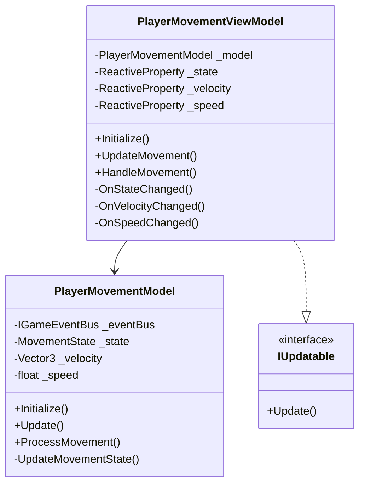
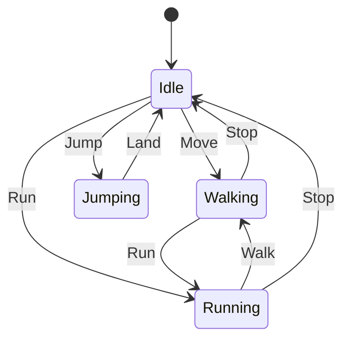
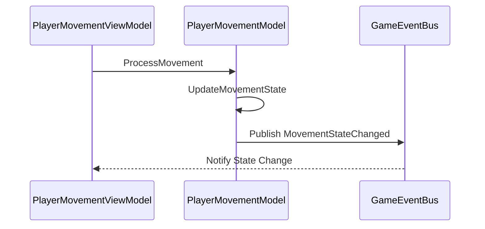
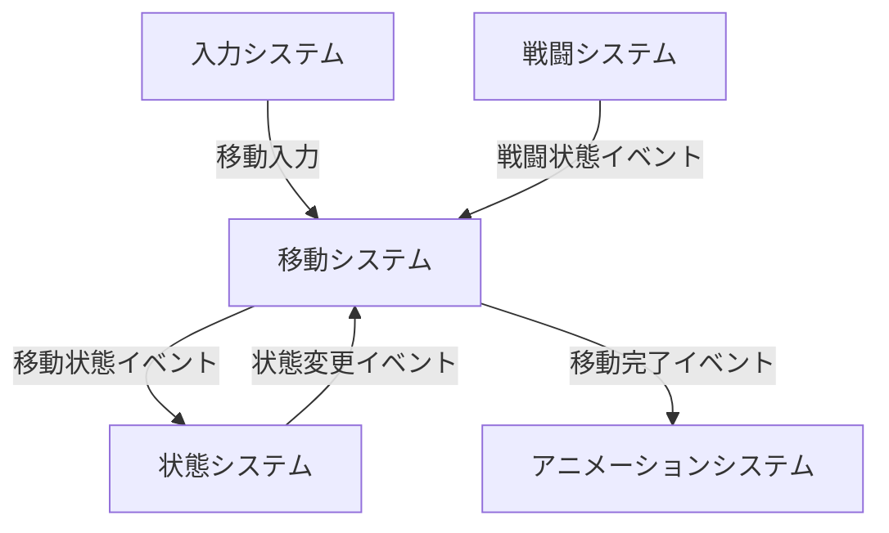

# Player Movement System

## 目次

1. [概要](#概要)
2. [システム構成](#システム構成)
3. [主要コンポーネント](#主要コンポーネント)
4. [イベントシステム](#イベントシステム)
5. [エラー処理](#エラー処理)
6. [使用例とベストプラクティス](#使用例とベストプラクティス)
7. [関連システム](#関連システム)
8. [変更履歴](#変更履歴)

## 概要

PlayerMovementSystem は、プレイヤーの移動関連の機能を管理するシステムです。MVVM パターンに基づいて実装され、以下の主要な機能を提供します：

-   移動状態の管理
-   移動速度の制御
-   移動方向の制御
-   移動イベントの発行
-   移動アニメーション制御

## システム構成

### 全体構成図



### 移動状態遷移図



### 移動処理シーケンス



## 主要コンポーネント

### PlayerMovementViewModel

移動管理のビューモデルクラスです。

#### 主要プロパティ

| プロパティ名 | 型                              | 説明             |
| ------------ | ------------------------------- | ---------------- |
| State        | ReactiveProperty<MovementState> | 移動状態         |
| Velocity     | ReactiveProperty<Vector3>       | 移動速度ベクトル |
| Speed        | ReactiveProperty<float>         | 移動速度         |

#### 主要メソッド

| メソッド名     | 説明             | パラメータ | 戻り値 |
| -------------- | ---------------- | ---------- | ------ |
| Initialize     | システムの初期化 | なし       | void   |
| UpdateMovement | 移動状態の更新   | なし       | void   |
| HandleMovement | 移動処理         | なし       | void   |

### PlayerMovementModel

移動管理のモデルクラスです。

#### 主要メソッド

| メソッド名          | 説明             | パラメータ | 戻り値 |
| ------------------- | ---------------- | ---------- | ------ |
| Initialize          | システムの初期化 | なし       | void   |
| Update              | 状態の更新       | なし       | void   |
| ProcessMovement     | 移動処理         | なし       | void   |
| UpdateMovementState | 状態の更新       | なし       | void   |

## 使用例とベストプラクティス

### 基本的な実装例

```csharp
// ビューモデルの初期化
var viewModel = new PlayerMovementViewModel(model, eventBus);
viewModel.Initialize();

// 移動の監視
viewModel.Movement.Subscribe(movement => {
    // 移動が変更された時の処理
});

// 移動の実行
viewModel.Move(new Vector2(1, 0));
```

### エラー処理

```csharp
try {
    viewModel.Move(new Vector2(1, 0));
} catch (PlayerMovementException ex) {
    // エラー処理
    Debug.LogError($"移動に失敗: {ex.Message}");
}
```

## 制限事項

1. 移動状態の変更は必ず State プロパティを通して行う必要があります
2. 移動処理は必ず HandleMovement メソッドを通して行う必要があります
3. 移動状態の更新は必ず UpdateMovement メソッドを通して行う必要があります
4. イベントの購読は必ず Disposables に追加する必要があります

## 変更履歴

| バージョン | 更新日     | 変更内容                                                                                     |
| ---------- | ---------- | -------------------------------------------------------------------------------------------- |
| 0.2.0      | 2024-03-24 | システム間の相互参照を追加<br>- 各サブシステムとの関連性を明確化<br>- イベントフロー図を追加 |
| 0.1.0      | 2024-03-21 | 初版作成                                                                                     |

## 関連システム

### プレイヤーシステム

-   [PlayerSystem](PlayerSystem.md) - プレイヤー全体の管理を担当
    -   サブシステムの初期化と管理
    -   イベントバスの提供
    -   エラー処理の一元管理

### 入力システム

-   [PlayerInputSystem](PlayerInputSystem.md) - 移動入力の処理を担当
    -   移動方向の入力検出
    -   移動速度の入力検出
    -   移動入力イベントの発生

### 状態システム

-   [PlayerStateSystem](PlayerStateSystem.md) - 移動状態の管理を担当
    -   移動可能状態の判定
    -   状態遷移の制御
    -   状態変更イベントの発生

### 戦闘システム

-   [PlayerCombatSystem](PlayerCombatSystem.md) - 移動中の戦闘制御を担当
    -   移動中の攻撃制御
    -   移動中の防御制御
    -   戦闘イベントの発生

### アニメーションシステム

-   [PlayerAnimationSystem](PlayerAnimationSystem.md) - 移動アニメーションの制御を担当
    -   移動アニメーションの再生
    -   アニメーション遷移の制御
    -   アニメーションイベントの発生

### システム間の連携

1. **移動 → 入力**

    - 移動システムが入力の有効性を検証
    - 入力システムが移動に必要な入力情報を提供

2. **移動 → 状態**

    - 移動システムが移動状態を通知
    - 状態システムが移動状態に応じた状態遷移を制御

3. **移動 → 戦闘**

    - 移動システムが移動中の戦闘制限を通知
    - 戦闘システムが移動状態に応じた戦闘制御を実行

4. **移動 → アニメーション**
    - 移動システムが移動状態を通知
    - アニメーションシステムが移動状態に応じたアニメーションを再生

### イベントフロー


