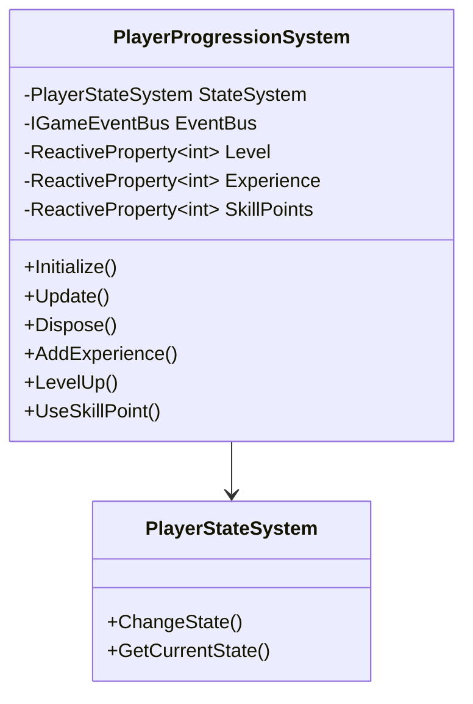

# PlayerProgressionSystem API Reference

## 目次

1. [概要](#概要)
2. [詳細](#詳細)
3. [使用方法](#使用方法)
4. [制限事項](#制限事項)
5. [変更履歴](#変更履歴)

## 概要

PlayerProgressionSystem は、プレイヤーの進行を管理するシステムです。以下の主要な機能を提供します：

-   レベル管理
-   経験値管理
-   スキルポイント管理
-   進行状況の保存

## 詳細

### システム構成図



### 主要コンポーネント

#### PlayerProgressionSystem

進行管理システムのメインコンポーネントです。

##### 主要メソッド

| メソッド名    | 説明               | パラメータ      | 戻り値 |
| ------------- | ------------------ | --------------- | ------ |
| Initialize    | システムの初期化   | なし            | void   |
| Update        | システムの更新     | なし            | void   |
| Dispose       | リソースの解放     | なし            | void   |
| AddExperience | 経験値を追加       | amount: int     | void   |
| LevelUp       | レベルアップ       | なし            | void   |
| UseSkillPoint | スキルポイント使用 | skillId: string | bool   |

##### 主要プロパティ

| プロパティ名 | 型                       | 説明           |
| ------------ | ------------------------ | -------------- |
| Level        | IReactiveProperty\<int\> | 現在のレベル   |
| Experience   | IReactiveProperty\<int\> | 現在の経験値   |
| SkillPoints  | IReactiveProperty\<int\> | スキルポイント |

## 使用方法

### 基本的な進行管理

```csharp
public class PlayerProgressionController : MonoBehaviour
{
    [SerializeField] private PlayerProgressionSystem _progressionSystem;

    private void OnEnemyDefeated(int experienceReward)
    {
        // 経験値の追加
        _progressionSystem.AddExperience(experienceReward);

        // レベルアップの確認
        if (_progressionSystem.Level.Value >= 10)
        {
            // スキルポイントの使用
            _progressionSystem.UseSkillPoint("Fireball");
        }
    }
}
```

### 進行状況の監視

```csharp
public class PlayerProgressionHandler : MonoBehaviour
{
    [SerializeField] private PlayerProgressionSystem _progressionSystem;
    private readonly CompositeDisposable _disposables = new();

    private void OnEnable()
    {
        _progressionSystem.Level
            .Subscribe(OnLevelChanged)
            .AddTo(_disposables);

        _progressionSystem.Experience
            .Subscribe(OnExperienceChanged)
            .AddTo(_disposables);

        _progressionSystem.SkillPoints
            .Subscribe(OnSkillPointsChanged)
            .AddTo(_disposables);
    }

    private void OnLevelChanged(int newLevel)
    {
        Debug.Log($"Player level changed to: {newLevel}");
    }

    private void OnExperienceChanged(int newExperience)
    {
        Debug.Log($"Player experience changed to: {newExperience}");
    }

    private void OnSkillPointsChanged(int newSkillPoints)
    {
        Debug.Log($"Player skill points changed to: {newSkillPoints}");
    }

    private void OnDisable()
    {
        _disposables.Dispose();
    }
}
```

## 制限事項

1. 経験値の追加は必ず `AddExperience` メソッドを使用する必要があります
2. レベルアップは必ず `LevelUp` メソッドを使用する必要があります
3. スキルポイントの使用は必ず `UseSkillPoint` メソッドを使用する必要があります
4. 進行状況の変更は必ず対応するプロパティを通じて行う必要があります

## 変更履歴

| バージョン | 更新日     | 変更内容 |
| ---------- | ---------- | -------- |
| 0.1.0      | 2024-03-21 | 初版作成 |
