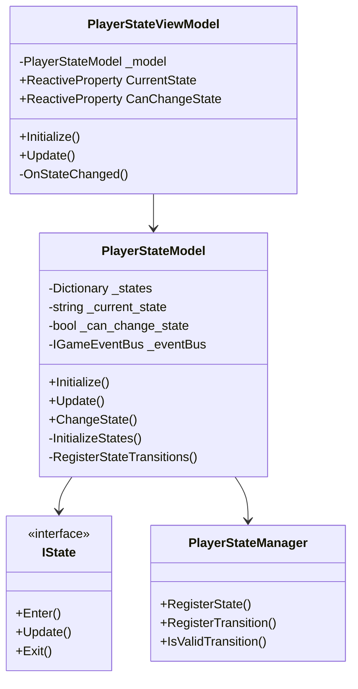
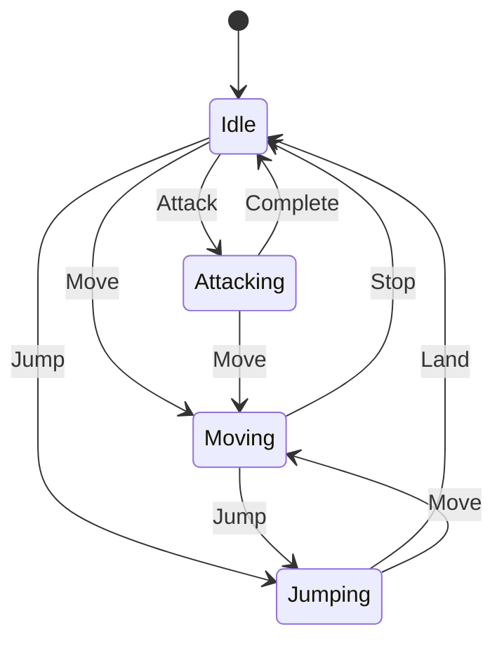
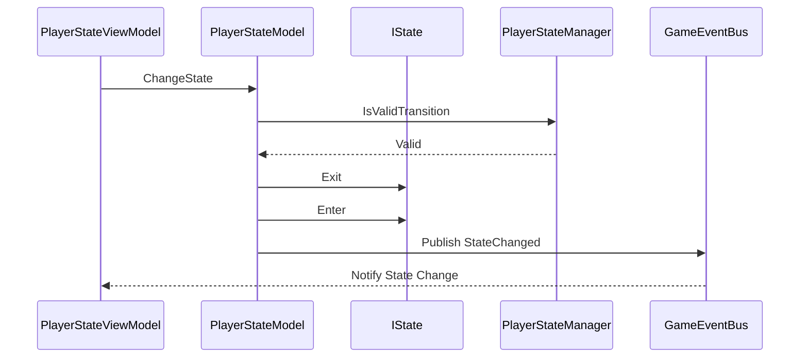
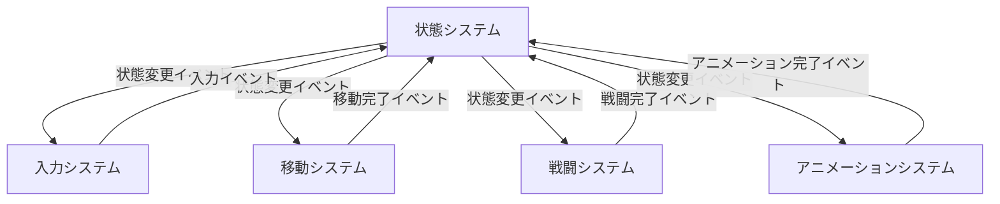

# Player State System

## 目次

1. [概要](#概要)
2. [システム構成](#システム構成)
3. [主要コンポーネント](#主要コンポーネント)
4. [イベントシステム](#イベントシステム)
5. [エラー処理](#エラー処理)
6. [使用例とベストプラクティス](#使用例とベストプラクティス)
7. [関連システム](#関連システム)
8. [変更履歴](#変更履歴)

## 概要

PlayerStateSystem は、プレイヤーの状態を管理するシステムです。MVVM パターンに基づいて実装され、以下の主要な機能を提供します：

-   状態の遷移管理
-   状態の検証
-   状態変更イベントの発行
-   状態の永続化
-   状態のロック制御

## システム構成

### 全体構成図



### 状態遷移図



### 状態変更シーケンス



## 主要コンポーネント

### PlayerStateViewModel

状態管理のビューモデルクラスです。

#### 主要プロパティ

| プロパティ名   | 型                       | 説明               |
| -------------- | ------------------------ | ------------------ |
| CurrentState   | ReactiveProperty<string> | 現在の状態         |
| CanChangeState | ReactiveProperty<bool>   | 状態変更可能フラグ |

#### 主要メソッド

| メソッド名 | 説明             | パラメータ | 戻り値 |
| ---------- | ---------------- | ---------- | ------ |
| Initialize | システムの初期化 | なし       | void   |
| Update     | 状態の更新       | なし       | void   |

### PlayerStateModel

状態管理のモデルクラスです。

#### 主要メソッド

| メソッド名               | 説明             | パラメータ       | 戻り値 |
| ------------------------ | ---------------- | ---------------- | ------ |
| Initialize               | システムの初期化 | なし             | void   |
| Update                   | 状態の更新       | なし             | void   |
| ChangeState              | 状態の変更       | newState: string | void   |
| InitializeStates         | 状態の初期化     | なし             | void   |
| RegisterStateTransitions | 遷移の登録       | なし             | void   |

### IState

状態を表すインターフェースです。

#### 主要メソッド

| メソッド名 | 説明             | パラメータ | 戻り値 |
| ---------- | ---------------- | ---------- | ------ |
| Enter      | 状態開始時の処理 | なし       | void   |
| Update     | 状態更新時の処理 | なし       | void   |
| Exit       | 状態終了時の処理 | なし       | void   |

## イベントシステム

## エラー処理

## 使用例とベストプラクティス

### 状態の定義

```csharp
// プレイヤーの状態定義
public enum PlayerState
{
    Idle,
    Walking,
    Running,
    Jumping,
    Attacking,
    Blocking,
    Dodging,
    Stunned,
    Dead
}

// 状態の遷移条件定義
public class PlayerStateTransitions
{
    public static readonly StateTransition<PlayerState> IdleToWalking = new StateTransition<PlayerState>
    {
        From = PlayerState.Idle,
        To = PlayerState.Walking,
        Condition = (currentState, context) => context.IsMoving && !context.IsRunning
    };

    public static readonly StateTransition<PlayerState> WalkingToRunning = new StateTransition<PlayerState>
    {
        From = PlayerState.Walking,
        To = PlayerState.Running,
        Condition = (currentState, context) => context.IsRunning
    };

    public static readonly StateTransition<PlayerState> AnyToJumping = new StateTransition<PlayerState>
    {
        From = null, // 任意の状態から
        To = PlayerState.Jumping,
        Condition = (currentState, context) => context.IsJumping && context.CanJump
    };
}
```

### 状態システムの初期化

```csharp
// 状態モデルの作成
var stateModel = new PlayerStateModel(eventBus);

// 状態ビューモデルの作成
var stateViewModel = new PlayerStateViewModel(stateModel, eventBus);

// 状態遷移の登録
stateViewModel.RegisterTransition(PlayerStateTransitions.IdleToWalking);
stateViewModel.RegisterTransition(PlayerStateTransitions.WalkingToRunning);
stateViewModel.RegisterTransition(PlayerStateTransitions.AnyToJumping);

// システムの初期化
stateViewModel.Initialize();
```

### 状態の監視

```csharp
// 現在の状態の監視
stateViewModel.CurrentState
    .Subscribe(state => {
        switch (state)
        {
            case PlayerState.Idle:
                Debug.Log("Player is idle");
                break;
            case PlayerState.Walking:
                Debug.Log("Player is walking");
                break;
            case PlayerState.Running:
                Debug.Log("Player is running");
                break;
            case PlayerState.Jumping:
                Debug.Log("Player is jumping");
                break;
            case PlayerState.Attacking:
                Debug.Log("Player is attacking");
                break;
            case PlayerState.Blocking:
                Debug.Log("Player is blocking");
                break;
            case PlayerState.Dodging:
                Debug.Log("Player is dodging");
                break;
            case PlayerState.Stunned:
                Debug.Log("Player is stunned");
                break;
            case PlayerState.Dead:
                Debug.Log("Player is dead");
                break;
        }
    })
    .AddTo(_disposables);

// 状態の変更履歴の監視
stateViewModel.StateHistory
    .Subscribe(history => {
        Debug.Log($"State history: {string.Join(" -> ", history)}");
    })
    .AddTo(_disposables);
```

### 状態イベントの処理

```csharp
// 状態変更イベントの処理
eventBus.GetEventStream<PlayerStateChangedEvent>()
    .Subscribe(evt => {
        Debug.Log($"State changed from {evt.PreviousState} to {evt.NewState}");

        // 状態に応じた処理
        switch (evt.NewState)
        {
            case PlayerState.Attacking:
                // 攻撃開始時の処理
                break;
            case PlayerState.Blocking:
                // 防御開始時の処理
                break;
            case PlayerState.Dodging:
                // 回避開始時の処理
                break;
            case PlayerState.Stunned:
                // スタン開始時の処理
                break;
            case PlayerState.Dead:
                // 死亡時の処理
                break;
        }
    })
    .AddTo(_disposables);
```

### ベストプラクティス

1. **状態の定義**

    - 状態は明確な目的を持つ
    - 状態の遷移条件は明確に定義する
    - 状態の数は必要最小限に抑える

2. **状態遷移の管理**

    - 状態遷移は一貫性を保つ
    - 遷移条件は適切に検証する
    - 遷移の履歴は適切に管理する

3. **イベントの購読**

    - イベントの購読は必ず`CompositeDisposable`に追加する
    - 不要になったイベントの購読は適切に解除する
    - イベントハンドラー内での例外は適切に処理する

4. **パフォーマンス**

    - 不要な状態の更新を避ける
    - 状態の検証は効率的に行う
    - 状態の履歴は適切なサイズに制限する

5. **エラー処理**

    - 状態遷移の失敗は適切に処理する
    - 状態の処理中に発生した例外は適切に処理する
    - エラー状態の回復処理を実装する

6. **テスト容易性**
    - 状態はテスト可能な形で実装する
    - 状態遷移は単体テスト可能な形で実装する
    - 状態のコンテキストはモック可能な形で実装する

## 関連システム

### プレイヤーシステム

-   [PlayerSystem](PlayerSystem.md) - プレイヤー全体の管理を担当
    -   サブシステムの初期化と管理
    -   イベントバスの提供
    -   エラー処理の一元管理

### 入力システム

-   [PlayerInputSystem](PlayerInputSystem.md) - 状態変更のトリガーを担当
    -   入力の検出と処理
    -   入力状態の管理
    -   入力イベントの発生

### 移動システム

-   [PlayerMovementSystem](PlayerMovementSystem.md) - 状態に応じた移動を担当
    -   移動可能状態の判定
    -   移動速度と方向の制御
    -   移動イベントの発生

### 戦闘システム

-   [PlayerCombatSystem](PlayerCombatSystem.md) - 状態に応じた戦闘を担当
    -   戦闘可能状態の判定
    -   攻撃と防御の制御
    -   戦闘イベントの発生

### アニメーションシステム

-   [PlayerAnimationSystem](PlayerAnimationSystem.md) - 状態に応じたアニメーションを担当
    -   アニメーション状態の管理
    -   アニメーション遷移の制御
    -   アニメーションイベントの発生

### システム間の連携

1. **状態 → 入力**

    - 状態システムが入力の有効性を制御
    - 入力システムが状態に応じた入力処理を実行

2. **状態 → 移動**

    - 状態システムが移動可能か判定
    - 移動システムが状態に応じた移動を実行

3. **状態 → 戦闘**

    - 状態システムが戦闘可能か判定
    - 戦闘システムが状態に応じた戦闘を実行

4. **状態 → アニメーション**
    - 状態システムがアニメーション変更をトリガー
    - アニメーションシステムが状態に応じたアニメーションを再生

### イベントフロー



## 変更履歴

| バージョン | 更新日     | 変更内容                                                                                     |
| ---------- | ---------- | -------------------------------------------------------------------------------------------- |
| 0.2.0      | 2024-03-24 | システム間の相互参照を追加<br>- 各サブシステムとの関連性を明確化<br>- イベントフロー図を追加 |
| 0.1.0      | 2024-03-21 | 初版作成                                                                                     |
