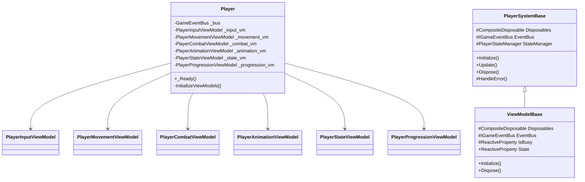

# Player System

## 目次

1. [概要](#概要)
2. [システム構成](#システム構成)
3. [主要コンポーネント](#主要コンポーネント)
4. [イベントシステム](#イベントシステム)
5. [エラー処理](#エラー処理)
6. [使用例とベストプラクティス](#使用例とベストプラクティス)
7. [関連システム](#関連システム)
8. [変更履歴](#変更履歴)

## 概要

PlayerSystem は、プレイヤー関連の機能を管理するコアシステムです。MVVM パターンに基づいて実装され、以下の主要な機能を提供します：

-   プレイヤーの状態管理
-   イベント処理
-   リソース管理
-   エラー処理
-   入力処理
-   移動制御
-   戦闘処理
-   アニメーション制御
-   進行管理

## システム構成

### 全体構成図



### 初期化シーケンス


## 主要コンポーネント

### PlayerSystemBase

基底クラスとして、以下の機能を提供します：

-   イベントバスの管理
-   リソースの解放
-   エラー処理
-   状態管理

#### 主要メソッド

| メソッド名  | 説明                                                                                               | パラメータ                         | 戻り値 | 例外                                                                                                 |
| ----------- | -------------------------------------------------------------------------------------------------- | ---------------------------------- | ------ | ---------------------------------------------------------------------------------------------------- |
| Initialize  | システムの初期化を行います。イベントバスの設定、状態管理の初期化、リソースの準備を行います。       | なし                               | void   | InvalidOperationException: 既に初期化済みの場合<br>ArgumentNullException: イベントバスが null の場合 |
| Update      | システムの更新を行います。プレイヤーの状態更新、イベント処理、リソースの更新を行います。           | なし                               | void   | InvalidOperationException: 初期化されていない場合                                                    |
| Dispose     | リソースの解放を行います。イベントの購読解除、状態管理のクリーンアップ、リソースの解放を行います。 | なし                               | void   | ObjectDisposedException: 既に解放済みの場合                                                          |
| HandleError | エラー処理を行います。エラーのログ記録、イベントの発行、リカバリー処理を行います。                 | operation: string<br>ex: Exception | void   | ArgumentNullException: パラメータが null の場合                                                      |

### エラー処理の詳細


## 使用例とベストプラクティス

### 基本的な実装例

```csharp
// プレイヤーシステムの初期化
var playerSystem = new PlayerSystem(eventBus);
playerSystem.Initialize();

// サブシステムの初期化
playerSystem.InitializeSubSystems();

// イベントの購読
eventBus.GetEventStream<PlayerStateChangedEvent>()
    .Subscribe(evt => {
        // 状態変更イベントの処理
    })
    .AddTo(disposables);
```

### エラー処理

```csharp
try {
    playerSystem.Initialize();
} catch (PlayerSystemException ex) {
    // エラー処理
    Debug.LogError($"プレイヤーシステムの初期化に失敗: {ex.Message}");
}
```

## 制限事項

1. イベントバスは必ず初期化時に提供する必要があります
2. リソースの解放は必ず Dispose メソッドで行う必要があります
3. エラー処理は HandleError メソッドを使用する必要があります
4. 各 ViewModel は独立して動作し、直接的な依存関係を持たないようにする必要があります
5. イベントの購読は必ず Disposables に追加する必要があります

## 変更履歴

| バージョン | 更新日     | 変更内容                                                                                     |
| ---------- | ---------- | -------------------------------------------------------------------------------------------- |
| 0.2.0      | 2024-03-24 | システム間の相互参照を追加<br>- 各サブシステムとの関連性を明確化<br>- イベントフロー図を追加 |
| 0.1.0      | 2024-03-21 | 初版作成                                                                                     |

## 使用例とベストプラクティス

### システムの初期化

```csharp
// イベントバスの作成
var eventBus = new GameEventBus();

// 各サブシステムのモデルを作成
var inputModel = new PlayerInputModel(eventBus);
var stateModel = new PlayerStateModel(eventBus);
var movementModel = new PlayerMovementModel(eventBus);
var combatModel = new PlayerCombatModel(eventBus);
var animationModel = new PlayerAnimationModel(eventBus);

// 各サブシステムのビューモデルを作成
var inputViewModel = new PlayerInputViewModel(inputModel, eventBus);
var stateViewModel = new PlayerStateViewModel(stateModel, eventBus);
var movementViewModel = new PlayerMovementViewModel(movementModel, eventBus);
var combatViewModel = new PlayerCombatViewModel(combatModel, eventBus);
var animationViewModel = new PlayerAnimationViewModel(animationModel, eventBus);

// 各サブシステムの初期化
inputViewModel.Initialize();
stateViewModel.Initialize();
movementViewModel.Initialize();
combatViewModel.Initialize();
animationViewModel.Initialize();
```

### イベントの購読

```csharp
// イベントの購読を管理するためのCompositeDisposable
private readonly CompositeDisposable _disposables = new();

// 入力イベントの購読
eventBus.GetEventStream<InputStateChangedEvent>()
    .Subscribe(evt => {
        // 入力状態が変更された時の処理
    })
    .AddTo(_disposables);

// 状態変更イベントの購読
eventBus.GetEventStream<PlayerStateChangedEvent>()
    .Subscribe(evt => {
        // プレイヤーの状態が変更された時の処理
    })
    .AddTo(_disposables);

// 移動イベントの購読
eventBus.GetEventStream<MovementStateChangedEvent>()
    .Subscribe(evt => {
        // 移動状態が変更された時の処理
    })
    .AddTo(_disposables);

// 戦闘イベントの購読
eventBus.GetEventStream<CombatStateChangedEvent>()
    .Subscribe(evt => {
        // 戦闘状態が変更された時の処理
    })
    .AddTo(_disposables);

// アニメーションイベントの購読
eventBus.GetEventStream<AnimationStateChangedEvent>()
    .Subscribe(evt => {
        // アニメーション状態が変更された時の処理
    })
    .AddTo(_disposables);
```

### エラー処理

```csharp
// エラーハンドラーの実装
private void HandleError(string operation, Exception ex)
{
    // エラーのログ記録
    Debug.LogError($"Error in {operation}: {ex.Message}");

    // エラーイベントの発行
    eventBus.Publish(new ErrorOccurredEvent(operation, ex));

    // エラー状態の回復処理
    try
    {
        // 各サブシステムの状態をリセット
        inputViewModel.Initialize();
        stateViewModel.Initialize();
        movementViewModel.Initialize();
        combatViewModel.Initialize();
        animationViewModel.Initialize();
    }
    catch (Exception recoveryEx)
    {
        Debug.LogError($"Error during recovery: {recoveryEx.Message}");
    }
}
```
