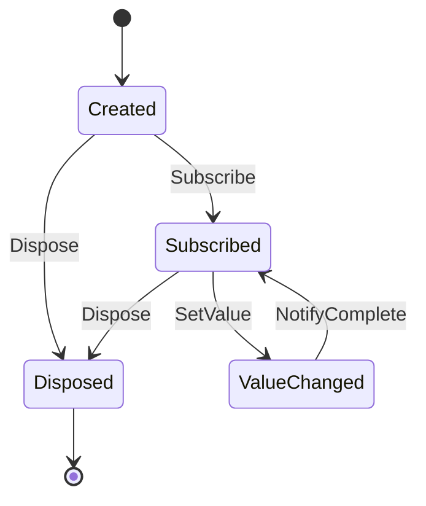
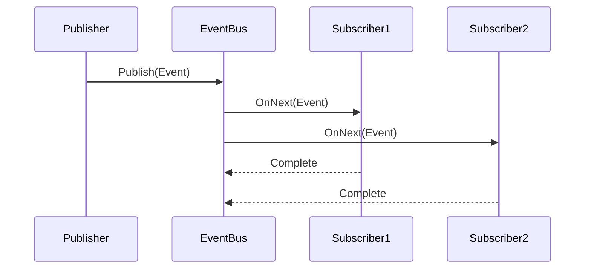
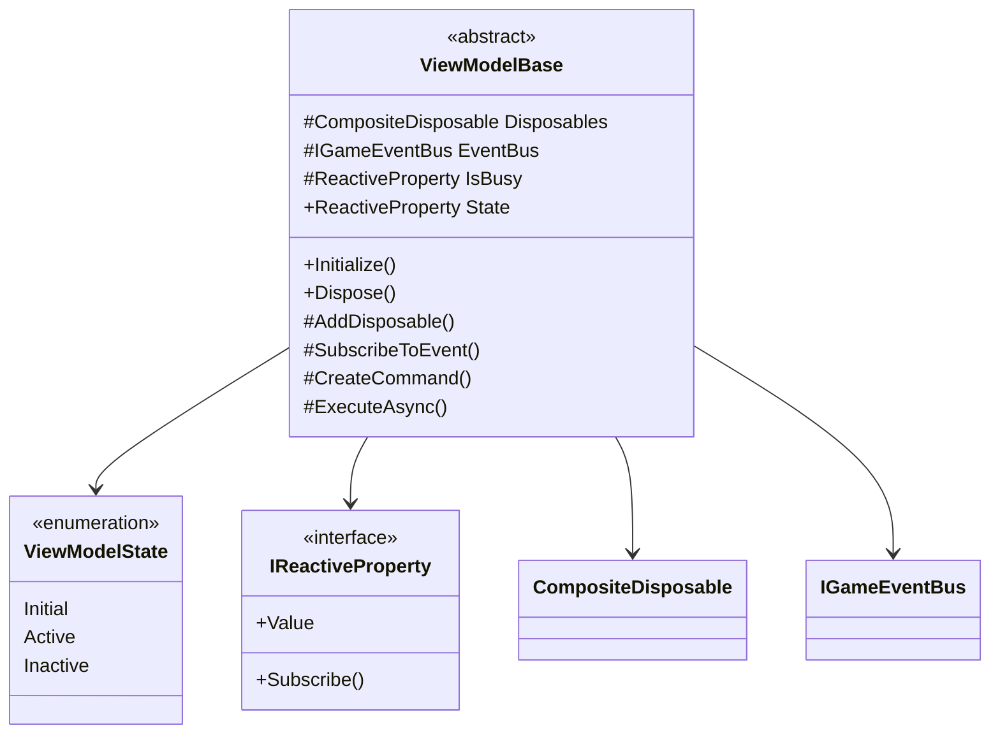

# リアクティブシステム

## 目次

1. [概要](#概要)
2. [リアクティブプロパティ](#リアクティブプロパティ)
3. [イベントシステム](#イベントシステム)
4. [リソース管理](#リソース管理)
5. [ViewModel](#viewmodel)
6. [使用例](#使用例)
7. [制限事項](#制限事項)
8. [テスト](#テスト)
9. [変更履歴](#変更履歴)

## 概要

リアクティブシステムは、値の変更通知とイベント処理を提供するコアシステムです。主に以下の機能を提供します：

-   リアクティブプロパティによる値変更通知
-   イベントバスによるイベント発行・購読
-   リソースの自動解放管理
-   MVVM パターンのサポート

## リアクティブプロパティ

### 状態遷移図



### IReactiveProperty<T>

値の変更を通知するリアクティブプロパティのインターフェースです。

```csharp
public interface IReactiveProperty<T> : IDisposable
{
    T Value { get; set; }
    IDisposable Subscribe(Action<T> onNext);
}
```

### ReactiveProperty<T>

`IReactiveProperty<T>`の実装クラスです。値が変更された時に購読者に通知します。

```csharp
public class ReactiveProperty<T> : IReactiveProperty<T>
{
    private T _value;
    private readonly Subject<T> _raw_subject = new();
    private readonly ISubject<T> _sync_subject;
    private readonly object _sync_lock = new();
    private bool _is_disposed;

    public T Value { get; set; }
    public IDisposable Subscribe(Action<T> onNext);
}
```

主な特徴：

-   スレッドセーフな実装（`Subject.Synchronize`を使用）
-   同一値設定時の通知制御
-   リソース解放時の適切な処理

## イベントシステム

### シーケンス図



### IGameEvent

ゲームイベントの基底インターフェースです。

```csharp
public interface IGameEvent
{
    DateTime Timestamp { get; }
}
```

### GameEvent

`IGameEvent`の実装クラスです。イベントの発生時刻を管理します。

```csharp
public abstract class GameEvent : IGameEvent
{
    public DateTime Timestamp { get; } = DateTime.UtcNow;
}
```

### IGameEventBus

イベントバスのインターフェースです。

```csharp
public interface IGameEventBus
{
    void Publish<T>(T evt) where T : GameEvent;
    IObservable<T> GetEventStream<T>() where T : GameEvent;
}
```

### GameEventBus

`IGameEventBus`の実装クラスです。イベントの発行と購読を管理します。

```csharp
public class GameEventBus : IGameEventBus
{
    private readonly ConcurrentDictionary<Type, ISubject<GameEvent>> _subjects = new();

    public void Publish<T>(T evt) where T : GameEvent;
    public IObservable<T> GetEventStream<T>() where T : GameEvent;
}
```

主な特徴：

-   スレッドセーフな実装（`ConcurrentDictionary`と`Subject.Synchronize`を使用）
-   型ごとのイベントストリーム管理
-   効率的なメモリ使用

## リソース管理

### CompositeDisposable

複数の`IDisposable`リソースをまとめて管理するクラスです。

```csharp
public class CompositeDisposable : IDisposable
{
    private readonly List<IDisposable> _disposables = new();
    private bool _is_disposed;
    private readonly object _sync_lock = new();

    public int DisposableCount { get; }
    public void Add(IDisposable disposable);
    public void AddRange(IEnumerable<IDisposable> disposables);
    public bool Remove(IDisposable disposable);
    public void Clear();
    public void Dispose();
}
```

主な特徴：

-   スレッドセーフな実装
-   循環参照の防止
-   効率的なリソース管理
-   一括操作のサポート

## ViewModel

### クラス図



### ViewModelBase

MVVM パターンのベースクラスです。

```csharp
public abstract class ViewModelBase : IDisposable
{
    protected readonly CompositeDisposable Disposables = new();
    protected readonly IGameEventBus EventBus;
    protected ReactiveProperty<bool> IsBusy { get; }
    public ReactiveProperty<ViewModelState> State { get; }

    protected ViewModelBase(IGameEventBus eventBus);
    public virtual void Dispose();
    protected void AddDisposable(IDisposable disposable);
    protected IDisposable SubscribeToEvent<T>(Action<T> onNext) where T : GameEvent;
    protected ReactiveCommand CreateCommand();
    protected ReactiveCommand<T> CreateCommand<T>();
    protected async Task ExecuteAsync(Func<Task> action);
    protected T GetValue<T>(IReactiveProperty<T> property);
    protected void SetValue<T>(IReactiveProperty<T> property, T value);
    public virtual void Activate();
    public virtual void Deactivate();
    protected virtual void OnActivate();
    protected virtual void OnDeactivate();
}
```

主な特徴：

-   リソース管理の自動化
-   イベント購読の簡易化
-   コマンド生成のヘルパーメソッド
-   非同期処理のサポート
-   アクティブ/非アクティブ状態の管理

### ViewModelState

ViewModel の状態を表す列挙型です。

```csharp
public enum ViewModelState
{
    Initial,
    Active,
    Inactive
}
```

## 使用例

### ViewModel の使用例

```csharp
public class PlayerViewModel : ViewModelBase
{
    private readonly ReactiveProperty<int> _health;
    public IReactiveProperty<int> Health => _health;

    public PlayerViewModel(IGameEventBus eventBus) : base(eventBus)
    {
        _health = new ReactiveProperty<int>(100).AddTo(Disposables);

        // イベントの購読
        SubscribeToEvent<PlayerDamagedEvent>(OnPlayerDamaged);
    }

    private void OnPlayerDamaged(PlayerDamagedEvent evt)
    {
        _health.Value -= evt.Damage;
    }

    protected override void OnActivate()
    {
        base.OnActivate();
        // アクティブ化時の処理
    }

    protected override void OnDeactivate()
    {
        base.OnDeactivate();
        // 非アクティブ化時の処理
    }
}
```

## 制限事項

-   スレッドセーフな実装が必要な箇所では、必ず提供されている同期メカニズムを使用してください
-   リソースの解放は適切なタイミングで行ってください
-   イベントの購読は必要最小限に抑えてください
-   非同期処理の実行時は、必ず`ExecuteAsync`メソッドを使用してください

## テスト

### テスト結果

詳細なテスト結果は[[ReactiveSystemTestResults|リアクティブシステムテスト結果]]を参照してください。

主なテスト項目：

-   リアクティブプロパティの値変更通知
-   イベントの発行と購読
-   リソースの解放
-   スレッドセーフな実装
-   パフォーマンス

## 変更履歴

| バージョン | 更新日     | 変更内容                                                     |
| ---------- | ---------- | ------------------------------------------------------------ |
| 0.5.0      | 2024-03-21 | ドキュメントの構造を更新し、制限事項とテストセクションを追加 |
| 0.4.0      | 2024-03-21 | ViewModel 機能の追加と使用例の更新                           |
| 0.3.0      | 2024-03-21 | イベントシステムの実装を更新                                 |
| 0.2.0      | 2024-03-21 | リソース管理機能の追加                                       |
| 0.1.0      | 2024-03-21 | 初版作成                                                     |
