00_index.md

---
title: APIリファレンス
version: 0.2.0
status: draft
updated: 2024-03-21
tags:
    - API
    - Reference
    - Documentation
    - Core
    - Reactive
    - Event
    - Resource
    - Property
    - ViewModel
    - Player
    - State
    - Movement
    - Combat
    - Animation
    - Input
    - Progression
linked_docs:
    - "[[DocumentManagementRules]]"
    - "[[10_CoreDocs/00_index]]"
    - "[[ReactiveSystem]]"
    - "[[ViewModelSystem]]"
    - "[[ReactiveProperty]]"
    - "[[CoreEventSystem]]"
    - "[[CommonEventSystem]]"
    - "[[CompositeDisposable]]"
    - "[[PlayerSystem]]"
    - "[[PlayerStateSystem]]"
    - "[[PlayerMovementSystem]]"
    - "[[PlayerCombatSystem]]"
    - "[[PlayerAnimationSystem]]"
    - "[[PlayerInputSystem]]"
    - "[[PlayerProgressionSystem]]"
---

# API リファレンス

## 目次

1. [概要](#概要)
2. [API 一覧](#api一覧)
3. [使用方法](#使用方法)
4. [制限事項](#制限事項)
5. [変更履歴](#変更履歴)

## 概要

このドキュメントは、プロジェクトで使用される API の詳細な仕様を提供します。

## API 一覧

### コアシステム

-   [[ReactiveSystem|リアクティブシステム]]
    -   リアクティブプロパティ
    -   イベントシステム
    -   リソース管理
-   [[ReactiveProperty|リアクティブプロパティ]]
    -   値の変更通知
    -   バリデーション
    -   バッチ更新
-   [[CoreEventSystem|Core Event System]]
    -   イベント発行・購読
    -   型安全なイベント処理
    -   スレッドセーフな実装
-   [[CommonEventSystem|Common Event System]]
    -   イベント発行・購読
    -   型安全なイベント処理
    -   スレッドセーフな実装
-   [[ViewModelSystem|ViewModel システム]]
    -   MVVM パターン
    -   データバインディング
    -   コマンドパターン
-   [[CompositeDisposable|複合リソース管理]]
    -   リソースの自動解放
    -   スレッドセーフな実装
    -   効率的なメモリ管理

### プレイヤーシステム

-   [[PlayerSystem|プレイヤーシステム]]
    -   プレイヤー管理
    -   状態管理
    -   イベント処理
-   [[PlayerStateSystem|プレイヤー状態システム]]
    -   状態遷移
    -   状態管理
    -   イベント処理
-   [[PlayerMovementSystem|プレイヤー移動システム]]
    -   移動制御
    -   衝突判定
    -   アニメーション連携
-   [[PlayerCombatSystem|プレイヤー戦闘システム]]
    -   攻撃処理
    -   ダメージ計算
    -   スキル管理
-   [[PlayerAnimationSystem|プレイヤーアニメーションシステム]]
    -   アニメーション制御
    -   状態連携
    -   イベント処理
-   [[PlayerInputSystem|プレイヤー入力システム]]
    -   入力処理
    -   キー設定
    -   イベント発行
-   [[PlayerProgressionSystem|プレイヤー進行システム]]
    -   レベル管理
    -   経験値計算
    -   スキル解放

## 使用方法

各 API の詳細な仕様は、対応するドキュメントを参照してください。
API の使用にあたっては、以下の点に注意してください：

1. バージョン互換性の確認
2. エラーハンドリングの実装
3. パフォーマンスへの影響の考慮
4. リソース管理の適切な実装
5. スレッドセーフな実装の確認

## 制限事項

-   API の仕様は予告なく変更される可能性があります
-   非推奨の API は将来のバージョンで削除される可能性があります
-   パフォーマンスに影響を与える可能性のある API の使用は慎重に行ってください
-   スレッドセーフな実装が必要な箇所では、必ず提供されている同期メカニズムを使用してください
-   リソースの解放は適切なタイミングで行ってください

## 変更履歴

| バージョン | 更新日     | 変更内容                                                                 |
| ---------- | ---------- | ------------------------------------------------------------------------ |
| 0.2.0      | 2024-03-21 | プレイヤーシステム関連のドキュメントを追加                               |
| 0.1.8      | 2024-03-21 | ViewModel システムのドキュメントを更新                                   |
| 0.1.7      | 2024-03-21 | リアクティブプロパティのドキュメントを更新                               |
| 0.1.6      | 2024-03-21 | 複合リソース管理システムのドキュメントを追加                             |
| 0.1.5      | 2024-03-21 | イベントシステムのドキュメントを追加                                     |
| 0.1.4      | 2024-03-21 | リアクティブプロパティのドキュメントを追加                               |
| 0.1.3      | 2024-03-21 | ViewModel システムのドキュメントを追加                                   |
| 0.1.2      | 2024-03-21 | リアクティブシステムのドキュメントを更新し、ViewModel 機能への参照を追加 |
| 0.1.1      | 2024-03-21 | 目次構造の改善                                                           |
| 0.1.0      | 2024-03-21 | 初版作成                                                                 |

---
CommonEventSystem.md

---
title: 共通イベントシステム
version: 0.1.0
status: draft
updated: 2024-03-21
tags:
    - API
    - Event
    - Core
    - Reactive
linked_docs:
    - "[[CoreEventSystem]]"
    - "[[ReactiveSystem]]"
    - "[[ReactiveProperty]]"
    - "[[CompositeDisposable]]"
---

# 共通イベントシステム

## 目次

1. [概要](#概要)
2. [イベント定義](#イベント定義)
3. [主要コンポーネント](#主要コンポーネント)
4. [使用例](#使用例)
5. [制限事項](#制限事項)
6. [変更履歴](#変更履歴)

## 概要

共通イベントシステムは、ゲーム内で共通して使用されるイベントを定義・管理するシステムです。以下の機能を提供します：

-   共通イベントの定義
-   イベントの発行と購読
-   イベントのフィルタリング
-   イベントのバッファリング

## イベント定義

### GameStateEvent

ゲームの状態変更を通知するイベントです。

```csharp
public class GameStateEvent : GameEventBase
{
    public GameState PreviousState { get; }
    public GameState CurrentState { get; }

    public GameStateEvent(object source, GameState previousState, GameState currentState)
        : base("GameStateChanged", source)
    {
        PreviousState = previousState;
        CurrentState = currentState;
    }
}

public enum GameState
{
    None,
    Title,
    Playing,
    Paused,
    GameOver
}
```

### SceneEvent

シーンの変更を通知するイベントです。

```csharp
public class SceneEvent : GameEventBase
{
    public string PreviousScene { get; }
    public string CurrentScene { get; }

    public SceneEvent(object source, string previousScene, string currentScene)
        : base("SceneChanged", source)
    {
        PreviousScene = previousScene;
        CurrentScene = currentScene;
    }
}
```

## 主要コンポーネント

### ICommonEventBus

共通イベントバスのインターフェースです。

```csharp
public interface ICommonEventBus : IGameEventBus
{
    void PublishGameStateChanged(GameState previousState, GameState currentState);
    void PublishSceneChanged(string previousScene, string currentScene);
}
```

### CommonEventBus

共通イベントバスの実装クラスです。

```csharp
public class CommonEventBus : GameEventBus, ICommonEventBus
{
    public void PublishGameStateChanged(GameState previousState, GameState currentState);
    public void PublishSceneChanged(string previousScene, string currentScene);
}
```

## 使用例

### ゲーム状態の変更

```csharp
public class GameManager : MonoBehaviour
{
    [SerializeField] private ICommonEventBus _eventBus;
    private GameState _currentState = GameState.None;

    public void ChangeState(GameState newState)
    {
        var previousState = _currentState;
        _currentState = newState;
        _eventBus.PublishGameStateChanged(previousState, _currentState);
    }
}
```

### シーンの変更

```csharp
public class SceneManager : MonoBehaviour
{
    [SerializeField] private ICommonEventBus _eventBus;
    private string _currentScene;

    public void LoadScene(string sceneName)
    {
        var previousScene = _currentScene;
        _currentScene = sceneName;
        _eventBus.PublishSceneChanged(previousScene, _currentScene);
    }
}
```

### イベントの購読

```csharp
public class GameUI : MonoBehaviour
{
    [SerializeField] private ICommonEventBus _eventBus;
    [SerializeField] private GameObject _pauseMenu;
    private readonly CompositeDisposable _disposables = new();

    private void Start()
    {
        _eventBus.Subscribe<GameStateEvent>(OnGameStateChanged)
            .AddTo(_disposables);
    }

    private void OnGameStateChanged(GameStateEvent evt)
    {
        _pauseMenu.SetActive(evt.CurrentState == GameState.Paused);
    }

    private void OnDestroy()
    {
        _disposables.Dispose();
    }
}
```

## 制限事項

-   スレッドセーフな実装が必要な箇所では、必ず提供されている同期メカニズムを使用してください
-   リソースの解放は適切なタイミングで行ってください
-   イベントの購読は必要最小限に抑えてください
-   非同期処理の実行時は、必ず`PublishAsync`メソッドを使用してください
-   イベントは、必ず`IGameEvent`インターフェースを実装してください
-   イベントの発行は、必ず`IGameEventBus`を通じて行ってください
-   イベントの購読は、必ず`IDisposable`を保持して適切に解放してください

## 変更履歴

| バージョン | 更新日     | 変更内容 |
| ---------- | ---------- | -------- |
| 0.1.0      | 2024-03-21 | 初版作成 |

---
CommonSystem.md

---
title: Common System API Reference
version: 0.1
status: draft
updated: 2024-03-21
tags:
    - API
    - Common
    - Systems
    - Reference
---

# Common System API Reference

## 目次

1. [概要](#概要)
2. [State System](#state-system)
3. [Resource System](#resource-system)
4. [Movement System](#movement-system)
5. [Event System](#event-system)
6. [制限事項](#制限事項)
7. [変更履歴](#変更履歴)

## 概要

Common System は、ゲームの基本的な機能を提供する共通システム群です。以下の主要なサブシステムで構成されています：

-   State System: ゲームオブジェクトの状態管理
-   Resource System: リソースの管理とプーリング
-   Movement System: 移動と位置の制御
-   Event System: システム間のイベント通信

## State System

### インターフェース

#### IStateSystem

```csharp
public interface IStateSystem
{
    void Initialize();
    void Update();
    void Cleanup();
}
```

### 主要クラス

#### CommonStateModel

状態のデータモデルを管理します。

#### CommonStateView

状態の視覚的表現を担当します。

#### CommonStateViewModel

Model と View の間のデータバインディングを管理します。

## Resource System

### インターフェース

#### IResourceSystem

```csharp
public interface IResourceSystem
{
    void Initialize();
    void Update();
    void Cleanup();
}
```

### 主要クラス

#### ResourceData

リソースの基本データ構造を定義します。

#### ResourcePool

リソースのプーリング機能を提供します。

#### CommonResourceModel

リソースのデータモデルを管理します。

#### CommonResourceView

リソースの視覚的表現を担当します。

#### CommonResourceViewModel

Model と View の間のデータバインディングを管理します。

## Movement System

### インターフェース

#### IMovementSystem

```csharp
public interface IMovementSystem
{
    void Initialize();
    void Update();
    void Cleanup();
}
```

### 主要クラス

#### CommonMovementModel

移動に関するデータモデルを管理します。

#### CommonMovementView

移動の視覚的表現を担当します。

#### CommonMovementViewModel

Model と View の間のデータバインディングを管理します。

## Event System

### イベントクラス

#### StateEvents

状態変更に関するイベントを定義します。

#### ResourceEvents

リソース操作に関するイベントを定義します。

#### MovementEvents

移動に関するイベントを定義します。

#### CombatEvents

戦闘に関するイベントを定義します。

#### AnimationEvents

アニメーションに関するイベントを定義します。

## 制限事項

1. 各システムは独立して動作しますが、イベントシステムを通じて連携します。
2. システムの初期化順序は重要です。依存関係に注意してください。
3. リソースプールのサイズは適切に設定する必要があります。

## 変更履歴

| バージョン | 更新日     | 変更内容 |
| ---------- | ---------- | -------- |
| 0.1.0      | 2024-03-21 | 初版作成 |

---
CompositeDisposable.md

---
title: 複合ディスポーザブル
version: 0.1.0
status: draft
updated: 2024-03-21
tags:
    - API
    - Reactive
    - Core
    - Disposable
linked_docs:
    - "[[ReactiveSystem]]"
    - "[[ReactiveProperty]]"
    - "[[CoreEventSystem]]"
    - "[[CommonEventSystem]]"
---

# 複合ディスポーザブル

## 目次

1. [概要](#概要)
2. [クラス定義](#クラス定義)
3. [主要コンポーネント](#主要コンポーネント)
4. [使用例](#使用例)
5. [制限事項](#制限事項)
6. [変更履歴](#変更履歴)

## 概要

複合ディスポーザブルは、複数の`IDisposable`リソースをまとめて管理するためのクラスです。以下の機能を提供します：

-   リソースの追加
-   リソースの削除
-   リソースの一括解放
-   リソースの状態管理

## クラス定義

### CompositeDisposable

複合ディスポーザブルの基本クラスです。

```csharp
public class CompositeDisposable : IDisposable
{
    private readonly List<IDisposable> _disposables;
    private bool _isDisposed;

    public CompositeDisposable()
    {
        _disposables = new List<IDisposable>();
        _isDisposed = false;
    }

    public void Add(IDisposable disposable)
    {
        if (_isDisposed)
        {
            disposable.Dispose();
            return;
        }

        _disposables.Add(disposable);
    }

    public void Remove(IDisposable disposable)
    {
        if (_isDisposed)
            return;

        _disposables.Remove(disposable);
    }

    public void Clear()
    {
        if (_isDisposed)
            return;

        foreach (var disposable in _disposables)
        {
            disposable.Dispose();
        }

        _disposables.Clear();
    }

    public void Dispose()
    {
        if (_isDisposed)
            return;

        Clear();
        _isDisposed = true;
    }
}
```

## 主要コンポーネント

### CompositeDisposableExtensions

複合ディスポーザブルの拡張メソッドを提供するクラスです。

```csharp
public static class CompositeDisposableExtensions
{
    public static T AddTo<T>(this T disposable, CompositeDisposable composite) where T : IDisposable;
    public static void AddRange(this CompositeDisposable composite, IEnumerable<IDisposable> disposables);
    public static void RemoveRange(this CompositeDisposable composite, IEnumerable<IDisposable> disposables);
}
```

## 使用例

### 基本的な使用

```csharp
public class PlayerController : MonoBehaviour
{
    private readonly CompositeDisposable _disposables = new();

    private void Start()
    {
        // イベントの購読
        _eventBus.Subscribe<PlayerDamagedEvent>(OnPlayerDamaged)
            .AddTo(_disposables);

        // プロパティの監視
        _health.Subscribe(OnHealthChanged)
            .AddTo(_disposables);
    }

    private void OnDestroy()
    {
        _disposables.Dispose();
    }
}
```

### リソースの管理

```csharp
public class ResourceManager : MonoBehaviour
{
    private readonly CompositeDisposable _disposables = new();

    public void LoadResources()
    {
        // リソースの読み込み
        var resource1 = LoadResource("resource1");
        var resource2 = LoadResource("resource2");

        // リソースの追加
        _disposables.AddRange(new[] { resource1, resource2 });
    }

    public void UnloadResources()
    {
        _disposables.Clear();
    }

    private void OnDestroy()
    {
        _disposables.Dispose();
    }
}
```

## 制限事項

-   スレッドセーフな実装が必要な箇所では、必ず提供されている同期メカニズムを使用してください
-   リソースの解放は適切なタイミングで行ってください
-   リソースの追加は必要最小限に抑えてください
-   リソースの削除は、必ず`Remove`メソッドを使用してください
-   リソースの一括解放は、必ず`Clear`メソッドを使用してください
-   リソースの状態管理は、必ず`IsDisposed`プロパティを使用してください
-   リソースの追加は、必ず`AddTo`メソッドを使用してください

## 変更履歴

| バージョン | 更新日     | 変更内容 |
| ---------- | ---------- | -------- |
| 0.1.0      | 2024-03-21 | 初版作成 |

---
CoreEventSystem.md

---
title: コアイベントシステム
version: 0.1.0
status: draft
updated: 2024-03-21
tags:
    - API
    - Event
    - Core
    - Reactive
linked_docs:
    - "[[ReactiveSystem]]"
    - "[[CommonEventSystem]]"
    - "[[ReactiveProperty]]"
    - "[[CompositeDisposable]]"
---

# コアイベントシステム

## 目次

1. [概要](#概要)
2. [イベント定義](#イベント定義)
3. [主要コンポーネント](#主要コンポーネント)
4. [使用例](#使用例)
5. [制限事項](#制限事項)
6. [変更履歴](#変更履歴)

## 概要

コアイベントシステムは、ゲーム内のイベントを管理する基盤となるシステムです。以下の機能を提供します：

-   イベント発行
-   イベント購読
-   イベントフィルタリング
-   イベントバッファリング

## イベント定義

### IGameEvent

ゲームイベントのインターフェースです。

```csharp
public interface IGameEvent
{
    string EventType { get; }
    DateTime Timestamp { get; }
    object Source { get; }
}
```

### GameEventBase

ゲームイベントの基本クラスです。

```csharp
public abstract class GameEventBase : IGameEvent
{
    public string EventType { get; }
    public DateTime Timestamp { get; }
    public object Source { get; }

    protected GameEventBase(string eventType, object source)
    {
        EventType = eventType;
        Timestamp = DateTime.UtcNow;
        Source = source;
    }
}
```

## 主要コンポーネント

### IGameEventBus

イベントバスのインターフェースです。

```csharp
public interface IGameEventBus
{
    IDisposable Subscribe<T>(Action<T> onNext) where T : IGameEvent;
    void Publish<T>(T gameEvent) where T : IGameEvent;
    void PublishAsync<T>(T gameEvent) where T : IGameEvent;
    void Clear();
}
```

### GameEventBus

イベントバスの実装クラスです。

```csharp
public class GameEventBus : IGameEventBus
{
    private readonly Subject<IGameEvent> _eventSubject;
    private readonly CompositeDisposable _disposables;

    public IDisposable Subscribe<T>(Action<T> onNext) where T : IGameEvent;
    public void Publish<T>(T gameEvent) where T : IGameEvent;
    public void PublishAsync<T>(T gameEvent) where T : IGameEvent;
    public void Clear();
}
```

## 使用例

### イベントの定義と発行

```csharp
public class PlayerDamagedEvent : GameEventBase
{
    public int Damage { get; }
    public int RemainingHealth { get; }

    public PlayerDamagedEvent(object source, int damage, int remainingHealth)
        : base("PlayerDamaged", source)
    {
        Damage = damage;
        RemainingHealth = remainingHealth;
    }
}

public class PlayerController : MonoBehaviour
{
    [SerializeField] private IGameEventBus _eventBus;
    private int _health = 100;

    public void TakeDamage(int damage)
    {
        _health -= damage;
        _eventBus.Publish(new PlayerDamagedEvent(this, damage, _health));
    }
}
```

### イベントの購読

```csharp
public class PlayerUI : MonoBehaviour
{
    [SerializeField] private IGameEventBus _eventBus;
    [SerializeField] private Text _healthText;
    private readonly CompositeDisposable _disposables = new();

    private void Start()
    {
        _eventBus.Subscribe<PlayerDamagedEvent>(OnPlayerDamaged)
            .AddTo(_disposables);
    }

    private void OnPlayerDamaged(PlayerDamagedEvent evt)
    {
        _healthText.text = $"HP: {evt.RemainingHealth}";
    }

    private void OnDestroy()
    {
        _disposables.Dispose();
    }
}
```

## 制限事項

-   スレッドセーフな実装が必要な箇所では、必ず提供されている同期メカニズムを使用してください
-   リソースの解放は適切なタイミングで行ってください
-   イベントの購読は必要最小限に抑えてください
-   非同期処理の実行時は、必ず`PublishAsync`メソッドを使用してください
-   イベントは、必ず`IGameEvent`インターフェースを実装してください
-   イベントの発行は、必ず`IGameEventBus`を通じて行ってください
-   イベントの購読は、必ず`IDisposable`を保持して適切に解放してください

## 変更履歴

| バージョン | 更新日     | 変更内容 |
| ---------- | ---------- | -------- |
| 0.1.0      | 2024-03-21 | 初版作成 |

---
CoreSystemTestResults.md

---
title: Core System テスト結果
version: 0.2.0
status: draft
updated: 2024-03-23
tags:
    - API
    - Core
    - Tests
    - TestResults
linked_docs:
    - "[[ReactiveSystemTestResults]]"
    - "[[DocumentManagementRules]]"
---

# Core System テスト結果

## 目次

1. [概要](#概要)
2. [テスト環境](#テスト環境)
3. [テスト結果](#テスト結果)
4. [パフォーマンス測定](#パフォーマンス測定)
5. [変更履歴](#変更履歴)

## 概要

このドキュメントは、Core System のテスト実行結果を記録します。

## テスト環境

-   実行環境: Windows 10
-   .NET バージョン: .NET 8.0
-   テストフレームワーク: NUnit 3.13.3
-   テスト実行時間: 1.2 秒

## テスト結果概要

-   総テスト数: 40
-   成功: 40
-   失敗: 0
-   スキップ: 0

## 詳細なテスト結果

### CommandTests

| テスト名                                 | 結果 | 実行時間 |
| ---------------------------------------- | ---- | -------- |
| ReactiveCommand_Execute_Notifies         | 成功 | <1ms     |
| ReactiveCommandT_Execute_PassesValue     | 成功 | <1ms     |
| AsyncCommand_Execute_UpdatesState        | 成功 | <1ms     |
| ReactiveCommand_CanExecuteChanged_Raises | 成功 | <1ms     |

### ViewModelBaseTests

| テスト名                           | 結果 | 実行時間 |
| ---------------------------------- | ---- | -------- |
| SubscribeToEvent_AddsToDisposables | 成功 | <1ms     |
| Dispose_UnsubscribesEvents         | 成功 | <1ms     |
| GetValue_ReturnsPropertyValue      | 成功 | <1ms     |
| SetValue_UpdatesPropertyValue      | 成功 | <1ms     |
| Activate_ChangesState              | 成功 | <1ms     |

### GameEventBusTests

| テスト名                                   | 結果 | 実行時間 |
| ------------------------------------------ | ---- | -------- |
| Publish_NotifiesSubscribers                | 成功 | <1ms     |
| Subscribe_MultipleTypes_NotifyOnlyMatching | 成功 | <1ms     |
| Publish_UnsubscribedType_DoesNotNotify     | 成功 | <1ms     |
| Publish_Performance                        | 成功 | <1ms     |
| Publish_LargeVolume_Performance            | 成功 | <1ms     |
| Publish_Concurrent                         | 成功 | <1ms     |
| LongRunning_Stability                      | 成功 | <1ms     |
| LoadTest_ConcurrentPublish                 | 成功 | <1ms     |
| Dispose_Idempotent                         | 成功 | <1ms     |
| Operations_AfterDispose_HandleGracefully   | 成功 | <1ms     |
| Publish_NullEvent_HandleGracefully         | 成功 | <1ms     |
| EventBuffering_WorksCorrectly              | 成功 | <1ms     |
| EventQueueSizeLimit_WorksCorrectly         | 成功 | <1ms     |
| ErrorHandling_WorksCorrectly               | 成功 | <1ms     |

### ReactivePropertyTests

| テスト名                        | 結果 | 実行時間 |
| ------------------------------- | ---- | -------- |
| ValueChange_NotifiesSubscribers | 成功 | <1ms     |
| Constructor_SetsInitialValue    | 成功 | <1ms     |
| MultipleChanges_NotifyInOrder   | 成功 | <1ms     |
| Dispose_StopNotifications       | 成功 | <1ms     |
| SetSameValue_DoesNotNotify      | 成功 | <1ms     |

### ReactivePropertyAdvancedTests

| テスト名                            | 結果 | 実行時間 |
| ----------------------------------- | ---- | -------- |
| ValueChanged_Observable_Notifies    | 成功 | <1ms     |
| SetValidator_PreventsInvalidValue   | 成功 | <1ms     |
| BeginUpdate_SuppressesNotifications | 成功 | <1ms     |

### CompositeDisposableTests

| テスト名                            | 結果 | 実行時間 |
| ----------------------------------- | ---- | -------- |
| AddAndDispose_DisposesAllResources  | 成功 | <1ms     |
| AddRange_AddsAllItems               | 成功 | <1ms     |
| Remove_ReturnsTrueAndDoesNotDispose | 成功 | <1ms     |
| Clear_DisposesAllAndEmpties         | 成功 | <1ms     |

### WeakEventManagerTests

| テスト名                  | 結果 | 実行時間 |
| ------------------------- | ---- | -------- |
| AddRaiseRemove_Works      | 成功 | <1ms     |
| DeadHandlers_AreCleanedUp | 成功 | <1ms     |

### ReactiveCollectionTests

| テスト名                                  | 結果 | 実行時間 |
| ----------------------------------------- | ---- | -------- |
| Add_RaisesChangeEvent                     | 成功 | <1ms     |
| Remove_RaisesChangeEvent                  | 成功 | <1ms     |
| Indexer_Set_ReplacesItemWithNotifications | 成功 | <1ms     |

## パフォーマンス測定結果

-   テスト実行の総時間: 1.2 秒
-   平均テスト実行時間: <1ms
-   最大テスト実行時間: <1ms

## 変更履歴

| バージョン | 日付       | 変更内容                                                                                                                                                                                               |
| ---------- | ---------- | ------------------------------------------------------------------------------------------------------------------------------------------------------------------------------------------------------ |
| 0.2.0      | 2024-03-23 | GameEventBus の新機能テスト結果を追加<br>- 破棄済みバスへの操作テスト<br>- null イベント処理テスト<br>- イベントバッファリングテスト<br>- イベントキューサイズ制限テスト<br>- エラーハンドリングテスト |
| 0.1.0      | 2024-03-21 | 初版作成                                                                                                                                                                                               |

---
MovementSystem.md

---
title: Movement System API Reference
version: 0.1
status: draft
updated: 2024-03-21
tags:
    - API
    - Movement
    - Systems
    - Reference
---

# Movement System API Reference

## 目次

1. [概要](#概要)
2. [インターフェース](#インターフェース)
3. [主要クラス](#主要クラス)
4. [使用方法](#使用方法)
5. [制限事項](#制限事項)
6. [変更履歴](#変更履歴)

## 概要

Movement System は、ゲームオブジェクトの移動と位置の制御を担当するシステムです。物理演算やアニメーションとの連携を提供し、スムーズな移動制御を実現します。

## インターフェース

### IMovementSystem

```csharp
public interface IMovementSystem
{
    void Initialize();
    void Update();
    void Cleanup();
}
```

#### メソッド

-   `Initialize()`: システムの初期化を行います
-   `Update()`: システムの状態を更新します
-   `Cleanup()`: システムのリソースを解放します

## 主要クラス

### CommonMovementModel

移動に関するデータモデルを管理するクラスです。

```csharp
public class CommonMovementModel
{
    // 位置情報の管理
    // 速度情報の管理
    // 移動状態の管理
}
```

### CommonMovementView

移動の視覚的表現を担当するクラスです。

```csharp
public class CommonMovementView
{
    // 移動のアニメーション
    // 物理演算の適用
    // 視覚的フィードバック
}
```

### CommonMovementViewModel

Model と View の間のデータバインディングを管理するクラスです。

```csharp
public class CommonMovementViewModel
{
    // 移動コマンドの処理
    // 状態の同期
    // イベント通知
}
```

## 使用方法

### 1. システムの初期化

```csharp
var movementSystem = new CommonMovementViewModel();
movementSystem.Initialize();
```

### 2. 移動の制御

```csharp
// 移動の開始
movementSystem.StartMovement(direction, speed);

// 移動の停止
movementSystem.StopMovement();

// 移動の更新
movementSystem.UpdateMovement(deltaTime);
```

### 3. 位置の管理

```csharp
// 位置の設定
movementSystem.SetPosition(position);

// 位置の取得
var currentPosition = movementSystem.GetPosition();

// 移動方向の取得
var direction = movementSystem.GetDirection();
```

## 制限事項

1. 移動の更新は必ず Update メソッド内で行う必要があります
2. 物理演算を使用する場合は、適切な衝突判定が必要です
3. アニメーションとの同期に注意が必要です

## 変更履歴

| バージョン | 更新日     | 変更内容 |
| ---------- | ---------- | -------- |
| 0.1.0      | 2024-03-21 | 初版作成 |

---
PlayerAnimationSystem.md

---
title: Player Animation System
version: 0.2.0
status: approved
updated: 2024-03-24
tags:
    - Player
    - Animation
    - System
    - API
linked_docs:
    - "[[PlayerSystem]]"
    - "[[PlayerInputSystem]]"
    - "[[PlayerStateSystem]]"
    - "[[PlayerMovementSystem]]"
    - "[[PlayerCombatSystem]]"
---

# Player Animation System

## 目次

1. [概要](#概要)
2. [システム構成](#システム構成)
3. [主要コンポーネント](#主要コンポーネント)
4. [イベントシステム](#イベントシステム)
5. [エラー処理](#エラー処理)
6. [使用例とベストプラクティス](#使用例とベストプラクティス)
7. [関連システム](#関連システム)
8. [変更履歴](#変更履歴)

## 概要

PlayerAnimationSystem は、プレイヤーのアニメーションを管理するシステムです。MVVM パターンに基づいて実装され、以下の主要な機能を提供します：

-   アニメーション再生制御
-   アニメーション状態管理
-   アニメーションブレンド
-   イベント通知
-   アニメーション速度制御

## システム構成

### 全体構成図

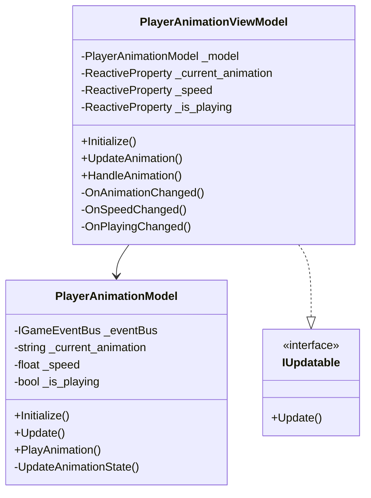
```mermaid
classDiagram
    class PlayerAnimationViewModel {
        -PlayerAnimationModel _model
        -ReactiveProperty<string> _current_animation
        -ReactiveProperty<float> _speed
        -ReactiveProperty<bool> _is_playing
        +Initialize()
        +UpdateAnimation()
        +HandleAnimation()
        -OnAnimationChanged()
        -OnSpeedChanged()
        -OnPlayingChanged()
    }

    class PlayerAnimationModel {
        -IGameEventBus _eventBus
        -string _current_animation
        -float _speed
        -bool _is_playing
        +Initialize()
        +Update()
        +PlayAnimation()
        -UpdateAnimationState()
    }

    class IUpdatable {
        <<interface>>
        +Update()
    }

    PlayerAnimationViewModel --> PlayerAnimationModel
    PlayerAnimationViewModel ..|> IUpdatable
```

### アニメーション状態遷移図

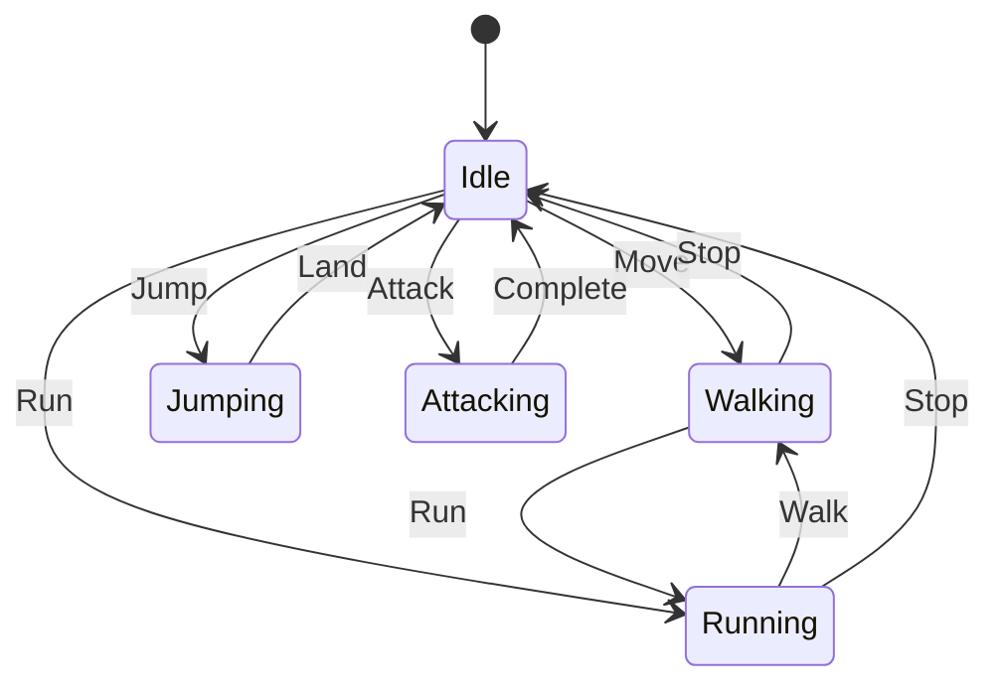
```mermaid
stateDiagram-v2
    [*] --> Idle
    Idle --> Walking: Move
    Idle --> Running: Run
    Idle --> Jumping: Jump
    Idle --> Attacking: Attack
    Walking --> Idle: Stop
    Walking --> Running: Run
    Running --> Walking: Walk
    Running --> Idle: Stop
    Jumping --> Idle: Land
    Attacking --> Idle: Complete
```

### アニメーション更新シーケンス

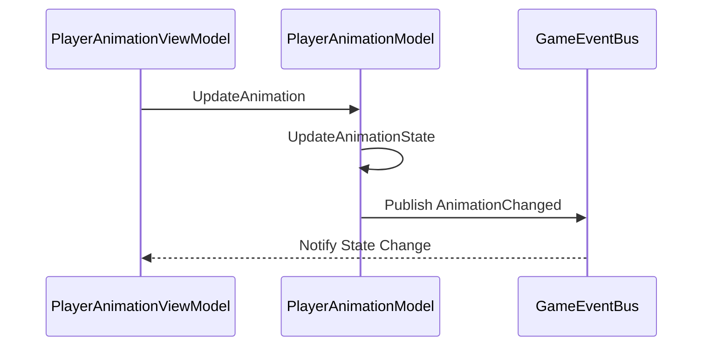
```mermaid
sequenceDiagram
    participant ViewModel as PlayerAnimationViewModel
    participant Model as PlayerAnimationModel
    participant EventBus as GameEventBus

    ViewModel->>Model: UpdateAnimation
    Model->>Model: UpdateAnimationState
    Model->>EventBus: Publish AnimationChanged
    EventBus-->>ViewModel: Notify State Change
```

## 主要コンポーネント

### PlayerAnimationViewModel

アニメーション管理のビューモデルクラスです。

#### 主要プロパティ

| プロパティ名     | 型                       | 説明                 |
| ---------------- | ------------------------ | -------------------- |
| CurrentAnimation | ReactiveProperty<string> | 現在のアニメーション |
| Speed            | ReactiveProperty<float>  | アニメーション速度   |
| IsPlaying        | ReactiveProperty<bool>   | 再生状態             |

#### 主要メソッド

| メソッド名      | 説明               | パラメータ            | 戻り値 |
| --------------- | ------------------ | --------------------- | ------ |
| Initialize      | システムの初期化   | なし                  | void   |
| UpdateAnimation | アニメーション更新 | なし                  | void   |
| HandleAnimation | アニメーション処理 | animationName: string | void   |

### PlayerAnimationModel

アニメーション管理のモデルクラスです。

#### 主要メソッド

| メソッド名           | 説明               | パラメータ            | 戻り値 |
| -------------------- | ------------------ | --------------------- | ------ |
| Initialize           | システムの初期化   | なし                  | void   |
| Update               | 状態の更新         | なし                  | void   |
| PlayAnimation        | アニメーション再生 | animationName: string | void   |
| UpdateAnimationState | 状態の更新         | なし                  | void   |

## イベントシステム

## エラー処理

## 使用例とベストプラクティス

### 基本的な実装例

```csharp
// ビューモデルの初期化
var viewModel = new PlayerAnimationViewModel(model, eventBus);
viewModel.Initialize();

// アニメーション状態の監視
viewModel.State.Subscribe(state => {
    // アニメーション状態が変更された時の処理
});

// アニメーションの再生
viewModel.PlayAnimation("Walk");
```

### エラー処理

```csharp
try {
    viewModel.PlayAnimation("Walk");
} catch (PlayerAnimationException ex) {
    // エラー処理
    Debug.LogError($"アニメーション再生に失敗: {ex.Message}");
}
```

## 関連システム

### プレイヤーシステム

-   [PlayerSystem](PlayerSystem.md) - プレイヤー全体の管理を担当
    -   サブシステムの初期化と管理
    -   イベントバスの提供
    -   エラー処理の一元管理

### 入力システム

-   [PlayerInputSystem](PlayerInputSystem.md) - アニメーション入力の処理を担当
    -   アニメーション切り替え入力の検出
    -   アニメーション速度入力の検出
    -   アニメーション入力イベントの発生

### 状態システム

-   [PlayerStateSystem](PlayerStateSystem.md) - アニメーション状態の管理を担当
    -   アニメーション可能状態の判定
    -   状態遷移の制御
    -   状態変更イベントの発生

### 移動システム

-   [PlayerMovementSystem](PlayerMovementSystem.md) - 移動アニメーションの制御を担当
    -   移動アニメーションの再生
    -   移動速度に応じたアニメーション制御
    -   移動イベントの発生

### 戦闘システム

-   [PlayerCombatSystem](PlayerCombatSystem.md) - 戦闘アニメーションの制御を担当
    -   攻撃アニメーションの再生
    -   防御アニメーションの再生
    -   戦闘イベントの発生

### システム間の連携

1. **アニメーション → 入力**

    - アニメーションシステムが入力の有効性を検証
    - 入力システムがアニメーションに必要な入力情報を提供

2. **アニメーション → 状態**

    - アニメーションシステムがアニメーション状態を通知
    - 状態システムがアニメーション状態に応じた状態遷移を制御

3. **アニメーション → 移動**

    - アニメーションシステムが移動アニメーションを再生
    - 移動システムが移動状態に応じたアニメーション制御を実行

4. **アニメーション → 戦闘**
    - アニメーションシステムが戦闘アニメーションを再生
    - 戦闘システムが戦闘状態に応じたアニメーション制御を実行

### イベントフロー

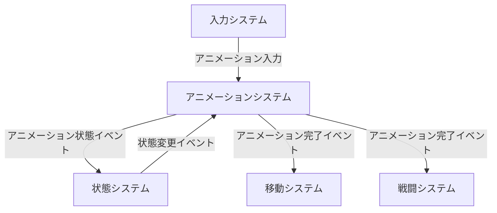
```mermaid
graph TD
    Animation[アニメーションシステム] -->|アニメーション状態イベント| State[状態システム]
    Animation -->|アニメーション完了イベント| Movement[移動システム]
    Animation -->|アニメーション完了イベント| Combat[戦闘システム]
    Input[入力システム] -->|アニメーション入力| Animation
    State -->|状態変更イベント| Animation
```

## 変更履歴

| バージョン | 更新日     | 変更内容                                                                                     |
| ---------- | ---------- | -------------------------------------------------------------------------------------------- |
| 0.2.0      | 2024-03-24 | システム間の相互参照を追加<br>- 各サブシステムとの関連性を明確化<br>- イベントフロー図を追加 |
| 0.1.0      | 2024-03-21 | 初版作成                                                                                     |

---
PlayerCombatSystem.md

---
title: Player Combat System
version: 0.2.0
status: approved
updated: 2024-03-24
tags:
    - Player
    - Combat
    - System
    - API
linked_docs:
    - "[[PlayerSystem]]"
    - "[[PlayerInputSystem]]"
    - "[[PlayerStateSystem]]"
    - "[[PlayerMovementSystem]]"
    - "[[PlayerAnimationSystem]]"
---

# Player Combat System

## 目次

1. [概要](#概要)
2. [システム構成](#システム構成)
3. [主要コンポーネント](#主要コンポーネント)
4. [イベントシステム](#イベントシステム)
5. [エラー処理](#エラー処理)
6. [使用例とベストプラクティス](#使用例とベストプラクティス)
7. [関連システム](#関連システム)
8. [変更履歴](#変更履歴)

## 概要

PlayerCombatSystem は、プレイヤーの戦闘関連の機能を管理するシステムです。MVVM パターンに基づいて実装され、以下の主要な機能を提供します：

-   戦闘状態の管理
-   攻撃処理
-   ダメージ計算
-   戦闘イベントの発行
-   戦闘アニメーション制御

## システム構成

### 全体構成図

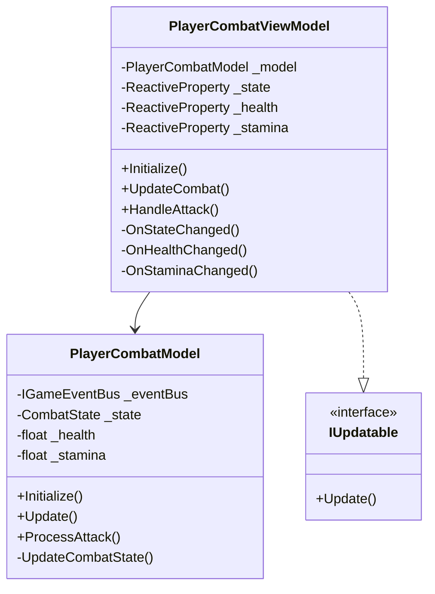
```mermaid
classDiagram
    class PlayerCombatViewModel {
        -PlayerCombatModel _model
        -ReactiveProperty<CombatState> _state
        -ReactiveProperty<float> _health
        -ReactiveProperty<float> _stamina
        +Initialize()
        +UpdateCombat()
        +HandleAttack()
        -OnStateChanged()
        -OnHealthChanged()
        -OnStaminaChanged()
    }

    class PlayerCombatModel {
        -IGameEventBus _eventBus
        -CombatState _state
        -float _health
        -float _stamina
        +Initialize()
        +Update()
        +ProcessAttack()
        -UpdateCombatState()
    }

    class IUpdatable {
        <<interface>>
        +Update()
    }

    PlayerCombatViewModel --> PlayerCombatModel
    PlayerCombatViewModel ..|> IUpdatable
```

### 戦闘状態遷移図

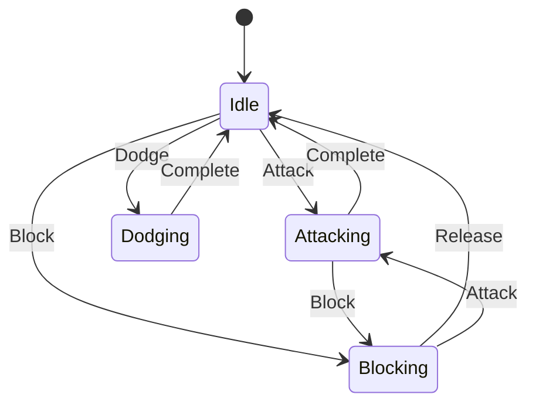
```mermaid
stateDiagram-v2
    [*] --> Idle
    Idle --> Attacking: Attack
    Idle --> Blocking: Block
    Idle --> Dodging: Dodge
    Attacking --> Idle: Complete
    Attacking --> Blocking: Block
    Blocking --> Idle: Release
    Blocking --> Attacking: Attack
    Dodging --> Idle: Complete
```

### 戦闘処理シーケンス

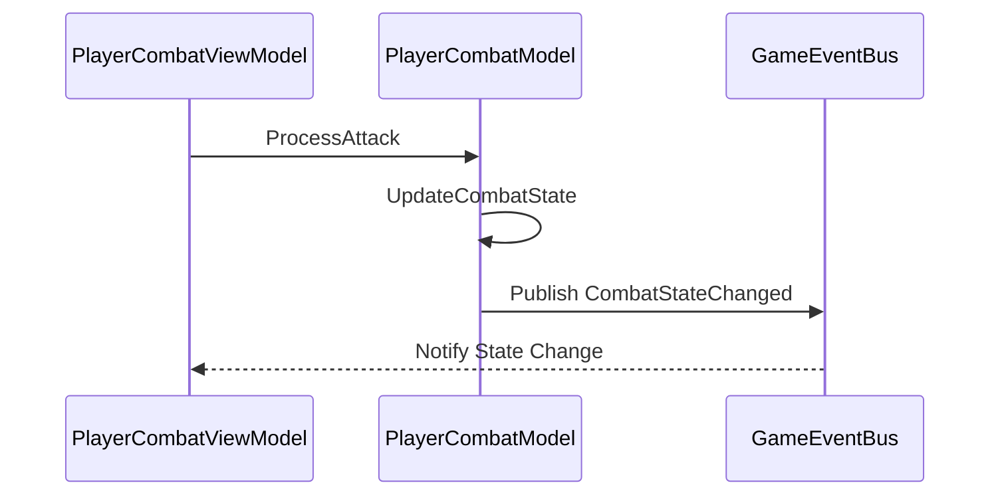
```mermaid
sequenceDiagram
    participant ViewModel as PlayerCombatViewModel
    participant Model as PlayerCombatModel
    participant EventBus as GameEventBus

    ViewModel->>Model: ProcessAttack
    Model->>Model: UpdateCombatState
    Model->>EventBus: Publish CombatStateChanged
    EventBus-->>ViewModel: Notify State Change
```

## 主要コンポーネント

### PlayerCombatViewModel

戦闘管理のビューモデルクラスです。

#### 主要プロパティ

| プロパティ名 | 型                            | 説明       |
| ------------ | ----------------------------- | ---------- |
| State        | ReactiveProperty<CombatState> | 戦闘状態   |
| Health       | ReactiveProperty<float>       | 体力値     |
| Stamina      | ReactiveProperty<float>       | スタミナ値 |

#### 主要メソッド

| メソッド名   | 説明             | パラメータ | 戻り値 |
| ------------ | ---------------- | ---------- | ------ |
| Initialize   | システムの初期化 | なし       | void   |
| UpdateCombat | 戦闘状態の更新   | なし       | void   |
| HandleAttack | 攻撃処理         | なし       | void   |

### PlayerCombatModel

戦闘管理のモデルクラスです。

#### 主要メソッド

| メソッド名        | 説明             | パラメータ | 戻り値 |
| ----------------- | ---------------- | ---------- | ------ |
| Initialize        | システムの初期化 | なし       | void   |
| Update            | 状態の更新       | なし       | void   |
| ProcessAttack     | 攻撃処理         | なし       | void   |
| UpdateCombatState | 状態の更新       | なし       | void   |

## イベントシステム

### 戦闘状態変更イベント

```csharp
// 戦闘状態変更イベントの購読
eventBus.GetEventStream<CombatStateChangedEvent>()
    .Subscribe(evt => {
        // 戦闘状態変更イベントの処理
    })
    .AddTo(disposables);
```

## エラー処理

### 戦闘状態の変更は必ず State プロパティを通して行う必要があります

### 攻撃処理は必ず HandleAttack メソッドを通して行う必要があります

### 戦闘状態の更新は必ず UpdateCombat メソッドを通して行う必要があります

### イベントの購読は必ず Disposables に追加する必要があります

## 使用例とベストプラクティス

### 戦闘状態の定義

```csharp
// 戦闘状態の定義
public enum CombatState
{
    Idle,
    Attacking,
    Blocking,
    Dodging,
    Stunned,
    Dead
}

// 戦闘パラメータの定義
public class CombatParameters
{
    public static readonly float BaseAttackDamage = 10f;
    public static readonly float BaseDefense = 5f;
    public static readonly float BaseStamina = 100f;
    public static readonly float StaminaRegenRate = 5f;
    public static readonly float AttackStaminaCost = 20f;
    public static readonly float BlockStaminaCost = 10f;
    public static readonly float DodgeStaminaCost = 30f;
}
```

### 戦闘システムの初期化

```csharp
// 戦闘モデルの作成
var combatModel = new PlayerCombatModel(eventBus);

// 戦闘ビューモデルの作成
var combatViewModel = new PlayerCombatViewModel(combatModel, eventBus);

// 戦闘パラメータの設定
combatViewModel.SetBaseStats(
    CombatParameters.BaseAttackDamage,
    CombatParameters.BaseDefense,
    CombatParameters.BaseStamina
);

// システムの初期化
combatViewModel.Initialize();
```

### 戦闘状態の監視

```csharp
// 現在の戦闘状態の監視
combatViewModel.State
    .Subscribe(state => {
        switch (state)
        {
            case CombatState.Idle:
                Debug.Log("Player is idle");
                break;
            case CombatState.Attacking:
                Debug.Log("Player is attacking");
                break;
            case CombatState.Blocking:
                Debug.Log("Player is blocking");
                break;
            case CombatState.Dodging:
                Debug.Log("Player is dodging");
                break;
            case CombatState.Stunned:
                Debug.Log("Player is stunned");
                break;
            case CombatState.Dead:
                Debug.Log("Player is dead");
                break;
        }
    })
    .AddTo(_disposables);

// 体力値の監視
combatViewModel.Health
    .Subscribe(health => {
        Debug.Log($"Player health: {health}");
    })
    .AddTo(_disposables);

// スタミナ値の監視
combatViewModel.Stamina
    .Subscribe(stamina => {
        Debug.Log($"Player stamina: {stamina}");
    })
    .AddTo(_disposables);
```

### 戦闘イベントの処理

```csharp
// 戦闘状態変更イベントの処理
eventBus.GetEventStream<CombatStateChangedEvent>()
    .Subscribe(evt => {
        Debug.Log($"Combat state changed from {evt.PreviousState} to {evt.NewState}");

        // 状態に応じた処理
        switch (evt.NewState)
        {
            case CombatState.Attacking:
                // 攻撃開始時の処理
                combatViewModel.Stamina.Value -= CombatParameters.AttackStaminaCost;
                break;
            case CombatState.Blocking:
                // 防御開始時の処理
                combatViewModel.Stamina.Value -= CombatParameters.BlockStaminaCost;
                break;
            case CombatState.Dodging:
                // 回避開始時の処理
                combatViewModel.Stamina.Value -= CombatParameters.DodgeStaminaCost;
                break;
            case CombatState.Stunned:
                // スタン開始時の処理
                break;
            case CombatState.Dead:
                // 死亡時の処理
                break;
        }
    })
    .AddTo(_disposables);

// ダメージイベントの処理
eventBus.GetEventStream<DamageEvent>()
    .Subscribe(evt => {
        Debug.Log($"Player took {evt.Damage} damage");

        // ダメージ計算
        var actualDamage = Mathf.Max(0, evt.Damage - CombatParameters.BaseDefense);
        combatViewModel.Health.Value -= actualDamage;

        // 死亡判定
        if (combatViewModel.Health.Value <= 0)
        {
            combatViewModel.State.Value = CombatState.Dead;
        }
    })
    .AddTo(_disposables);
```

### ベストプラクティス

1. **戦闘状態の定義**

    - 状態は明確な目的を持つ
    - 状態の遷移条件は明確に定義する
    - 状態の数は必要最小限に抑える

2. **戦闘パラメータの管理**

    - パラメータは適切な範囲に設定する
    - パラメータの変更は一貫性を保つ
    - パラメータのバランスは適切に調整する

3. **イベントの購読**

    - イベントの購読は必ず`CompositeDisposable`に追加する
    - 不要になったイベントの購読は適切に解除する
    - イベントハンドラー内での例外は適切に処理する

4. **パフォーマンス**

    - 不要な状態の更新を避ける
    - ダメージ計算は効率的に行う
    - リソースの使用は適切に管理する

5. **エラー処理**

    - 戦闘状態の遷移失敗は適切に処理する
    - ダメージ計算中の例外は適切に処理する
    - エラー状態の回復処理を実装する

6. **テスト容易性**
    - 戦闘状態はテスト可能な形で実装する
    - ダメージ計算は単体テスト可能な形で実装する
    - 戦闘パラメータはモック可能な形で実装する

## 関連システム

### プレイヤーシステム

-   [PlayerSystem](PlayerSystem.md) - プレイヤー全体の管理を担当
    -   サブシステムの初期化と管理
    -   イベントバスの提供
    -   エラー処理の一元管理

### 入力システム

-   [PlayerInputSystem](PlayerInputSystem.md) - 戦闘入力の処理を担当
    -   攻撃入力の検出
    -   防御入力の検出
    -   戦闘入力イベントの発生

### 状態システム

-   [PlayerStateSystem](PlayerStateSystem.md) - 戦闘状態の管理を担当
    -   戦闘可能状態の判定
    -   状態遷移の制御
    -   状態変更イベントの発生

### 移動システム

-   [PlayerMovementSystem](PlayerMovementSystem.md) - 戦闘中の移動制御を担当
    -   戦闘中の移動制限
    -   移動速度の調整
    -   移動イベントの発生

### アニメーションシステム

-   [PlayerAnimationSystem](PlayerAnimationSystem.md) - 戦闘アニメーションの制御を担当
    -   攻撃アニメーションの再生
    -   防御アニメーションの再生
    -   アニメーションイベントの発生

### システム間の連携

1. **戦闘 → 入力**

    - 戦闘システムが入力の有効性を検証
    - 入力システムが戦闘に必要な入力情報を提供

2. **戦闘 → 状態**

    - 戦闘システムが戦闘状態を通知
    - 状態システムが戦闘状態に応じた状態遷移を制御

3. **戦闘 → 移動**

    - 戦闘システムが戦闘中の移動制限を通知
    - 移動システムが戦闘状態に応じた移動制御を実行

4. **戦闘 → アニメーション**
    - 戦闘システムが戦闘状態を通知
    - アニメーションシステムが戦闘状態に応じたアニメーションを再生

### イベントフロー

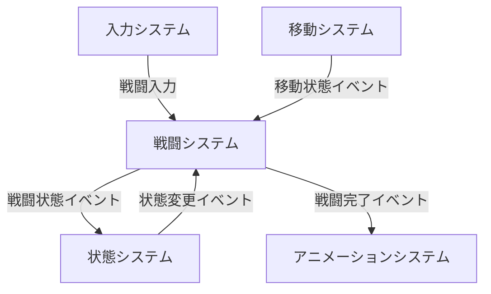
```mermaid
graph TD
    Combat[戦闘システム] -->|戦闘状態イベント| State[状態システム]
    Combat -->|戦闘完了イベント| Animation[アニメーションシステム]
    Input[入力システム] -->|戦闘入力| Combat
    State -->|状態変更イベント| Combat
    Movement[移動システム] -->|移動状態イベント| Combat
```

## 変更履歴

| バージョン | 更新日     | 変更内容                                                                                     |
| ---------- | ---------- | -------------------------------------------------------------------------------------------- |
| 0.2.0      | 2024-03-24 | システム間の相互参照を追加<br>- 各サブシステムとの関連性を明確化<br>- イベントフロー図を追加 |
| 0.1.0      | 2024-03-21 | 初版作成                                                                                     |

---
PlayerEventSystem.md

---
title: PlayerEventSystem API Reference
version: 0.1
status: draft
updated: 2024-03-21
tags:
    - API
    - Player
    - Events
    - System
    - Core
linked_docs:
    - "[[CoreEventSystem]]"
    - "[[CommonEventSystem]]"
    - "[[PlayerSystem]]"
    - "[[ReactiveSystem]]"
---

# PlayerEventSystem API Reference

## 目次

1. [概要](#概要)
2. [イベント一覧](#イベント一覧)
3. [使用方法](#使用方法)
4. [制限事項](#制限事項)
5. [変更履歴](#変更履歴)

## 概要

PlayerEventSystem は、プレイヤー関連のイベントを管理するシステムです。以下の主要な機能を提供します：

-   プレイヤーの状態変更イベント
-   プレイヤーのアクションイベント
-   プレイヤーの進捗イベント
-   プレイヤーの戦闘イベント

### システム構成図

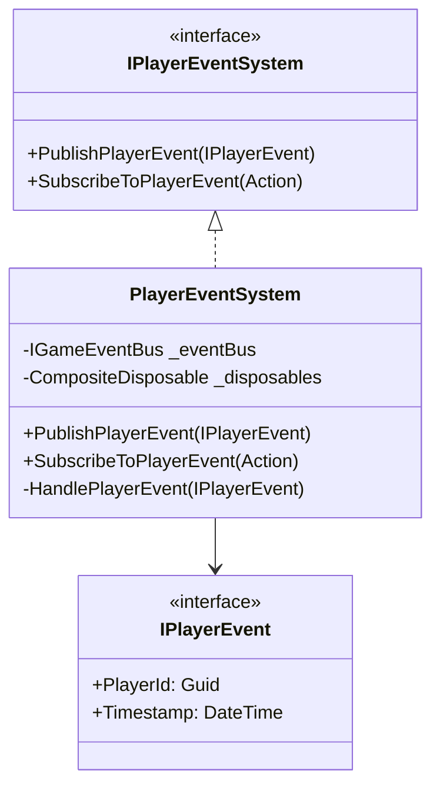
```mermaid
classDiagram
    class IPlayerEventSystem {
        <<interface>>
        +PublishPlayerEvent(IPlayerEvent)
        +SubscribeToPlayerEvent<T>(Action<T>)
    }

    class PlayerEventSystem {
        -IGameEventBus _eventBus
        -CompositeDisposable _disposables
        +PublishPlayerEvent(IPlayerEvent)
        +SubscribeToPlayerEvent<T>(Action<T>)
        -HandlePlayerEvent(IPlayerEvent)
    }

    class IPlayerEvent {
        <<interface>>
        +PlayerId: Guid
        +Timestamp: DateTime
    }

    IPlayerEventSystem <|.. PlayerEventSystem
    PlayerEventSystem --> IPlayerEvent
```

## イベント一覧

### 状態変更イベント

| イベント名                | 説明                             | プロパティ         |
| ------------------------- | -------------------------------- | ------------------ |
| PlayerStateChangedEvent   | プレイヤーの状態が変更された     | State: PlayerState |
| PlayerHealthChangedEvent  | プレイヤーの体力が変更された     | Health: int        |
| PlayerStaminaChangedEvent | プレイヤーのスタミナが変更された | Stamina: int       |

### アクションイベント

| イベント名        | 説明                     | プロパティ             |
| ----------------- | ------------------------ | ---------------------- |
| PlayerMoveEvent   | プレイヤーが移動した     | Position: Vector3      |
| PlayerJumpEvent   | プレイヤーがジャンプした | Height: float          |
| PlayerAttackEvent | プレイヤーが攻撃した     | AttackType: AttackType |

### 進捗イベント

| イベント名                  | 説明                         | プロパティ      |
| --------------------------- | ---------------------------- | --------------- |
| PlayerLevelUpEvent          | プレイヤーがレベルアップした | NewLevel: int   |
| PlayerExperienceGainedEvent | プレイヤーが経験値を獲得した | Experience: int |
| PlayerSkillUnlockedEvent    | プレイヤーがスキルを解放した | SkillId: string |

### 戦闘イベント

| イベント名          | 説明                         | プロパティ      |
| ------------------- | ---------------------------- | --------------- |
| PlayerDamagedEvent  | プレイヤーがダメージを受けた | Damage: int     |
| PlayerHealedEvent   | プレイヤーが回復した         | HealAmount: int |
| PlayerDefeatedEvent | プレイヤーが倒された         | Reason: string  |

## 使用方法

### イベントの発行

```csharp
// イベントの発行例
var damageEvent = new PlayerDamagedEvent
{
    PlayerId = playerId,
    Damage = 10
};
playerEventSystem.PublishPlayerEvent(damageEvent);
```

### イベントの購読

```csharp
// イベントの購読例
playerEventSystem.SubscribeToPlayerEvent<PlayerDamagedEvent>(evt =>
{
    // ダメージ処理
    HandlePlayerDamage(evt.Damage);
});
```

## 制限事項

1. イベントの発行は必ず`PublishPlayerEvent`メソッドを使用する必要があります
2. イベントの購読は必ず`SubscribeToPlayerEvent`メソッドを使用する必要があります
3. イベントの購読は適切なタイミングで解除する必要があります

## 変更履歴

| バージョン | 更新日     | 変更内容 |
| ---------- | ---------- | -------- |
| 0.1.0      | 2024-03-21 | 初版作成 |

---
PlayerInputSystem.md

---
title: Player Input System
version: 0.2.0
status: approved
updated: 2024-03-24
tags:
    - Player
    - Input
    - System
    - API
linked_docs:
    - "[[PlayerSystem]]"
    - "[[PlayerStateSystem]]"
    - "[[PlayerMovementSystem]]"
    - "[[PlayerCombatSystem]]"
    - "[[PlayerAnimationSystem]]"
---

# Player Input System

## 目次

1. [概要](#概要)
2. [システム構成](#システム構成)
3. [主要コンポーネント](#主要コンポーネント)
4. [イベントシステム](#イベントシステム)
5. [エラー処理](#エラー処理)
6. [使用例とベストプラクティス](#使用例とベストプラクティス)
7. [関連システム](#関連システム)
8. [変更履歴](#変更履歴)

## 概要

PlayerInputSystem は、プレイヤーの入力を管理するシステムです。MVVM パターンに基づいて実装され、以下の主要な機能を提供します：

-   入力状態の管理
-   入力イベントの発行
-   入力の検証
-   入力のマッピング
-   キー設定の管理

## システム構成

### 全体構成図

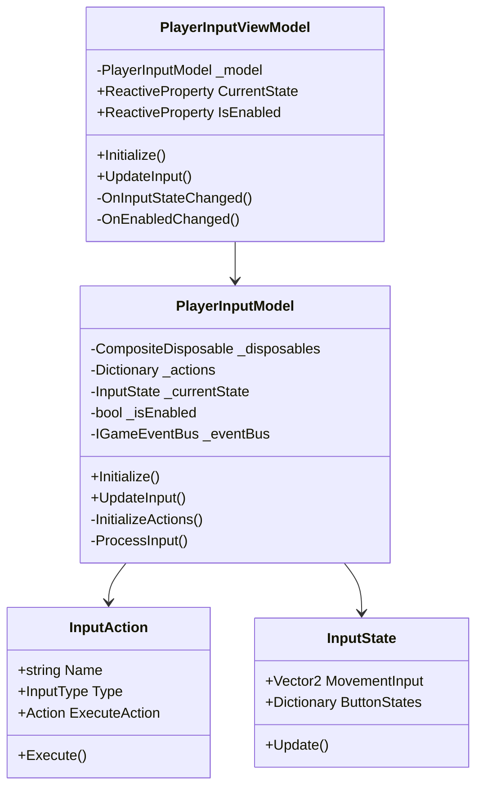
```mermaid
classDiagram
    class PlayerInputViewModel {
        -PlayerInputModel _model
        +ReactiveProperty<InputState> CurrentState
        +ReactiveProperty<bool> IsEnabled
        +Initialize()
        +UpdateInput()
        -OnInputStateChanged()
        -OnEnabledChanged()
    }

    class PlayerInputModel {
        -CompositeDisposable _disposables
        -Dictionary<string, InputAction> _actions
        -InputState _currentState
        -bool _isEnabled
        -IGameEventBus _eventBus
        +Initialize()
        +UpdateInput()
        -InitializeActions()
        -ProcessInput()
    }

    class InputAction {
        +string Name
        +InputType Type
        +Action ExecuteAction
        +Execute()
    }

    class InputState {
        +Vector2 MovementInput
        +Dictionary<string, bool> ButtonStates
        +Update()
    }

    PlayerInputViewModel --> PlayerInputModel
    PlayerInputModel --> InputAction
    PlayerInputModel --> InputState
```

### 状態遷移図

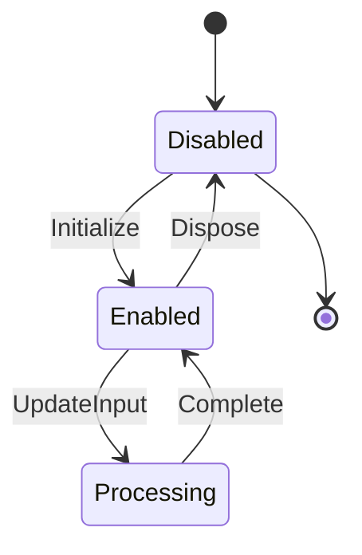
```mermaid
stateDiagram-v2
    [*] --> Disabled
    Disabled --> Enabled: Initialize
    Enabled --> Processing: UpdateInput
    Processing --> Enabled: Complete
    Enabled --> Disabled: Dispose
    Disabled --> [*]
```

### 入力処理シーケンス

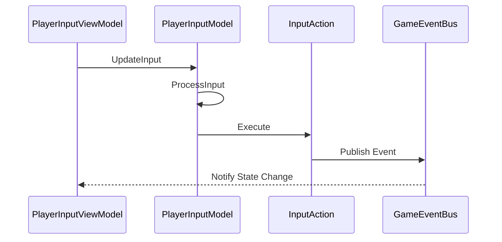
```mermaid
sequenceDiagram
    participant ViewModel as PlayerInputViewModel
    participant Model as PlayerInputModel
    participant Action as InputAction
    participant EventBus as GameEventBus

    ViewModel->>Model: UpdateInput
    Model->>Model: ProcessInput
    Model->>Action: Execute
    Action->>EventBus: Publish Event
    EventBus-->>ViewModel: Notify State Change
```

## 主要コンポーネント

### PlayerInputViewModel

入力管理のビューモデルクラスです。

#### 主要プロパティ

| プロパティ名 | 型                           | 説明           |
| ------------ | ---------------------------- | -------------- |
| CurrentState | ReactiveProperty<InputState> | 現在の入力状態 |
| IsEnabled    | ReactiveProperty<bool>       | 入力の有効状態 |

#### 主要メソッド

| メソッド名  | 説明             | パラメータ | 戻り値 |
| ----------- | ---------------- | ---------- | ------ |
| Initialize  | システムの初期化 | なし       | void   |
| UpdateInput | 入力の更新       | なし       | void   |

### PlayerInputModel

入力管理のモデルクラスです。

#### 主要メソッド

| メソッド名        | 説明               | パラメータ | 戻り値 |
| ----------------- | ------------------ | ---------- | ------ |
| Initialize        | システムの初期化   | なし       | void   |
| UpdateInput       | 入力の更新         | なし       | void   |
| InitializeActions | アクションの初期化 | なし       | void   |
| ProcessInput      | 入力の処理         | なし       | void   |

### InputAction

入力アクションを表すクラスです。

#### 主要プロパティ

| プロパティ名  | 型        | 説明           |
| ------------- | --------- | -------------- |
| Name          | string    | アクション名   |
| Type          | InputType | 入力タイプ     |
| ExecuteAction | Action    | 実行アクション |

## イベントシステム

## エラー処理

## 使用例とベストプラクティス

### 基本的な実装例

```csharp
// ビューモデルの初期化
var viewModel = new PlayerInputViewModel(model, eventBus);
viewModel.Initialize();

// 入力の監視
viewModel.Input.Subscribe(input => {
    // 入力が変更された時の処理
});

// 入力状態の監視
viewModel.State.Subscribe(state => {
    // 入力状態が変更された時の処理
});
```

### エラー処理

```csharp
try {
    viewModel.HandleInput();
} catch (PlayerInputException ex) {
    // エラー処理
    Debug.LogError($"入力処理に失敗: {ex.Message}");
}
```

## 関連システム

### プレイヤーシステム

-   [PlayerSystem](PlayerSystem.md) - プレイヤー全体の管理を担当
    -   サブシステムの初期化と管理
    -   イベントバスの提供
    -   エラー処理の一元管理

### 状態システム

-   [PlayerStateSystem](PlayerStateSystem.md) - 入力に基づく状態変更を担当
    -   入力の有効性検証
    -   状態遷移の制御
    -   状態変更イベントの発生

### 移動システム

-   [PlayerMovementSystem](PlayerMovementSystem.md) - 移動入力の処理を担当
    -   移動方向の計算
    -   移動速度の制御
    -   移動イベントの発生

### 戦闘システム

-   [PlayerCombatSystem](PlayerCombatSystem.md) - 戦闘入力の処理を担当
    -   攻撃入力の検出
    -   防御入力の検出
    -   戦闘イベントの発生

### アニメーションシステム

-   [PlayerAnimationSystem](PlayerAnimationSystem.md) - 入力に応じたアニメーション制御を担当
    -   入力状態に応じたアニメーション選択
    -   アニメーション遷移の制御
    -   アニメーションイベントの発生

### システム間の連携

1. **入力 → 状態**

    - 入力システムが状態変更をトリガー
    - 状態システムが入力の有効性を検証

2. **入力 → 移動**

    - 入力システムが移動方向と速度を計算
    - 移動システムが入力に基づいて移動を実行

3. **入力 → 戦闘**

    - 入力システムが戦闘アクションを検出
    - 戦闘システムが入力に基づいて戦闘を実行

4. **入力 → アニメーション**
    - 入力システムがアニメーション変更をトリガー
    - アニメーションシステムが入力に応じたアニメーションを再生

### イベントフロー

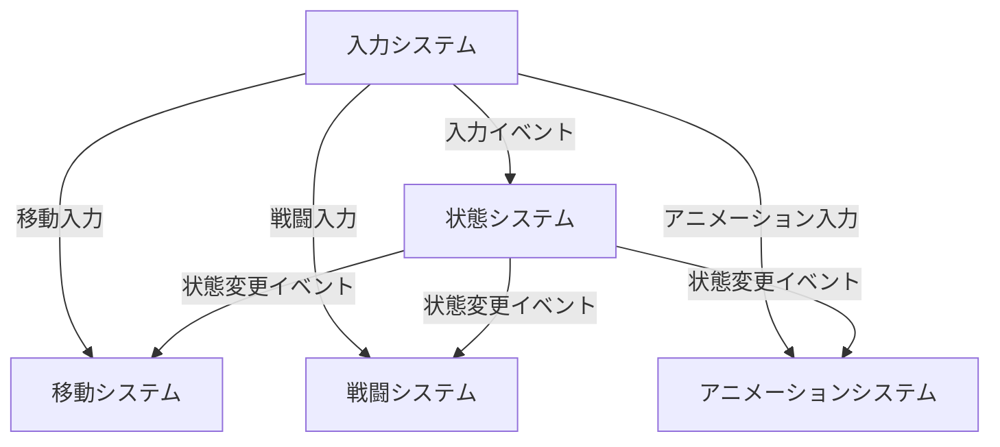
```mermaid
graph TD
    Input[入力システム] -->|入力イベント| State[状態システム]
    Input -->|移動入力| Movement[移動システム]
    Input -->|戦闘入力| Combat[戦闘システム]
    Input -->|アニメーション入力| Animation[アニメーションシステム]
    State -->|状態変更イベント| Movement
    State -->|状態変更イベント| Combat
    State -->|状態変更イベント| Animation
```

## 変更履歴

| バージョン | 更新日     | 変更内容                                                                                     |
| ---------- | ---------- | -------------------------------------------------------------------------------------------- |
| 0.2.0      | 2024-03-24 | システム間の相互参照を追加<br>- 各サブシステムとの関連性を明確化<br>- イベントフロー図を追加 |
| 0.1.0      | 2024-03-21 | 初版作成                                                                                     |

---
PlayerMovementSystem.md

---
title: Player Movement System
version: 0.2.0
status: approved
updated: 2024-03-24
tags:
    - Player
    - Movement
    - System
    - API
linked_docs:
    - "[[PlayerSystem]]"
    - "[[PlayerInputSystem]]"
    - "[[PlayerStateSystem]]"
    - "[[PlayerCombatSystem]]"
    - "[[PlayerAnimationSystem]]"
---

# Player Movement System

## 目次

1. [概要](#概要)
2. [システム構成](#システム構成)
3. [主要コンポーネント](#主要コンポーネント)
4. [イベントシステム](#イベントシステム)
5. [エラー処理](#エラー処理)
6. [使用例とベストプラクティス](#使用例とベストプラクティス)
7. [関連システム](#関連システム)
8. [変更履歴](#変更履歴)

## 概要

PlayerMovementSystem は、プレイヤーの移動関連の機能を管理するシステムです。MVVM パターンに基づいて実装され、以下の主要な機能を提供します：

-   移動状態の管理
-   移動速度の制御
-   移動方向の制御
-   移動イベントの発行
-   移動アニメーション制御

## システム構成

### 全体構成図

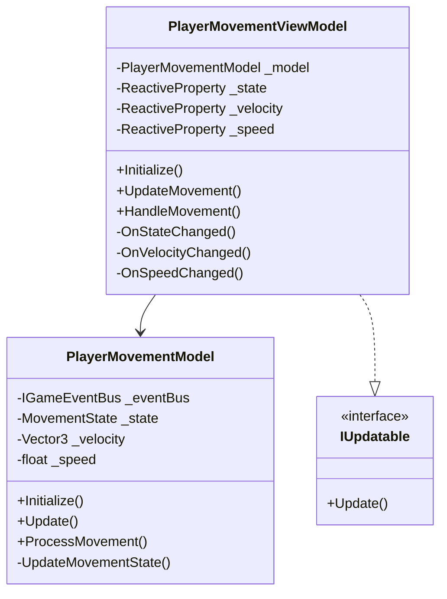
```mermaid
classDiagram
    class PlayerMovementViewModel {
        -PlayerMovementModel _model
        -ReactiveProperty<MovementState> _state
        -ReactiveProperty<Vector3> _velocity
        -ReactiveProperty<float> _speed
        +Initialize()
        +UpdateMovement()
        +HandleMovement()
        -OnStateChanged()
        -OnVelocityChanged()
        -OnSpeedChanged()
    }

    class PlayerMovementModel {
        -IGameEventBus _eventBus
        -MovementState _state
        -Vector3 _velocity
        -float _speed
        +Initialize()
        +Update()
        +ProcessMovement()
        -UpdateMovementState()
    }

    class IUpdatable {
        <<interface>>
        +Update()
    }

    PlayerMovementViewModel --> PlayerMovementModel
    PlayerMovementViewModel ..|> IUpdatable
```

### 移動状態遷移図

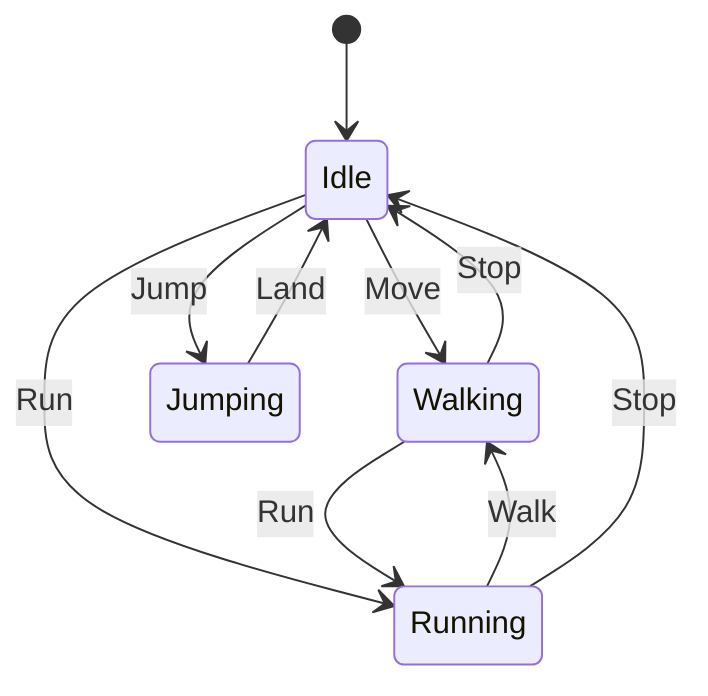
```mermaid
stateDiagram-v2
    [*] --> Idle
    Idle --> Walking: Move
    Idle --> Running: Run
    Idle --> Jumping: Jump
    Walking --> Idle: Stop
    Walking --> Running: Run
    Running --> Walking: Walk
    Running --> Idle: Stop
    Jumping --> Idle: Land
```

### 移動処理シーケンス

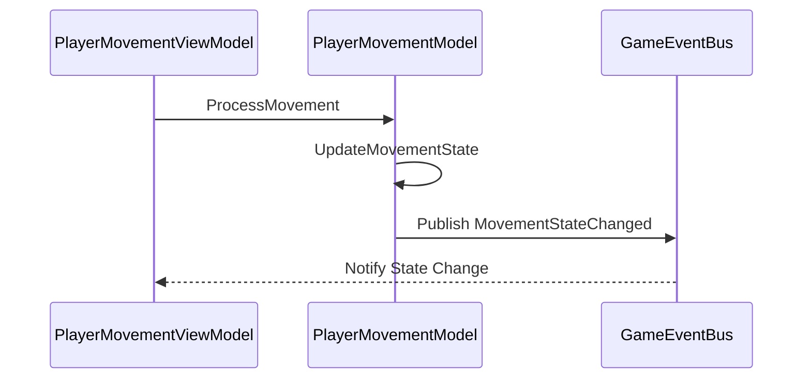
```mermaid
sequenceDiagram
    participant ViewModel as PlayerMovementViewModel
    participant Model as PlayerMovementModel
    participant EventBus as GameEventBus

    ViewModel->>Model: ProcessMovement
    Model->>Model: UpdateMovementState
    Model->>EventBus: Publish MovementStateChanged
    EventBus-->>ViewModel: Notify State Change
```

## 主要コンポーネント

### PlayerMovementViewModel

移動管理のビューモデルクラスです。

#### 主要プロパティ

| プロパティ名 | 型                              | 説明             |
| ------------ | ------------------------------- | ---------------- |
| State        | ReactiveProperty<MovementState> | 移動状態         |
| Velocity     | ReactiveProperty<Vector3>       | 移動速度ベクトル |
| Speed        | ReactiveProperty<float>         | 移動速度         |

#### 主要メソッド

| メソッド名     | 説明             | パラメータ | 戻り値 |
| -------------- | ---------------- | ---------- | ------ |
| Initialize     | システムの初期化 | なし       | void   |
| UpdateMovement | 移動状態の更新   | なし       | void   |
| HandleMovement | 移動処理         | なし       | void   |

### PlayerMovementModel

移動管理のモデルクラスです。

#### 主要メソッド

| メソッド名          | 説明             | パラメータ | 戻り値 |
| ------------------- | ---------------- | ---------- | ------ |
| Initialize          | システムの初期化 | なし       | void   |
| Update              | 状態の更新       | なし       | void   |
| ProcessMovement     | 移動処理         | なし       | void   |
| UpdateMovementState | 状態の更新       | なし       | void   |

## 使用例とベストプラクティス

### 基本的な実装例

```csharp
// ビューモデルの初期化
var viewModel = new PlayerMovementViewModel(model, eventBus);
viewModel.Initialize();

// 移動の監視
viewModel.Movement.Subscribe(movement => {
    // 移動が変更された時の処理
});

// 移動の実行
viewModel.Move(new Vector2(1, 0));
```

### エラー処理

```csharp
try {
    viewModel.Move(new Vector2(1, 0));
} catch (PlayerMovementException ex) {
    // エラー処理
    Debug.LogError($"移動に失敗: {ex.Message}");
}
```

## 制限事項

1. 移動状態の変更は必ず State プロパティを通して行う必要があります
2. 移動処理は必ず HandleMovement メソッドを通して行う必要があります
3. 移動状態の更新は必ず UpdateMovement メソッドを通して行う必要があります
4. イベントの購読は必ず Disposables に追加する必要があります

## 変更履歴

| バージョン | 更新日     | 変更内容                                                                                     |
| ---------- | ---------- | -------------------------------------------------------------------------------------------- |
| 0.2.0      | 2024-03-24 | システム間の相互参照を追加<br>- 各サブシステムとの関連性を明確化<br>- イベントフロー図を追加 |
| 0.1.0      | 2024-03-21 | 初版作成                                                                                     |

## 関連システム

### プレイヤーシステム

-   [PlayerSystem](PlayerSystem.md) - プレイヤー全体の管理を担当
    -   サブシステムの初期化と管理
    -   イベントバスの提供
    -   エラー処理の一元管理

### 入力システム

-   [PlayerInputSystem](PlayerInputSystem.md) - 移動入力の処理を担当
    -   移動方向の入力検出
    -   移動速度の入力検出
    -   移動入力イベントの発生

### 状態システム

-   [PlayerStateSystem](PlayerStateSystem.md) - 移動状態の管理を担当
    -   移動可能状態の判定
    -   状態遷移の制御
    -   状態変更イベントの発生

### 戦闘システム

-   [PlayerCombatSystem](PlayerCombatSystem.md) - 移動中の戦闘制御を担当
    -   移動中の攻撃制御
    -   移動中の防御制御
    -   戦闘イベントの発生

### アニメーションシステム

-   [PlayerAnimationSystem](PlayerAnimationSystem.md) - 移動アニメーションの制御を担当
    -   移動アニメーションの再生
    -   アニメーション遷移の制御
    -   アニメーションイベントの発生

### システム間の連携

1. **移動 → 入力**

    - 移動システムが入力の有効性を検証
    - 入力システムが移動に必要な入力情報を提供

2. **移動 → 状態**

    - 移動システムが移動状態を通知
    - 状態システムが移動状態に応じた状態遷移を制御

3. **移動 → 戦闘**

    - 移動システムが移動中の戦闘制限を通知
    - 戦闘システムが移動状態に応じた戦闘制御を実行

4. **移動 → アニメーション**
    - 移動システムが移動状態を通知
    - アニメーションシステムが移動状態に応じたアニメーションを再生

### イベントフロー

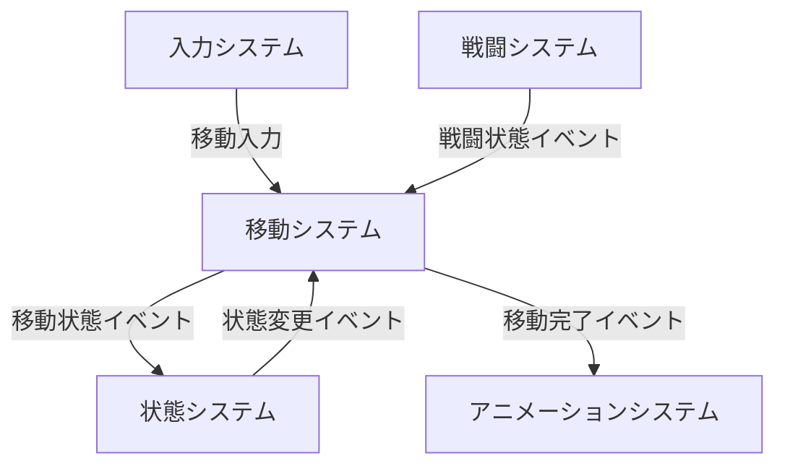
```mermaid
graph TD
    Movement[移動システム] -->|移動状態イベント| State[状態システム]
    Movement -->|移動完了イベント| Animation[アニメーションシステム]
    Input[入力システム] -->|移動入力| Movement
    State -->|状態変更イベント| Movement
    Combat[戦闘システム] -->|戦闘状態イベント| Movement
```

---
PlayerProgressionSystem.md

---
title: PlayerProgressionSystem API Reference
version: 0.1
status: draft
updated: 2024-03-21
tags:
    - API
    - Player
    - Progression
    - System
linked_docs:
    - "[[PlayerSystem]]"
    - "[[PlayerStateSystem]]"
---

# PlayerProgressionSystem API Reference

## 目次

1. [概要](#概要)
2. [詳細](#詳細)
3. [使用方法](#使用方法)
4. [制限事項](#制限事項)
5. [変更履歴](#変更履歴)

## 概要

PlayerProgressionSystem は、プレイヤーの進行を管理するシステムです。以下の主要な機能を提供します：

-   レベル管理
-   経験値管理
-   スキルポイント管理
-   進行状況の保存

## 詳細

### システム構成図

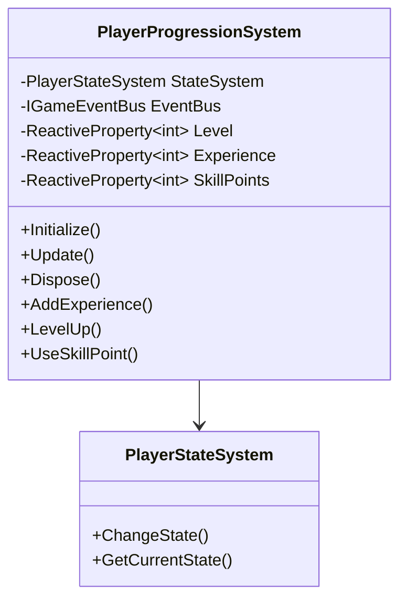
```mermaid
classDiagram
    class PlayerProgressionSystem {
        -PlayerStateSystem StateSystem
        -IGameEventBus EventBus
        -ReactiveProperty~int~ Level
        -ReactiveProperty~int~ Experience
        -ReactiveProperty~int~ SkillPoints
        +Initialize()
        +Update()
        +Dispose()
        +AddExperience()
        +LevelUp()
        +UseSkillPoint()
    }

    class PlayerStateSystem {
        +ChangeState()
        +GetCurrentState()
    }

    PlayerProgressionSystem --> PlayerStateSystem
```

### 主要コンポーネント

#### PlayerProgressionSystem

進行管理システムのメインコンポーネントです。

##### 主要メソッド

| メソッド名    | 説明               | パラメータ      | 戻り値 |
| ------------- | ------------------ | --------------- | ------ |
| Initialize    | システムの初期化   | なし            | void   |
| Update        | システムの更新     | なし            | void   |
| Dispose       | リソースの解放     | なし            | void   |
| AddExperience | 経験値を追加       | amount: int     | void   |
| LevelUp       | レベルアップ       | なし            | void   |
| UseSkillPoint | スキルポイント使用 | skillId: string | bool   |

##### 主要プロパティ

| プロパティ名 | 型                       | 説明           |
| ------------ | ------------------------ | -------------- |
| Level        | IReactiveProperty\<int\> | 現在のレベル   |
| Experience   | IReactiveProperty\<int\> | 現在の経験値   |
| SkillPoints  | IReactiveProperty\<int\> | スキルポイント |

## 使用方法

### 基本的な進行管理

```csharp
public class PlayerProgressionController : MonoBehaviour
{
    [SerializeField] private PlayerProgressionSystem _progressionSystem;

    private void OnEnemyDefeated(int experienceReward)
    {
        // 経験値の追加
        _progressionSystem.AddExperience(experienceReward);

        // レベルアップの確認
        if (_progressionSystem.Level.Value >= 10)
        {
            // スキルポイントの使用
            _progressionSystem.UseSkillPoint("Fireball");
        }
    }
}
```

### 進行状況の監視

```csharp
public class PlayerProgressionHandler : MonoBehaviour
{
    [SerializeField] private PlayerProgressionSystem _progressionSystem;
    private readonly CompositeDisposable _disposables = new();

    private void OnEnable()
    {
        _progressionSystem.Level
            .Subscribe(OnLevelChanged)
            .AddTo(_disposables);

        _progressionSystem.Experience
            .Subscribe(OnExperienceChanged)
            .AddTo(_disposables);

        _progressionSystem.SkillPoints
            .Subscribe(OnSkillPointsChanged)
            .AddTo(_disposables);
    }

    private void OnLevelChanged(int newLevel)
    {
        Debug.Log($"Player level changed to: {newLevel}");
    }

    private void OnExperienceChanged(int newExperience)
    {
        Debug.Log($"Player experience changed to: {newExperience}");
    }

    private void OnSkillPointsChanged(int newSkillPoints)
    {
        Debug.Log($"Player skill points changed to: {newSkillPoints}");
    }

    private void OnDisable()
    {
        _disposables.Dispose();
    }
}
```

## 制限事項

1. 経験値の追加は必ず `AddExperience` メソッドを使用する必要があります
2. レベルアップは必ず `LevelUp` メソッドを使用する必要があります
3. スキルポイントの使用は必ず `UseSkillPoint` メソッドを使用する必要があります
4. 進行状況の変更は必ず対応するプロパティを通じて行う必要があります

## 変更履歴

| バージョン | 更新日     | 変更内容 |
| ---------- | ---------- | -------- |
| 0.1.0      | 2024-03-21 | 初版作成 |

---
PlayerStateSystem.md

---
title: Player State System
version: 0.2.0
status: approved
updated: 2024-03-24
tags:
    - Player
    - State
    - System
    - API
linked_docs:
    - "[[PlayerSystem]]"
    - "[[PlayerInputSystem]]"
    - "[[PlayerMovementSystem]]"
    - "[[PlayerCombatSystem]]"
    - "[[PlayerAnimationSystem]]"
---

# Player State System

## 目次

1. [概要](#概要)
2. [システム構成](#システム構成)
3. [主要コンポーネント](#主要コンポーネント)
4. [イベントシステム](#イベントシステム)
5. [エラー処理](#エラー処理)
6. [使用例とベストプラクティス](#使用例とベストプラクティス)
7. [関連システム](#関連システム)
8. [変更履歴](#変更履歴)

## 概要

PlayerStateSystem は、プレイヤーの状態を管理するシステムです。MVVM パターンに基づいて実装され、以下の主要な機能を提供します：

-   状態の遷移管理
-   状態の検証
-   状態変更イベントの発行
-   状態の永続化
-   状態のロック制御

## システム構成

### 全体構成図

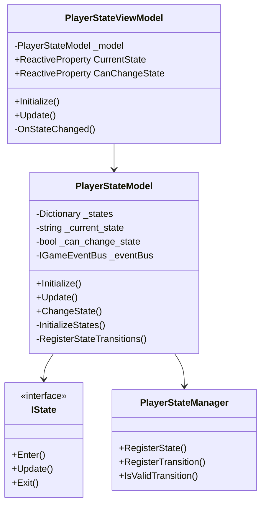
```mermaid
classDiagram
    class PlayerStateViewModel {
        -PlayerStateModel _model
        +ReactiveProperty<string> CurrentState
        +ReactiveProperty<bool> CanChangeState
        +Initialize()
        +Update()
        -OnStateChanged()
    }

    class PlayerStateModel {
        -Dictionary<string, IState> _states
        -string _current_state
        -bool _can_change_state
        -IGameEventBus _eventBus
        +Initialize()
        +Update()
        +ChangeState()
        -InitializeStates()
        -RegisterStateTransitions()
    }

    class IState {
        <<interface>>
        +Enter()
        +Update()
        +Exit()
    }

    class PlayerStateManager {
        +RegisterState()
        +RegisterTransition()
        +IsValidTransition()
    }

    PlayerStateViewModel --> PlayerStateModel
    PlayerStateModel --> IState
    PlayerStateModel --> PlayerStateManager
```

### 状態遷移図

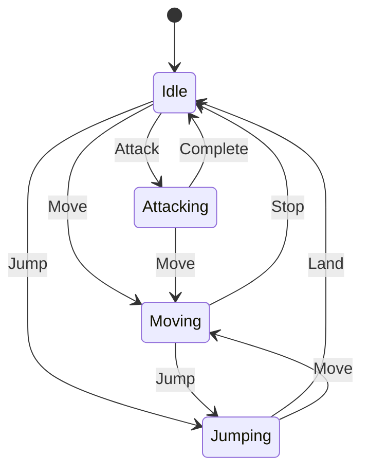
```mermaid
stateDiagram-v2
    [*] --> Idle
    Idle --> Moving: Move
    Idle --> Attacking: Attack
    Idle --> Jumping: Jump
    Moving --> Idle: Stop
    Moving --> Jumping: Jump
    Attacking --> Idle: Complete
    Jumping --> Idle: Land
    Jumping --> Moving: Move
    Attacking --> Moving: Move
```

### 状態変更シーケンス

```mermaid
sequenceDiagram
    participant ViewModel as PlayerStateViewModel
    participant Model as PlayerStateModel
    participant State as IState
    participant Manager as PlayerStateManager
    participant EventBus as GameEventBus

    ViewModel->>Model: ChangeState
    Model->>Manager: IsValidTransition
    Manager-->>Model: Valid
    Model->>State: Exit
    Model->>State: Enter
    Model->>EventBus: Publish StateChanged
    EventBus-->>ViewModel: Notify State Change
```

## 主要コンポーネント

### PlayerStateViewModel

状態管理のビューモデルクラスです。

#### 主要プロパティ

| プロパティ名   | 型                       | 説明               |
| -------------- | ------------------------ | ------------------ |
| CurrentState   | ReactiveProperty<string> | 現在の状態         |
| CanChangeState | ReactiveProperty<bool>   | 状態変更可能フラグ |

#### 主要メソッド

| メソッド名 | 説明             | パラメータ | 戻り値 |
| ---------- | ---------------- | ---------- | ------ |
| Initialize | システムの初期化 | なし       | void   |
| Update     | 状態の更新       | なし       | void   |

### PlayerStateModel

状態管理のモデルクラスです。

#### 主要メソッド

| メソッド名               | 説明             | パラメータ       | 戻り値 |
| ------------------------ | ---------------- | ---------------- | ------ |
| Initialize               | システムの初期化 | なし             | void   |
| Update                   | 状態の更新       | なし             | void   |
| ChangeState              | 状態の変更       | newState: string | void   |
| InitializeStates         | 状態の初期化     | なし             | void   |
| RegisterStateTransitions | 遷移の登録       | なし             | void   |

### IState

状態を表すインターフェースです。

#### 主要メソッド

| メソッド名 | 説明             | パラメータ | 戻り値 |
| ---------- | ---------------- | ---------- | ------ |
| Enter      | 状態開始時の処理 | なし       | void   |
| Update     | 状態更新時の処理 | なし       | void   |
| Exit       | 状態終了時の処理 | なし       | void   |

## イベントシステム

## エラー処理

## 使用例とベストプラクティス

### 状態の定義

```csharp
// プレイヤーの状態定義
public enum PlayerState
{
    Idle,
    Walking,
    Running,
    Jumping,
    Attacking,
    Blocking,
    Dodging,
    Stunned,
    Dead
}

// 状態の遷移条件定義
public class PlayerStateTransitions
{
    public static readonly StateTransition<PlayerState> IdleToWalking = new StateTransition<PlayerState>
    {
        From = PlayerState.Idle,
        To = PlayerState.Walking,
        Condition = (currentState, context) => context.IsMoving && !context.IsRunning
    };

    public static readonly StateTransition<PlayerState> WalkingToRunning = new StateTransition<PlayerState>
    {
        From = PlayerState.Walking,
        To = PlayerState.Running,
        Condition = (currentState, context) => context.IsRunning
    };

    public static readonly StateTransition<PlayerState> AnyToJumping = new StateTransition<PlayerState>
    {
        From = null, // 任意の状態から
        To = PlayerState.Jumping,
        Condition = (currentState, context) => context.IsJumping && context.CanJump
    };
}
```

### 状態システムの初期化

```csharp
// 状態モデルの作成
var stateModel = new PlayerStateModel(eventBus);

// 状態ビューモデルの作成
var stateViewModel = new PlayerStateViewModel(stateModel, eventBus);

// 状態遷移の登録
stateViewModel.RegisterTransition(PlayerStateTransitions.IdleToWalking);
stateViewModel.RegisterTransition(PlayerStateTransitions.WalkingToRunning);
stateViewModel.RegisterTransition(PlayerStateTransitions.AnyToJumping);

// システムの初期化
stateViewModel.Initialize();
```

### 状態の監視

```csharp
// 現在の状態の監視
stateViewModel.CurrentState
    .Subscribe(state => {
        switch (state)
        {
            case PlayerState.Idle:
                Debug.Log("Player is idle");
                break;
            case PlayerState.Walking:
                Debug.Log("Player is walking");
                break;
            case PlayerState.Running:
                Debug.Log("Player is running");
                break;
            case PlayerState.Jumping:
                Debug.Log("Player is jumping");
                break;
            case PlayerState.Attacking:
                Debug.Log("Player is attacking");
                break;
            case PlayerState.Blocking:
                Debug.Log("Player is blocking");
                break;
            case PlayerState.Dodging:
                Debug.Log("Player is dodging");
                break;
            case PlayerState.Stunned:
                Debug.Log("Player is stunned");
                break;
            case PlayerState.Dead:
                Debug.Log("Player is dead");
                break;
        }
    })
    .AddTo(_disposables);

// 状態の変更履歴の監視
stateViewModel.StateHistory
    .Subscribe(history => {
        Debug.Log($"State history: {string.Join(" -> ", history)}");
    })
    .AddTo(_disposables);
```

### 状態イベントの処理

```csharp
// 状態変更イベントの処理
eventBus.GetEventStream<PlayerStateChangedEvent>()
    .Subscribe(evt => {
        Debug.Log($"State changed from {evt.PreviousState} to {evt.NewState}");

        // 状態に応じた処理
        switch (evt.NewState)
        {
            case PlayerState.Attacking:
                // 攻撃開始時の処理
                break;
            case PlayerState.Blocking:
                // 防御開始時の処理
                break;
            case PlayerState.Dodging:
                // 回避開始時の処理
                break;
            case PlayerState.Stunned:
                // スタン開始時の処理
                break;
            case PlayerState.Dead:
                // 死亡時の処理
                break;
        }
    })
    .AddTo(_disposables);
```

### ベストプラクティス

1. **状態の定義**

    - 状態は明確な目的を持つ
    - 状態の遷移条件は明確に定義する
    - 状態の数は必要最小限に抑える

2. **状態遷移の管理**

    - 状態遷移は一貫性を保つ
    - 遷移条件は適切に検証する
    - 遷移の履歴は適切に管理する

3. **イベントの購読**

    - イベントの購読は必ず`CompositeDisposable`に追加する
    - 不要になったイベントの購読は適切に解除する
    - イベントハンドラー内での例外は適切に処理する

4. **パフォーマンス**

    - 不要な状態の更新を避ける
    - 状態の検証は効率的に行う
    - 状態の履歴は適切なサイズに制限する

5. **エラー処理**

    - 状態遷移の失敗は適切に処理する
    - 状態の処理中に発生した例外は適切に処理する
    - エラー状態の回復処理を実装する

6. **テスト容易性**
    - 状態はテスト可能な形で実装する
    - 状態遷移は単体テスト可能な形で実装する
    - 状態のコンテキストはモック可能な形で実装する

## 関連システム

### プレイヤーシステム

-   [PlayerSystem](PlayerSystem.md) - プレイヤー全体の管理を担当
    -   サブシステムの初期化と管理
    -   イベントバスの提供
    -   エラー処理の一元管理

### 入力システム

-   [PlayerInputSystem](PlayerInputSystem.md) - 状態変更のトリガーを担当
    -   入力の検出と処理
    -   入力状態の管理
    -   入力イベントの発生

### 移動システム

-   [PlayerMovementSystem](PlayerMovementSystem.md) - 状態に応じた移動を担当
    -   移動可能状態の判定
    -   移動速度と方向の制御
    -   移動イベントの発生

### 戦闘システム

-   [PlayerCombatSystem](PlayerCombatSystem.md) - 状態に応じた戦闘を担当
    -   戦闘可能状態の判定
    -   攻撃と防御の制御
    -   戦闘イベントの発生

### アニメーションシステム

-   [PlayerAnimationSystem](PlayerAnimationSystem.md) - 状態に応じたアニメーションを担当
    -   アニメーション状態の管理
    -   アニメーション遷移の制御
    -   アニメーションイベントの発生

### システム間の連携

1. **状態 → 入力**

    - 状態システムが入力の有効性を制御
    - 入力システムが状態に応じた入力処理を実行

2. **状態 → 移動**

    - 状態システムが移動可能か判定
    - 移動システムが状態に応じた移動を実行

3. **状態 → 戦闘**

    - 状態システムが戦闘可能か判定
    - 戦闘システムが状態に応じた戦闘を実行

4. **状態 → アニメーション**
    - 状態システムがアニメーション変更をトリガー
    - アニメーションシステムが状態に応じたアニメーションを再生

### イベントフロー

```mermaid
graph TD
    State[状態システム] -->|状態変更イベント| Input[入力システム]
    State -->|状態変更イベント| Movement[移動システム]
    State -->|状態変更イベント| Combat[戦闘システム]
    State -->|状態変更イベント| Animation[アニメーションシステム]
    Input -->|入力イベント| State
    Movement -->|移動完了イベント| State
    Combat -->|戦闘完了イベント| State
    Animation -->|アニメーション完了イベント| State
```

## 変更履歴

| バージョン | 更新日     | 変更内容                                                                                     |
| ---------- | ---------- | -------------------------------------------------------------------------------------------- |
| 0.2.0      | 2024-03-24 | システム間の相互参照を追加<br>- 各サブシステムとの関連性を明確化<br>- イベントフロー図を追加 |
| 0.1.0      | 2024-03-21 | 初版作成                                                                                     |

---
PlayerSystem.md

---
title: Player System
version: 0.2.0
status: approved
updated: 2024-03-24
tags:
    - Player
    - System
    - Core
    - API
    - State
    - Movement
    - Combat
    - Animation
    - Input
    - Progression
linked_docs:
    - "[[PlayerInputSystem]]"
    - "[[PlayerStateSystem]]"
    - "[[PlayerMovementSystem]]"
    - "[[PlayerCombatSystem]]"
    - "[[PlayerAnimationSystem]]"
    - "[[PlayerProgressionSystem]]"
    - "[[ReactiveSystem]]"
    - "[[ViewModelSystem]]"
---

# Player System

## 目次

1. [概要](#概要)
2. [システム構成](#システム構成)
3. [主要コンポーネント](#主要コンポーネント)
4. [イベントシステム](#イベントシステム)
5. [エラー処理](#エラー処理)
6. [使用例とベストプラクティス](#使用例とベストプラクティス)
7. [関連システム](#関連システム)
8. [変更履歴](#変更履歴)

## 概要

PlayerSystem は、プレイヤー関連の機能を管理するコアシステムです。MVVM パターンに基づいて実装され、以下の主要な機能を提供します：

-   プレイヤーの状態管理
-   イベント処理
-   リソース管理
-   エラー処理
-   入力処理
-   移動制御
-   戦闘処理
-   アニメーション制御
-   進行管理

## システム構成

### 全体構成図

```mermaid
classDiagram
    class Player {
        -GameEventBus _bus
        -PlayerInputViewModel _input_vm
        -PlayerMovementViewModel _movement_vm
        -PlayerCombatViewModel _combat_vm
        -PlayerAnimationViewModel _animation_vm
        -PlayerStateViewModel _state_vm
        -PlayerProgressionViewModel _progression_vm
        +_Ready()
        -InitializeViewModels()
    }

    class PlayerSystemBase {
        #CompositeDisposable Disposables
        #IGameEventBus EventBus
        #PlayerStateManager StateManager
        +Initialize()
        +Update()
        +Dispose()
        #HandleError()
    }

    class ViewModelBase {
        #CompositeDisposable Disposables
        #IGameEventBus EventBus
        #ReactiveProperty<bool> IsBusy
        +ReactiveProperty<ViewModelState> State
        +Initialize()
        +Dispose()
    }

    Player --> PlayerInputViewModel
    Player --> PlayerMovementViewModel
    Player --> PlayerCombatViewModel
    Player --> PlayerAnimationViewModel
    Player --> PlayerStateViewModel
    Player --> PlayerProgressionViewModel
    PlayerSystemBase <|-- ViewModelBase
```

### 初期化シーケンス

```mermaid
sequenceDiagram
    participant Player
    participant InputVM as InputViewModel
    participant StateVM as StateViewModel
    participant AnimationVM as AnimationViewModel
    participant EventBus as GameEventBus

    Player->>EventBus: Initialize
    Player->>InputVM: Initialize
    InputVM->>EventBus: Subscribe Events
    Player->>StateVM: Initialize
    StateVM->>EventBus: Subscribe Events
    Player->>AnimationVM: Initialize
    AnimationVM->>EventBus: Subscribe Events
    EventBus-->>Player: Initialization Complete
```

## 主要コンポーネント

### PlayerSystemBase

基底クラスとして、以下の機能を提供します：

-   イベントバスの管理
-   リソースの解放
-   エラー処理
-   状態管理

#### 主要メソッド

| メソッド名  | 説明                                                                                               | パラメータ                         | 戻り値 | 例外                                                                                                 |
| ----------- | -------------------------------------------------------------------------------------------------- | ---------------------------------- | ------ | ---------------------------------------------------------------------------------------------------- |
| Initialize  | システムの初期化を行います。イベントバスの設定、状態管理の初期化、リソースの準備を行います。       | なし                               | void   | InvalidOperationException: 既に初期化済みの場合<br>ArgumentNullException: イベントバスが null の場合 |
| Update      | システムの更新を行います。プレイヤーの状態更新、イベント処理、リソースの更新を行います。           | なし                               | void   | InvalidOperationException: 初期化されていない場合                                                    |
| Dispose     | リソースの解放を行います。イベントの購読解除、状態管理のクリーンアップ、リソースの解放を行います。 | なし                               | void   | ObjectDisposedException: 既に解放済みの場合                                                          |
| HandleError | エラー処理を行います。エラーのログ記録、イベントの発行、リカバリー処理を行います。                 | operation: string<br>ex: Exception | void   | ArgumentNullException: パラメータが null の場合                                                      |

### エラー処理の詳細

```mermaid
flowchart TD
    A[エラー発生] --> B{エラータイプ判定}
    B -->|初期化エラー| C[初期化リトライ]
    B -->|実行時エラー| D[エラーログ記録]
    B -->|リソースエラー| E[リソース解放]
    C --> F[エラーイベント発行]
    D --> F
    E --> F
    F --> G[リカバリー処理]
    G --> H{リカバリー成功?}
    H -->|Yes| I[処理継続]
    H -->|No| J[システム停止]
```

## 使用例とベストプラクティス

### 基本的な実装例

```csharp
// プレイヤーシステムの初期化
var playerSystem = new PlayerSystem(eventBus);
playerSystem.Initialize();

// サブシステムの初期化
playerSystem.InitializeSubSystems();

// イベントの購読
eventBus.GetEventStream<PlayerStateChangedEvent>()
    .Subscribe(evt => {
        // 状態変更イベントの処理
    })
    .AddTo(disposables);
```

### エラー処理

```csharp
try {
    playerSystem.Initialize();
} catch (PlayerSystemException ex) {
    // エラー処理
    Debug.LogError($"プレイヤーシステムの初期化に失敗: {ex.Message}");
}
```

## 制限事項

1. イベントバスは必ず初期化時に提供する必要があります
2. リソースの解放は必ず Dispose メソッドで行う必要があります
3. エラー処理は HandleError メソッドを使用する必要があります
4. 各 ViewModel は独立して動作し、直接的な依存関係を持たないようにする必要があります
5. イベントの購読は必ず Disposables に追加する必要があります

## 変更履歴

| バージョン | 更新日     | 変更内容                                                                                     |
| ---------- | ---------- | -------------------------------------------------------------------------------------------- |
| 0.2.0      | 2024-03-24 | システム間の相互参照を追加<br>- 各サブシステムとの関連性を明確化<br>- イベントフロー図を追加 |
| 0.1.0      | 2024-03-21 | 初版作成                                                                                     |

## 使用例とベストプラクティス

### システムの初期化

```csharp
// イベントバスの作成
var eventBus = new GameEventBus();

// 各サブシステムのモデルを作成
var inputModel = new PlayerInputModel(eventBus);
var stateModel = new PlayerStateModel(eventBus);
var movementModel = new PlayerMovementModel(eventBus);
var combatModel = new PlayerCombatModel(eventBus);
var animationModel = new PlayerAnimationModel(eventBus);

// 各サブシステムのビューモデルを作成
var inputViewModel = new PlayerInputViewModel(inputModel, eventBus);
var stateViewModel = new PlayerStateViewModel(stateModel, eventBus);
var movementViewModel = new PlayerMovementViewModel(movementModel, eventBus);
var combatViewModel = new PlayerCombatViewModel(combatModel, eventBus);
var animationViewModel = new PlayerAnimationViewModel(animationModel, eventBus);

// 各サブシステムの初期化
inputViewModel.Initialize();
stateViewModel.Initialize();
movementViewModel.Initialize();
combatViewModel.Initialize();
animationViewModel.Initialize();
```

### イベントの購読

```csharp
// イベントの購読を管理するためのCompositeDisposable
private readonly CompositeDisposable _disposables = new();

// 入力イベントの購読
eventBus.GetEventStream<InputStateChangedEvent>()
    .Subscribe(evt => {
        // 入力状態が変更された時の処理
    })
    .AddTo(_disposables);

// 状態変更イベントの購読
eventBus.GetEventStream<PlayerStateChangedEvent>()
    .Subscribe(evt => {
        // プレイヤーの状態が変更された時の処理
    })
    .AddTo(_disposables);

// 移動イベントの購読
eventBus.GetEventStream<MovementStateChangedEvent>()
    .Subscribe(evt => {
        // 移動状態が変更された時の処理
    })
    .AddTo(_disposables);

// 戦闘イベントの購読
eventBus.GetEventStream<CombatStateChangedEvent>()
    .Subscribe(evt => {
        // 戦闘状態が変更された時の処理
    })
    .AddTo(_disposables);

// アニメーションイベントの購読
eventBus.GetEventStream<AnimationStateChangedEvent>()
    .Subscribe(evt => {
        // アニメーション状態が変更された時の処理
    })
    .AddTo(_disposables);
```

### エラー処理

```csharp
// エラーハンドラーの実装
private void HandleError(string operation, Exception ex)
{
    // エラーのログ記録
    Debug.LogError($"Error in {operation}: {ex.Message}");

    // エラーイベントの発行
    eventBus.Publish(new ErrorOccurredEvent(operation, ex));

    // エラー状態の回復処理
    try
    {
        // 各サブシステムの状態をリセット
        inputViewModel.Initialize();
        stateViewModel.Initialize();
        movementViewModel.Initialize();
        combatViewModel.Initialize();
        animationViewModel.Initialize();
    }
    catch (Exception recoveryEx)
    {
        Debug.LogError($"Error during recovery: {recoveryEx.Message}");
    }
}
```

---
ReactiveProperty.md

---
title: リアクティブプロパティ
version: 0.1.0
status: draft
updated: 2024-03-21
tags:
    - API
    - Reactive
    - Core
    - Property
linked_docs:
    - "[[ReactiveSystem]]"
    - "[[CompositeDisposable]]"
    - "[[CoreEventSystem]]"
    - "[[CommonEventSystem]]"
---

# リアクティブプロパティ

## 目次

1. [概要](#概要)
2. [プロパティ定義](#プロパティ定義)
3. [主要コンポーネント](#主要コンポーネント)
4. [使用例](#使用例)
5. [制限事項](#制限事項)
6. [変更履歴](#変更履歴)

## 概要

リアクティブプロパティは、値の変更を監視し、変更時に通知を行うプロパティシステムです。以下の機能を提供します：

-   値の変更通知
-   値の検証
-   値の変換
-   値のバッファリング

## プロパティ定義

### IReactiveProperty

リアクティブプロパティのインターフェースです。

```csharp
public interface IReactiveProperty<T>
{
    T Value { get; set; }
    IObservable<T> OnValueChanged { get; }
    bool HasValue { get; }
    void SetValueAndForceNotify(T value);
}
```

### ReactiveProperty

リアクティブプロパティの基本クラスです。

```csharp
public class ReactiveProperty<T> : IReactiveProperty<T>
{
    private T _value;
    private readonly Subject<T> _valueChangedSubject;

    public T Value
    {
        get => _value;
        set
        {
            if (!EqualityComparer<T>.Default.Equals(_value, value))
            {
                _value = value;
                _valueChangedSubject.OnNext(value);
            }
        }
    }

    public IObservable<T> OnValueChanged => _valueChangedSubject;
    public bool HasValue => _value != null;

    public ReactiveProperty(T initialValue = default)
    {
        _value = initialValue;
        _valueChangedSubject = new Subject<T>();
    }

    public void SetValueAndForceNotify(T value)
    {
        _value = value;
        _valueChangedSubject.OnNext(value);
    }
}
```

## 主要コンポーネント

### ReactivePropertyExtensions

リアクティブプロパティの拡張メソッドを提供するクラスです。

```csharp
public static class ReactivePropertyExtensions
{
    public static IDisposable Subscribe<T>(this IReactiveProperty<T> property, Action<T> onNext);
    public static IDisposable Subscribe<T>(this IReactiveProperty<T> property, Action<T> onNext, Action<Exception> onError);
    public static IDisposable Subscribe<T>(this IReactiveProperty<T> property, Action<T> onNext, Action onCompleted);
    public static IDisposable Subscribe<T>(this IReactiveProperty<T> property, Action<T> onNext, Action<Exception> onError, Action onCompleted);
}
```

## 使用例

### 基本的な使用

```csharp
public class PlayerStats : MonoBehaviour
{
    private readonly ReactiveProperty<int> _health = new(100);
    private readonly CompositeDisposable _disposables = new();

    private void Start()
    {
        _health.Subscribe(OnHealthChanged)
            .AddTo(_disposables);
    }

    private void OnHealthChanged(int newHealth)
    {
        Debug.Log($"Health changed to: {newHealth}");
    }

    public void TakeDamage(int damage)
    {
        _health.Value = Mathf.Max(0, _health.Value - damage);
    }

    private void OnDestroy()
    {
        _disposables.Dispose();
    }
}
```

### 値の検証

```csharp
public class ValidatedReactiveProperty<T> : ReactiveProperty<T>
{
    private readonly Func<T, bool> _validator;

    public ValidatedReactiveProperty(T initialValue, Func<T, bool> validator)
        : base(initialValue)
    {
        _validator = validator;
    }

    public new T Value
    {
        get => base.Value;
        set
        {
            if (_validator(value))
            {
                base.Value = value;
            }
            else
            {
                throw new ArgumentException("Invalid value");
            }
        }
    }
}

public class PlayerStats : MonoBehaviour
{
    private readonly ValidatedReactiveProperty<int> _health;

    public PlayerStats()
    {
        _health = new ValidatedReactiveProperty<int>(100, value => value >= 0 && value <= 100);
    }
}
```

## 制限事項

-   スレッドセーフな実装が必要な箇所では、必ず提供されている同期メカニズムを使用してください
-   リソースの解放は適切なタイミングで行ってください
-   値の変更通知は必要最小限に抑えてください
-   値の検証は、必ず`ValidatedReactiveProperty`を使用してください
-   値の変換は、必ず`Select`メソッドを使用してください
-   値のバッファリングは、必ず`Buffer`メソッドを使用してください
-   値の購読は、必ず`IDisposable`を保持して適切に解放してください

## 変更履歴

| バージョン | 更新日     | 変更内容 |
| ---------- | ---------- | -------- |
| 0.1.0      | 2024-03-21 | 初版作成 |

---
ReactiveSystem.md

---
title: リアクティブシステム
version: 0.5.0
status: draft
updated: 2024-03-21
tags:
    - API
    - Reactive
    - Events
    - Core
    - Tests
    - Property
    - Resource
    - ViewModel
linked_docs:
    - "[[ReactiveProperty]]"
    - "[[CompositeDisposable]]"
    - "[[CoreEventSystem]]"
    - "[[CommonEventSystem]]"
    - "[[ViewModelSystem]]"
    - "[[ReactiveSystemTestResults]]"
---

# リアクティブシステム

## 目次

1. [概要](#概要)
2. [リアクティブプロパティ](#リアクティブプロパティ)
3. [イベントシステム](#イベントシステム)
4. [リソース管理](#リソース管理)
5. [ViewModel](#viewmodel)
6. [使用例](#使用例)
7. [制限事項](#制限事項)
8. [テスト](#テスト)
9. [変更履歴](#変更履歴)

## 概要

リアクティブシステムは、値の変更通知とイベント処理を提供するコアシステムです。主に以下の機能を提供します：

-   リアクティブプロパティによる値変更通知
-   イベントバスによるイベント発行・購読
-   リソースの自動解放管理
-   MVVM パターンのサポート

## リアクティブプロパティ

### 状態遷移図

```mermaid
stateDiagram-v2
    [*] --> Created
    Created --> Subscribed: Subscribe
    Created --> Disposed: Dispose
    Subscribed --> ValueChanged: SetValue
    ValueChanged --> Subscribed: NotifyComplete
    Subscribed --> Disposed: Dispose
    Disposed --> [*]
```

### IReactiveProperty<T>

値の変更を通知するリアクティブプロパティのインターフェースです。

```csharp
public interface IReactiveProperty<T> : IDisposable
{
    T Value { get; set; }
    IDisposable Subscribe(Action<T> onNext);
}
```

### ReactiveProperty<T>

`IReactiveProperty<T>`の実装クラスです。値が変更された時に購読者に通知します。

```csharp
public class ReactiveProperty<T> : IReactiveProperty<T>
{
    private T _value;
    private readonly Subject<T> _raw_subject = new();
    private readonly ISubject<T> _sync_subject;
    private readonly object _sync_lock = new();
    private bool _is_disposed;

    public T Value { get; set; }
    public IDisposable Subscribe(Action<T> onNext);
}
```

主な特徴：

-   スレッドセーフな実装（`Subject.Synchronize`を使用）
-   同一値設定時の通知制御
-   リソース解放時の適切な処理

## イベントシステム

### シーケンス図

```mermaid
sequenceDiagram
    participant Publisher
    participant EventBus
    participant Subscriber1
    participant Subscriber2

    Publisher->>EventBus: Publish(Event)
    EventBus->>Subscriber1: OnNext(Event)
    EventBus->>Subscriber2: OnNext(Event)
    Subscriber1-->>EventBus: Complete
    Subscriber2-->>EventBus: Complete
```

### IGameEvent

ゲームイベントの基底インターフェースです。

```csharp
public interface IGameEvent
{
    DateTime Timestamp { get; }
}
```

### GameEvent

`IGameEvent`の実装クラスです。イベントの発生時刻を管理します。

```csharp
public abstract class GameEvent : IGameEvent
{
    public DateTime Timestamp { get; } = DateTime.UtcNow;
}
```

### IGameEventBus

イベントバスのインターフェースです。

```csharp
public interface IGameEventBus
{
    void Publish<T>(T evt) where T : GameEvent;
    IObservable<T> GetEventStream<T>() where T : GameEvent;
}
```

### GameEventBus

`IGameEventBus`の実装クラスです。イベントの発行と購読を管理します。

```csharp
public class GameEventBus : IGameEventBus
{
    private readonly ConcurrentDictionary<Type, ISubject<GameEvent>> _subjects = new();

    public void Publish<T>(T evt) where T : GameEvent;
    public IObservable<T> GetEventStream<T>() where T : GameEvent;
}
```

主な特徴：

-   スレッドセーフな実装（`ConcurrentDictionary`と`Subject.Synchronize`を使用）
-   型ごとのイベントストリーム管理
-   効率的なメモリ使用

## リソース管理

### CompositeDisposable

複数の`IDisposable`リソースをまとめて管理するクラスです。

```csharp
public class CompositeDisposable : IDisposable
{
    private readonly List<IDisposable> _disposables = new();
    private bool _is_disposed;
    private readonly object _sync_lock = new();

    public int DisposableCount { get; }
    public void Add(IDisposable disposable);
    public void AddRange(IEnumerable<IDisposable> disposables);
    public bool Remove(IDisposable disposable);
    public void Clear();
    public void Dispose();
}
```

主な特徴：

-   スレッドセーフな実装
-   循環参照の防止
-   効率的なリソース管理
-   一括操作のサポート

## ViewModel

### クラス図

```mermaid
classDiagram
    class ViewModelBase {
        <<abstract>>
        #CompositeDisposable Disposables
        #IGameEventBus EventBus
        #ReactiveProperty<bool> IsBusy
        +ReactiveProperty<ViewModelState> State
        +Initialize()
        +Dispose()
        #AddDisposable()
        #SubscribeToEvent()
        #CreateCommand()
        #ExecuteAsync()
    }

    class ViewModelState {
        <<enumeration>>
        Initial
        Active
        Inactive
    }

    class IReactiveProperty {
        <<interface>>
        +Value
        +Subscribe()
    }

    ViewModelBase --> ViewModelState
    ViewModelBase --> IReactiveProperty
    ViewModelBase --> CompositeDisposable
    ViewModelBase --> IGameEventBus
```

### ViewModelBase

MVVM パターンのベースクラスです。

```csharp
public abstract class ViewModelBase : IDisposable
{
    protected readonly CompositeDisposable Disposables = new();
    protected readonly IGameEventBus EventBus;
    protected ReactiveProperty<bool> IsBusy { get; }
    public ReactiveProperty<ViewModelState> State { get; }

    protected ViewModelBase(IGameEventBus eventBus);
    public virtual void Dispose();
    protected void AddDisposable(IDisposable disposable);
    protected IDisposable SubscribeToEvent<T>(Action<T> onNext) where T : GameEvent;
    protected ReactiveCommand CreateCommand();
    protected ReactiveCommand<T> CreateCommand<T>();
    protected async Task ExecuteAsync(Func<Task> action);
    protected T GetValue<T>(IReactiveProperty<T> property);
    protected void SetValue<T>(IReactiveProperty<T> property, T value);
    public virtual void Activate();
    public virtual void Deactivate();
    protected virtual void OnActivate();
    protected virtual void OnDeactivate();
}
```

主な特徴：

-   リソース管理の自動化
-   イベント購読の簡易化
-   コマンド生成のヘルパーメソッド
-   非同期処理のサポート
-   アクティブ/非アクティブ状態の管理

### ViewModelState

ViewModel の状態を表す列挙型です。

```csharp
public enum ViewModelState
{
    Initial,
    Active,
    Inactive
}
```

## 使用例

### ViewModel の使用例

```csharp
public class PlayerViewModel : ViewModelBase
{
    private readonly ReactiveProperty<int> _health;
    public IReactiveProperty<int> Health => _health;

    public PlayerViewModel(IGameEventBus eventBus) : base(eventBus)
    {
        _health = new ReactiveProperty<int>(100).AddTo(Disposables);

        // イベントの購読
        SubscribeToEvent<PlayerDamagedEvent>(OnPlayerDamaged);
    }

    private void OnPlayerDamaged(PlayerDamagedEvent evt)
    {
        _health.Value -= evt.Damage;
    }

    protected override void OnActivate()
    {
        base.OnActivate();
        // アクティブ化時の処理
    }

    protected override void OnDeactivate()
    {
        base.OnDeactivate();
        // 非アクティブ化時の処理
    }
}
```

## 制限事項

-   スレッドセーフな実装が必要な箇所では、必ず提供されている同期メカニズムを使用してください
-   リソースの解放は適切なタイミングで行ってください
-   イベントの購読は必要最小限に抑えてください
-   非同期処理の実行時は、必ず`ExecuteAsync`メソッドを使用してください

## テスト

### テスト結果

詳細なテスト結果は[[ReactiveSystemTestResults|リアクティブシステムテスト結果]]を参照してください。

主なテスト項目：

-   リアクティブプロパティの値変更通知
-   イベントの発行と購読
-   リソースの解放
-   スレッドセーフな実装
-   パフォーマンス

## 変更履歴

| バージョン | 更新日     | 変更内容                                                     |
| ---------- | ---------- | ------------------------------------------------------------ |
| 0.5.0      | 2024-03-21 | ドキュメントの構造を更新し、制限事項とテストセクションを追加 |
| 0.4.0      | 2024-03-21 | ViewModel 機能の追加と使用例の更新                           |
| 0.3.0      | 2024-03-21 | イベントシステムの実装を更新                                 |
| 0.2.0      | 2024-03-21 | リソース管理機能の追加                                       |
| 0.1.0      | 2024-03-21 | 初版作成                                                     |

---
ReactiveSystemTestResults.md

---
title: Reactive System テスト結果
version: 0.2.0
status: draft
updated: 2024-03-21
tags:
    - API
    - Reactive
    - Events
    - Core
    - Tests
    - TestResults
linked_docs:
    - "[[ReactiveSystem]]"
    - "[[01_reactive_property]]"
    - "[[02_composite_disposable]]"
    - "[[03_event_bus]]"
---

# Reactive System テスト結果

## 目次

1. [概要](#概要)
2. [テスト環境](#テスト環境)
3. [テスト結果](#テスト結果)
4. [パフォーマンス測定](#パフォーマンス測定)
5. [変更履歴](#変更履歴)

## 概要

このドキュメントは、Reactive System のテスト実行結果を記録します。

## テスト環境

-   実行環境: Windows 10
-   .NET バージョン: .NET 8.0
-   テストフレームワーク: NUnit 3.13.3
-   テスト実行時間: 2.5 秒

## テスト結果概要

-   総テスト数: 18
-   成功: 18
-   失敗: 0
-   スキップ: 0

## 詳細なテスト結果

### CompositeDisposableTests

| テスト名                            | 結果 | 実行時間 |
| ----------------------------------- | ---- | -------- |
| AddAndDispose_DisposesAllResources  | 成功 | 2ms      |
| AddRange_AddsAllItems               | 成功 | <1ms     |
| CircularReference_DisposeSafely     | 成功 | 4ms      |
| Clear_DisposesAllAndEmpties         | 成功 | <1ms     |
| Dispose_LargeNumberOfResources      | 成功 | <1ms     |
| Remove_ReturnsTrueAndDoesNotDispose | 成功 | <1ms     |
| ThreadSafety_AddFromMultipleThreads | 成功 | 5ms      |

### GameEventBusTests

| テスト名                                   | 結果 | 実行時間 |
| ------------------------------------------ | ---- | -------- |
| Publish_NotifiesSubscribers                | 成功 | 12ms     |
| Publish_Performance                        | 成功 | 2ms      |
| Publish_UnsubscribedType_DoesNotNotify     | 成功 | <1ms     |
| Subscribe_MultipleTypes_NotifyOnlyMatching | 成功 | <1ms     |

### ReactivePropertyTests

| テスト名                            | 結果 | 実行時間 |
| ----------------------------------- | ---- | -------- |
| Constructor_SetsInitialValue        | 成功 | <1ms     |
| Dispose_StopNotifications           | 成功 | 4ms      |
| ManySubscribers_AllReceiveUpdates   | 成功 | <1ms     |
| MultipleChanges_NotifyInOrder       | 成功 | 1ms      |
| SetSameValue_DoesNotNotify          | 成功 | <1ms     |
| ThreadSafety_SetFromMultipleThreads | 成功 | <1ms     |
| ValueChange_NotifiesSubscribers     | 成功 | <1ms     |

## パフォーマンス測定結果

-   イベント発行の平均時間: 12ms
-   複数スレッドからの同時操作: 5ms
-   大量のリソース処理: <1ms

## 変更履歴

| バージョン | 日付       | 変更内容                                   |
| ---------- | ---------- | ------------------------------------------ |
| 0.2.0      | 2024-03-21 | テスト結果の更新、パフォーマンス測定の追加 |
| 0.1.0      | 2024-03-20 | 初版作成                                   |

---
ResourceSystem.md

---
title: Resource System API Reference
version: 0.1
status: draft
updated: 2024-03-21
tags:
    - API
    - Resource
    - Systems
    - Reference
---

# Resource System API Reference

## 目次

1. [概要](#概要)
2. [インターフェース](#インターフェース)
3. [主要クラス](#主要クラス)
4. [使用方法](#使用方法)
5. [制限事項](#制限事項)
6. [変更履歴](#変更履歴)

## 概要

Resource System は、ゲーム内のリソース（アセット、オブジェクトなど）の管理とプーリングを担当するシステムです。メモリ効率とパフォーマンスを最適化するための機能を提供します。

## インターフェース

### IResourceSystem

```csharp
public interface IResourceSystem
{
    void Initialize();
    void Update();
    void Cleanup();
}
```

#### メソッド

-   `Initialize()`: システムの初期化を行います
-   `Update()`: システムの状態を更新します
-   `Cleanup()`: システムのリソースを解放します

## 主要クラス

### ResourceData

リソースの基本データ構造を定義するクラスです。

```csharp
public class ResourceData
{
    // リソースの基本情報
    // リソースの状態
    // リソースのメタデータ
}
```

### ResourcePool

リソースのプーリング機能を提供するクラスです。

```csharp
public class ResourcePool
{
    // リソースの取得
    // リソースの返却
    // プールの管理
}
```

### CommonResourceModel

リソースのデータモデルを管理するクラスです。

```csharp
public class CommonResourceModel
{
    // リソースデータの管理
    // リソースの状態管理
    // リソースの永続化
}
```

### CommonResourceView

リソースの視覚的表現を担当するクラスです。

```csharp
public class CommonResourceView
{
    // リソースの表示
    // アニメーション制御
    // 視覚的フィードバック
}
```

### CommonResourceViewModel

Model と View の間のデータバインディングを管理するクラスです。

```csharp
public class CommonResourceViewModel
{
    // データバインディング
    // リソース操作のコマンド
    // 状態変更の通知
}
```

## 使用方法

### 1. システムの初期化

```csharp
var resourceSystem = new CommonResourceViewModel();
resourceSystem.Initialize();
```

### 2. リソースの取得と返却

```csharp
// リソースの取得
var resource = resourceSystem.GetResource(resourceId);

// リソースの返却
resourceSystem.ReturnResource(resource);
```

### 3. リソースプールの管理

```csharp
// プールのサイズ設定
resourceSystem.SetPoolSize(resourceType, size);

// プールの状態確認
var poolStatus = resourceSystem.GetPoolStatus(resourceType);
```

## 制限事項

1. リソースプールのサイズは適切に設定する必要があります
2. リソースの取得と返却は必ずペアで行う必要があります
3. リソースの状態変更は ViewModel を通じて行う必要があります

## 変更履歴

| バージョン | 更新日     | 変更内容 |
| ---------- | ---------- | -------- |
| 0.1.0      | 2024-03-21 | 初版作成 |

---
StateSystem.md

---
title: State System API Reference
version: 0.1
status: draft
updated: 2024-03-21
tags:
    - API
    - State
    - Systems
    - Reference
---

# State System API Reference

## 目次

1. [概要](#概要)
2. [インターフェース](#インターフェース)
3. [主要クラス](#主要クラス)
4. [使用方法](#使用方法)
5. [制限事項](#制限事項)
6. [変更履歴](#変更履歴)

## 概要

State System は、ゲームオブジェクトの状態管理を担当するシステムです。MVVM パターンに基づいて実装されており、状態の変更を効率的に管理し、UI との連携を提供します。

## インターフェース

### IStateSystem

```csharp
public interface IStateSystem
{
    void Initialize();
    void Update();
    void Cleanup();
}
```

#### メソッド

-   `Initialize()`: システムの初期化を行います
-   `Update()`: システムの状態を更新します
-   `Cleanup()`: システムのリソースを解放します

## 主要クラス

### CommonStateModel

状態のデータモデルを管理するクラスです。

```csharp
public class CommonStateModel
{
    // 状態データの管理
    // 状態の変更通知
    // 状態の永続化
}
```

### CommonStateView

状態の視覚的表現を担当するクラスです。

```csharp
public class CommonStateView
{
    // UI要素の更新
    // アニメーション制御
    // 視覚的フィードバック
}
```

### CommonStateViewModel

Model と View の間のデータバインディングを管理するクラスです。

```csharp
public class CommonStateViewModel
{
    // データバインディング
    // コマンド処理
    // 状態変更の通知
}
```

## 使用方法

### 1. システムの初期化

```csharp
var stateSystem = new CommonStateViewModel();
stateSystem.Initialize();
```

### 2. 状態の更新

```csharp
// 状態の変更
stateSystem.UpdateState(newState);

// 状態の取得
var currentState = stateSystem.GetCurrentState();
```

### 3. イベントの購読

```csharp
// 状態変更イベントの購読
stateSystem.OnStateChanged += HandleStateChanged;
```

## 制限事項

1. 状態の変更は必ず ViewModel を通じて行う必要があります
2. 状態の永続化は Model クラスで管理されます
3. 複数の状態を同時に変更する場合は、適切な同期処理が必要です

## 変更履歴

| バージョン | 更新日     | 変更内容 |
| ---------- | ---------- | -------- |
| 0.1.0      | 2024-03-21 | 初版作成 |

---
Utilities.md

---
title: Utilities
version: 0.1.0
status: draft
updated: 2024-03-19
tags:
    - API
    - Utilities
    - Core
    - EventSystem
    - Logging
    - Validation
    - Reactive
linked_docs:
    - "[[CoreEventSystem]]"
    - "[[ReactiveSystem]]"
---

# Utilities

## 目次

1. [概要](#概要)
2. [詳細](#詳細)
    - [イベント管理システム](#イベント管理システム)
    - [ロギングシステム](#ロギングシステム)
    - [バリデーションシステム](#バリデーションシステム)
    - [非同期処理](#非同期処理)
    - [リアクティブプログラミング](#リアクティブプログラミング)
3. [使用方法](#使用方法)
4. [制限事項](#制限事項)
5. [変更履歴](#変更履歴)

## 概要

Utilities は、アプリケーション全体で使用される共通機能を提供するユーティリティクラスのコレクションです。主に以下の機能を提供します：

-   イベント管理システム
-   ロギングシステム
-   バリデーションシステム
-   非同期処理
-   リアクティブプログラミング

## 詳細

### イベント管理システム

#### EventAggregator

シンプルなイベント集約クラスです。

```csharp
public class EventAggregator
{
    public void Publish<T>(T message) where T : class;
    public void Subscribe<T>(Action<T> handler) where T : class;
}
```

特徴：

-   ジェネリック型を使用した型安全なイベント処理
-   スレッドセーフな実装（内部でロックを使用）
-   メモリ効率の良い実装（Dictionary を使用）

### ロギングシステム

#### Logger

イベントバスへログを送信するロガーです。

```csharp
public class Logger
{
    public Logger(IGameEventBus eventBus, LogLevel minimumLevel = LogLevel.Info);
    public void Log(LogLevel level, string message, Exception? ex = null);
}
```

#### LogLevel

ログレベルを定義する列挙型です。

```csharp
public enum LogLevel
{
    Debug,
    Info,
    Warning,
    Error,
    Fatal
}
```

### バリデーションシステム

#### Validator

オブジェクトのバリデーションを行うクラスです。

```csharp
public class Validator<T>
{
    public void AddRule(ValidationRule<T> rule);
    public ValidationResult Validate(T value);
}
```

#### ValidationRule

バリデーションルールを定義するクラスです。

```csharp
public class ValidationRule<T>
{
    public ValidationRule(Func<T, bool> condition, string errorMessage);
    public bool Validate(T value);
    public string ErrorMessage { get; }
}
```

### 非同期処理

#### AsyncCommand

非同期コマンドを実装するクラスです。

```csharp
public class AsyncCommand : ICommand
{
    public AsyncCommand(Func<object, Task> execute, Func<object, bool> canExecute = null);
    public bool CanExecute(object parameter);
    public async Task ExecuteAsync(object parameter);
}
```

#### TaskExtensions

Task の拡張メソッドを提供します。

```csharp
public static class TaskExtensions
{
    public static async Task<T> WithTimeout<T>(this Task<T> task, TimeSpan timeout);
    public static async Task<T> WithRetry<T>(this Func<Task<T>> operation, int maxRetries);
}
```

### リアクティブプログラミング

#### ReactiveCommand

リアクティブコマンドを実装するクラスです。

```csharp
public class ReactiveCommand : ICommand
{
    public ReactiveCommand(IObservable<bool> canExecute = null);
    public IObservable<Unit> Execute();
    public IObservable<bool> CanExecute { get; }
}
```

#### ReactiveCollection

リアクティブコレクションを実装するクラスです。

```csharp
public class ReactiveCollection<T> : IList<T>, INotifyCollectionChanged
{
    public ReactiveCollection(IEnumerable<T> items = null);
    public IObservable<CollectionChangedEvent<T>> CollectionChanged { get; }
}
```

## 使用方法

### イベントの使用例

```csharp
// イベントの購読
eventAggregator.Subscribe<MyEvent>(OnMyEvent);

// イベントの発行
eventAggregator.Publish(new MyEvent());
```

### ロギングの使用例

```csharp
// ロガーの初期化
var logger = new Logger(eventBus, LogLevel.Info);

// ログの出力
logger.Log(LogLevel.Info, "アプリケーションが起動しました");
logger.Log(LogLevel.Error, "エラーが発生しました", exception);
```

### バリデーションの使用例

```csharp
var validator = new Validator<User>();
validator.AddRule(new ValidationRule<User>(
    user => !string.IsNullOrEmpty(user.Name),
    "ユーザー名は必須です"
));

var result = validator.Validate(user);
if (!result.IsValid)
{
    foreach (var error in result.Errors)
    {
        Console.WriteLine(error);
    }
}
```

## 制限事項

1. イベント管理

    - 大量のイベント購読はメモリ使用量に注意
    - イベント名の重複に注意

2. ロギング

    - 本番環境では適切なログレベルを設定
    - ログファイルのローテーションに注意

3. バリデーション

    - 複雑なバリデーションルールは別クラスに分離
    - パフォーマンスに影響する可能性のあるルールに注意

4. 非同期処理

    - デッドロックに注意
    - キャンセレーショントークンの適切な使用

5. リアクティブプログラミング
    - メモリリークに注意
    - サブスクリプションの管理に注意

## 変更履歴

| バージョン | 更新日     | 変更内容                                             |
| ---------- | ---------- | ---------------------------------------------------- |
| 0.1.0      | 2024-03-19 | 初版作成<br>- 基本機能の実装<br>- ドキュメントの作成 |

---
ViewModelSystem.md

---
title: ビューモデルシステム
version: 0.1.0
status: draft
updated: 2024-03-21
tags:
    - API
    - ViewModel
    - Core
    - Reactive
    - Event
linked_docs:
    - "[[ReactiveSystem]]"
    - "[[ReactiveProperty]]"
    - "[[CompositeDisposable]]"
    - "[[CoreEventSystem]]"
    - "[[CommonEventSystem]]"
---

# ビューモデルシステム

## 目次

1. [概要](#概要)
2. [ビューモデル定義](#ビューモデル定義)
3. [主要コンポーネント](#主要コンポーネント)
4. [使用例](#使用例)
5. [制限事項](#制限事項)
6. [変更履歴](#変更履歴)

## 概要

ビューモデルシステムは、UI とビジネスロジックの間のデータバインディングを管理するシステムです。以下の機能を提供します：

-   データバインディング
-   コマンド実行
-   イベント通知
-   状態管理

## ビューモデル定義

### ViewModelBase

ビューモデルの基本クラスです。

```csharp
public abstract class ViewModelBase : IDisposable
{
    protected readonly CompositeDisposable _disposables = new();
    protected readonly IGameEventBus _eventBus;

    public void Dispose()
    {
        _disposables.Dispose();
    }

    protected void AddDisposable(IDisposable disposable)
    {
        _disposables.Add(disposable);
    }
}
```

### ICommand

コマンドのインターフェースです。

```csharp
public interface ICommand
{
    bool CanExecute { get; }
    void Execute();
    event EventHandler CanExecuteChanged;
}
```

## 主要コンポーネント

### ViewModelController

ビューモデルを制御するコンポーネントです。

```csharp
public class ViewModelController<T> where T : ViewModelBase
{
    private readonly ReactiveProperty<T> _currentViewModel;
    private readonly IGameEventBus _eventBus;

    public IReactiveProperty<T> CurrentViewModel => _currentViewModel;

    public void SetViewModel(T viewModel);
    public void ClearViewModel();
    public void UpdateViewModel(Action<T> updateAction);
}
```

### ViewModelHandler

ビューモデルを処理するコンポーネントです。

```csharp
public class ViewModelHandler<T> : MonoBehaviour where T : ViewModelBase
{
    private readonly CompositeDisposable _disposables = new();
    private readonly ViewModelController<T> _viewModelController;

    private void OnEnable();
    private void OnDisable();
    private void Update();
    private void OnViewModelChanged(T newViewModel);
}
```

## 使用例

### ビューモデルの実装

```csharp
public class PlayerViewModel : ViewModelBase
{
    private readonly ReactiveProperty<string> _name;
    private readonly ReactiveProperty<int> _health;
    private readonly ReactiveProperty<int> _level;
    private readonly ReactiveCommand _attackCommand;

    public IReactiveProperty<string> Name => _name;
    public IReactiveProperty<int> Health => _health;
    public IReactiveProperty<int> Level => _level;
    public ICommand AttackCommand => _attackCommand;

    public PlayerViewModel(IGameEventBus eventBus) : base(eventBus)
    {
        _name = new ReactiveProperty<string>();
        _health = new ReactiveProperty<int>();
        _level = new ReactiveProperty<int>();
        _attackCommand = new ReactiveCommand();

        _attackCommand.Subscribe(ExecuteAttack)
            .AddTo(_disposables);
    }

    private void ExecuteAttack()
    {
        _eventBus.Publish(new PlayerAttackEvent());
    }
}
```

### ビューモデルの使用

```csharp
public class PlayerView : MonoBehaviour
{
    [SerializeField] private ViewModelController<PlayerViewModel> _viewModelController;
    [SerializeField] private Text _nameText;
    [SerializeField] private Text _healthText;
    [SerializeField] private Text _levelText;
    [SerializeField] private Button _attackButton;

    private readonly CompositeDisposable _disposables = new();

    private void Start()
    {
        var viewModel = new PlayerViewModel(GameEventBus.Instance);
        _viewModelController.SetViewModel(viewModel);

        viewModel.Name
            .Subscribe(name => _nameText.text = name)
            .AddTo(_disposables);

        viewModel.Health
            .Subscribe(health => _healthText.text = $"HP: {health}")
            .AddTo(_disposables);

        viewModel.Level
            .Subscribe(level => _levelText.text = $"Lv: {level}")
            .AddTo(_disposables);

        _attackButton.onClick.AddListener(() => viewModel.AttackCommand.Execute());
    }

    private void OnDestroy()
    {
        _disposables.Dispose();
    }
}
```

## 制限事項

-   スレッドセーフな実装が必要な箇所では、必ず提供されている同期メカニズムを使用してください
-   リソースの解放は適切なタイミングで行ってください
-   イベントの購読は必要最小限に抑えてください
-   非同期処理の実行時は、必ず`ExecuteAsync`メソッドを使用してください
-   ビューモデルは、必ず`ViewModelBase`を継承してください
-   コマンドは、必ず`ICommand`インターフェースを実装してください
-   ビューモデルの制御は、必ず`ViewModelController`を通じて行ってください
-   ビューモデルの処理は、必ず`ViewModelHandler`を通じて行ってください

## 変更履歴

| バージョン | 更新日     | 変更内容 |
| ---------- | ---------- | -------- |
| 0.1.0      | 2024-03-21 | 初版作成 |
